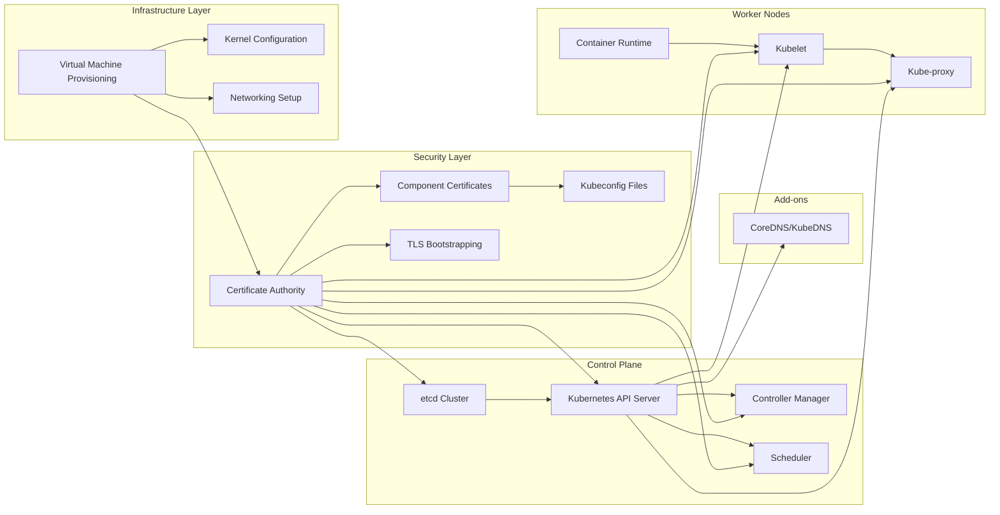
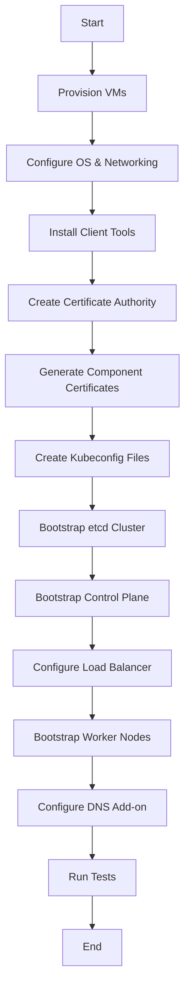
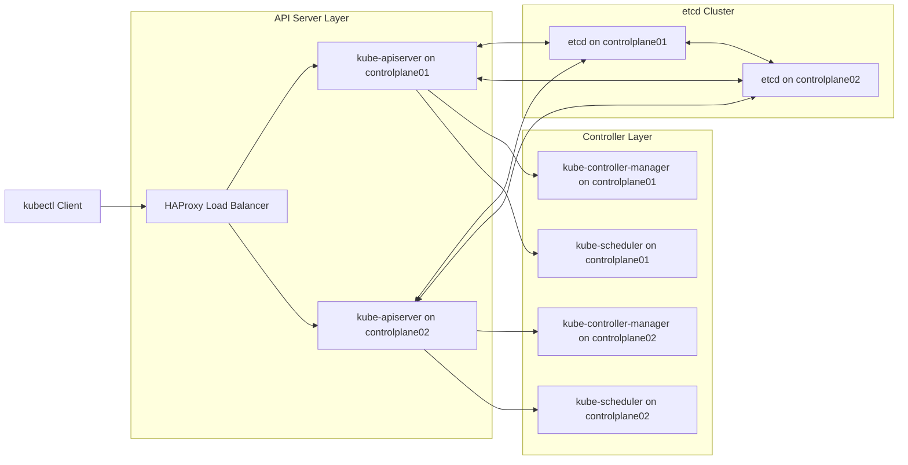
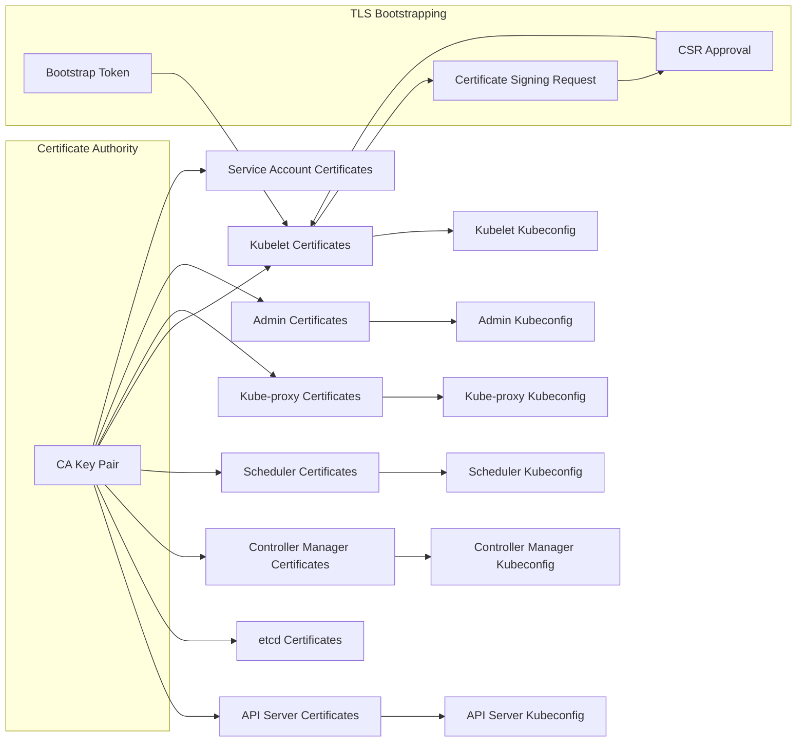

# Introduction and Overview
Relevant source files
- [.github/ISSUE_TEMPLATE/bug.yaml](https://github.com/mmumshad/kubernetes-the-hard-way/blob/8218a815/.github/ISSUE_TEMPLATE/bug.yaml)
- [.github/ISSUE_TEMPLATE/config.yml](https://github.com/mmumshad/kubernetes-the-hard-way/blob/8218a815/.github/ISSUE_TEMPLATE/config.yml)
- [README.md](https://github.com/mmumshad/kubernetes-the-hard-way/blob/8218a815/README.md?plain=1)
- [VirtualBox/docs/01-prerequisites.md](https://github.com/mmumshad/kubernetes-the-hard-way/blob/8218a815/VirtualBox/docs/01-prerequisites.md?plain=1)
- [VirtualBox/docs/02-compute-resources.md](https://github.com/mmumshad/kubernetes-the-hard-way/blob/8218a815/VirtualBox/docs/02-compute-resources.md?plain=1)
- [apple-silicon/docs/01-prerequisites.md](https://github.com/mmumshad/kubernetes-the-hard-way/blob/8218a815/apple-silicon/docs/01-prerequisites.md?plain=1)
- [apple-silicon/docs/02-compute-resources.md](https://github.com/mmumshad/kubernetes-the-hard-way/blob/8218a815/apple-silicon/docs/02-compute-resources.md?plain=1)
- [docs/07-bootstrapping-etcd.md](https://github.com/mmumshad/kubernetes-the-hard-way/blob/8218a815/docs/07-bootstrapping-etcd.md?plain=1)

This document provides a comprehensive introduction to the "Kubernetes The Hard Way" project, which guides you through the process of bootstrapping a Kubernetes cluster manually without using automated deployment tools. The tutorial is designed to help you understand the internals of Kubernetes by building each component step-by-step.

Unlike tools such as kubeadm or managed Kubernetes services that automate cluster setup, this approach takes the long route deliberately to ensure you understand every component required to set up a functional Kubernetes cluster. This tutorial is not meant for production use but serves as an educational resource for those interested in deeply understanding Kubernetes architecture.

For information about specific environment setup requirements, see [Environment Setup and Prerequisites](/mmumshad/kubernetes-the-hard-way/2-environment-setup-and-prerequisites).

Sources: [README.md3-14](https://github.com/mmumshad/kubernetes-the-hard-way/blob/8218a815/README.md?plain=1#L3-L14)

## Project Purpose and Goals

The primary goal of this project is educational. By manually setting up each component of a Kubernetes cluster, you will:

1. Gain a deeper understanding of how Kubernetes components interact
2. Learn about the security infrastructure required for a Kubernetes cluster
3. Understand networking configurations necessary for pods and services
4. Experience the complexity that automation tools typically hide from users

This tutorial is particularly valuable for:

- System administrators looking to support production Kubernetes clusters
- DevOps engineers wanting to understand Kubernetes internals
- Certification candidates preparing for advanced Kubernetes certifications
- Anyone interested in the technical details of container orchestration

Note that the cluster built in this tutorial is not intended for production use and may receive limited support from the community.

Sources: [README.md9-14](https://github.com/mmumshad/kubernetes-the-hard-way/blob/8218a815/README.md?plain=1#L9-L14)[README.md24-26](https://github.com/mmumshad/kubernetes-the-hard-way/blob/8218a815/README.md?plain=1#L24-L26)

## Architecture Overview

### Diagram: High-Level Kubernetes Architecture

The architecture consists of multiple layers that work together to form a complete Kubernetes cluster:

1. **Infrastructure Layer**: Provides the foundation with virtual machines and networking configuration
2. **Security Layer**: Manages certificates, authentication, and secure communication between components
3. **Control Plane**: Contains the core Kubernetes components that manage the cluster state
4. **Worker Nodes**: Run the containerized applications and handle networking between containers
5. **Add-ons**: Enhance functionality with additional services like DNS

Sources: [README.md28-36](https://github.com/mmumshad/kubernetes-the-hard-way/blob/8218a815/README.md?plain=1#L28-L36)[docs/07-bootstrapping-etcd.md1-3](https://github.com/mmumshad/kubernetes-the-hard-way/blob/8218a815/docs/07-bootstrapping-etcd.md?plain=1#L1-L3)

### Cluster Components

The cluster built in this tutorial includes the following components:

| Component | Version | Purpose |
| --- | --- | --- |
| Kubernetes | Latest | Container orchestration system |
| Container Runtime | Latest | Runtime environment for containers |
| Weave Networking | Latest | Network plugin for pod networking |
| etcd | v3.5.9 | Distributed key-value store |
| CoreDNS | v1.9.4 | DNS server for service discovery |

Sources: [README.md30-36](https://github.com/mmumshad/kubernetes-the-hard-way/blob/8218a815/README.md?plain=1#L30-L36)

### Node Configuration

The tutorial guides you through setting up the following virtual machines:

| Node | Purpose | Description |
| --- | --- | --- |
| controlplane01 & controlplane02 | Control Plane | Run the control plane components (etcd, API server, controller manager, scheduler) |
| node01 & node02 | Worker Nodes | Run containerized applications |
| loadbalancer | Load Balancer | Balance API server requests across control plane nodes |

Note that the control planes are not themselves nodes in the Kubernetes sense and will not show up when running `kubectl get nodes`. They only run the control plane components as operating system services.

Sources: [README.md38-45](https://github.com/mmumshad/kubernetes-the-hard-way/blob/8218a815/README.md?plain=1#L38-L45)

## Deployment Flow

### Diagram: Deployment Process

The deployment process follows a logical sequence:

1. **Infrastructure Preparation**: Setting up virtual machines and configuring networking
2. **Security Setup**: Creating a certificate authority and generating certificates for components
3. **Configuration**: Creating kubeconfig files for various components
4. **Control Plane Bootstrapping**: Setting up etcd, API servers, controller managers, and schedulers
5. **Worker Node Configuration**: Setting up the container runtime, kubelet, and kube-proxy
6. **Add-ons Deployment**: Installing DNS services and other necessary add-ons
7. **Verification**: Testing the cluster to ensure everything works correctly

Sources: [docs/07-bootstrapping-etcd.md1-3](https://github.com/mmumshad/kubernetes-the-hard-way/blob/8218a815/docs/07-bootstrapping-etcd.md?plain=1#L1-L3)[README.md48-50](https://github.com/mmumshad/kubernetes-the-hard-way/blob/8218a815/README.md?plain=1#L48-L50)

## Control Plane Components

### Diagram: Control Plane Architecture

The control plane consists of several key components:

1. **etcd Cluster**: A distributed key-value store that stores all cluster data

- Runs on both control plane nodes in a highly available configuration
- Uses TLS certificates for secure communication
2. **API Server**: The primary entry point for all cluster interactions

- Exposes the Kubernetes API
- Validates and processes API requests
- Communicates with etcd to store and retrieve cluster state
3. **Controller Manager**: Runs controller processes

- Monitors the state of the cluster through the API server
- Makes changes to move the current state toward the desired state
4. **Scheduler**: Assigns workloads to nodes

- Decides which node should run each pod
- Considers resource requirements, constraints, and other factors
5. **Load Balancer**: Provides high availability for the API servers

- Distributes client requests across multiple API servers
- Acts as the single endpoint for kubectl and other clients

Sources: [docs/07-bootstrapping-etcd.md1-140](https://github.com/mmumshad/kubernetes-the-hard-way/blob/8218a815/docs/07-bootstrapping-etcd.md?plain=1#L1-L140)[README.md38-45](https://github.com/mmumshad/kubernetes-the-hard-way/blob/8218a815/README.md?plain=1#L38-L45)

## Security Infrastructure

### Diagram: PKI Infrastructure

Security is a critical aspect of Kubernetes. The tutorial guides you through setting up:

1. **Certificate Authority (CA)**: The root of trust for the entire cluster

- Creates and signs certificates for all components
- Enables secure TLS communication between components
2. **Component Certificates**: Unique certificates for each component

- API server certificate for secure API access
- etcd certificates for secure data storage
- Controller manager, scheduler, kubelet, and kube-proxy certificates
3. **Kubeconfig Files**: Configuration files that contain:

- Server information
- Authentication credentials
- Context information
4. **TLS Bootstrapping**: Process for worker nodes to automatically obtain certificates

- Bootstrap tokens used for initial authentication
- Certificate Signing Requests (CSRs) for obtaining proper certificates

All communication between Kubernetes components is secured with TLS encryption, ensuring data confidentiality and integrity.

Sources: [docs/07-bootstrapping-etcd.md40-53](https://github.com/mmumshad/kubernetes-the-hard-way/blob/8218a815/docs/07-bootstrapping-etcd.md?plain=1#L40-L53)

## Platform Support

The tutorial supports two main deployment platforms:

1. **VirtualBox with Vagrant** (for Windows and Intel Mac)

- Uses VirtualBox as the hypervisor
- Vagrant for automating VM provisioning
- Recommended hardware: 16GB RAM, 8+ core CPU, 50GB disk space
2. **Multipass** (for Apple Silicon Mac - M1/M2/M3)

- Uses Multipass for VM management
- Recommended hardware: 8GB RAM (16GB recommended)
- Requires Pro or Max CPU for running end-to-end tests

Both approaches create the same virtual machine layout for the Kubernetes components, but use different virtualization technologies based on the hardware platform.

Sources: [README.md47-48](https://github.com/mmumshad/kubernetes-the-hard-way/blob/8218a815/README.md?plain=1#L47-L48)[VirtualBox/docs/01-prerequisites.md1-3](https://github.com/mmumshad/kubernetes-the-hard-way/blob/8218a815/VirtualBox/docs/01-prerequisites.md?plain=1#L1-L3)[apple-silicon/docs/01-prerequisites.md1-4](https://github.com/mmumshad/kubernetes-the-hard-way/blob/8218a815/apple-silicon/docs/01-prerequisites.md?plain=1#L1-L4)

## Conclusion

"Kubernetes The Hard Way" provides a deep, hands-on learning experience for understanding Kubernetes internals. By following this tutorial, you will gain valuable insights into how Kubernetes components work together to form a complete container orchestration system.

The upcoming sections will guide you through:

- Environment setup and prerequisites [Environment Setup and Prerequisites](/mmumshad/kubernetes-the-hard-way/2-environment-setup-and-prerequisites)
- Security infrastructure setup [Security Infrastructure](/mmumshad/kubernetes-the-hard-way/3-security-infrastructure)
- Control plane bootstrapping [Control Plane Setup](/mmumshad/kubernetes-the-hard-way/4-control-plane-setup)
- Worker node configuration [Worker Node Setup](/mmumshad/kubernetes-the-hard-way/5-worker-node-setup)
- Networking and add-ons [Networking and Add-ons](/mmumshad/kubernetes-the-hard-way/6-networking-and-add-ons)
- Testing and verification [Testing and Verification](/mmumshad/kubernetes-the-hard-way/7-testing-and-verification)
- Troubleshooting and maintenance [Troubleshooting and Maintenance](/mmumshad/kubernetes-the-hard-way/8-troubleshooting-and-maintenance)

Remember that while this tutorial is not meant for production use, the knowledge gained is invaluable for anyone working with Kubernetes in a professional capacity.

Sources: [README.md9-14](https://github.com/mmumshad/kubernetes-the-hard-way/blob/8218a815/README.md?plain=1#L9-L14)[README.md24-26](https://github.com/mmumshad/kubernetes-the-hard-way/blob/8218a815/README.md?plain=1#L24-L26)