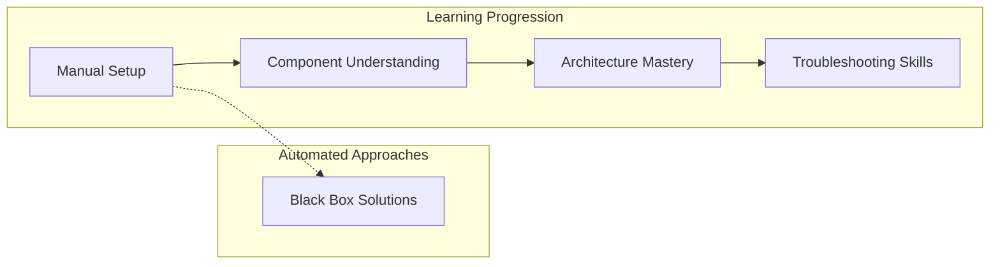
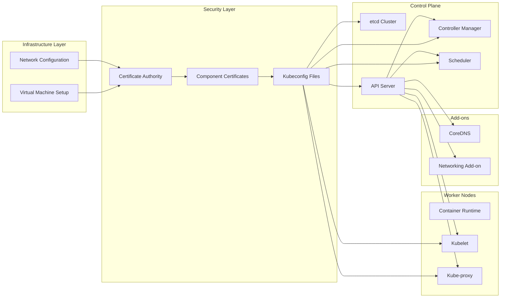
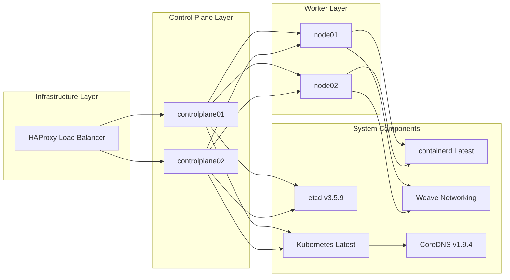

# Project Purpose and Goals
Relevant source files
- [README.md](https://github.com/mmumshad/kubernetes-the-hard-way/blob/8218a815/README.md?plain=1)
- [docs/07-bootstrapping-etcd.md](https://github.com/mmumshad/kubernetes-the-hard-way/blob/8218a815/docs/07-bootstrapping-etcd.md?plain=1)

## Introduction

"Kubernetes The Hard Way" is a comprehensive tutorial designed to guide users through setting up a Kubernetes cluster manually on a local machine using virtualization technology. Unlike automated deployment tools, this approach deliberately takes the longer, more detailed route to provide deep insights into Kubernetes' internal workings and architecture.

Sources: [README.md1-12](https://github.com/mmumshad/kubernetes-the-hard-way/blob/8218a815/README.md?plain=1#L1-L12)

## Core Purpose

The primary purpose of this project is **educational rather than operational**. By manually setting up each component of a Kubernetes cluster, users gain a thorough understanding of:

1. How Kubernetes components interact with each other
2. The security mechanisms that protect the cluster
3. The sequence of operations required to bootstrap a functional cluster
4. The internal architecture of a production-grade Kubernetes deployment

Rather than abstracting away complexity through automation, this approach deliberately exposes it as a learning tool.

Sources: [README.md9-14](https://github.com/mmumshad/kubernetes-the-hard-way/blob/8218a815/README.md?plain=1#L9-L14)

## Target Audience

The tutorial is specifically designed for:

- DevOps engineers planning to support production Kubernetes clusters
- Platform engineers who need to understand Kubernetes internals
- System administrators preparing for Kubernetes certifications
- Anyone wanting to understand how Kubernetes components fit together

It is **not** intended for those seeking a quick, production-ready deployment solution.

Sources: [README.md24-26](https://github.com/mmumshad/kubernetes-the-hard-way/blob/8218a815/README.md?plain=1#L24-L26)

## Learning Journey

The project creates a deliberate learning journey that starts with manual setup and results in a deep understanding of Kubernetes architecture and troubleshooting capabilities, contrasting with "black box" automated deployment methods.

Sources: [README.md8-14](https://github.com/mmumshad/kubernetes-the-hard-way/blob/8218a815/README.md?plain=1#L8-L14)[README.md24-30](https://github.com/mmumshad/kubernetes-the-hard-way/blob/8218a815/README.md?plain=1#L24-L30)

## System Components and Educational Focus

The tutorial guides users through setting up:

Each component's setup is deliberately manual to highlight key concepts like:

1. **Infrastructure Requirements**: Understanding the hardware and network needs of Kubernetes components
2. **Security Model**: How certificates, authentication and authorization work together
3. **Control Plane Architecture**: How the distributed control plane components coordinate
4. **Data Storage Pattern**: How etcd stores and manages cluster state
5. **Node-level Operations**: How worker nodes run containers and communicate

Sources: [README.md30-36](https://github.com/mmumshad/kubernetes-the-hard-way/blob/8218a815/README.md?plain=1#L30-L36)[docs/07-bootstrapping-etcd.md1-3](https://github.com/mmumshad/kubernetes-the-hard-way/blob/8218a815/docs/07-bootstrapping-etcd.md?plain=1#L1-L3)

## Platform Support

The tutorial supports multiple deployment platforms:

| Platform | Target Hardware | Virtualization Technology |
| --- | --- | --- |
| VirtualBox with Vagrant | Windows or Intel Mac | VirtualBox hypervisor |
| Multipass | Apple Silicon Mac (M1/M2/M3) | Multipass virtual machine manager |

This multi-platform approach ensures the educational value is accessible regardless of the user's hardware.

Sources: [README.md47-49](https://github.com/mmumshad/kubernetes-the-hard-way/blob/8218a815/README.md?plain=1#L47-L49)

## Cluster Configuration

The tutorial creates a high-availability Kubernetes cluster with:

This architecture demonstrates production-grade patterns like:

1. **High Availability**: Multiple control plane nodes with load balancing
2. **Security**: End-to-end encryption between components and RBAC authentication
3. **Networking**: Pod networking with Weave
4. **Service Discovery**: CoreDNS for DNS resolution

Sources: [README.md30-36](https://github.com/mmumshad/kubernetes-the-hard-way/blob/8218a815/README.md?plain=1#L30-L36)[README.md38-44](https://github.com/mmumshad/kubernetes-the-hard-way/blob/8218a815/README.md?plain=1#L38-L44)

## What This Project Is Not

This project explicitly is **not**:

- A quick way to set up a production Kubernetes cluster
- A fully automated deployment system
- A replacement for managed Kubernetes services like Google Kubernetes Engine
- A method to create a cluster for development and testing of applications

For those needs, the project recommends alternative approaches like managed services or automated installers.

Sources: [README.md6-7](https://github.com/mmumshad/kubernetes-the-hard-way/blob/8218a815/README.md?plain=1#L6-L7)[README.md14](https://github.com/mmumshad/kubernetes-the-hard-way/blob/8218a815/README.md?plain=1#L14-L14)

## Educational Philosophy

The project's educational philosophy can be summarized as "understanding through implementation." By requiring users to manually implement each component, it enforces a deeper understanding than could be gained from theoretical learning alone.

The tutorial emphasizes:

1. **Step-by-step progression**: Building from basic infrastructure to a complete cluster
2. **Component-level understanding**: Learning the purpose and configuration of each piece
3. **Debugging skills**: Troubleshooting a manual setup builds diagnostic abilities
4. **Security awareness**: Explicit handling of certificates and security configurations builds security consciousness

Sources: [README.md16-22](https://github.com/mmumshad/kubernetes-the-hard-way/blob/8218a815/README.md?plain=1#L16-L22)

## Relationship to Original Project

This tutorial is a modified version of Kelsey Hightower's original "Kubernetes The Hard Way," adapted to work on local hypervisors rather than Google Cloud Platform, making it more accessible for individual learning without cloud costs.

Sources: [README.md11-12](https://github.com/mmumshad/kubernetes-the-hard-way/blob/8218a815/README.md?plain=1#L11-L12)