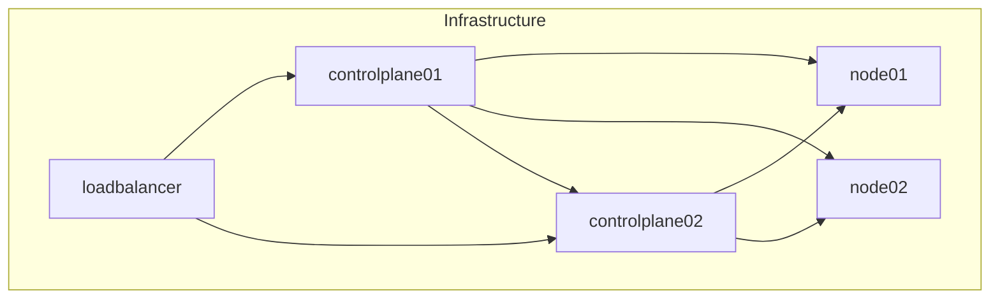
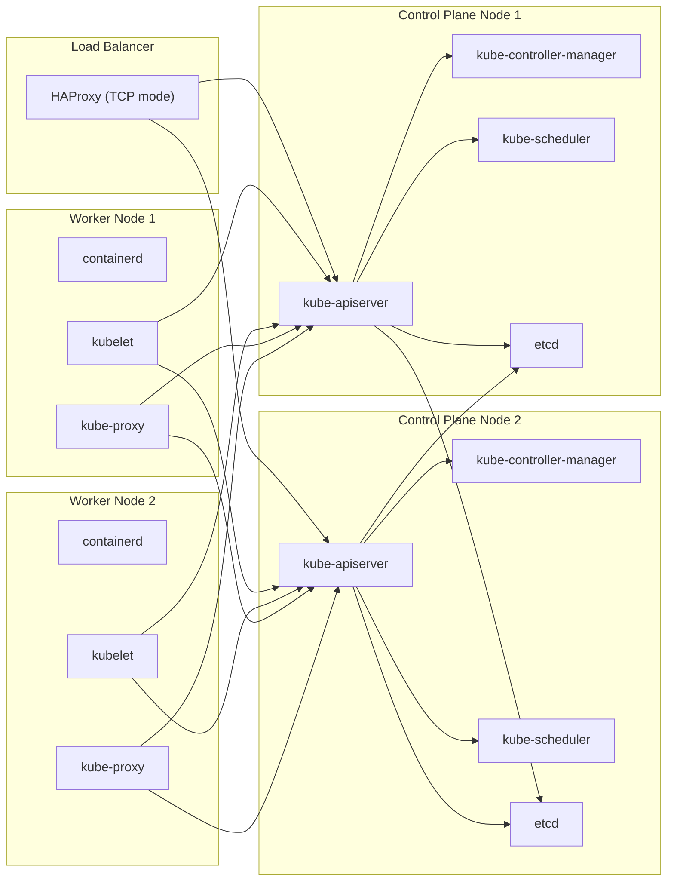
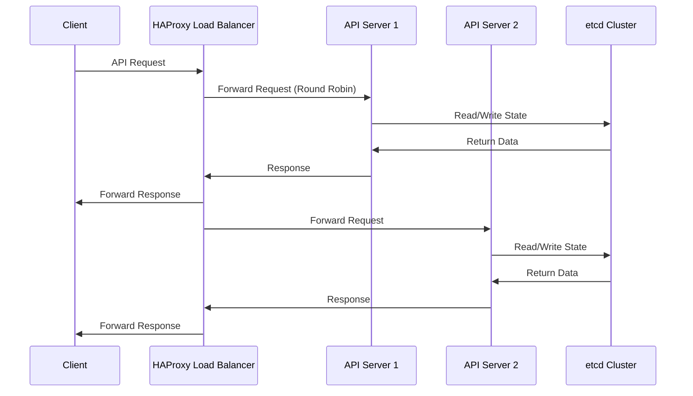
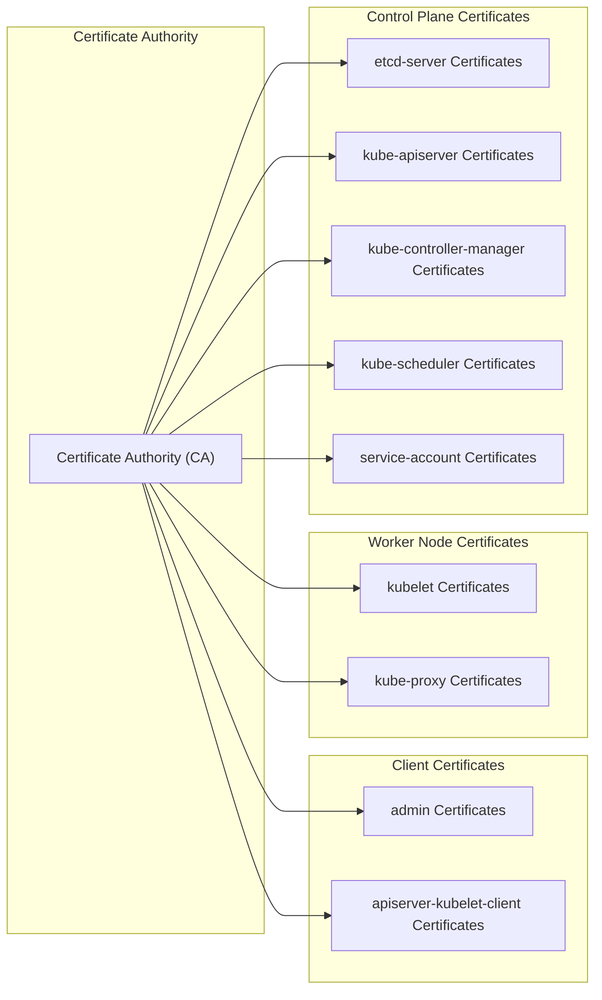
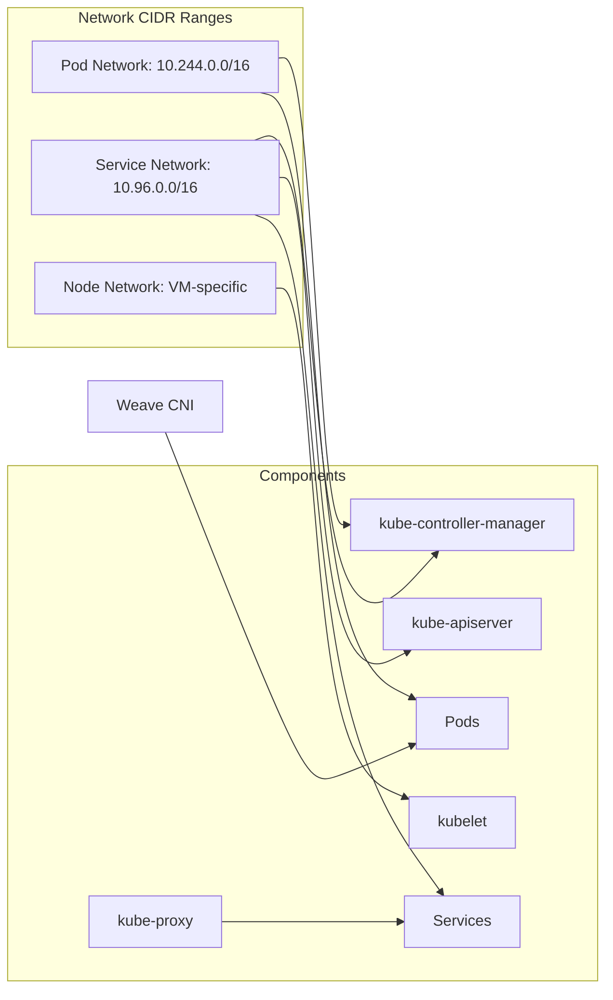
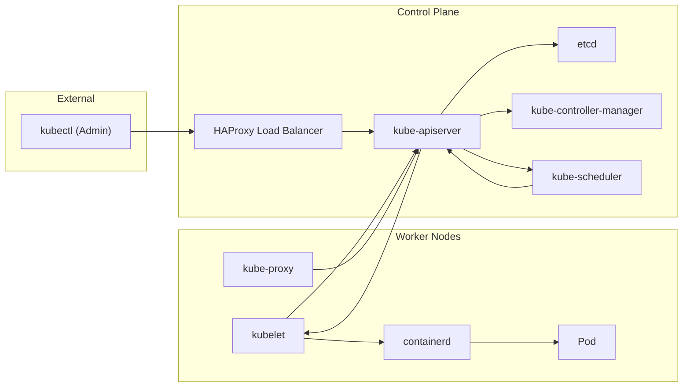

# Architecture Overview
Relevant source files
- [README.md](https://github.com/mmumshad/kubernetes-the-hard-way/blob/8218a815/README.md?plain=1)
- [docs/07-bootstrapping-etcd.md](https://github.com/mmumshad/kubernetes-the-hard-way/blob/8218a815/docs/07-bootstrapping-etcd.md?plain=1)
- [docs/08-bootstrapping-kubernetes-controllers.md](https://github.com/mmumshad/kubernetes-the-hard-way/blob/8218a815/docs/08-bootstrapping-kubernetes-controllers.md?plain=1)

This document provides a comprehensive overview of the Kubernetes cluster architecture deployed using the "Kubernetes The Hard Way" approach. It covers the physical infrastructure, component layout, security architecture, and communication flows between components. For a detailed step-by-step deployment process, see [Deployment Flow](/mmumshad/kubernetes-the-hard-way/1.3-deployment-flow).

## Physical Infrastructure

The Kubernetes cluster consists of five virtual machines, each with specific roles in the architecture:

**Cluster Components:**

- **Control Plane Nodes (2)**: Hosts the Kubernetes control plane components
- **Worker Nodes (2)**: Runs the actual containerized applications
- **Load Balancer (1)**: Provides high availability for the Kubernetes API server

Sources: [README.md38-44](https://github.com/mmumshad/kubernetes-the-hard-way/blob/8218a815/README.md?plain=1#L38-L44)

## Component Architecture

The Kubernetes architecture follows a distributed system design with clearly separated control plane and data plane components:

### Control Plane Components

1. **etcd Cluster**

- Distributed key-value store that stores all Kubernetes cluster data
- Runs as a cluster across both control plane nodes with mutual TLS authentication
- Version: etcd v3.5.9
2. **Kubernetes API Server (kube-apiserver)**

- Exposes the Kubernetes API
- Validates and processes API requests
- Acts as the front-end to the cluster's shared state
3. **Kubernetes Controller Manager (kube-controller-manager)**

- Runs controller processes (node controller, replication controller, etc.)
- Watches for changes and maintains the desired state of the cluster
4. **Kubernetes Scheduler (kube-scheduler)**

- Assigns newly created pods to nodes based on resource requirements and constraints

### Worker Node Components

1. **Container Runtime (containerd)**

- Manages container lifecycle operations
- Pulls container images and runs containers
2. **Kubelet**

- Ensures that containers are running in a pod
- Communicates with the API server
3. **Kube-proxy**

- Maintains network rules on nodes
- Enables Kubernetes service abstraction

### Add-ons

1. **CoreDNS**
- Provides DNS service discovery for the cluster
- Version: v1.9.4

Sources: [README.md29-36](https://github.com/mmumshad/kubernetes-the-hard-way/blob/8218a815/README.md?plain=1#L29-L36)[docs/08-bootstrapping-kubernetes-controllers.md1-260](https://github.com/mmumshad/kubernetes-the-hard-way/blob/8218a815/docs/08-bootstrapping-kubernetes-controllers.md?plain=1#L1-L260)[docs/07-bootstrapping-etcd.md1-143](https://github.com/mmumshad/kubernetes-the-hard-way/blob/8218a815/docs/07-bootstrapping-etcd.md?plain=1#L1-L143)

## High Availability Design

The cluster is designed with high availability in mind, although for resource efficiency, only two control plane nodes are used rather than the recommended three for a production environment.

Key high availability features:

- **Load Balancer**: HAProxy distributes traffic between API servers
- **Multiple API Servers**: Each control plane node runs its own API server instance
- **Distributed etcd**: Data is replicated across multiple etcd instances
- **Leader Election**: Controller manager and scheduler use leader election to ensure only one active instance

Sources: [docs/08-bootstrapping-kubernetes-controllers.md262-326](https://github.com/mmumshad/kubernetes-the-hard-way/blob/8218a815/docs/08-bootstrapping-kubernetes-controllers.md?plain=1#L262-L326)[README.md13-14](https://github.com/mmumshad/kubernetes-the-hard-way/blob/8218a815/README.md?plain=1#L13-L14)

## Security Architecture

Security is a fundamental aspect of the Kubernetes architecture, implemented through a comprehensive PKI infrastructure:

The security architecture features:

- **TLS Everywhere**: All communication between components uses TLS encryption
- **Mutual TLS Authentication**: Components authenticate each other using certificates
- **RBAC Authorization**: Role-Based Access Control restricts permissions
- **Node Authorization**: Restricts kubelet API access to their own node resources
- **Encryption at Rest**: Secret data is encrypted when stored in etcd

Sources: [docs/08-bootstrapping-kubernetes-controllers.md45-131](https://github.com/mmumshad/kubernetes-the-hard-way/blob/8218a815/docs/08-bootstrapping-kubernetes-controllers.md?plain=1#L45-L131)[docs/07-bootstrapping-etcd.md40-103](https://github.com/mmumshad/kubernetes-the-hard-way/blob/8218a815/docs/07-bootstrapping-etcd.md?plain=1#L40-L103)

## Network Architecture

The Kubernetes cluster uses a multi-network design to separate different types of traffic:

Key networking aspects:

- **Pod Network (10.244.0.0/16)**: Managed by Weave networking plugin
- **Service Network (10.96.0.0/16)**: Virtual IP range for Kubernetes services
- **Node Network**: Physical network for node-to-node communication
- **Network Policies**: Firewall rules for pod communication (implemented by CNI)

Sources: [docs/08-bootstrapping-kubernetes-controllers.md78-84](https://github.com/mmumshad/kubernetes-the-hard-way/blob/8218a815/docs/08-bootstrapping-kubernetes-controllers.md?plain=1#L78-L84)[README.md34](https://github.com/mmumshad/kubernetes-the-hard-way/blob/8218a815/README.md?plain=1#L34-L34)

## Component Communication Flows

Understanding the communication patterns between components is essential for troubleshooting and security:

Communication security:

- All communications use TLS encryption with certificate-based authentication
- The API server is the central hub for all cluster communications
- The load balancer provides a single entry point for external access

Sources: [docs/08-bootstrapping-kubernetes-controllers.md8-12](https://github.com/mmumshad/kubernetes-the-hard-way/blob/8218a815/docs/08-bootstrapping-kubernetes-controllers.md?plain=1#L8-L12)[docs/08-bootstrapping-kubernetes-controllers.md84-130](https://github.com/mmumshad/kubernetes-the-hard-way/blob/8218a815/docs/08-bootstrapping-kubernetes-controllers.md?plain=1#L84-L130)

## Summary

The Kubernetes cluster created through the "Kubernetes The Hard Way" approach follows the standard Kubernetes architecture, but with a focus on manual deployment to understand each component's purpose and configuration. The architecture consists of clearly separated control plane and worker node components, with a load balancer providing high availability for the API server. The security is implemented through a comprehensive PKI infrastructure, and the networking is designed to separate different types of traffic.

This architecture demonstrates the fundamental components and design principles of Kubernetes, providing a solid foundation for understanding more complex production deployments.

Sources: [README.md9-14](https://github.com/mmumshad/kubernetes-the-hard-way/blob/8218a815/README.md?plain=1#L9-L14)[README.md29-36](https://github.com/mmumshad/kubernetes-the-hard-way/blob/8218a815/README.md?plain=1#L29-L36)