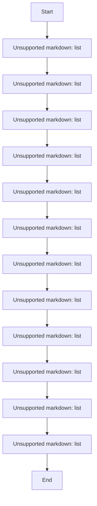
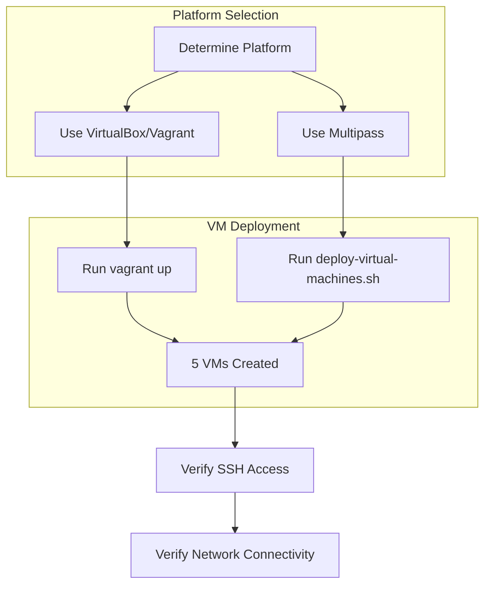
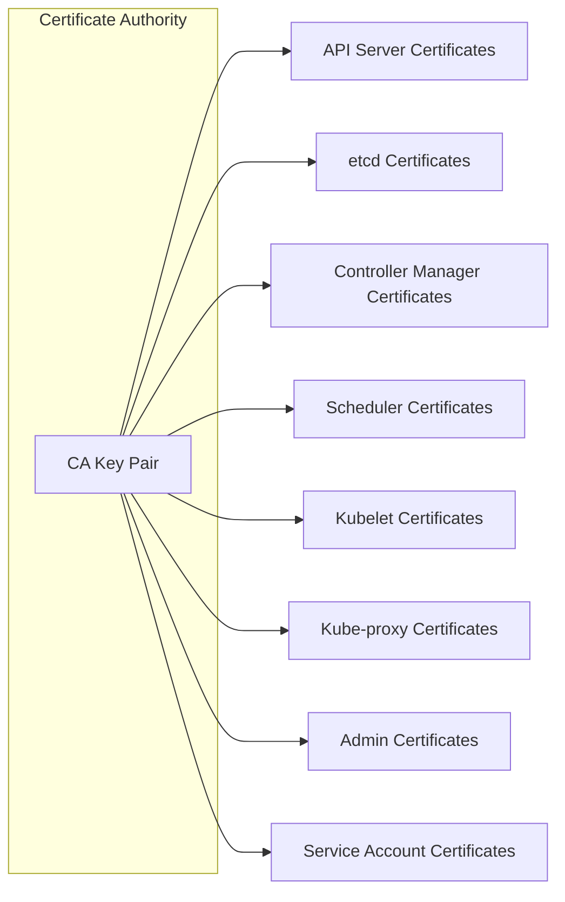
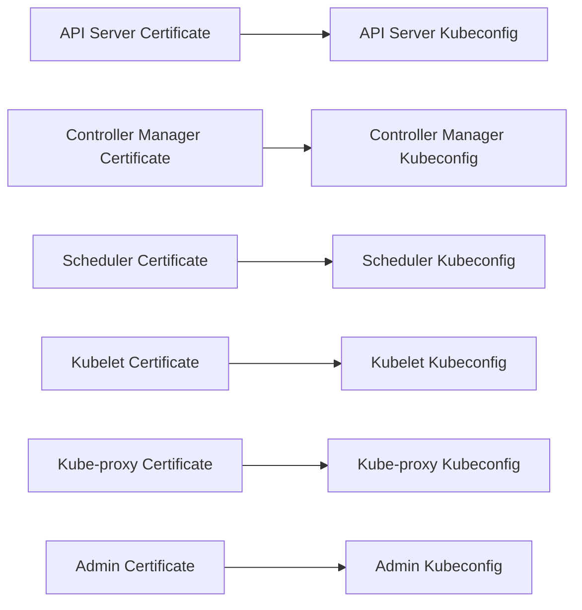
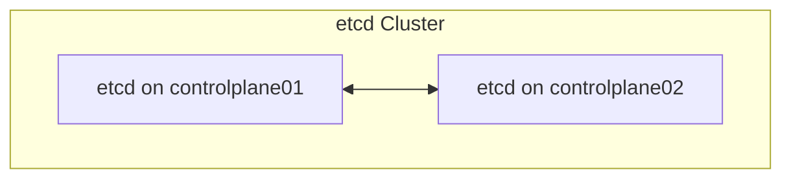
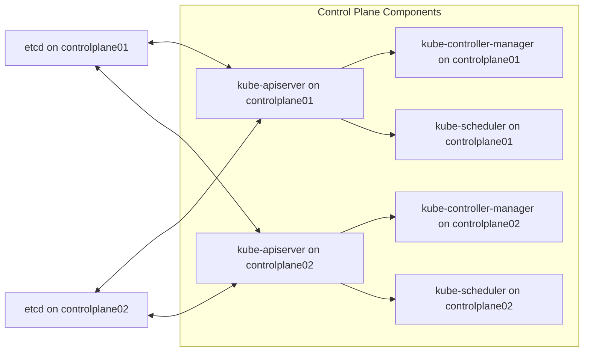
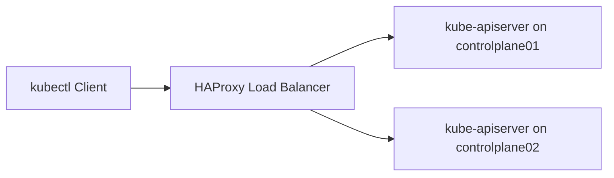
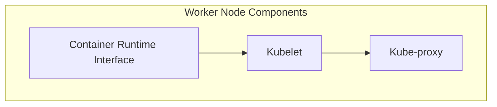
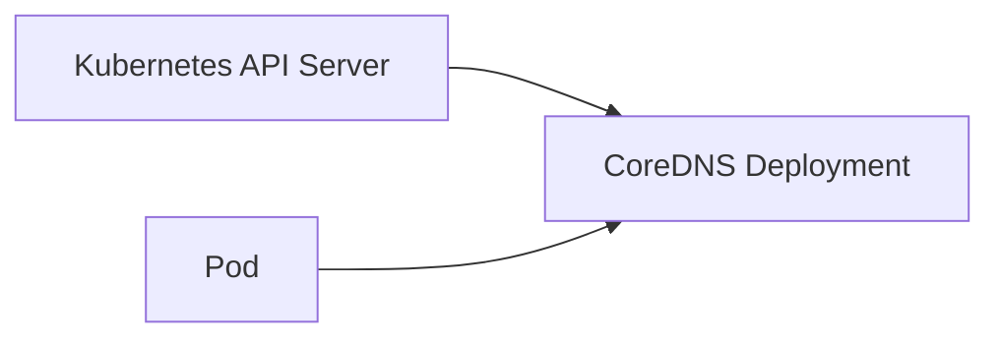
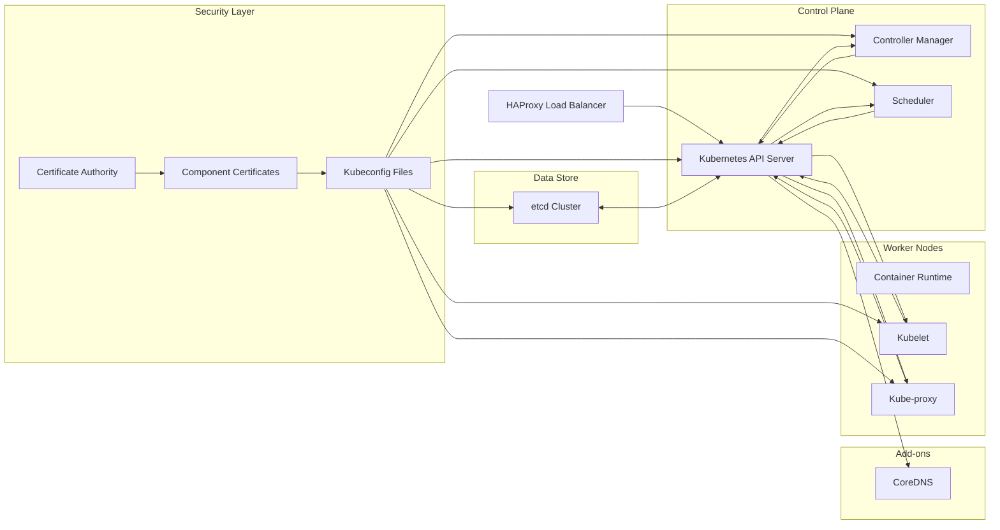

# Deployment Flow
Relevant source files
- [.github/ISSUE_TEMPLATE/bug.yaml](https://github.com/mmumshad/kubernetes-the-hard-way/blob/8218a815/.github/ISSUE_TEMPLATE/bug.yaml)
- [.github/ISSUE_TEMPLATE/config.yml](https://github.com/mmumshad/kubernetes-the-hard-way/blob/8218a815/.github/ISSUE_TEMPLATE/config.yml)
- [README.md](https://github.com/mmumshad/kubernetes-the-hard-way/blob/8218a815/README.md?plain=1)
- [VirtualBox/docs/01-prerequisites.md](https://github.com/mmumshad/kubernetes-the-hard-way/blob/8218a815/VirtualBox/docs/01-prerequisites.md?plain=1)
- [VirtualBox/docs/02-compute-resources.md](https://github.com/mmumshad/kubernetes-the-hard-way/blob/8218a815/VirtualBox/docs/02-compute-resources.md?plain=1)
- [apple-silicon/docs/01-prerequisites.md](https://github.com/mmumshad/kubernetes-the-hard-way/blob/8218a815/apple-silicon/docs/01-prerequisites.md?plain=1)
- [apple-silicon/docs/02-compute-resources.md](https://github.com/mmumshad/kubernetes-the-hard-way/blob/8218a815/apple-silicon/docs/02-compute-resources.md?plain=1)
- [docs/07-bootstrapping-etcd.md](https://github.com/mmumshad/kubernetes-the-hard-way/blob/8218a815/docs/07-bootstrapping-etcd.md?plain=1)

This document outlines the step-by-step process for deploying a Kubernetes cluster manually using the "Kubernetes The Hard Way" methodology. The deployment flow describes the sequential stages required to set up a functioning Kubernetes cluster from scratch, without using automated tools like kubeadm. For information about the overall architecture of the resulting cluster, see [Architecture Overview](/mmumshad/kubernetes-the-hard-way/1.2-architecture-overview).

## Overview of Deployment Stages

The deployment of a Kubernetes cluster using the "hard way" approach follows a logical progression from infrastructure provisioning through security configuration, component bootstrapping, and finally verification.

Sources: [README.md38-44](https://github.com/mmumshad/kubernetes-the-hard-way/blob/8218a815/README.md?plain=1#L38-L44)

## 1. Infrastructure Provisioning

The first step is to provision the required virtual machines that will form the Kubernetes cluster. The deployment requires setting up five VMs with specific roles:

| VM | Purpose | IP Address | Configuration |
| --- | --- | --- | --- |
| controlplane01 | Control Plane | 192.168.56.11 | etcd, kube-apiserver, kube-controller-manager, kube-scheduler |
| controlplane02 | Control Plane | 192.168.56.12 | etcd, kube-apiserver, kube-controller-manager, kube-scheduler |
| node01 | Worker | 192.168.56.21 | kubelet, kube-proxy, container runtime |
| node02 | Worker | 192.168.56.22 | kubelet, kube-proxy, container runtime |
| loadbalancer | Load Balancer | 192.168.56.30 | HAProxy for API server |

The VM provisioning process differs based on the underlying platform:

- For Windows/Intel Mac: VirtualBox + Vagrant
- For Apple Silicon Mac: Multipass

Sources: [VirtualBox/docs/02-compute-resources.md1-42](https://github.com/mmumshad/kubernetes-the-hard-way/blob/8218a815/VirtualBox/docs/02-compute-resources.md?plain=1#L1-L42)[apple-silicon/docs/02-compute-resources.md1-26](https://github.com/mmumshad/kubernetes-the-hard-way/blob/8218a815/apple-silicon/docs/02-compute-resources.md?plain=1#L1-L26)

## 2. Operating System and Network Configuration

After provisioning the VMs, the OS is configured with the necessary kernel parameters and networking settings required for Kubernetes. This includes:

- Setting up `/etc/hosts` for name resolution between cluster nodes
- Configuring kernel parameters for networking (IP forwarding, bridge traffic)
- Distributing SSH keys for passwordless access between nodes
- Setting the `PRIMARY_IP` environment variable to ensure Kubernetes components bind to the correct network interface

Sources: [VirtualBox/docs/02-compute-resources.md30-51](https://github.com/mmumshad/kubernetes-the-hard-way/blob/8218a815/VirtualBox/docs/02-compute-resources.md?plain=1#L30-L51)[apple-silicon/docs/01-prerequisites.md31-39](https://github.com/mmumshad/kubernetes-the-hard-way/blob/8218a815/apple-silicon/docs/01-prerequisites.md?plain=1#L31-L39)

## 3. Client Tools Installation

The deployment process requires installing various client tools on the host machine to interact with the Kubernetes cluster:

- `kubectl`: For interacting with the Kubernetes API
- `cfssl` and `cfssljson`: For certificate generation and management
- Authentication configuration for secure cluster access

These tools are essential for executing subsequent steps in the deployment process.

## 4-6. Security Infrastructure Setup

Setting up the security infrastructure is a critical phase of the deployment, consisting of three key steps:

### 4. Certificate Authority Creation

A Certificate Authority (CA) is established to generate and sign certificates for all cluster components, creating the root of trust for the entire cluster.

### 5. Component Certificate Generation

Using the CA, certificates are generated for each Kubernetes component:

### 6. Kubeconfig File Creation

Kubeconfig files are created for each component using the generated certificates. These files enable secure authentication with the Kubernetes API server:

Sources: [docs/07-bootstrapping-etcd.md41-53](https://github.com/mmumshad/kubernetes-the-hard-way/blob/8218a815/docs/07-bootstrapping-etcd.md?plain=1#L41-L53)

## 7-10. Cluster Bootstrapping

The bootstrapping phase involves setting up the core components of the Kubernetes cluster:

### 7. etcd Cluster Bootstrapping

The etcd distributed key-value store is the first component bootstrapped. It forms the foundation of the cluster, storing all cluster state:

The etcd service is configured using systemd unit files, with certificates for secure communication.

Sources: [docs/07-bootstrapping-etcd.md70-102](https://github.com/mmumshad/kubernetes-the-hard-way/blob/8218a815/docs/07-bootstrapping-etcd.md?plain=1#L70-L102)

### 8. Control Plane Bootstrapping

The Kubernetes control plane components are bootstrapped on both control plane nodes:

Each component is configured with appropriate certificates and kubeconfig files for secure communication.

### 9. Load Balancer Configuration

A load balancer (HAProxy) is configured to distribute traffic between the two API servers, providing high availability for the control plane:

### 10. Worker Node Bootstrapping

Worker nodes are bootstrapped with the necessary components to run containerized applications:

The worker nodes are configured with:

- Container runtime (containerd)
- Kubelet (the primary node agent)
- Kube-proxy (for network routing)

Sources: [README.md40-44](https://github.com/mmumshad/kubernetes-the-hard-way/blob/8218a815/README.md?plain=1#L40-L44)

## 11-12. Add-ons and Verification

The final stages involve setting up additional components and verifying the cluster functionality:

### 11. DNS Add-on Configuration

CoreDNS is deployed to provide DNS resolution for services within the cluster:

### 12. Verification Testing

Various tests are performed to verify the correct functioning of the cluster:

- Smoke tests: Basic functionality testing
- End-to-end tests: Comprehensive testing of cluster functionality
- Certificate verification: Ensuring proper certificate configuration

## Component Relationships and Dependencies

The following diagram illustrates the relationships and dependencies between all components in the deployed Kubernetes cluster:

Sources: [README.md29-37](https://github.com/mmumshad/kubernetes-the-hard-way/blob/8218a815/README.md?plain=1#L29-L37)[docs/07-bootstrapping-etcd.md1-3](https://github.com/mmumshad/kubernetes-the-hard-way/blob/8218a815/docs/07-bootstrapping-etcd.md?plain=1#L1-L3)

## Verification Points

To ensure a successful deployment, verification is performed at key points throughout the process:

1. After VM provisioning: Verify SSH access and network connectivity
2. After security setup: Verify certificate configurations
3. After etcd bootstrapping: Verify cluster member list
4. After control plane bootstrapping: Verify component status
5. After worker node bootstrapping: Verify node registration
6. After DNS add-on deployment: Verify DNS resolution
7. Final verification: Run comprehensive tests

Sources: [docs/07-bootstrapping-etcd.md117-138](https://github.com/mmumshad/kubernetes-the-hard-way/blob/8218a815/docs/07-bootstrapping-etcd.md?plain=1#L117-L138)[README.md16-22](https://github.com/mmumshad/kubernetes-the-hard-way/blob/8218a815/README.md?plain=1#L16-L22)

This methodical, step-by-step approach ensures that each component is properly configured and functioning before proceeding to the next stage, ultimately resulting in a complete, functioning Kubernetes cluster deployed "the hard way."