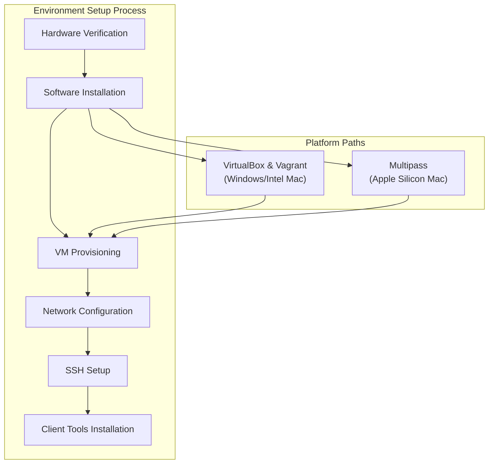
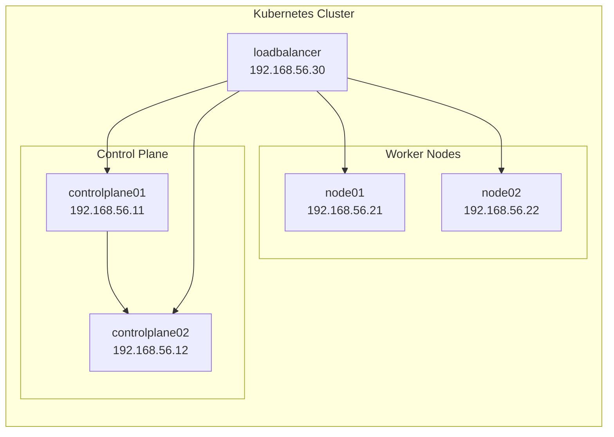
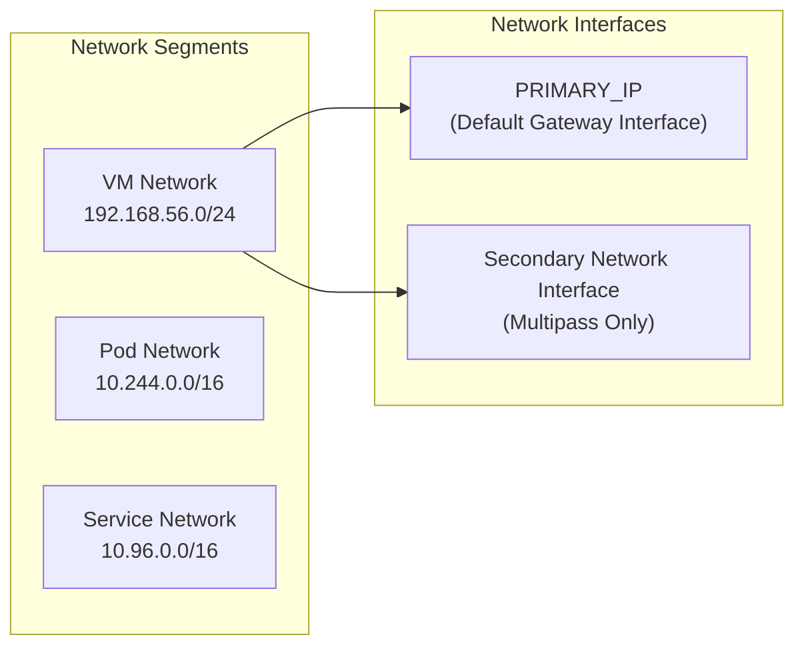
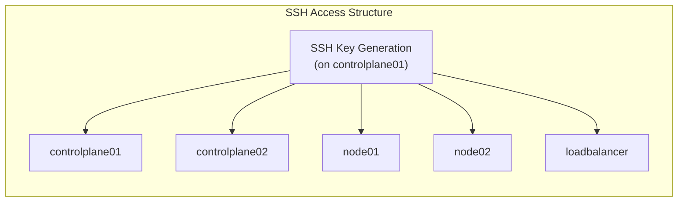

# Environment Setup and Prerequisites
Relevant source files
- [.github/ISSUE_TEMPLATE/bug.yaml](https://github.com/mmumshad/kubernetes-the-hard-way/blob/8218a815/.github/ISSUE_TEMPLATE/bug.yaml)
- [.github/ISSUE_TEMPLATE/config.yml](https://github.com/mmumshad/kubernetes-the-hard-way/blob/8218a815/.github/ISSUE_TEMPLATE/config.yml)
- [VirtualBox/docs/01-prerequisites.md](https://github.com/mmumshad/kubernetes-the-hard-way/blob/8218a815/VirtualBox/docs/01-prerequisites.md?plain=1)
- [VirtualBox/docs/02-compute-resources.md](https://github.com/mmumshad/kubernetes-the-hard-way/blob/8218a815/VirtualBox/docs/02-compute-resources.md?plain=1)
- [apple-silicon/docs/01-prerequisites.md](https://github.com/mmumshad/kubernetes-the-hard-way/blob/8218a815/apple-silicon/docs/01-prerequisites.md?plain=1)
- [apple-silicon/docs/02-compute-resources.md](https://github.com/mmumshad/kubernetes-the-hard-way/blob/8218a815/apple-silicon/docs/02-compute-resources.md?plain=1)
- [docs/03-client-tools.md](https://github.com/mmumshad/kubernetes-the-hard-way/blob/8218a815/docs/03-client-tools.md?plain=1)

This document outlines the essential hardware and software requirements needed to establish the foundational environment for installing Kubernetes the Hard Way. It covers prerequisite components, system specifications, and initial configuration steps necessary before proceeding with the Kubernetes component installation.

For platform-specific setup details, see [Platform-specific Setup](/mmumshad/kubernetes-the-hard-way/2.1-platform-specific-setup). For information about client tools installation, see [Client Tools Installation](/mmumshad/kubernetes-the-hard-way/2.3-client-tools-installation).

## Overview

Before deploying Kubernetes components, we need to establish a proper environment consisting of multiple virtual machines with appropriate networking. This guide supports two distinct approaches based on your hardware:

1. **VirtualBox-based approach** - For Windows and Intel Mac users
2. **Multipass-based approach** - For Apple Silicon Mac (M1/M2/M3) users

Sources: [VirtualBox/docs/01-prerequisites.md](https://github.com/mmumshad/kubernetes-the-hard-way/blob/8218a815/VirtualBox/docs/01-prerequisites.md?plain=1)[apple-silicon/docs/01-prerequisites.md](https://github.com/mmumshad/kubernetes-the-hard-way/blob/8218a815/apple-silicon/docs/01-prerequisites.md?plain=1)

## Hardware Requirements

The hardware requirements differ based on your platform:

### For VirtualBox (Windows/Intel Mac)

- **RAM**: 16GB minimum recommended (8GB absolute minimum but may cause performance issues)
- **CPU**: 8 cores or better (Intel Core-i7/Core-i9, AMD Ryzen-7/Ryzen-9)
- **Storage**: 50GB free disk space

### For Apple Silicon (M1/M2/M3)

- **RAM**: 16GB recommended (8GB minimum)
- **CPU**: Pro or Max CPU recommended for running e2e-tests
- **Storage**: 25GB free disk space

Note that on Apple Silicon Macs, the unified memory architecture means that some RAM is reserved for the display, especially with external monitors connected. With less than 16GB, smaller VMs will be deployed, which may not be sufficient for running the final end-to-end tests.

Sources: [VirtualBox/docs/01-prerequisites.md10-16](https://github.com/mmumshad/kubernetes-the-hard-way/blob/8218a815/VirtualBox/docs/01-prerequisites.md?plain=1#L10-L16)[apple-silicon/docs/01-prerequisites.md3-9](https://github.com/mmumshad/kubernetes-the-hard-way/blob/8218a815/apple-silicon/docs/01-prerequisites.md?plain=1#L3-L9)

## Software Requirements

### For VirtualBox (Windows/Intel Mac)

1. **VirtualBox**: Download and install from [VirtualBox website](https://www.virtualbox.org/wiki/Downloads)
2. **Vagrant**: Download and install from [Vagrant website](https://www.vagrantup.com/)

### For Apple Silicon (M1/M2/M3)

1. **Multipass**: Install from [multipass.run](https://multipass.run/install)
2. **JQ**: JSON processor for command-line use

### Common Requirements

- Administrator privileges on your local machine
- Git for cloning the repository
- Terminal access

Sources: [VirtualBox/docs/01-prerequisites.md20-39](https://github.com/mmumshad/kubernetes-the-hard-way/blob/8218a815/VirtualBox/docs/01-prerequisites.md?plain=1#L20-L39)[apple-silicon/docs/01-prerequisites.md12-21](https://github.com/mmumshad/kubernetes-the-hard-way/blob/8218a815/apple-silicon/docs/01-prerequisites.md?plain=1#L12-L21)

## VM Architecture

The environment consists of 5 virtual machines with specific roles:

| VM | Purpose | IP Address (VirtualBox) | RAM (VirtualBox) |
| --- | --- | --- | --- |
| controlplane01 | Control Plane | 192.168.56.11 | 2048 MB |
| controlplane02 | Control Plane | 192.168.56.12 | 1024 MB |
| node01 | Worker Node | 192.168.56.21 | 512 MB |
| node02 | Worker Node | 192.168.56.22 | 1024 MB |
| loadbalancer | Load Balancer | 192.168.56.30 | 1024 MB |

Note: IP addresses for Multipass (Apple Silicon) are determined dynamically but follow a similar structure on a different subnet.

Sources: [VirtualBox/docs/02-compute-resources.md36-46](https://github.com/mmumshad/kubernetes-the-hard-way/blob/8218a815/VirtualBox/docs/02-compute-resources.md?plain=1#L36-L46)

## Network Configuration

Three distinct network segments are used in the Kubernetes cluster:

| Network | Purpose | Default CIDR |
| --- | --- | --- |
| VM Network | Communication between virtual machines | 192.168.56.0/24 (VirtualBox) |
| Pod Network | Network for Kubernetes pods | 10.244.0.0/16 |
| Service Network | Network for Kubernetes services | 10.96.0.0/16 |

On Apple Silicon (Multipass), each VM requires two network adapters. An environment variable `PRIMARY_IP` is pre-set on all VMs to ensure Kubernetes components bind to the correct network interface.

Sources: [VirtualBox/docs/01-prerequisites.md44-80](https://github.com/mmumshad/kubernetes-the-hard-way/blob/8218a815/VirtualBox/docs/01-prerequisites.md?plain=1#L44-L80)[apple-silicon/docs/01-prerequisites.md31-46](https://github.com/mmumshad/kubernetes-the-hard-way/blob/8218a815/apple-silicon/docs/01-prerequisites.md?plain=1#L31-L46)

## VM Provisioning Overview

The process of provisioning VMs differs between platforms:

### VirtualBox Provisioning

VMs are provisioned using Vagrant, which:

- Creates 5 VMs with predefined specifications
- Sets up networking and hostname resolution
- Configures kernel settings required for Kubernetes

### Apple Silicon Provisioning

VMs are provisioned using Multipass via a script:

- Creates 5 VMs with specifications appropriate for ARM architecture
- Sets up networking with proper IP addressing
- Ensures compatibility with Apple Silicon architecture

Sources: [VirtualBox/docs/02-compute-resources.md1-28](https://github.com/mmumshad/kubernetes-the-hard-way/blob/8218a815/VirtualBox/docs/02-compute-resources.md?plain=1#L1-L28)[apple-silicon/docs/02-compute-resources.md1-25](https://github.com/mmumshad/kubernetes-the-hard-way/blob/8218a815/apple-silicon/docs/02-compute-resources.md?plain=1#L1-L25)

## SSH Configuration and Access

After provisioning the VMs, SSH access needs to be configured:

The process includes:

1. Generating an SSH key pair on the `controlplane01` node
2. Distributing the public key to all nodes (including `controlplane01` itself)
3. Verifying password-less SSH access between nodes

This SSH setup is crucial as many subsequent installation steps require secure communication between nodes.

Sources: [docs/03-client-tools.md7-64](https://github.com/mmumshad/kubernetes-the-hard-way/blob/8218a815/docs/03-client-tools.md?plain=1#L7-L64)

## Client Tools Installation

The final prerequisite is installing the `kubectl` command-line tool, which is necessary for:

- Generating Kubernetes configuration files
- Interacting with the Kubernetes API once deployed
- Managing the cluster

The correct architecture-specific version of kubectl must be installed (amd64 for Intel/Windows, arm64 for Apple Silicon).

Sources: [docs/03-client-tools.md67-98](https://github.com/mmumshad/kubernetes-the-hard-way/blob/8218a815/docs/03-client-tools.md?plain=1#L67-L98)

## Troubleshooting Common Issues

### VirtualBox Issues

- Failed VM provisioning can be resolved by destroying and recreating the specific VM
- If a provisioner gets stuck, terminate the process and retry
- For folder naming conflicts, manually delete the VM folder before reprovisioning

### Apple Silicon Issues

- DHCP lease exhaustion requires manual cleaning of lease files
- Performance issues may occur with less than 16GB RAM

Sources: [VirtualBox/docs/02-compute-resources.md82-123](https://github.com/mmumshad/kubernetes-the-hard-way/blob/8218a815/VirtualBox/docs/02-compute-resources.md?plain=1#L82-L123)[apple-silicon/docs/02-compute-resources.md27-57](https://github.com/mmumshad/kubernetes-the-hard-way/blob/8218a815/apple-silicon/docs/02-compute-resources.md?plain=1#L27-L57)[.github/ISSUE_TEMPLATE/bug.yaml](https://github.com/mmumshad/kubernetes-the-hard-way/blob/8218a815/.github/ISSUE_TEMPLATE/bug.yaml)

## Pausing and Resuming the Environment

You can pause your work and resume later:

### VirtualBox

- Use `vagrant halt` to gracefully shut down all VMs
- Use `vagrant up` to start them again

### Apple Silicon

- Exit all VM sessions
- Use `multipass stop <vm-name>` to stop specific VMs
- Use `multipass start <vm-name>` to restart them

Sources: [VirtualBox/docs/02-compute-resources.md125-138](https://github.com/mmumshad/kubernetes-the-hard-way/blob/8218a815/VirtualBox/docs/02-compute-resources.md?plain=1#L125-L138)

## Next Steps

After completing the environment setup and prerequisites, you will proceed to:

1. **Client Tools Installation** - Setting up CLI tools for managing Kubernetes
2. **Security Infrastructure** - Creating certificates and securing the cluster
3. **Control Plane Setup** - Deploying the Kubernetes control plane components