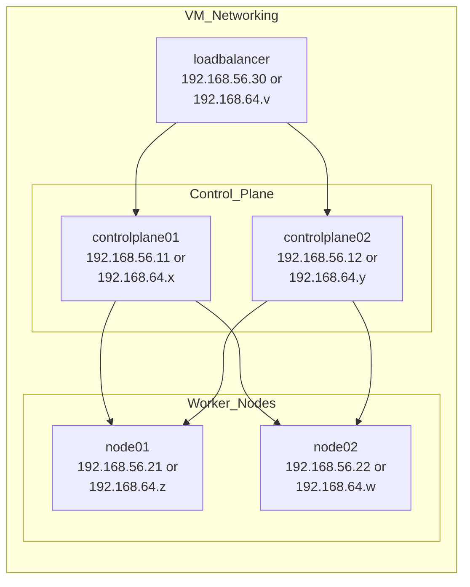
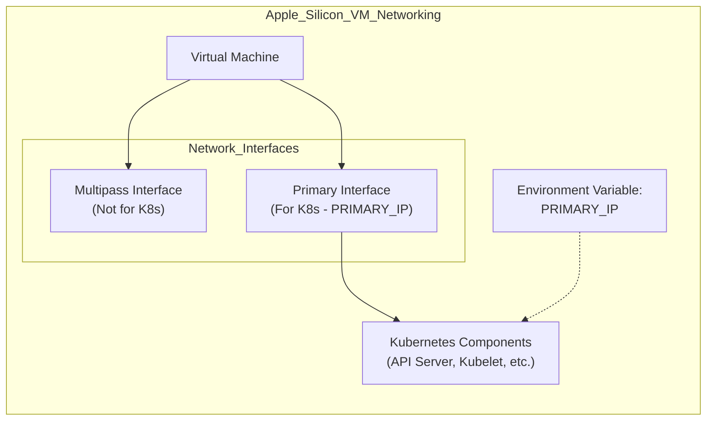

# Platform-specific Setup
Relevant source files
- [.github/ISSUE_TEMPLATE/bug.yaml](https://github.com/mmumshad/kubernetes-the-hard-way/blob/8218a815/.github/ISSUE_TEMPLATE/bug.yaml)
- [.github/ISSUE_TEMPLATE/config.yml](https://github.com/mmumshad/kubernetes-the-hard-way/blob/8218a815/.github/ISSUE_TEMPLATE/config.yml)
- [VirtualBox/docs/01-prerequisites.md](https://github.com/mmumshad/kubernetes-the-hard-way/blob/8218a815/VirtualBox/docs/01-prerequisites.md?plain=1)
- [VirtualBox/docs/02-compute-resources.md](https://github.com/mmumshad/kubernetes-the-hard-way/blob/8218a815/VirtualBox/docs/02-compute-resources.md?plain=1)
- [apple-silicon/docs/01-prerequisites.md](https://github.com/mmumshad/kubernetes-the-hard-way/blob/8218a815/apple-silicon/docs/01-prerequisites.md?plain=1)
- [apple-silicon/docs/02-compute-resources.md](https://github.com/mmumshad/kubernetes-the-hard-way/blob/8218a815/apple-silicon/docs/02-compute-resources.md?plain=1)

## Purpose and Scope

This document explains how to set up the necessary virtual machine infrastructure for deploying Kubernetes the Hard Way on different platforms. It covers two distinct implementation paths: VirtualBox/Vagrant for Windows/Intel Macs and Multipass for Apple Silicon Macs. This setup creates the foundational infrastructure upon which the Kubernetes components will be installed in later sections.

For information on compute resource requirements, see [Compute Resources](/mmumshad/kubernetes-the-hard-way/2.2-compute-resources). For client tool installation after VM setup, see [Client Tools Installation](/mmumshad/kubernetes-the-hard-way/2.3-client-tools-installation).

## Supported Platforms

The Kubernetes the Hard Way tutorial supports the following platforms:

| Platform | Virtualization Technology | Provisioning Tool | Supported OS |
| --- | --- | --- | --- |
| x86/x64 | VirtualBox | Vagrant | Windows, Intel Mac, Linux |
| ARM64 | Multipass | Shell Scripts | Apple Silicon Mac (M1/M2/M3) |

## Platform Path 1: VirtualBox/Vagrant (Windows/Intel Mac)

### Prerequisites

Before setting up the VMs, ensure you have:

1. **Hardware Requirements**:

- 16GB RAM (minimum recommended)
- 8 core or better CPU (Intel Core-i7/i9, AMD Ryzen-7/9)
- 50GB free disk space
2. **Required Software**:

- [VirtualBox](https://www.virtualbox.org/wiki/Downloads)
- [Vagrant](https://www.vagrantup.com/)

Sources: [VirtualBox/docs/01-prerequisites.md9-39](https://github.com/mmumshad/kubernetes-the-hard-way/blob/8218a815/VirtualBox/docs/01-prerequisites.md?plain=1#L9-L39)

### Setup Procedure

1. **Clone Repository**:

```
git clone https://github.com/mmumshad/kubernetes-the-hard-way.git
cd kubernetes-the-hard-way/vagrant
```
2. **Launch VMs**:

```
vagrant up
```
3. **SSH to the VMs**:

- Using Vagrant: `vagrant ssh controlplane01`
- Using SSH client: Connect to the VM's IP address using the private key at `.vagrant/machines/<machine name>/virtualbox/private_key`

Sources: [VirtualBox/docs/02-compute-resources.md3-73](https://github.com/mmumshad/kubernetes-the-hard-way/blob/8218a815/VirtualBox/docs/02-compute-resources.md?plain=1#L3-L73)

## Platform Path 2: Apple Silicon (M1/M2/M3 Macs)

### Prerequisites

Before setting up the VMs, ensure you have:

1. **Hardware Requirements**:

- Apple Silicon System (M1/M2/M3)
- 8GB RAM (16GB recommended)
- Pro or Max CPU recommended for running e2e-tests
2. **Required Software**:

- [Multipass](https://multipass.run/install)
- JQ (`brew install jq`)
- Admin privileges for your Mac account

Sources: [apple-silicon/docs/01-prerequisites.md3-28](https://github.com/mmumshad/kubernetes-the-hard-way/blob/8218a815/apple-silicon/docs/01-prerequisites.md?plain=1#L3-L28)

### Setup Procedure

1. **Clone Repository**:

```
mkdir ~/kodekloud
cd ~/kodekloud
git clone https://github.com/mmumshad/kubernetes-the-hard-way.git
cd kubernetes-the-hard-way/apple-silicon
```
2. **Launch VMs**:

```
./deploy-virtual-machines.sh
```
3. **Verify VM Access**:

```
multipass shell controlplane01
# Exit with 'exit' command
```

Sources: [apple-silicon/docs/02-compute-resources.md1-26](https://github.com/mmumshad/kubernetes-the-hard-way/blob/8218a815/apple-silicon/docs/02-compute-resources.md?plain=1#L1-L26)

## VM Networking Architecture

The tutorial creates a consistent network topology regardless of the platform, but with different implementation details.

### VM Network Diagram



Sources: [VirtualBox/docs/02-compute-resources.md37-45](https://github.com/mmumshad/kubernetes-the-hard-way/blob/8218a815/VirtualBox/docs/02-compute-resources.md?plain=1#L37-L45)[apple-silicon/docs/01-prerequisites.md32-46](https://github.com/mmumshad/kubernetes-the-hard-way/blob/8218a815/apple-silicon/docs/01-prerequisites.md?plain=1#L32-L46)

### Network Configuration Details

#### VirtualBox/Vagrant Path

- Network: `192.168.56.0/24` (static IP addresses)
- DNS: `8.8.8.8`
- Kernel settings: Pre-configured for Kubernetes networking
- Networking style: Host-only network

| VM | Purpose | IP Address | VM Name | RAM |
| --- | --- | --- | --- | --- |
| controlplane01 | Control Plane | 192.168.56.11 | kubernetes-ha-controlplane01 | 2048MB |
| controlplane02 | Control Plane | 192.168.56.12 | kubernetes-ha-controlplane02 | 1024MB |
| node01 | Worker | 192.168.56.21 | kubernetes-ha-node01 | 512MB |
| node02 | Worker | 192.168.56.22 | kubernetes-ha-node02 | 1024MB |
| loadbalancer | Load Balancer | 192.168.56.30 | kubernetes-ha-lb | 1024MB |

Sources: [VirtualBox/docs/02-compute-resources.md37-45](https://github.com/mmumshad/kubernetes-the-hard-way/blob/8218a815/VirtualBox/docs/02-compute-resources.md?plain=1#L37-L45)

#### Apple Silicon Path

- Network: Determined by Multipass (usually `192.168.64.0/24`)
- Networking style: NAT networking
- Special consideration: Each VM has two network adapters

- One used by Multipass
- One used by Kubernetes components (referenced via `PRIMARY_IP` environment variable)

Sources: [apple-silicon/docs/01-prerequisites.md32-46](https://github.com/mmumshad/kubernetes-the-hard-way/blob/8218a815/apple-silicon/docs/01-prerequisites.md?plain=1#L32-L46)

## Environment Variables and Network Considerations

### Apple Silicon Special Network Configuration

On Apple Silicon, each VM has a `PRIMARY_IP` environment variable set, which is the IP address that Kubernetes components should bind to. This is necessary because:

1. Each VM has two network adapters
2. Kubernetes components must bind to the correct interface
3. The `PRIMARY_IP` is defined as the IP of the interface connected to the network with the default gateway



Sources: [apple-silicon/docs/01-prerequisites.md32-34](https://github.com/mmumshad/kubernetes-the-hard-way/blob/8218a815/apple-silicon/docs/01-prerequisites.md?plain=1#L32-L34)

### Network Default Recommendations

For both platform paths, it's recommended to use the default network settings:

- Pod Network CIDR: `10.244.0.0/16`
- Service Network CIDR: `10.96.0.0/16`

Changing these values requires modifying the Weave networking manifests.

Sources: [VirtualBox/docs/01-prerequisites.md44-63](https://github.com/mmumshad/kubernetes-the-hard-way/blob/8218a815/VirtualBox/docs/01-prerequisites.md?plain=1#L44-L63)[apple-silicon/docs/01-prerequisites.md43-45](https://github.com/mmumshad/kubernetes-the-hard-way/blob/8218a815/apple-silicon/docs/01-prerequisites.md?plain=1#L43-L45)

## Verification and Troubleshooting

### Verifying Setup

After provisioning, verify that:

1. All VMs are running
2. VMs have the expected IP addresses
3. You can SSH into all VMs
4. The VMs can ping each other

```
# For VirtualBox:
vagrant ssh controlplane01
 
# For Apple Silicon:
multipass shell controlplane01
```

Sources: [VirtualBox/docs/02-compute-resources.md75-81](https://github.com/mmumshad/kubernetes-the-hard-way/blob/8218a815/VirtualBox/docs/02-compute-resources.md?plain=1#L75-L81)[apple-silicon/docs/02-compute-resources.md11-25](https://github.com/mmumshad/kubernetes-the-hard-way/blob/8218a815/apple-silicon/docs/02-compute-resources.md?plain=1#L11-L25)

### Troubleshooting VirtualBox Setup

If VM provisioning fails:

1. Destroy the problematic VM:

```
vagrant destroy <vm>
```
2. If necessary, delete the VM folder manually:

```
rmdir "<path-to-vm-folder>\kubernetes-ha-node02"
```
3. Re-provision the VM:

```
vagrant up
```

For stuck provisioners (especially at "Waiting for machine to reboot"):

1. Hit `CTRL+C`
2. Kill any running `ruby` process
3. Destroy and re-provision the VM

Sources: [VirtualBox/docs/02-compute-resources.md82-123](https://github.com/mmumshad/kubernetes-the-hard-way/blob/8218a815/VirtualBox/docs/02-compute-resources.md?plain=1#L82-L123)

### Pausing the Environment

For VirtualBox/Vagrant, you can pause and resume your environment:

```
# To shut down all VMs:
vagrant halt
 
# To power on again:
vagrant up
```

Sources: [VirtualBox/docs/02-compute-resources.md125-138](https://github.com/mmumshad/kubernetes-the-hard-way/blob/8218a815/VirtualBox/docs/02-compute-resources.md?plain=1#L125-L138)

### Cleaning Up Apple Silicon Environment

When finished with the Apple Silicon setup:

1. Exit all VM sessions
2. Run the delete script:

```
./delete-virtual-machines.sh
```
3. Clean stale DHCP leases:

```
sudo vi /var/db/dhcpd_leases
```

Remove blocks with names like `controlplane`, `node`, or `loadbalancer`

Sources: [apple-silicon/docs/02-compute-resources.md27-57](https://github.com/mmumshad/kubernetes-the-hard-way/blob/8218a815/apple-silicon/docs/02-compute-resources.md?plain=1#L27-L57)

## Parallel Command Execution Tools

Both platform paths offer tools to run commands on multiple nodes simultaneously:

### iTerm2 for Apple Silicon

[iTerm2](https://iterm2.com/) allows splitting a window into multiple panes with broadcast input enabled:

1. Split pane horizontally
2. Connect to different nodes in each pane
3. Toggle broadcast with `ALT+CMD+I` or from menu: `Session` → `Broadcast` → `Broadcast input to all panes`

Sources: [apple-silicon/docs/01-prerequisites.md48-61](https://github.com/mmumshad/kubernetes-the-hard-way/blob/8218a815/apple-silicon/docs/01-prerequisites.md?plain=1#L48-L61)

### Tmux for VirtualBox

[Tmux](https://github.com/mmumshad/kubernetes-the-hard-way/blob/8218a815/Tmux) provides similar functionality:

1. Split window with `CTRL+B` followed by `"`
2. SSH to different hosts in each pane
3. Enable synchronization with `CTRL+X`
4. Disable synchronization with `CTRL+X` again

Sources: [VirtualBox/docs/01-prerequisites.md81-90](https://github.com/mmumshad/kubernetes-the-hard-way/blob/8218a815/VirtualBox/docs/01-prerequisites.md?plain=1#L81-L90)