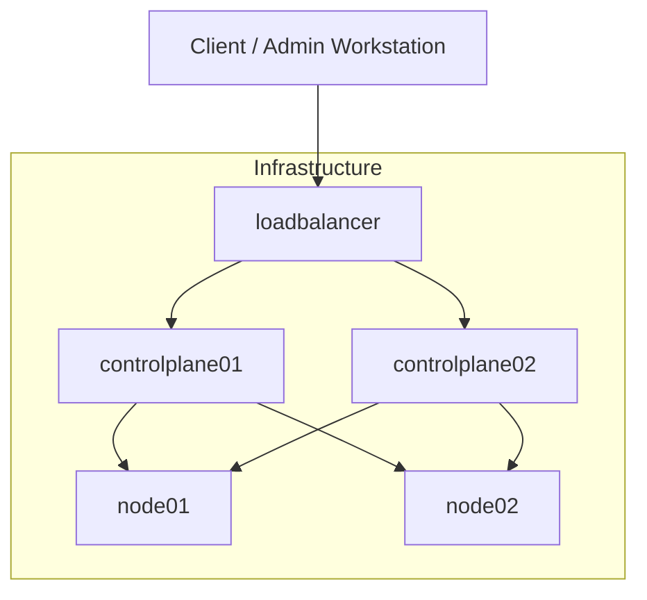
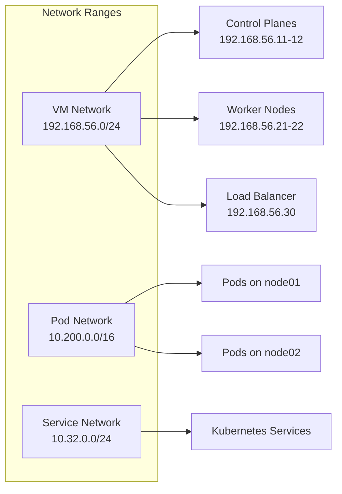
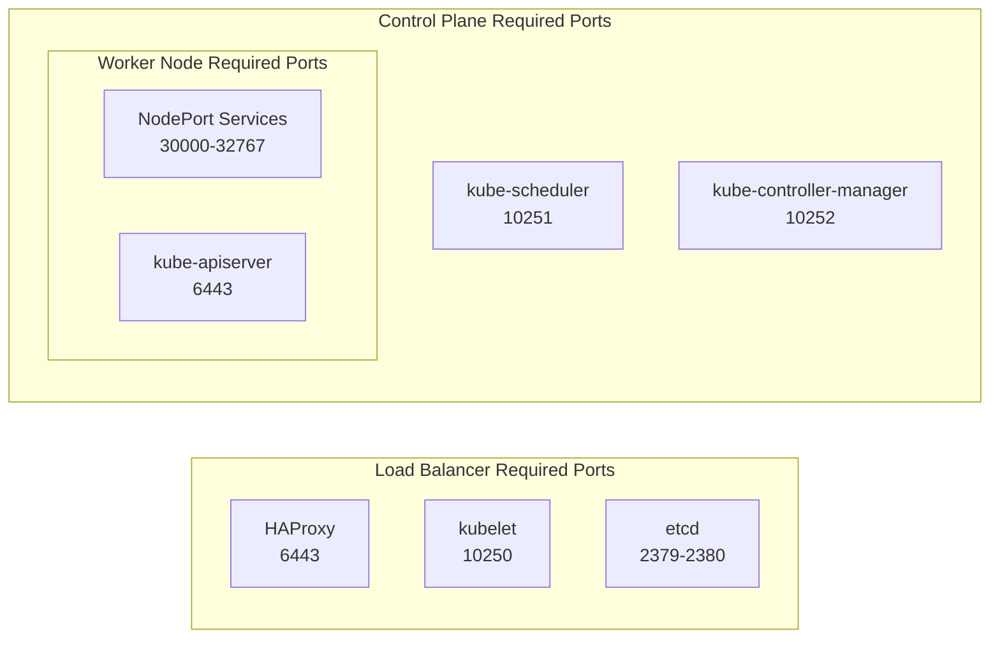
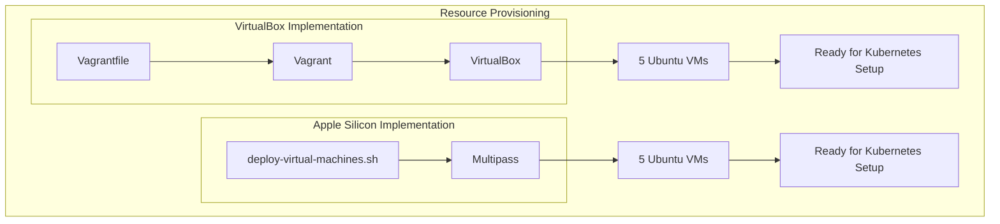
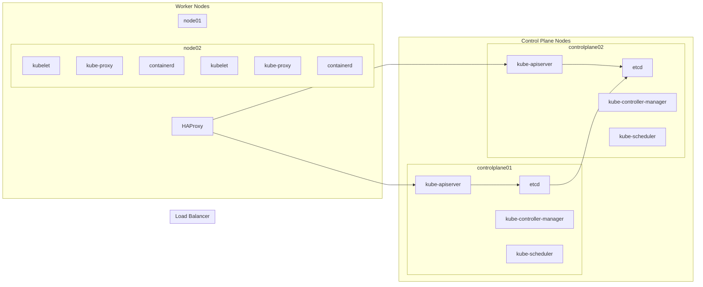

# Compute Resources
Relevant source files
- [docs/03-client-tools.md](https://github.com/mmumshad/kubernetes-the-hard-way/blob/8218a815/docs/03-client-tools.md?plain=1)

## Purpose and Scope

This document details the compute resource requirements and virtual machine configurations necessary for running a Kubernetes cluster using the "Kubernetes The Hard Way" methodology. It covers the specifications for each node type, networking configuration, and base system requirements. For information about how to provision these resources on specific platforms, see [Platform-specific Setup](/mmumshad/kubernetes-the-hard-way/2.1-platform-specific-setup).

## Cluster Architecture

The infrastructure consists of five virtual machines that serve different roles within the Kubernetes cluster:



This diagram represents the basic cluster architecture where:

- Two control plane nodes run the Kubernetes control plane components
- Two worker nodes run the containerized workloads
- One load balancer distributes API requests across the control plane nodes

Sources:

## Resource Requirements

Each node type requires specific compute resources based on its role in the cluster:

| Node Type | CPU | Memory | Disk | Purpose |
| --- | --- | --- | --- | --- |
| Control Plane | 2 vCPU | 2 GB | 20 GB | Runs etcd, kube-apiserver, kube-controller-manager, and kube-scheduler |
| Worker | 2 vCPU | 2 GB | 20 GB | Runs kubelet, kube-proxy, and container runtime |
| Load Balancer | 1 vCPU | 1 GB | 10 GB | Runs HAProxy to load balance API server requests |

These are minimum recommended specifications for a learning environment. Production deployments would typically require more resources.

Sources:

## Networking Configuration

The cluster uses several network ranges for different purposes:



Each node is assigned a static IP address from the VM network range:

| Node | IP Address |
| --- | --- |
| controlplane01 | 192.168.56.11 |
| controlplane02 | 192.168.56.12 |
| node01 | 192.168.56.21 |
| node02 | 192.168.56.22 |
| loadbalancer | 192.168.56.30 |

Sources:

## Required Network Ports

For Kubernetes components to communicate properly, specific network ports must be accessible:



Sources:

## Operating System Requirements

All nodes use Ubuntu 20.04 LTS with specific configurations:

1. Swap must be disabled to ensure Kubernetes performs as expected
2. Required kernel modules:

- `overlay` - Supports overlay filesystem used by container runtimes
- `br_netfilter` - Enables bridge networking functionalities
3. System parameters for container networking:

```
net.bridge.bridge-nf-call-iptables = 1
net.ipv4.ip_forward = 1

```

These settings ensure proper container networking and Kubernetes functionality.

Sources:

## Host Name Resolution

All nodes must be able to resolve each other's hostnames, configured in `/etc/hosts`:

```
192.168.56.11 controlplane01
192.168.56.12 controlplane02
192.168.56.21 node01
192.168.56.22 node02
192.168.56.30 loadbalancer

```

The access between nodes is facilitated through SSH, which is configured in the [SSH Key Distribution](/mmumshad/kubernetes-the-hard-way/2.4-ssh-key-distribution) section.

Sources: [docs/03-client-tools.md7-64](https://github.com/mmumshad/kubernetes-the-hard-way/blob/8218a815/docs/03-client-tools.md?plain=1#L7-L64)

## Resource Provisioning Mechanisms

The VMs are provisioned differently depending on the platform:



Both methods produce identical virtual machine environments, but use different virtualization technologies based on the hardware platform:

1. **VirtualBox/Vagrant**: Used on standard x86 hardware
2. **Multipass**: Used on Apple Silicon (ARM64) hardware

After provisioning, the next steps are to [install the client tools](/mmumshad/kubernetes-the-hard-way/2.3-client-tools-installation) and [distribute SSH keys](/mmumshad/kubernetes-the-hard-way/2.4-ssh-key-distribution) to enable secure communication between nodes.

Sources: [docs/03-client-tools.md1-5](https://github.com/mmumshad/kubernetes-the-hard-way/blob/8218a815/docs/03-client-tools.md?plain=1#L1-L5)

## Architecture Components Diagram

This diagram shows how the compute resources map to the Kubernetes components that will be installed on them:



This shows the mapping between physical resources (virtual machines) and logical Kubernetes components, illustrating how the compute resources will be utilized once the Kubernetes cluster is fully operational.

Sources: