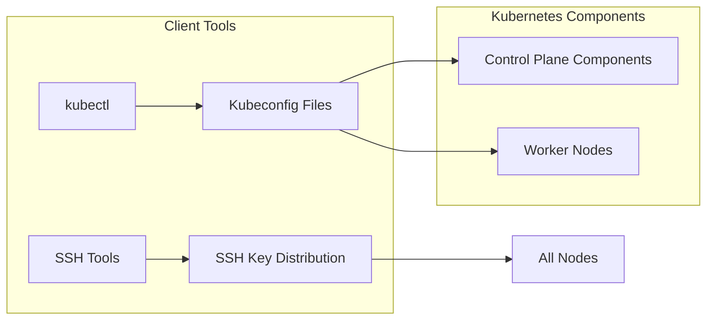
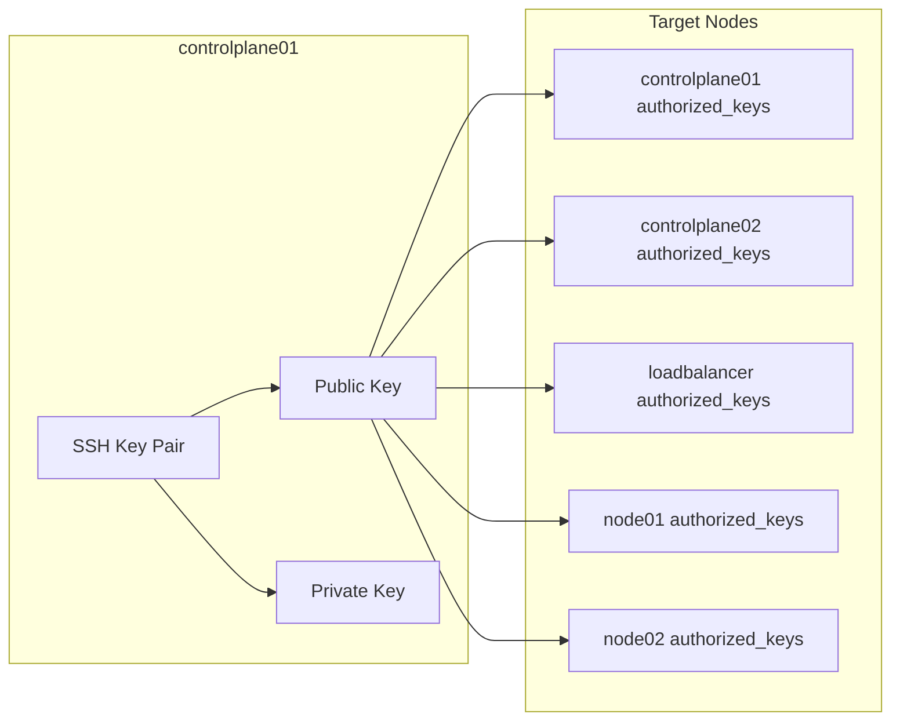
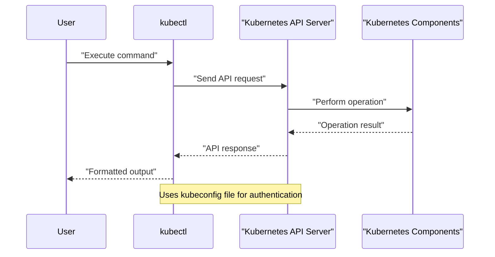

# Client Tools Installation
Relevant source files
- [docs/03-client-tools.md](https://github.com/mmumshad/kubernetes-the-hard-way/blob/8218a815/docs/03-client-tools.md?plain=1)

## Purpose and Scope

This document provides instructions for installing and configuring the necessary client tools required to set up a Kubernetes cluster the hard way. These tools are essential for interacting with the Kubernetes API and enabling secure communication between cluster nodes. This documentation covers SSH key distribution for passwordless access between nodes and the installation of `kubectl`, the primary command-line tool for Kubernetes cluster management.

For information about platform-specific environment setup, see [Platform-specific Setup](/mmumshad/kubernetes-the-hard-way/2.1-platform-specific-setup). For information about SSH key distribution for secure communication, see [SSH Key Distribution](/mmumshad/kubernetes-the-hard-way/2.4-ssh-key-distribution).

Sources: [docs/03-client-tools.md1-4](https://github.com/mmumshad/kubernetes-the-hard-way/blob/8218a815/docs/03-client-tools.md?plain=1#L1-L4)

## Overview of Client Tools

Client tools in the context of Kubernetes installation provide essential functionality for cluster setup, configuration, and management. The diagram below illustrates the relationship between these tools and their role in the setup process:



**Diagram: Client Tools in Kubernetes Setup Process**

Sources: [docs/03-client-tools.md67-69](https://github.com/mmumshad/kubernetes-the-hard-way/blob/8218a815/docs/03-client-tools.md?plain=1#L67-L69)[docs/03-client-tools.md71-73](https://github.com/mmumshad/kubernetes-the-hard-way/blob/8218a815/docs/03-client-tools.md?plain=1#L71-L73)[docs/03-client-tools.md7-10](https://github.com/mmumshad/kubernetes-the-hard-way/blob/8218a815/docs/03-client-tools.md?plain=1#L7-L10)

## Environment Access

Before installing the client tools, you need to access your environment. The process begins by logging into the `controlplane01` node, which serves as the primary control plane node.

Access methods depend on your virtualization platform:

- VirtualBox: Use `vagrant ssh controlplane01`
- Apple Silicon: Use `multipass shell controlplane01`

Sources: [docs/03-client-tools.md3-5](https://github.com/mmumshad/kubernetes-the-hard-way/blob/8218a815/docs/03-client-tools.md?plain=1#L3-L5)

## SSH Key Distribution for Node Access

### Purpose of SSH Key Distribution

Setting up passwordless SSH access between all nodes is a crucial prerequisite for many operations during Kubernetes installation. It allows for secure file transfers and remote command execution without password prompts, which is especially important for automation scripts.



**Diagram: SSH Key Distribution Process**

Sources: [docs/03-client-tools.md7-10](https://github.com/mmumshad/kubernetes-the-hard-way/blob/8218a815/docs/03-client-tools.md?plain=1#L7-L10)[docs/03-client-tools.md11-25](https://github.com/mmumshad/kubernetes-the-hard-way/blob/8218a815/docs/03-client-tools.md?plain=1#L11-L25)

### SSH Key Generation

To enable secure, passwordless SSH access between nodes, you need to generate an SSH key pair on the `controlplane01` node:

1. Generate the SSH key pair:

```
ssh-keygen
```

Accept all default settings by pressing `ENTER` at each prompt.
2. Add the generated public key to the local authorized_keys file:

```
cat ~/.ssh/id_rsa.pub >> ~/.ssh/authorized_keys
```

Sources: [docs/03-client-tools.md11-25](https://github.com/mmumshad/kubernetes-the-hard-way/blob/8218a815/docs/03-client-tools.md?plain=1#L11-L25)

### SSH Key Distribution

Once the SSH key pair is generated, distribute the public key to all other nodes in the cluster:

1. Copy the public key to each node using `ssh-copy-id`:

```
ssh-copy-id -o StrictHostKeyChecking=no $(whoami)@controlplane02
ssh-copy-id -o StrictHostKeyChecking=no $(whoami)@loadbalancer
ssh-copy-id -o StrictHostKeyChecking=no $(whoami)@node01
ssh-copy-id -o StrictHostKeyChecking=no $(whoami)@node02
```

When prompted, enter the appropriate password:

- VirtualBox: `vagrant`
- Apple Silicon: `ubuntu`
2. Verify successful connection by testing SSH access to each node:

```
ssh controlplane01
exit
 
ssh controlplane02
exit
 
ssh node01
exit
 
ssh node02
exit
```

Sources: [docs/03-client-tools.md26-64](https://github.com/mmumshad/kubernetes-the-hard-way/blob/8218a815/docs/03-client-tools.md?plain=1#L26-L64)

## kubectl Installation

### Purpose of kubectl

`kubectl` is the primary command-line utility for interacting with the Kubernetes API server. It provides essential functionality for cluster management and is required early in the setup process to generate `kubeconfig` files for control plane components.



**Diagram: kubectl Interaction Flow**

Sources: [docs/03-client-tools.md67-76](https://github.com/mmumshad/kubernetes-the-hard-way/blob/8218a815/docs/03-client-tools.md?plain=1#L67-L76)

### Installation Steps

The installation process uses the official Kubernetes release binaries, which are architecture-specific. The system has pre-configured the `ARCH` environment variable to ensure you download the correct version for your platform (either `amd64` for VirtualBox or `arm64` for Apple Silicon).

1. Download the appropriate `kubectl` binary:

```
curl -LO "https://dl.k8s.io/release/$(curl -L -s https://dl.k8s.io/release/stable.txt)/bin/linux/${ARCH}/kubectl"
```
2. Make the binary executable:

```
chmod +x kubectl
```
3. Move the binary to a directory in your PATH:

```
sudo mv kubectl /usr/local/bin/
```

Sources: [docs/03-client-tools.md77-83](https://github.com/mmumshad/kubernetes-the-hard-way/blob/8218a815/docs/03-client-tools.md?plain=1#L77-L83)

### Verification

After installation, verify that `kubectl` is installed correctly:

```
kubectl version --client
```

The output should be similar to:

```
Client Version: v1.29.0
Kustomize Version: v5.0.4-0.20230601165947-6ce0bf390ce3

```

Note that version numbers may be different depending on the current stable release at the time of installation.

Sources: [docs/03-client-tools.md85-98](https://github.com/mmumshad/kubernetes-the-hard-way/blob/8218a815/docs/03-client-tools.md?plain=1#L85-L98)

## Summary

Client tools installation is a foundational step in setting up a Kubernetes cluster the hard way. This process includes:

1. **SSH Key Distribution**: Enables secure, passwordless communication between all nodes in the cluster.
2. **kubectl Installation**: Provides the primary command-line interface for interacting with the Kubernetes API.

These tools form the foundation for subsequent steps in the Kubernetes installation process, including certificate generation, kubeconfig file creation, and component setup.

| Tool | Purpose | Required For |
| --- | --- | --- |
| SSH Tools | Secure communication between nodes | File transfers, remote commands |
| kubectl | Kubernetes API interaction | Kubeconfig generation, cluster management |

Sources: [docs/03-client-tools.md1-100](https://github.com/mmumshad/kubernetes-the-hard-way/blob/8218a815/docs/03-client-tools.md?plain=1#L1-L100)