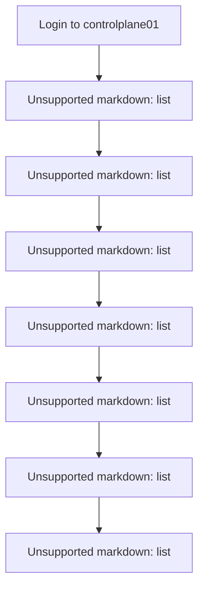
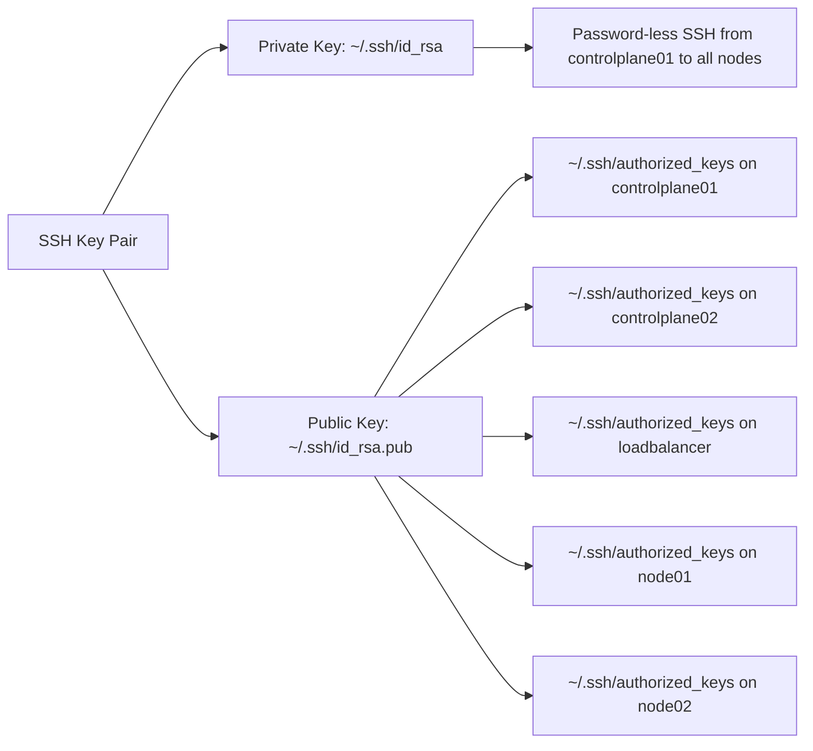

# SSH Key Distribution
Relevant source files
- [docs/03-client-tools.md](https://github.com/mmumshad/kubernetes-the-hard-way/blob/8218a815/docs/03-client-tools.md?plain=1)

## Purpose and Scope

This document explains the SSH key distribution process in the Kubernetes The Hard Way project. SSH key distribution enables password-less authentication between cluster nodes, which is essential for automating commands and securely transferring files during cluster setup and management. This step is performed early in the deployment process, right after provisioning the virtual machines and before installing Kubernetes components.

For information about installing client tools such as kubectl, see [Client Tools Installation](/mmumshad/kubernetes-the-hard-way/2.3-client-tools-installation).

## Overview

SSH key distribution involves generating an SSH key pair on the primary control plane node (`controlplane01`) and distributing the public key to all nodes in the cluster. This allows the user on `controlplane01` to SSH into any node without entering a password, which facilitates the execution of commands and copying of files during the Kubernetes setup process.

## SSH Key Distribution Process

The SSH key distribution process follows these steps:

### SSH Key Distribution Flow Diagram



Sources: [docs/03-client-tools.md9-64](https://github.com/mmumshad/kubernetes-the-hard-way/blob/8218a815/docs/03-client-tools.md?plain=1#L9-L64)

### 1. Login to Control Plane Node

First, log in to the `controlplane01` node using the appropriate method for your platform:

- VirtualBox: `vagrant ssh controlplane01`
- Apple Silicon: `multipass shell controlplane01`

### 2. Generate SSH Key Pair

On `controlplane01`, generate an SSH key pair using the `ssh-keygen` command:

```
ssh-keygen
```

Accept the default options by pressing ENTER at all prompts. This will create:

- Private key: `~/.ssh/id_rsa`
- Public key: `~/.ssh/id_rsa.pub`

Sources: [docs/03-client-tools.md15-19](https://github.com/mmumshad/kubernetes-the-hard-way/blob/8218a815/docs/03-client-tools.md?plain=1#L15-L19)

### 3. Add Public Key to Local Authorized Keys

Add the generated public key to the local `authorized_keys` file on `controlplane01`:

```
cat ~/.ssh/id_rsa.pub >> ~/.ssh/authorized_keys
```

This step is necessary because some commands require SSHing or SCPing to the local machine.

Sources: [docs/03-client-tools.md23-25](https://github.com/mmumshad/kubernetes-the-hard-way/blob/8218a815/docs/03-client-tools.md?plain=1#L23-L25)

### 4. Copy Public Key to Remote Nodes

Copy the public key to each of the other nodes using `ssh-copy-id`:

```
ssh-copy-id -o StrictHostKeyChecking=no $(whoami)@controlplane02
ssh-copy-id -o StrictHostKeyChecking=no $(whoami)@loadbalancer
ssh-copy-id -o StrictHostKeyChecking=no $(whoami)@node01
ssh-copy-id -o StrictHostKeyChecking=no $(whoami)@node02
```

When prompted, enter the password for the remote user:

- VirtualBox: `vagrant`
- Apple Silicon: `ubuntu`

The `-o StrictHostKeyChecking=no` option prevents SSH from asking about connecting to previously unknown hosts, which speeds up the process.

The `$(whoami)` command automatically inserts the correct username:

- VirtualBox: `vagrant`
- Apple Silicon: `ubuntu`

Sources: [docs/03-client-tools.md35-40](https://github.com/mmumshad/kubernetes-the-hard-way/blob/8218a815/docs/03-client-tools.md?plain=1#L35-L40)

### 5. Verify SSH Connection

Verify that you can SSH into each node without a password:

```
ssh controlplane01
exit
 
ssh controlplane02
exit
 
ssh node01
exit
 
ssh node02
exit
```

Sources: [docs/03-client-tools.md52-63](https://github.com/mmumshad/kubernetes-the-hard-way/blob/8218a815/docs/03-client-tools.md?plain=1#L52-L63)

## SSH Files and Connectivity

After completing the SSH key distribution process, the following files and connectivity are established:

### SSH Key Files and Connectivity Diagram



Sources: [docs/03-client-tools.md9-64](https://github.com/mmumshad/kubernetes-the-hard-way/blob/8218a815/docs/03-client-tools.md?plain=1#L9-L64)

## Troubleshooting

### Common Issues

1. **Authentication failure**: If you encounter an authentication failure when using `ssh-copy-id`, ensure you're using the correct password for the remote user (`vagrant` for VirtualBox, `ubuntu` for Apple Silicon).
2. **Connection refused**: If you can't connect to a node, verify that the node is running and accessible from `controlplane01`. Check the node's IP address in `/etc/hosts`.
3. **Permission issues**: If you encounter permission issues with the SSH keys, ensure the permissions are set correctly:

```
chmod 700 ~/.ssh
chmod 600 ~/.ssh/id_rsa
chmod 644 ~/.ssh/id_rsa.pub
chmod 644 ~/.ssh/authorized_keys
```

## Conclusion

SSH key distribution is a critical first step in the Kubernetes setup process. It enables password-less authentication between the primary control plane node (`controlplane01`) and all other nodes in the cluster, which facilitates the execution of commands and file transfers required for the subsequent Kubernetes installation steps.

After completing the SSH key distribution, you can proceed to install kubectl and other client tools as described in [Client Tools Installation](/mmumshad/kubernetes-the-hard-way/2.3-client-tools-installation).