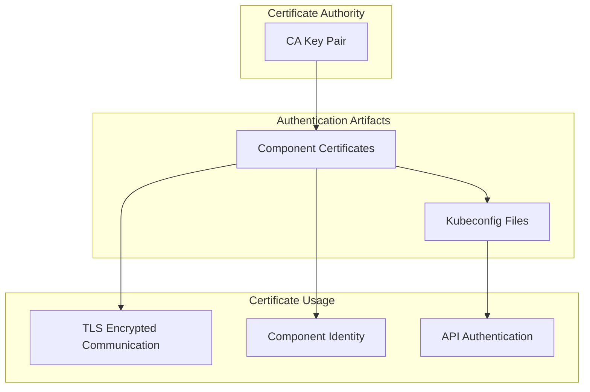
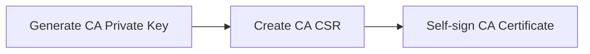
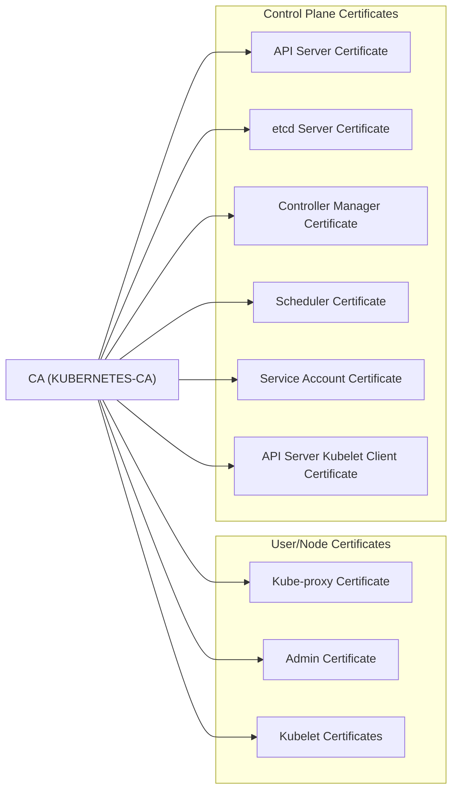
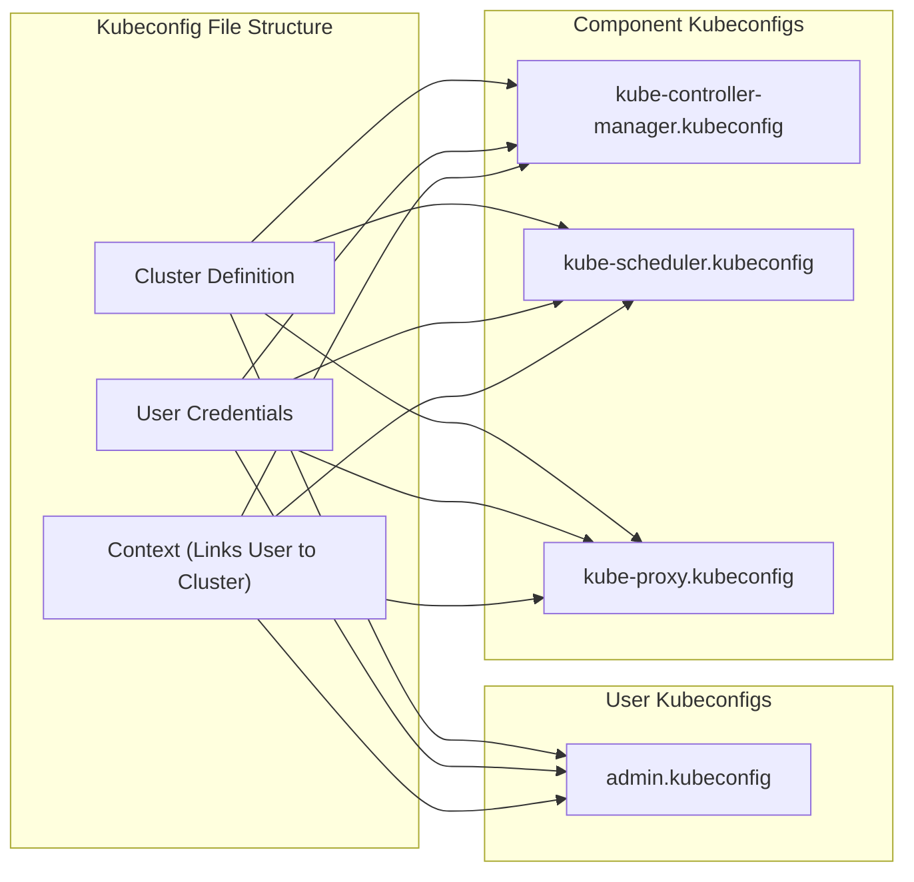
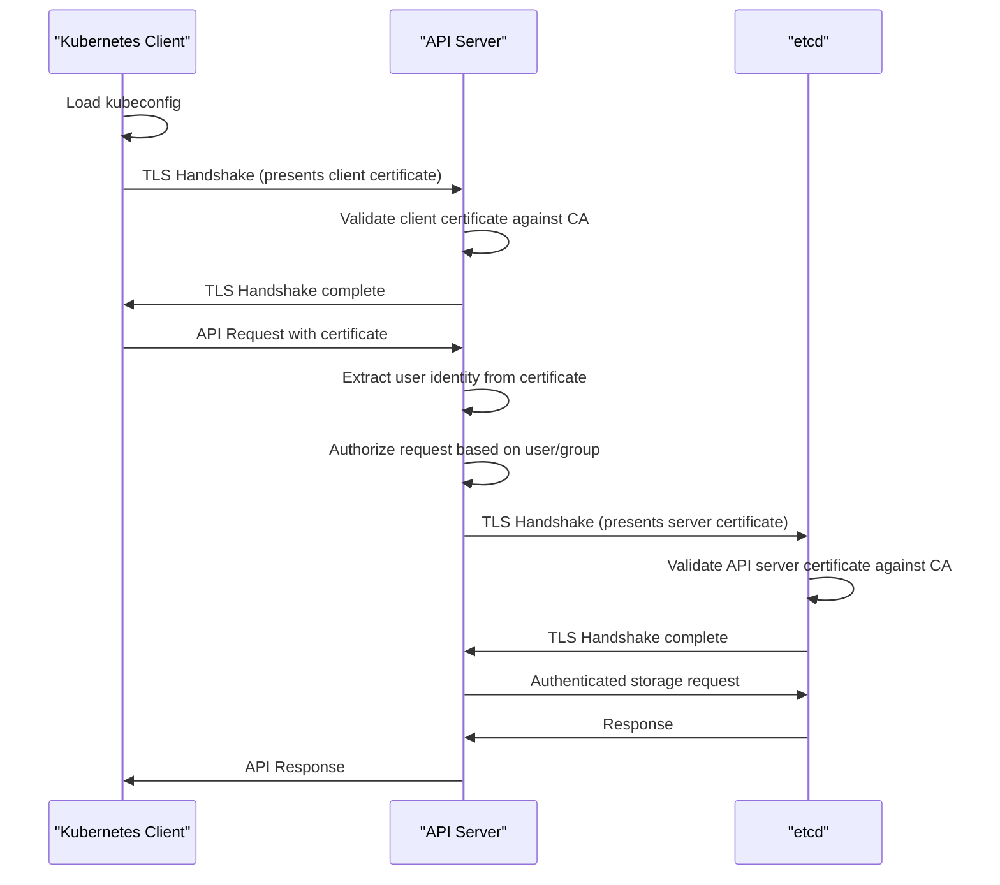
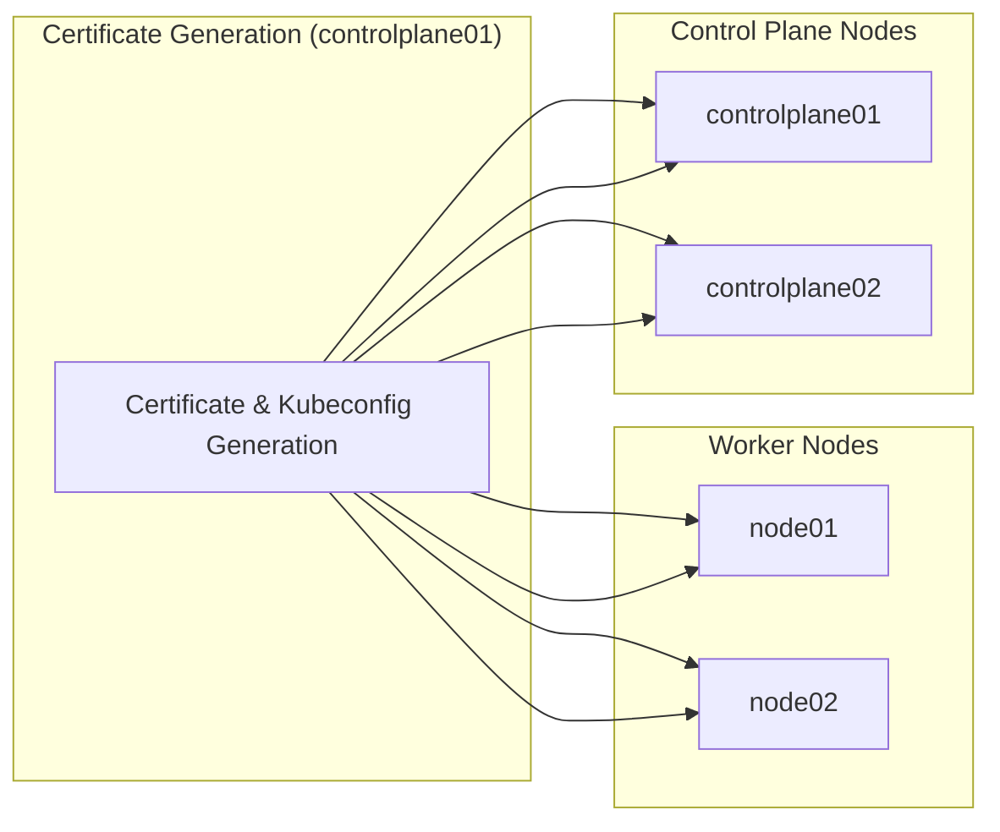
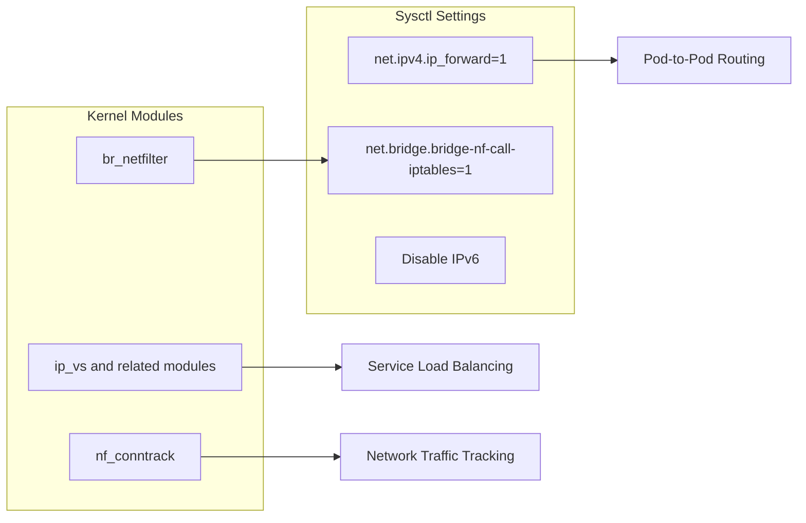

# Security Infrastructure
Relevant source files
- [docs/04-certificate-authority.md](https://github.com/mmumshad/kubernetes-the-hard-way/blob/8218a815/docs/04-certificate-authority.md?plain=1)
- [docs/05-kubernetes-configuration-files.md](https://github.com/mmumshad/kubernetes-the-hard-way/blob/8218a815/docs/05-kubernetes-configuration-files.md?plain=1)
- [vagrant/ubuntu/cert_verify.sh](https://github.com/mmumshad/kubernetes-the-hard-way/blob/8218a815/vagrant/ubuntu/cert_verify.sh)
- [vagrant/ubuntu/setup-kernel.sh](https://github.com/mmumshad/kubernetes-the-hard-way/blob/8218a815/vagrant/ubuntu/setup-kernel.sh)

## Purpose and Scope

This document details the Public Key Infrastructure (PKI) and authentication mechanisms implemented in the Kubernetes cluster. It covers the creation and management of the Certificate Authority (CA), generation of TLS certificates for all cluster components, and the configuration of authentication for both internal services and administrative users. For information about specific component configurations that use these security artifacts, see [Control Plane Setup](/mmumshad/kubernetes-the-hard-way/4-control-plane-setup) and [Worker Node Setup](/mmumshad/kubernetes-the-hard-way/5-worker-node-setup).

## Overview of Kubernetes Security Infrastructure

The security infrastructure of Kubernetes is built on a PKI system using X.509 certificates for encrypted communication and authentication. This section provides a high-level overview of how security is implemented in our cluster.

The security model provides:

- **Encryption** of all cluster communication
- **Authentication** of all components and users
- **Identity** verification for all cluster services
- **Authorization** controls through the Kubernetes API

Sources: [docs/04-certificate-authority.md3-15](https://github.com/mmumshad/kubernetes-the-hard-way/blob/8218a815/docs/04-certificate-authority.md?plain=1#L3-L15)[docs/05-kubernetes-configuration-files.md1-6](https://github.com/mmumshad/kubernetes-the-hard-way/blob/8218a815/docs/05-kubernetes-configuration-files.md?plain=1#L1-L6)

## Certificate Authority

The foundation of the cluster's security is the Certificate Authority (CA). This self-signed authority acts as the root of trust for all certificates in the cluster.

### CA Creation Process

The CA consists of:

- **ca.key**: The private key used to sign certificates
- **ca.crt**: The public certificate that verifies the identity of the CA

The CA private key is the most sensitive security artifact in the cluster and should be securely stored. In our implementation, the CA is hosted on the control plane nodes.

Sources: [docs/04-certificate-authority.md13-82](https://github.com/mmumshad/kubernetes-the-hard-way/blob/8218a815/docs/04-certificate-authority.md?plain=1#L13-L82)

## Component Certificates

Each component in the Kubernetes cluster requires its own certificate for authentication. The following diagram illustrates the certificates generated and their relationships:

Each component certificate serves a specific purpose:

| Certificate | Subject | Purpose |
| --- | --- | --- |
| kube-apiserver.crt | CN=kube-apiserver, O=Kubernetes | Identifies the API server to clients |
| etcd-server.crt | CN=etcd-server, O=Kubernetes | Secures etcd peer and client communication |
| kube-controller-manager.crt | CN=system:kube-controller-manager, O=system:kube-controller-manager | Authenticates controller manager to the API server |
| kube-scheduler.crt | CN=system:kube-scheduler, O=system:kube-scheduler | Authenticates scheduler to the API server |
| kube-proxy.crt | CN=system:kube-proxy, O=system:node-proxier | Authenticates kube-proxy to the API server |
| admin.crt | CN=admin, O=system:masters | Provides administrative access to the cluster |
| service-account.crt | CN=service-accounts, O=Kubernetes | Used by the controller manager to create service account tokens |
| apiserver-kubelet-client.crt | CN=kube-apiserver-kubelet-client, O=system:masters | Allows API server to connect to kubelets securely |

The certificate generation process creates both a private key (*.key) and a certificate (*.crt) for each component.

Sources: [docs/04-certificate-authority.md83-352](https://github.com/mmumshad/kubernetes-the-hard-way/blob/8218a815/docs/04-certificate-authority.md?plain=1#L83-L352)[vagrant/ubuntu/cert_verify.sh97-130](https://github.com/mmumshad/kubernetes-the-hard-way/blob/8218a815/vagrant/ubuntu/cert_verify.sh#L97-L130)

### Certificate Subject Alternative Names (SANs)

For server certificates (like kube-apiserver and etcd), additional identities are included in the certificate as SANs. These ensure the certificate is valid regardless of how clients access the service:

#### API Server SANs

- DNS names: kubernetes, kubernetes.default, kubernetes.default.svc, kubernetes.default.svc.cluster, kubernetes.default.svc.cluster.local
- IP addresses: Kubernetes service IP, control plane node IPs, load balancer IP, 127.0.0.1

#### etcd Server SANs

- IP addresses: Control plane node IPs, 127.0.0.1

These SANs ensure clients can verify the server's identity regardless of how they access it.

Sources: [docs/04-certificate-authority.md196-306](https://github.com/mmumshad/kubernetes-the-hard-way/blob/8218a815/docs/04-certificate-authority.md?plain=1#L196-L306)

## Kubernetes Configuration Files (kubeconfigs)

Kubeconfig files provide a way for Kubernetes components and users to locate the API server and authenticate to it. They contain:

- Cluster information (API server address and CA certificate)
- Authentication credentials (client certificate and key)
- Context information (default namespace and preferences)

The following kubeconfigs are created:

| Kubeconfig | User | API Server Address | Distribution |
| --- | --- | --- | --- |
| kube-controller-manager.kubeconfig | system:kube-controller-manager | [https://127.0.0.1:6443](https://127.0.0.1:6443) | Control plane nodes |
| kube-scheduler.kubeconfig | system:kube-scheduler | [https://127.0.0.1:6443](https://127.0.0.1:6443) | Control plane nodes |
| kube-proxy.kubeconfig | system:kube-proxy | [https://LOADBALANCER:6443](https://LOADBALANCER:6443) | Worker nodes |
| admin.kubeconfig | admin | [https://127.0.0.1:6443](https://127.0.0.1:6443) | Control plane nodes |

Note that control plane components use the localhost address (127.0.0.1) to connect to the API server on the same node, while worker components use the load balancer address to provide high availability.

Sources: [docs/05-kubernetes-configuration-files.md9-156](https://github.com/mmumshad/kubernetes-the-hard-way/blob/8218a815/docs/05-kubernetes-configuration-files.md?plain=1#L9-L156)

### Authentication Flow with Certificates and Kubeconfigs

This diagram shows how certificates are used throughout the authentication process for a typical API request.

Sources: [docs/04-certificate-authority.md86-120](https://github.com/mmumshad/kubernetes-the-hard-way/blob/8218a815/docs/04-certificate-authority.md?plain=1#L86-L120)[docs/05-kubernetes-configuration-files.md1-15](https://github.com/mmumshad/kubernetes-the-hard-way/blob/8218a815/docs/05-kubernetes-configuration-files.md?plain=1#L1-L15)

## Certificate and Kubeconfig Distribution

After generation, certificates and kubeconfigs must be distributed to the appropriate nodes.

The certificate distribution ensures that:

- Control plane nodes have all necessary control plane certificates and keys
- Worker nodes have the CA certificate and kube-proxy certificates
- All nodes have the appropriate kubeconfig files

Sources: [docs/04-certificate-authority.md390-409](https://github.com/mmumshad/kubernetes-the-hard-way/blob/8218a815/docs/04-certificate-authority.md?plain=1#L390-L409)[docs/05-kubernetes-configuration-files.md159-175](https://github.com/mmumshad/kubernetes-the-hard-way/blob/8218a815/docs/05-kubernetes-configuration-files.md?plain=1#L159-L175)

## Certificate Verification

A verification script is provided to ensure that certificates and kubeconfigs are properly created and distributed. The script checks:

- Presence of required certificates and keys
- Certificate subject and issuer fields
- Matching of private keys to certificates
- Proper configuration of kubeconfigs

The verification script can be run at different stages of the installation process to ensure that the security infrastructure is correctly set up.

Sources: [vagrant/ubuntu/cert_verify.sh1-130](https://github.com/mmumshad/kubernetes-the-hard-way/blob/8218a815/vagrant/ubuntu/cert_verify.sh#L1-L130)[docs/04-certificate-authority.md354-386](https://github.com/mmumshad/kubernetes-the-hard-way/blob/8218a815/docs/04-certificate-authority.md?plain=1#L354-L386)

## Security-Related Kernel Configuration

To support the security features of Kubernetes, several kernel configurations are applied:

These kernel configurations enable:

- Network traffic forwarding between containers
- Proper network isolation through iptables rules
- Service load balancing functionality
- Network address translation for pods

Sources: [vagrant/ubuntu/setup-kernel.sh1-28](https://github.com/mmumshad/kubernetes-the-hard-way/blob/8218a815/vagrant/ubuntu/setup-kernel.sh#L1-L28)

## Summary

The security infrastructure established in this guide forms the foundation for all secure communication within the Kubernetes cluster. By creating a Certificate Authority, generating component certificates, and configuring authentication through kubeconfig files, we establish:

1. **Identity** - Each component has a unique certificate that proves its identity
2. **Encryption** - All communication is encrypted using TLS
3. **Authentication** - Components and users can securely authenticate to the API server
4. **Authorization** - The certificate subjects include group memberships that enable authorization

This security infrastructure is vital to the operation of the Kubernetes cluster and must be properly maintained throughout the cluster's lifecycle.