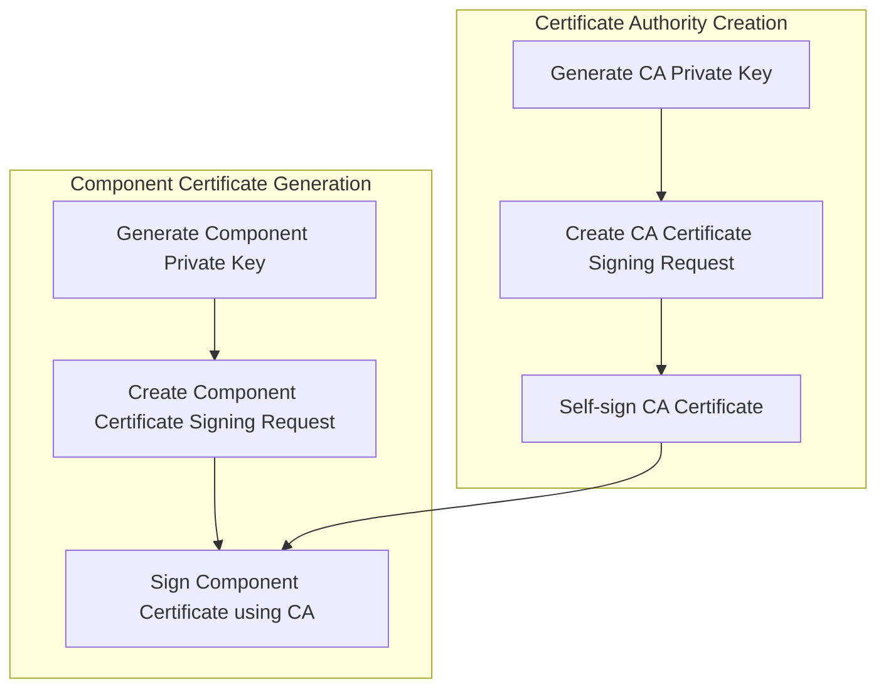
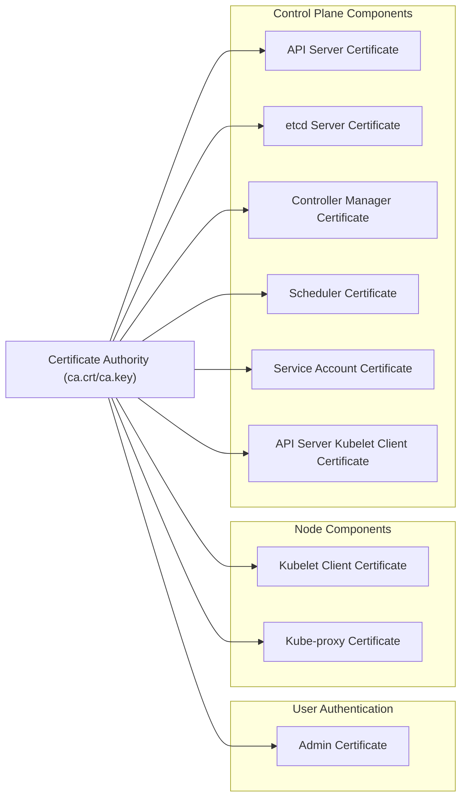
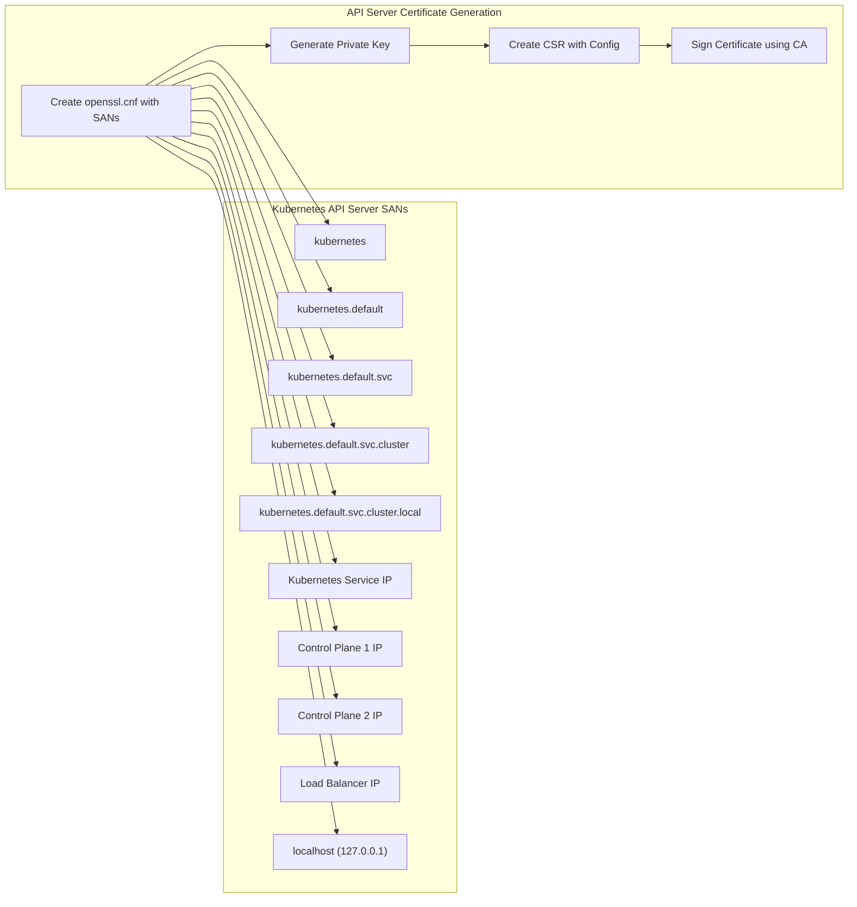

# Certificate Authority
Relevant source files
- [docs/04-certificate-authority.md](https://github.com/mmumshad/kubernetes-the-hard-way/blob/8218a815/docs/04-certificate-authority.md?plain=1)
- [docs/05-kubernetes-configuration-files.md](https://github.com/mmumshad/kubernetes-the-hard-way/blob/8218a815/docs/05-kubernetes-configuration-files.md?plain=1)

This document explains how to provision a Certificate Authority (CA) and generate the necessary TLS certificates for a Kubernetes cluster. The CA serves as the root of trust for all communications within the cluster, ensuring secure authentication between components.

For information about configuring Kubernetes components to use these certificates, see [Kubernetes Configuration Files](/mmumshad/kubernetes-the-hard-way/3.2-kubernetes-configuration-files).

## Purpose and Role of a Certificate Authority

A Certificate Authority is a trusted entity that issues digital certificates. In the context of Kubernetes:

- The CA establishes a Public Key Infrastructure (PKI) for the cluster
- It signs certificates for various Kubernetes components
- It enables secure TLS communication between components
- It provides a way to authenticate both users and services

## Certificate Authority Creation Process

The following diagram illustrates the process of creating a Certificate Authority and using it to sign component certificates:



Sources: [docs/04-certificate-authority.md54-66](https://github.com/mmumshad/kubernetes-the-hard-way/blob/8218a815/docs/04-certificate-authority.md?plain=1#L54-L66)

### Creating the Certificate Authority

The CA creation involves three main steps executed on a machine with OpenSSL installed:

1. Generate a private key for the CA
2. Create a Certificate Signing Request (CSR)
3. Self-sign the certificate with its own private key

```
# Create private key for CA
openssl genrsa -out ca.key 2048
 
# Create CSR using the private key
openssl req -new -key ca.key -subj "/CN=KUBERNETES-CA/O=Kubernetes" -out ca.csr
 
# Self sign the CSR using its own private key
openssl x509 -req -in ca.csr -signkey ca.key -CAcreateserial -out ca.crt -days 1000
```

This process generates two critical files:

- `ca.crt`: The Kubernetes Certificate Authority certificate
- `ca.key`: The Kubernetes Certificate Authority private key

Sources: [docs/04-certificate-authority.md54-81](https://github.com/mmumshad/kubernetes-the-hard-way/blob/8218a815/docs/04-certificate-authority.md?plain=1#L54-L81)

## Certificate Hierarchy in Kubernetes

The following diagram shows the hierarchical relationship between the CA and the certificates it signs for various Kubernetes components:



Sources: [docs/04-certificate-authority.md83-352](https://github.com/mmumshad/kubernetes-the-hard-way/blob/8218a815/docs/04-certificate-authority.md?plain=1#L83-L352)

## Component Certificates

Using the CA, we generate certificates for each Kubernetes component. Below is a breakdown of the required certificates:

| Certificate | Purpose | Issued To | Special Considerations |
| --- | --- | --- | --- |
| Admin | Cluster administration | Admin user | Part of system:masters group |
| Kubelet | Worker node authentication | Each worker node | Will be configured later |
| Controller Manager | Control plane component authentication | Controller Manager | system:kube-controller-manager user |
| Kube Proxy | Network proxy authentication | Kube-proxy | system:node-proxier user |
| Scheduler | Scheduling authentication | Scheduler | system:kube-scheduler user |
| API Server | API server identification | API Server | Requires multiple SANs |
| API Server Kubelet Client | API server to kubelet authentication | API Server | For kubelet interaction |
| ETCD Server | ETCD server identification | ETCD Server | Requires control plane IPs as SANs |
| Service Account | Token signing | Controller Manager | For service account token generation |

Sources: [docs/04-certificate-authority.md83-352](https://github.com/mmumshad/kubernetes-the-hard-way/blob/8218a815/docs/04-certificate-authority.md?plain=1#L83-L352)

## Certificate Generation Process

### Environment Setup

Before generating certificates, we need to capture IP addresses that will be included as Subject Alternative Names (SANs) in the certificates:

```
CONTROL01=$(dig +short controlplane01)
CONTROL02=$(dig +short controlplane02)
LOADBALANCER=$(dig +short loadbalancer)
SERVICE_CIDR=10.96.0.0/24
API_SERVICE=$(echo $SERVICE_CIDR | awk 'BEGIN {FS="."} ; { printf("%s.%s.%s.1", $1, $2, $3) }')
```

Sources: [docs/04-certificate-authority.md21-32](https://github.com/mmumshad/kubernetes-the-hard-way/blob/8218a815/docs/04-certificate-authority.md?plain=1#L21-L32)

### Administrative Client Certificate

The admin certificate provides administrative access to the cluster:

```
# Generate private key for admin user
openssl genrsa -out admin.key 2048
 
# Generate CSR for admin user
openssl req -new -key admin.key -subj "/CN=admin/O=system:masters" -out admin.csr
 
# Sign certificate for admin user using CA server's private key
openssl x509 -req -in admin.csr -CA ca.crt -CAkey ca.key -CAcreateserial -out admin.crt -days 1000
```

The key part is the subject name which includes the organization `system:masters`, granting full administrative privileges in Kubernetes RBAC.

Sources: [docs/04-certificate-authority.md94-103](https://github.com/mmumshad/kubernetes-the-hard-way/blob/8218a815/docs/04-certificate-authority.md?plain=1#L94-L103)

### Server Component Certificates

For server components like the API server and etcd, we need to create OpenSSL configuration files to specify Subject Alternative Names:



Sources: [docs/04-certificate-authority.md200-222](https://github.com/mmumshad/kubernetes-the-hard-way/blob/8218a815/docs/04-certificate-authority.md?plain=1#L200-L222)

## Certificate Distribution

After generating all certificates, they need to be distributed to the appropriate nodes:

```
for instance in controlplane01 controlplane02; do
  scp ca.crt ca.key kube-apiserver.key kube-apiserver.crt \
    apiserver-kubelet-client.crt apiserver-kubelet-client.key \
    service-account.key service-account.crt \
    etcd-server.key etcd-server.crt \
    kube-controller-manager.key kube-controller-manager.crt \
    kube-scheduler.key kube-scheduler.crt \
    ${instance}:~/
done
 
for instance in node01 node02 ; do
  scp ca.crt kube-proxy.crt kube-proxy.key ${instance}:~/
done
```

Sources: [docs/04-certificate-authority.md394-410](https://github.com/mmumshad/kubernetes-the-hard-way/blob/8218a815/docs/04-certificate-authority.md?plain=1#L394-L410)

## Certificate Verification

After distributing the certificates, it's essential to verify that all the required certificates are available and correctly configured:

```
./cert_verify.sh
```

This script checks that all necessary certificates and keys are present and authenticates them against the CA.

Sources: [docs/04-certificate-authority.md356-388](https://github.com/mmumshad/kubernetes-the-hard-way/blob/8218a815/docs/04-certificate-authority.md?plain=1#L356-L388)

## Security Implications

The certificate authority infrastructure forms the foundation of Kubernetes security:

1. **CA Key Security**: The CA private key (`ca.key`) must be stored securely, as it can be used to issue new trusted certificates for the cluster.
2. **Certificate Validity**: All certificates are created with a 1000-day validity period. In production environments, you should implement certificate rotation strategies.
3. **Identity Representation**: The subject field of each certificate represents the identity of the component or user in the Kubernetes RBAC system.
4. **Public Key Infrastructure**: The entire security model relies on the integrity of this PKI setup.

Sources: [docs/04-certificate-authority.md13-15](https://github.com/mmumshad/kubernetes-the-hard-way/blob/8218a815/docs/04-certificate-authority.md?plain=1#L13-L15)[docs/04-certificate-authority.md78-81](https://github.com/mmumshad/kubernetes-the-hard-way/blob/8218a815/docs/04-certificate-authority.md?plain=1#L78-L81)

## Next Steps

After setting up the Certificate Authority and generating all required certificates, the next step is to create the Kubernetes configuration files (kubeconfig) that will use these certificates for authentication. This is covered in [Kubernetes Configuration Files](/mmumshad/kubernetes-the-hard-way/3.2-kubernetes-configuration-files).