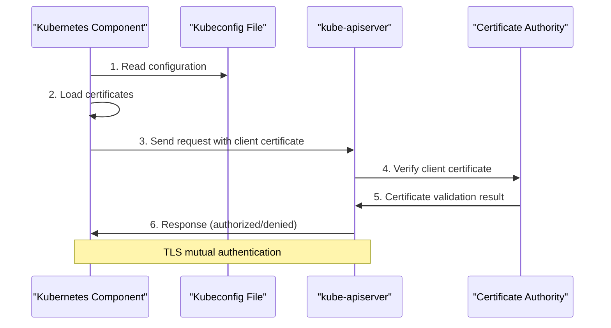
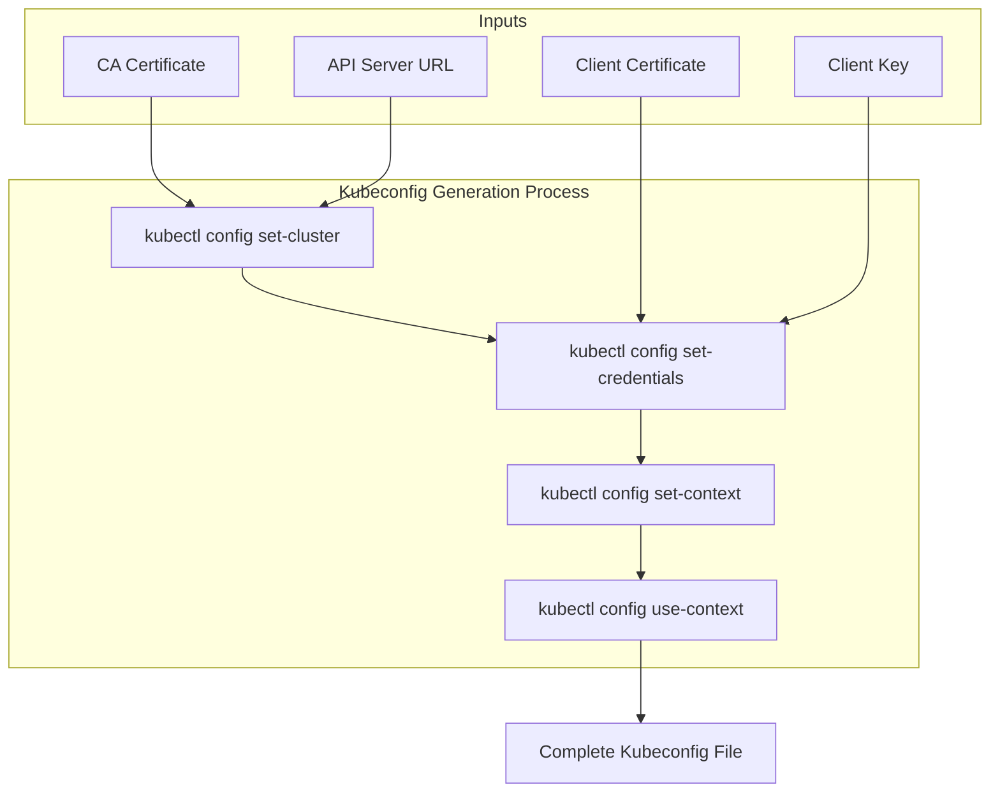
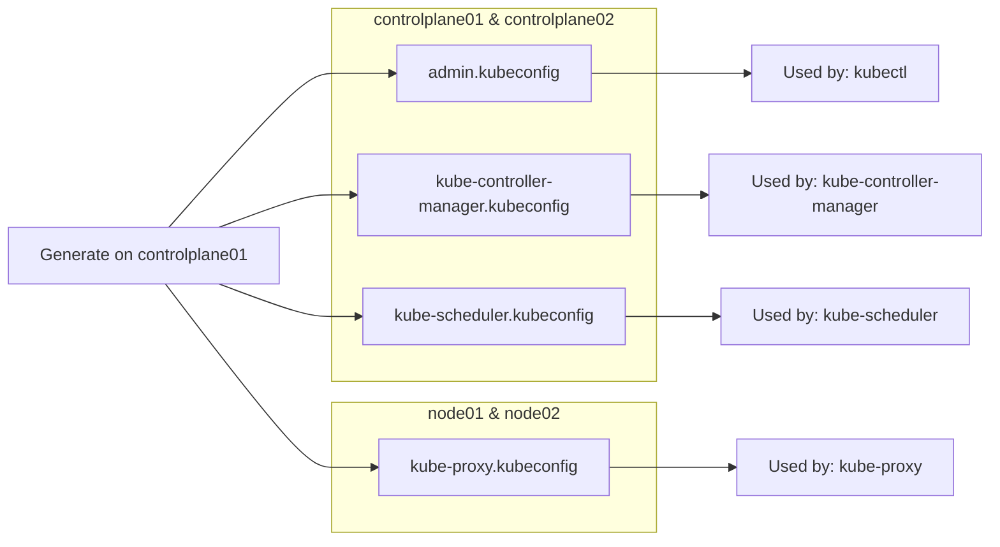
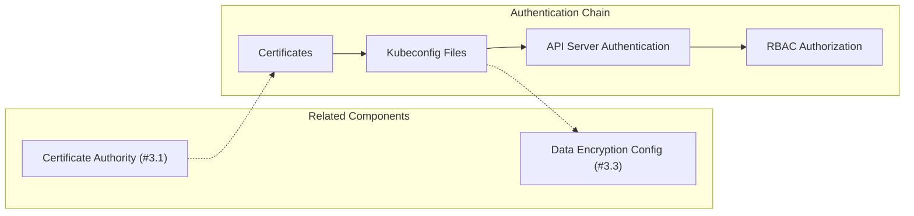

# Kubernetes Configuration Files
Relevant source files
- [docs/04-certificate-authority.md](https://github.com/mmumshad/kubernetes-the-hard-way/blob/8218a815/docs/04-certificate-authority.md?plain=1)
- [docs/05-kubernetes-configuration-files.md](https://github.com/mmumshad/kubernetes-the-hard-way/blob/8218a815/docs/05-kubernetes-configuration-files.md?plain=1)

## Purpose and Scope

This document explains Kubernetes configuration files (kubeconfigs) and their role in the authentication mechanism of a Kubernetes cluster. Kubeconfigs enable Kubernetes clients to locate and authenticate to the Kubernetes API servers by specifying cluster details, user credentials, and context information. This page covers the creation, structure, distribution, and verification of kubeconfig files for various Kubernetes components. For information about generating the certificates used within these configuration files, see [Certificate Authority](/mmumshad/kubernetes-the-hard-way/3.1-certificate-authority).

## What are Kubeconfig Files?

Kubeconfig files are YAML documents that contain configuration information needed for Kubernetes components and users to authenticate to the API server. They serve as authentication profiles that combine:

1. Cluster information (API server endpoints)
2. User authentication credentials (certificates/keys)
3. Contexts (combinations of clusters and users)

```

```

Sources: [docs/05-kubernetes-configuration-files.md1-6](https://github.com/mmumshad/kubernetes-the-hard-way/blob/8218a815/docs/05-kubernetes-configuration-files.md?plain=1#L1-L6)

## Two Approaches to Certificate References

Kubeconfig files can handle certificates in two ways:

1. **Referenced certificates**: The kubeconfig contains file paths to certificates on disk

- Used for system components (controller-manager, scheduler, kube-proxy)
- Advantage: When certificates are renewed, the kubeconfig does not need to be regenerated
2. **Embedded certificates**: The certificate data is embedded directly in the kubeconfig

- Used for user configurations (like admin.kubeconfig)
- Advantage: Portability - the kubeconfig is self-contained

Sources: [docs/05-kubernetes-configuration-files.md5-7](https://github.com/mmumshad/kubernetes-the-hard-way/blob/8218a815/docs/05-kubernetes-configuration-files.md?plain=1#L5-L7)

## Client Authentication Kubeconfigs

Each Kubernetes component requires its own kubeconfig file for proper authentication. The repository generates four main kubeconfig files:

| Kubeconfig File | User | Purpose | API Server Address |
| --- | --- | --- | --- |
| kube-proxy.kubeconfig | system:kube-proxy | Authenticates kube-proxy service | Load balancer address |
| kube-controller-manager.kubeconfig | system:kube-controller-manager | Authenticates controller manager | 127.0.0.1 (localhost) |
| kube-scheduler.kubeconfig | system:kube-scheduler | Authenticates scheduler | 127.0.0.1 (localhost) |
| admin.kubeconfig | admin | Authenticates administrative access | 127.0.0.1 (localhost) |

Control plane components (controller-manager and scheduler) use localhost (127.0.0.1) to communicate with their local API server, while components that run on worker nodes use the load balancer address to access the API server.

Sources: [docs/05-kubernetes-configuration-files.md9-13](https://github.com/mmumshad/kubernetes-the-hard-way/blob/8218a815/docs/05-kubernetes-configuration-files.md?plain=1#L9-L13)[docs/05-kubernetes-configuration-files.md15-16](https://github.com/mmumshad/kubernetes-the-hard-way/blob/8218a815/docs/05-kubernetes-configuration-files.md?plain=1#L15-L16)

## Kubeconfig Structure and Authentication Flow

The following diagram illustrates how kubeconfig files are used in the authentication flow:



Sources: [docs/05-kubernetes-configuration-files.md1-4](https://github.com/mmumshad/kubernetes-the-hard-way/blob/8218a815/docs/05-kubernetes-configuration-files.md?plain=1#L1-L4)

## Generating Kubeconfig Files

Kubeconfig files are generated using the `kubectl config` commands. The general process involves four steps:

1. Setting the cluster information (API server URL and CA certificate)
2. Setting user credentials (client certificates and keys)
3. Creating a context that links the cluster and user
4. Setting the created context as the default



Sources: [docs/05-kubernetes-configuration-files.md23-146](https://github.com/mmumshad/kubernetes-the-hard-way/blob/8218a815/docs/05-kubernetes-configuration-files.md?plain=1#L23-L146)

### Example: kube-proxy Kubeconfig Generation

For worker node components like kube-proxy, the kubeconfig points to the load balancer:

```
kubectl config set-cluster kubernetes-the-hard-way \
  --certificate-authority=/var/lib/kubernetes/pki/ca.crt \
  --server=https://${LOADBALANCER}:6443 \
  --kubeconfig=kube-proxy.kubeconfig

```

Then set credentials, context, and default context.

Sources: [docs/05-kubernetes-configuration-files.md25-45](https://github.com/mmumshad/kubernetes-the-hard-way/blob/8218a815/docs/05-kubernetes-configuration-files.md?plain=1#L25-L45)

### Example: Controller Manager Kubeconfig Generation

For control plane components like controller manager, the kubeconfig points to localhost:

```
kubectl config set-cluster kubernetes-the-hard-way \
  --certificate-authority=/var/lib/kubernetes/pki/ca.crt \
  --server=https://127.0.0.1:6443 \
  --kubeconfig=kube-controller-manager.kubeconfig

```

Then set credentials, context, and default context.

Sources: [docs/05-kubernetes-configuration-files.md58-78](https://github.com/mmumshad/kubernetes-the-hard-way/blob/8218a815/docs/05-kubernetes-configuration-files.md?plain=1#L58-L78)

### Example: Admin Kubeconfig Generation

The admin kubeconfig embeds certificates for portability:

```
kubectl config set-cluster kubernetes-the-hard-way \
  --certificate-authority=ca.crt \
  --embed-certs=true \
  --server=https://127.0.0.1:6443 \
  --kubeconfig=admin.kubeconfig

```

Note the `--embed-certs=true` flag that embeds certificate data directly in the kubeconfig.

Sources: [docs/05-kubernetes-configuration-files.md126-146](https://github.com/mmumshad/kubernetes-the-hard-way/blob/8218a815/docs/05-kubernetes-configuration-files.md?plain=1#L126-L146)

## Distribution of Kubeconfig Files

After generating the kubeconfig files, they need to be distributed to the appropriate nodes:



Distribution is performed using secure copy:

- Worker nodes receive the kube-proxy kubeconfig
- Control plane nodes receive the admin, controller manager, and scheduler kubeconfigs

Sources: [docs/05-kubernetes-configuration-files.md159-175](https://github.com/mmumshad/kubernetes-the-hard-way/blob/8218a815/docs/05-kubernetes-configuration-files.md?plain=1#L159-L175)

## Verification of Kubeconfig Files

After generating and distributing kubeconfig files, verification is critical to ensure they're properly configured. The repository includes a verification script that checks for the presence and validity of kubeconfig files:

```
./cert_verify.sh

```

When selecting option 2, this script verifies:

1. The presence of all required kubeconfig files
2. That they reference the correct certificates
3. That they're formatted correctly

Sources: [docs/05-kubernetes-configuration-files.md179-185](https://github.com/mmumshad/kubernetes-the-hard-way/blob/8218a815/docs/05-kubernetes-configuration-files.md?plain=1#L179-L185)

## Placement in the Kubernetes Authentication Chain

Kubeconfig files play a crucial role in the authentication chain:



In this security infrastructure, kubeconfig files serve as the bridge between the certificate authority system and the authentication mechanisms of Kubernetes components.

Sources: [docs/05-kubernetes-configuration-files.md189-190](https://github.com/mmumshad/kubernetes-the-hard-way/blob/8218a815/docs/05-kubernetes-configuration-files.md?plain=1#L189-L190)[docs/04-certificate-authority.md1-3](https://github.com/mmumshad/kubernetes-the-hard-way/blob/8218a815/docs/04-certificate-authority.md?plain=1#L1-L3)

## Next Steps

After generating the kubeconfig files, the next step in the Kubernetes deployment process is generating the data encryption configuration and key, which will be used to encrypt sensitive data in etcd.

Sources: [docs/05-kubernetes-configuration-files.md189](https://github.com/mmumshad/kubernetes-the-hard-way/blob/8218a815/docs/05-kubernetes-configuration-files.md?plain=1#L189-L189)