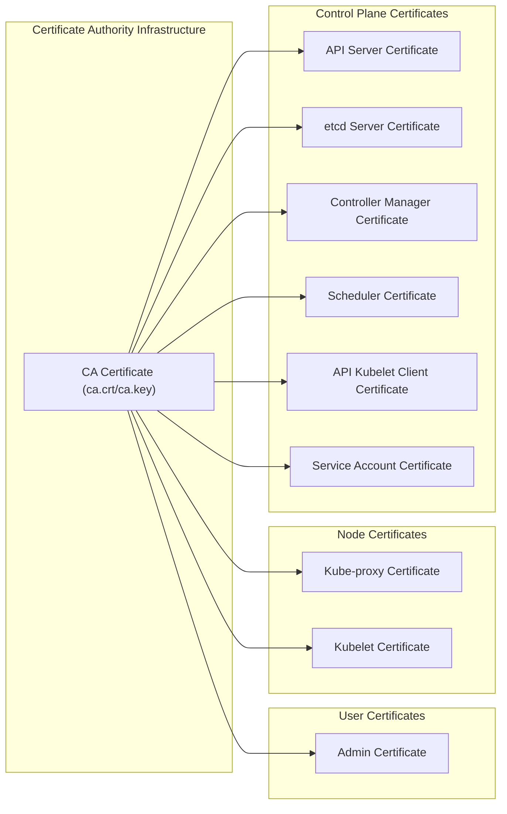
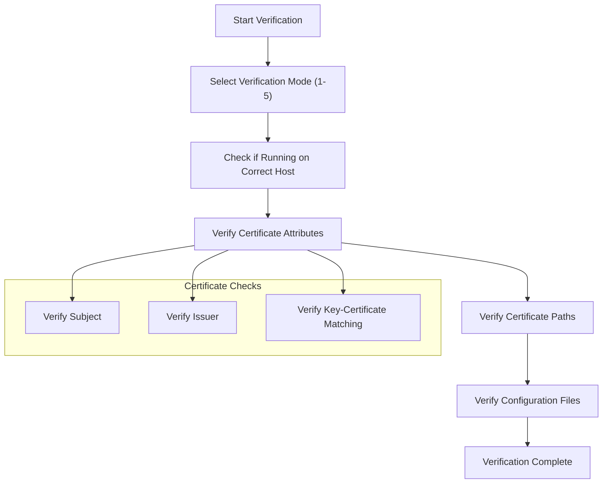
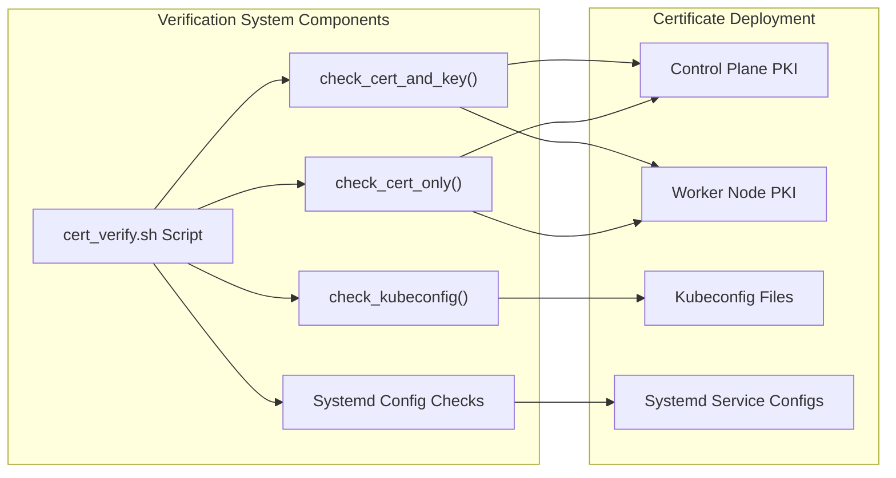

# Certificate Management
Relevant source files
- [tools/kubernetes-certs-checker.xlsx](https://github.com/mmumshad/kubernetes-the-hard-way/blob/8218a815/tools/kubernetes-certs-checker.xlsx)
- [vagrant/ubuntu/cert_verify.sh](https://github.com/mmumshad/kubernetes-the-hard-way/blob/8218a815/vagrant/ubuntu/cert_verify.sh)
- [vagrant/ubuntu/setup-kernel.sh](https://github.com/mmumshad/kubernetes-the-hard-way/blob/8218a815/vagrant/ubuntu/setup-kernel.sh)

This document describes the process, tools, and verification procedures for managing certificates in a Kubernetes cluster set up using the "hard way" approach. Certificate management is crucial for the security infrastructure of any Kubernetes deployment, as certificates enable encrypted communication and authentication between cluster components.

For information about creating the Certificate Authority (CA) and generating component certificates, see [Certificate Authority](/mmumshad/kubernetes-the-hard-way/3.1-certificate-authority). For details on creating kubeconfig files from these certificates, see [Kubernetes Configuration Files](/mmumshad/kubernetes-the-hard-way/3.2-kubernetes-configuration-files).

## Certificate Management Overview

In a Kubernetes cluster, certificates serve as the foundation of the security model. They enable:

1. Mutual TLS authentication between components
2. Secure API server communications
3. Authentication of users and service accounts
4. Validation of etcd cluster communications

The following diagram illustrates the certificate infrastructure in a Kubernetes cluster:



Sources: [vagrant/ubuntu/cert_verify.sh19-47](https://github.com/mmumshad/kubernetes-the-hard-way/blob/8218a815/vagrant/ubuntu/cert_verify.sh#L19-L47)

## Certificate Verification

The certificate verification process ensures that all certificates are correctly generated, signed, and deployed to the appropriate locations. The `cert_verify.sh` script provides comprehensive verification of certificates and their configurations across both control plane and worker nodes.

The script offers five verification modes:

| Mode | Description | When to Use |
| --- | --- | --- |
| 1 | Verify certificates on Master Nodes | After step 4 (CA and certificate generation) |
| 2 | Verify kubeconfigs on Master Nodes | After step 5 (kubeconfig generation) |
| 3 | Verify kubeconfigs and PKI on Master Nodes | After step 8 (control plane setup) |
| 4 | Verify kubeconfigs and PKI on node01 | After step 10 (worker node setup) |
| 5 | Verify kubeconfigs and PKI on node02 | After step 11 (worker node setup) |

Sources: [vagrant/ubuntu/cert_verify.sh438-454](https://github.com/mmumshad/kubernetes-the-hard-way/blob/8218a815/vagrant/ubuntu/cert_verify.sh#L438-L454)

### Certificate Verification Process



Sources: [vagrant/ubuntu/cert_verify.sh98-170](https://github.com/mmumshad/kubernetes-the-hard-way/blob/8218a815/vagrant/ubuntu/cert_verify.sh#L98-L170)

## Certificate Validation Functions

The `cert_verify.sh` script contains several functions for validating certificates and their usage:

### Certificate and Key Validation

The `check_cert_and_key` function validates:

1. Existence of both certificate and key files
2. Certificate subject matches expected value
3. Certificate issuer matches expected value
4. Certificate and key match (by comparing MD5 hashes of their moduli)

Sources: [vagrant/ubuntu/cert_verify.sh98-130](https://github.com/mmumshad/kubernetes-the-hard-way/blob/8218a815/vagrant/ubuntu/cert_verify.sh#L98-L130)

### Certificate-Only Validation

The `check_cert_only` function validates certificates without corresponding key files, used particularly for:

1. CA certificates that have been distributed
2. Automatically generated certificates (like kubelet client certificates)

Sources: [vagrant/ubuntu/cert_verify.sh132-170](https://github.com/mmumshad/kubernetes-the-hard-way/blob/8218a815/vagrant/ubuntu/cert_verify.sh#L132-L170)

### Kubeconfig Validation

The script also validates kubeconfig files, checking:

1. Existence of the kubeconfig file
2. Paths to CA certificate, client certificate, and client key
3. Server URL configuration

Sources: [vagrant/ubuntu/cert_verify.sh200-267](https://github.com/mmumshad/kubernetes-the-hard-way/blob/8218a815/vagrant/ubuntu/cert_verify.sh#L200-L267)

## Certificate Deployment Locations

The following table shows the locations of certificates and related files on different node types:

| Component | Control Plane Location | Worker Node Location | Purpose |
| --- | --- | --- | --- |
| CA Certificate | `/var/lib/kubernetes/pki/ca.crt` | `/var/lib/kubernetes/pki/ca.crt` | Root of trust |
| etcd Server | `/etc/etcd/etcd-server.crt` | N/A | Secure etcd communications |
| API Server | `/var/lib/kubernetes/pki/kube-apiserver.crt` | N/A | Secure API server communications |
| Controller Manager | `/var/lib/kubernetes/pki/kube-controller-manager.crt` | N/A | Controller manager authentication |
| Scheduler | `/var/lib/kubernetes/pki/kube-scheduler.crt` | N/A | Scheduler authentication |
| Kube-proxy | `/var/lib/kubernetes/pki/kube-proxy.crt` | `/var/lib/kubernetes/pki/kube-proxy.crt` | Kube-proxy authentication |
| Kubelet | N/A | `/var/lib/kubelet/node01.crt` (node01)`/var/lib/kubelet/pki/kubelet-client-current.pem` (node02) | Kubelet authentication |

Sources: [vagrant/ubuntu/cert_verify.sh269-321](https://github.com/mmumshad/kubernetes-the-hard-way/blob/8218a815/vagrant/ubuntu/cert_verify.sh#L269-L321)[vagrant/ubuntu/cert_verify.sh520-570](https://github.com/mmumshad/kubernetes-the-hard-way/blob/8218a815/vagrant/ubuntu/cert_verify.sh#L520-L570)

## Systemd Service Configuration Validation

The certificate management system also verifies that certificates are correctly referenced in the systemd service configurations for Kubernetes components. This ensures that services are correctly configured to use the appropriate certificates.

### etcd Service Validation

The script verifies that the etcd systemd service is properly configured with:

- Certificate and key file paths
- Trusted CA file path
- Peer certificate and key file paths
- Correct advertise and client URLs

Sources: [vagrant/ubuntu/cert_verify.sh269-321](https://github.com/mmumshad/kubernetes-the-hard-way/blob/8218a815/vagrant/ubuntu/cert_verify.sh#L269-L321)

### API Server Service Validation

For the API server, the script validates:

- Advertise address
- Client CA file path
- etcd certificate configurations
- Kubelet certificate configurations
- Service account configurations
- TLS certificate configurations

Sources: [vagrant/ubuntu/cert_verify.sh324-366](https://github.com/mmumshad/kubernetes-the-hard-way/blob/8218a815/vagrant/ubuntu/cert_verify.sh#L324-L366)

### Controller Manager Service Validation

The script checks that the controller manager service has the correct:

- Cluster signing certificate and key paths
- Root CA file path
- Service account private key file path
- Kubeconfig path

Sources: [vagrant/ubuntu/cert_verify.sh368-401](https://github.com/mmumshad/kubernetes-the-hard-way/blob/8218a815/vagrant/ubuntu/cert_verify.sh#L368-L401)

### Scheduler Service Validation

For the scheduler service, the script ensures the correct kubeconfig path is configured.

Sources: [vagrant/ubuntu/cert_verify.sh403-430](https://github.com/mmumshad/kubernetes-the-hard-way/blob/8218a815/vagrant/ubuntu/cert_verify.sh#L403-L430)

## Running Certificate Verification

To run certificate verification:

1. SSH into the node you want to verify
2. Execute the `cert_verify.sh` script
3. Select the appropriate verification mode based on your progress in the setup process

```
./cert_verify.sh [mode]

```

Where `[mode]` is a number from 1 to 5 corresponding to the verification mode described earlier.

For example, to verify certificates on a control plane node after step 4:

```
./cert_verify.sh 1

```

Sources: [vagrant/ubuntu/cert_verify.sh434-578](https://github.com/mmumshad/kubernetes-the-hard-way/blob/8218a815/vagrant/ubuntu/cert_verify.sh#L434-L578)

## Troubleshooting Certificate Issues

Common certificate issues and their solutions:

| Issue | Possible Cause | Solution |
| --- | --- | --- |
| Certificate subject mismatch | Incorrect subject specified during generation | Regenerate certificate with correct subject |
| Certificate issuer mismatch | Certificate not signed by expected CA | Ensure CA certificate is correct and regenerate |
| Certificate and key mismatch | Files mixed up during copying | Regenerate certificate-key pair |
| Missing certificate or key | Files not copied to the correct location | Copy files to the correct location |
| Incorrect system service configuration | Typo in systemd unit file | Correct the path in the systemd unit file |

Sources: [vagrant/ubuntu/cert_verify.sh109-128](https://github.com/mmumshad/kubernetes-the-hard-way/blob/8218a815/vagrant/ubuntu/cert_verify.sh#L109-L128)[vagrant/ubuntu/cert_verify.sh152-168](https://github.com/mmumshad/kubernetes-the-hard-way/blob/8218a815/vagrant/ubuntu/cert_verify.sh#L152-L168)

## Certificate Management System Architecture



Sources: [vagrant/ubuntu/cert_verify.sh98-430](https://github.com/mmumshad/kubernetes-the-hard-way/blob/8218a815/vagrant/ubuntu/cert_verify.sh#L98-L430)

## Kernel Configuration for Certificate Usage

The proper functioning of certificates in a Kubernetes cluster also depends on correct kernel configuration. The Kubernetes deployment ensures the kernel is properly configured for network security features through the setup-kernel.sh script.

Sources: [vagrant/ubuntu/setup-kernel.sh1-28](https://github.com/mmumshad/kubernetes-the-hard-way/blob/8218a815/vagrant/ubuntu/setup-kernel.sh#L1-L28)

By following these verification procedures and managing certificates properly, you ensure the security foundation of your Kubernetes cluster is solid and correctly configured.