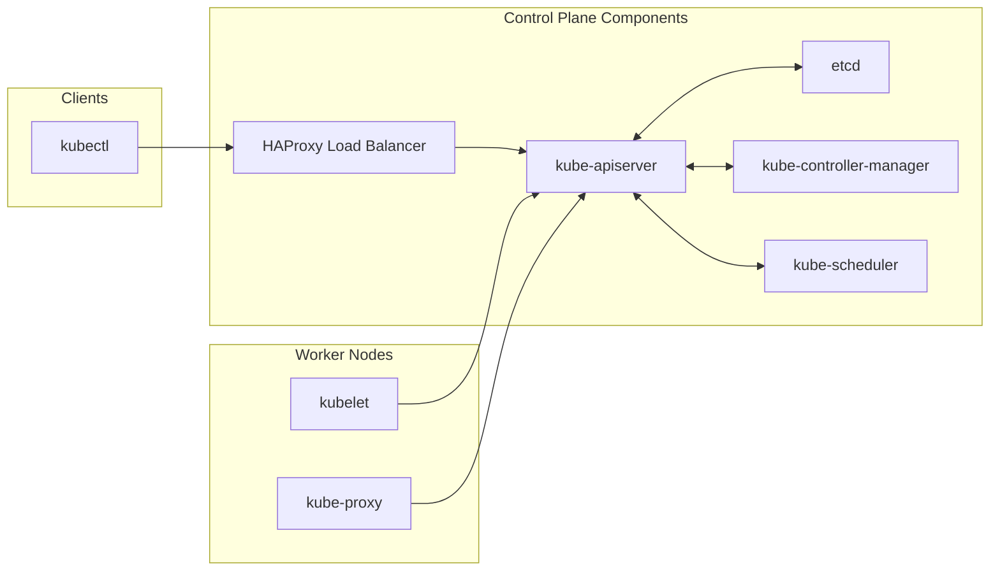
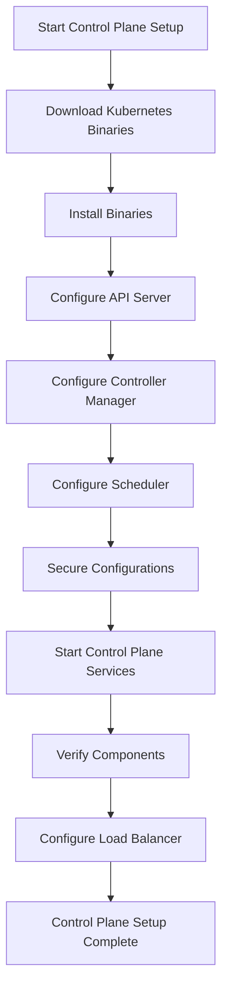
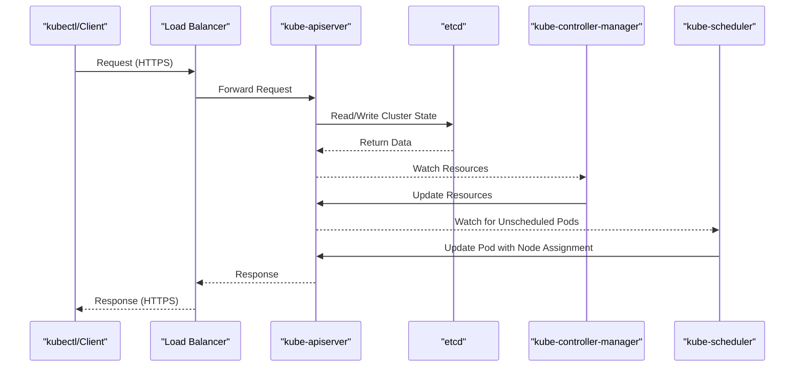

# Control Plane Setup
Relevant source files
- [README.md](https://github.com/mmumshad/kubernetes-the-hard-way/blob/8218a815/README.md?plain=1)
- [docs/07-bootstrapping-etcd.md](https://github.com/mmumshad/kubernetes-the-hard-way/blob/8218a815/docs/07-bootstrapping-etcd.md?plain=1)
- [docs/08-bootstrapping-kubernetes-controllers.md](https://github.com/mmumshad/kubernetes-the-hard-way/blob/8218a815/docs/08-bootstrapping-kubernetes-controllers.md?plain=1)

This document outlines the process of bootstrapping the Kubernetes control plane components across multiple compute instances in a highly available configuration. It covers the installation and configuration of the core control plane services: Kubernetes API Server, Controller Manager, and Scheduler. For information about etcd cluster bootstrapping, see [etcd Cluster Bootstrapping](/mmumshad/kubernetes-the-hard-way/4.1-etcd-cluster-bootstrapping), and for details on load balancer configuration, see [Load Balancer Configuration](/mmumshad/kubernetes-the-hard-way/4.3-load-balancer-configuration).

## Control Plane Architecture

The Kubernetes control plane is the brain of the cluster, responsible for maintaining the desired state of the system. It consists of multiple components working together to manage the entire cluster.

The diagram above shows the key components of the Kubernetes control plane and their relationships:

- **etcd**: Distributed key-value store that stores all cluster data
- **kube-apiserver**: Exposes the Kubernetes API and acts as the frontend to the control plane
- **kube-controller-manager**: Runs controller processes that regulate the state of the cluster
- **kube-scheduler**: Assigns pods to nodes based on resource requirements and constraints
- **HAProxy Load Balancer**: Distributes API server traffic across controller nodes for high availability

Sources: [docs/08-bootstrapping-kubernetes-controllers.md1-14](https://github.com/mmumshad/kubernetes-the-hard-way/blob/8218a815/docs/08-bootstrapping-kubernetes-controllers.md?plain=1#L1-L14)[README.md29-44](https://github.com/mmumshad/kubernetes-the-hard-way/blob/8218a815/README.md?plain=1#L29-L44)

## Control Plane Setup Process

The following diagram illustrates the process flow for setting up the Kubernetes control plane:

This process should be performed on each controller node in the cluster (controlplane01 and controlplane02).

Sources: [docs/08-bootstrapping-kubernetes-controllers.md10-14](https://github.com/mmumshad/kubernetes-the-hard-way/blob/8218a815/docs/08-bootstrapping-kubernetes-controllers.md?plain=1#L10-L14)

## Prerequisites

Before setting up the control plane, ensure:

1. A functional etcd cluster is running (see [etcd Cluster Bootstrapping](/mmumshad/kubernetes-the-hard-way/4.1-etcd-cluster-bootstrapping))
2. All necessary certificates have been generated (see [Certificate Authority](/mmumshad/kubernetes-the-hard-way/3.1-certificate-authority))
3. All required kubeconfig files are available (see [Kubernetes Configuration Files](/mmumshad/kubernetes-the-hard-way/3.2-kubernetes-configuration-files))
4. The encryption configuration has been created (for securing etcd data)

Sources: [docs/08-bootstrapping-kubernetes-controllers.md10-14](https://github.com/mmumshad/kubernetes-the-hard-way/blob/8218a815/docs/08-bootstrapping-kubernetes-controllers.md?plain=1#L10-L14)[docs/08-bootstrapping-kubernetes-controllers.md24-35](https://github.com/mmumshad/kubernetes-the-hard-way/blob/8218a815/docs/08-bootstrapping-kubernetes-controllers.md?plain=1#L24-L35)

## Control Plane Components Installation

### Downloading and Installing Kubernetes Binaries

The first step is to download the official Kubernetes release binaries for the control plane components:

1. Download kube-apiserver, kube-controller-manager, kube-scheduler, and kubectl
2. Make the binaries executable and move them to the appropriate location

Sources: [docs/08-bootstrapping-kubernetes-controllers.md24-43](https://github.com/mmumshad/kubernetes-the-hard-way/blob/8218a815/docs/08-bootstrapping-kubernetes-controllers.md?plain=1#L24-L43)

### API Server Configuration

The Kubernetes API server is the primary management point for the cluster. Key configuration aspects include:

1. Certificate and key placement in secure directories
2. Creation of the systemd unit file with appropriate command-line arguments

The API server is configured with:

- TLS certificates for secure communication
- Connection to the etcd cluster
- Service account configuration
- Authentication and authorization settings
- Admission control configuration
- Audit logging settings

Sources: [docs/08-bootstrapping-kubernetes-controllers.md45-131](https://github.com/mmumshad/kubernetes-the-hard-way/blob/8218a815/docs/08-bootstrapping-kubernetes-controllers.md?plain=1#L45-L131)

### Controller Manager Configuration

The Kubernetes Controller Manager runs controllers that handle routine tasks in the cluster such as node failures, maintaining the correct number of pods, and creating endpoints, service accounts, and API access tokens.

Key configuration aspects include:

- Service account key files
- Cluster signing certificates
- Root CA configuration
- Leader election settings for high availability

Sources: [docs/08-bootstrapping-kubernetes-controllers.md134-176](https://github.com/mmumshad/kubernetes-the-hard-way/blob/8218a815/docs/08-bootstrapping-kubernetes-controllers.md?plain=1#L134-L176)

### Scheduler Configuration

The Kubernetes Scheduler determines which nodes pods should run on based on resource requirements, policies, and other constraints.

The scheduler configuration is relatively simple compared to other components, requiring primarily:

- Kubeconfig for API server access
- Leader election settings

Sources: [docs/08-bootstrapping-kubernetes-controllers.md178-205](https://github.com/mmumshad/kubernetes-the-hard-way/blob/8218a815/docs/08-bootstrapping-kubernetes-controllers.md?plain=1#L178-L205)

## Control Plane Data Flow

The following diagram illustrates how data flows between the control plane components:

This diagram shows the typical flow of requests through the control plane. The client (usually kubectl) sends a request to the load balancer, which forwards it to one of the API server instances. The API server processes the request, interacting with etcd for data storage and retrieval. The controller manager and scheduler continuously watch the API server for resource changes and update the desired state accordingly.

Sources: [docs/08-bootstrapping-kubernetes-controllers.md86-130](https://github.com/mmumshad/kubernetes-the-hard-way/blob/8218a815/docs/08-bootstrapping-kubernetes-controllers.md?plain=1#L86-L130)[docs/08-bootstrapping-kubernetes-controllers.md144-175](https://github.com/mmumshad/kubernetes-the-hard-way/blob/8218a815/docs/08-bootstrapping-kubernetes-controllers.md?plain=1#L144-L175)[docs/08-bootstrapping-kubernetes-controllers.md188-204](https://github.com/mmumshad/kubernetes-the-hard-way/blob/8218a815/docs/08-bootstrapping-kubernetes-controllers.md?plain=1#L188-L204)

## Security Configuration

The control plane components are secured through:

1. TLS certificates for all components
2. RBAC authorization
3. Service account token authentication
4. Encryption of etcd data at rest
5. Secure kubeconfig files with minimal permissions

All certificates and keys are stored in `/var/lib/kubernetes/pki/` and secured with appropriate permissions.

Sources: [docs/08-bootstrapping-kubernetes-controllers.md47-61](https://github.com/mmumshad/kubernetes-the-hard-way/blob/8218a815/docs/08-bootstrapping-kubernetes-controllers.md?plain=1#L47-L61)[docs/08-bootstrapping-kubernetes-controllers.md207-211](https://github.com/mmumshad/kubernetes-the-hard-way/blob/8218a815/docs/08-bootstrapping-kubernetes-controllers.md?plain=1#L207-L211)

## Starting and Verifying the Control Plane

After configuring all components, the services must be started and enabled:

1. Reload systemd configurations
2. Enable the services to start at boot
3. Start the kube-apiserver, kube-controller-manager, and kube-scheduler services
4. Verify the components are healthy using `kubectl get componentstatuses`

The system may take up to 10 seconds to fully initialize. After initialization, component status checks should show all components as healthy.

Sources: [docs/08-bootstrapping-kubernetes-controllers.md226-258](https://github.com/mmumshad/kubernetes-the-hard-way/blob/8218a815/docs/08-bootstrapping-kubernetes-controllers.md?plain=1#L226-L258)

## Load Balancer Configuration

While the detailed configuration of the load balancer is covered in [Load Balancer Configuration](/mmumshad/kubernetes-the-hard-way/4.3-load-balancer-configuration), it's important to understand that the load balancer:

1. Provides a single entry point to the API servers
2. Enables high availability by distributing requests between multiple API server instances
3. Uses the TCP protocol (layer 4) to preserve TLS connections end-to-end

The load balancer forwards requests from clients to the API servers on port 6443 without modifying the traffic.

Sources: [docs/08-bootstrapping-kubernetes-controllers.md262-323](https://github.com/mmumshad/kubernetes-the-hard-way/blob/8218a815/docs/08-bootstrapping-kubernetes-controllers.md?plain=1#L262-L323)

## High Availability Considerations

This setup implements high availability for the control plane by:

1. Running multiple instances of each control plane component
2. Using leader election for controller-manager and scheduler
3. Distributing API server requests through a load balancer
4. Configuring etcd as a distributed, highly available datastore

Note that in this implementation, we use two control plane nodes instead of the recommended three for etcd quorum. In production environments, it's advisable to use at least three control plane nodes to maintain quorum in case one node fails.

Sources: [docs/08-bootstrapping-kubernetes-controllers.md3-6](https://github.com/mmumshad/kubernetes-the-hard-way/blob/8218a815/docs/08-bootstrapping-kubernetes-controllers.md?plain=1#L3-L6)[README.md14](https://github.com/mmumshad/kubernetes-the-hard-way/blob/8218a815/README.md?plain=1#L14-L14)

## Summary

The control plane setup process establishes the core management components of the Kubernetes cluster in a highly available configuration. After completing the steps in this document, you will have:

1. Multiple instances of kube-apiserver, kube-controller-manager, and kube-scheduler running
2. The components configured to use TLS for secure communication
3. A load balancer distributing requests to the API servers
4. A functional and secure Kubernetes control plane

The next steps after control plane setup are to configure the worker nodes (see [Worker Node Setup](/mmumshad/kubernetes-the-hard-way/5-worker-node-setup)) to run containers and join the cluster.