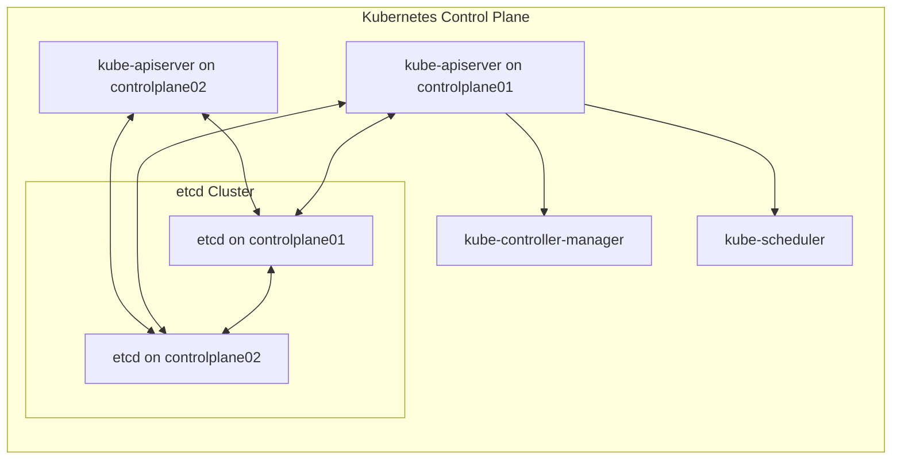
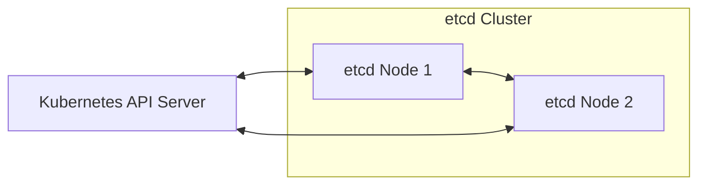
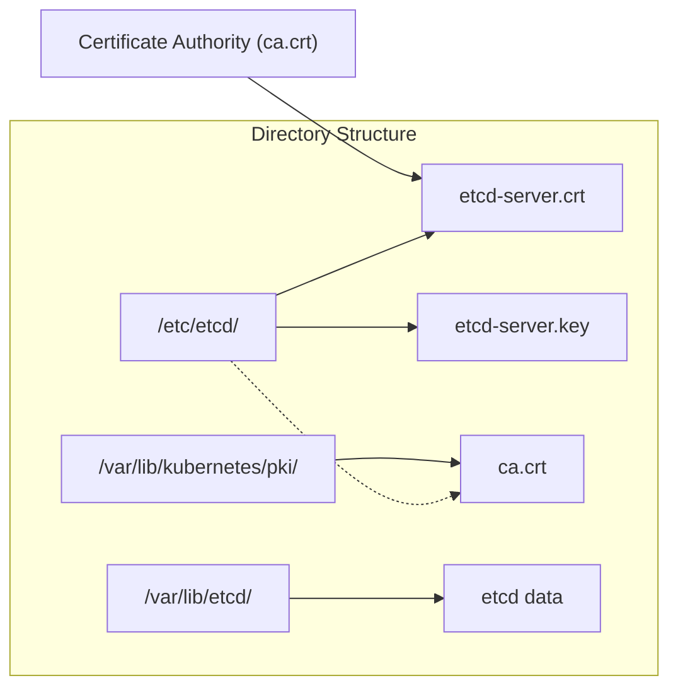
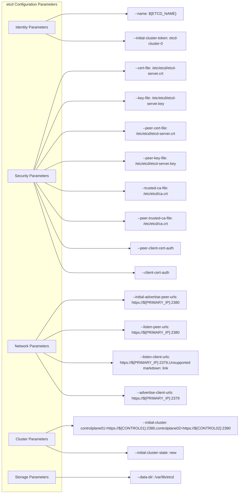

# etcd Cluster Bootstrapping
Relevant source files
- [README.md](https://github.com/mmumshad/kubernetes-the-hard-way/blob/8218a815/README.md?plain=1)
- [docs/07-bootstrapping-etcd.md](https://github.com/mmumshad/kubernetes-the-hard-way/blob/8218a815/docs/07-bootstrapping-etcd.md?plain=1)

## Purpose and Scope

This document details the process of bootstrapping an etcd cluster, which serves as the primary key-value store for all Kubernetes cluster state data. etcd is a critical component of the Kubernetes control plane, providing reliable distributed storage for configuration, state, and metadata. For information on the other control plane components that utilize etcd, see [Kubernetes API Server, Controller Manager, and Scheduler](/mmumshad/kubernetes-the-hard-way/4.2-kubernetes-api-server-controller-manager-and-scheduler).

Sources: [README.md30-36](https://github.com/mmumshad/kubernetes-the-hard-way/blob/8218a815/README.md?plain=1#L30-L36)[docs/07-bootstrapping-etcd.md1-4](https://github.com/mmumshad/kubernetes-the-hard-way/blob/8218a815/docs/07-bootstrapping-etcd.md?plain=1#L1-L4)

## etcd in Kubernetes Architecture

etcd forms the foundation of the Kubernetes control plane by providing a consistent and highly-available data store. In this implementation, we'll configure a two-node etcd cluster across both control plane nodes.



Sources: [README.md30-36](https://github.com/mmumshad/kubernetes-the-hard-way/blob/8218a815/README.md?plain=1#L30-L36)[docs/07-bootstrapping-etcd.md1-4](https://github.com/mmumshad/kubernetes-the-hard-way/blob/8218a815/docs/07-bootstrapping-etcd.md?plain=1#L1-L4)

## etcd Communication Channels

etcd operates through two primary communication channels:



Sources: [docs/07-bootstrapping-etcd.md89-92](https://github.com/mmumshad/kubernetes-the-hard-way/blob/8218a815/docs/07-bootstrapping-etcd.md?plain=1#L89-L92)

## The Bootstrapping Process

The process of bootstrapping an etcd cluster involves several key steps that must be performed on each control plane node (`controlplane01` and `controlplane02`).

### 1. Installing etcd Binaries

First, we download and install the etcd binaries on each control plane node:

1. Download the specified version (v3.5.9) of etcd from GitHub
2. Extract the tar file
3. Install the `etcd` server and `etcdctl` command line utility to `/usr/local/bin/`

Sources: [docs/07-bootstrapping-etcd.md17-37](https://github.com/mmumshad/kubernetes-the-hard-way/blob/8218a815/docs/07-bootstrapping-etcd.md?plain=1#L17-L37)

### 2. Configuring Certificates and Directories

etcd requires TLS certificates for secure communication. The following directory structure is established:



Sources: [docs/07-bootstrapping-etcd.md40-53](https://github.com/mmumshad/kubernetes-the-hard-way/blob/8218a815/docs/07-bootstrapping-etcd.md?plain=1#L40-L53)

### 3. etcd Service Configuration

The etcd service is configured through a systemd unit file with the following key parameter categories:

| Parameter Category | Description | Key Parameters |
| --- | --- | --- |
| Identity | Node identification | `--name=${ETCD_NAME}`, `--initial-cluster-token=etcd-cluster-0` |
| TLS Security | Certificate configuration | `--cert-file`, `--key-file`, `--trusted-ca-file` |
| Peer Security | Peer authentication | `--peer-cert-file`, `--peer-key-file`, `--peer-trusted-ca-file` |
| Client Networking | Client connection endpoints | `--listen-client-urls`, `--advertise-client-urls` |
| Peer Networking | Peer connection endpoints | `--initial-advertise-peer-urls`, `--listen-peer-urls` |
| Cluster Configuration | Cluster membership | `--initial-cluster`, `--initial-cluster-state=new` |
| Data Storage | Data directory | `--data-dir=/var/lib/etcd` |

The complete systemd unit file is defined in [docs/07-bootstrapping-etcd.md72-102](https://github.com/mmumshad/kubernetes-the-hard-way/blob/8218a815/docs/07-bootstrapping-etcd.md?plain=1#L72-L102)

Sources: [docs/07-bootstrapping-etcd.md70-103](https://github.com/mmumshad/kubernetes-the-hard-way/blob/8218a815/docs/07-bootstrapping-etcd.md?plain=1#L70-L103)

### 4. Starting and Verifying the etcd Cluster

After configuring etcd on both control plane nodes, the service is started and enabled:

```
sudo systemctl daemon-reload
sudo systemctl enable etcd
sudo systemctl start etcd

```

Once both etcd instances are running, the cluster can be verified using the `etcdctl` utility:

```
sudo ETCDCTL_API=3 etcdctl member list \
  --endpoints=https://127.0.0.1:2379 \
  --cacert=/etc/etcd/ca.crt \
  --cert=/etc/etcd/etcd-server.crt \
  --key=/etc/etcd/etcd-server.key

```

A successful output will show both cluster members with their IDs, status, names, peer URLs, and client URLs.

Sources: [docs/07-bootstrapping-etcd.md106-138](https://github.com/mmumshad/kubernetes-the-hard-way/blob/8218a815/docs/07-bootstrapping-etcd.md?plain=1#L106-L138)

## etcd Configuration Details

The following diagram illustrates the key configuration parameters for etcd:



Sources: [docs/07-bootstrapping-etcd.md72-102](https://github.com/mmumshad/kubernetes-the-hard-way/blob/8218a815/docs/07-bootstrapping-etcd.md?plain=1#L72-L102)

## Implementation Notes

1. While a production etcd cluster typically requires at least 3 nodes to maintain quorum, this implementation uses 2 nodes to conserve resources.
2. All communication between etcd nodes and with clients is secured using TLS certificates.
3. The etcd service is configured to start automatically on system boot via systemd.
4. Each etcd instance maintains its own data directory at `/var/lib/etcd`.
5. The bootstrap process must be performed on both control plane nodes for the cluster to form properly.

Sources: [README.md14](https://github.com/mmumshad/kubernetes-the-hard-way/blob/8218a815/README.md?plain=1#L14-L14)[docs/07-bootstrapping-etcd.md1-143](https://github.com/mmumshad/kubernetes-the-hard-way/blob/8218a815/docs/07-bootstrapping-etcd.md?plain=1#L1-L143)

## Troubleshooting

If verification fails, check:

1. Certificate paths and permissions
2. Network connectivity between control plane nodes
3. IP address configuration in the etcd service file
4. System logs via `journalctl -u etcd`

The most common issues arise from misconfigured certificates or network connectivity problems between nodes.

Sources: [README.md16-22](https://github.com/mmumshad/kubernetes-the-hard-way/blob/8218a815/README.md?plain=1#L16-L22)[docs/07-bootstrapping-etcd.md123-140](https://github.com/mmumshad/kubernetes-the-hard-way/blob/8218a815/docs/07-bootstrapping-etcd.md?plain=1#L123-L140)