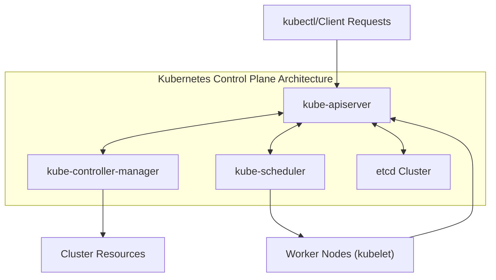
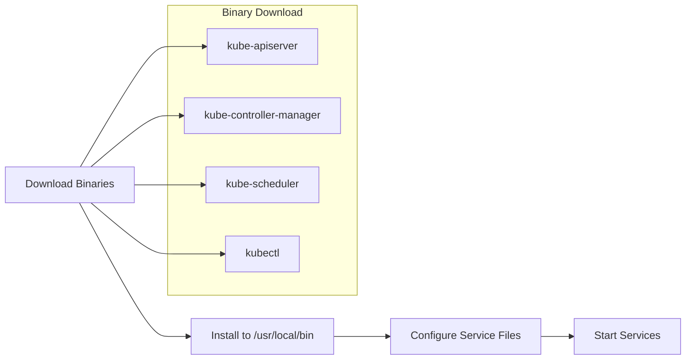
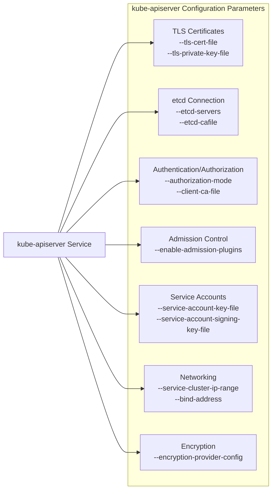
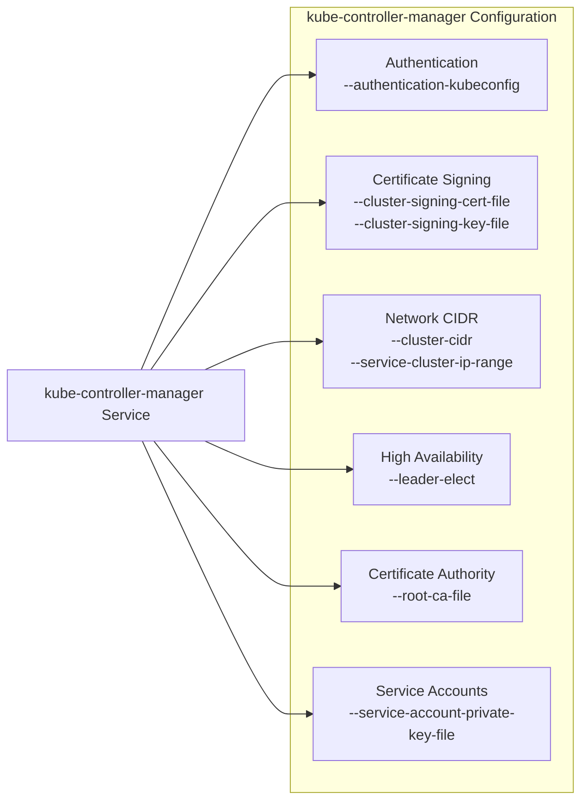
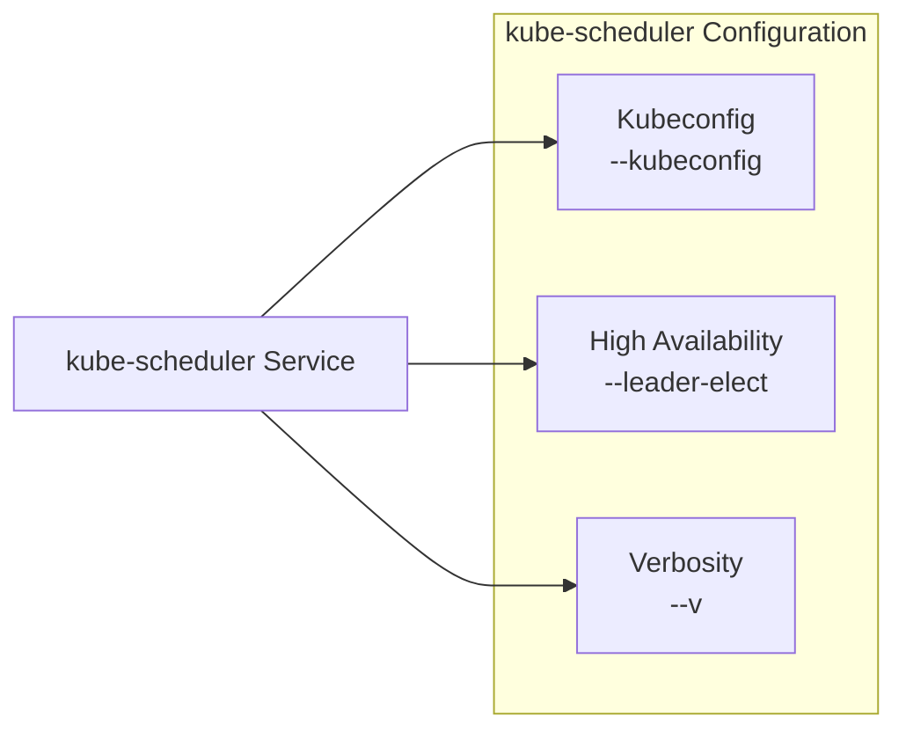
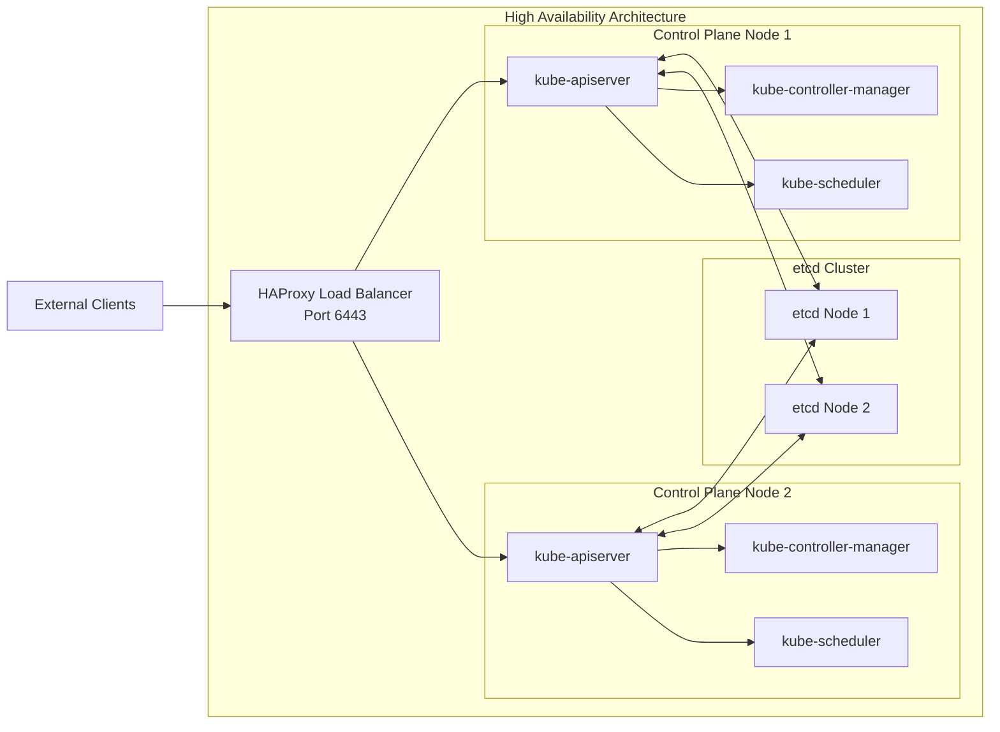

# Kubernetes API Server, Controller Manager, and Scheduler
Relevant source files
- [docs/08-bootstrapping-kubernetes-controllers.md](https://github.com/mmumshad/kubernetes-the-hard-way/blob/8218a815/docs/08-bootstrapping-kubernetes-controllers.md?plain=1)

This document explains the core components of the Kubernetes control plane: the API Server, Controller Manager, and Scheduler. These components collectively form the brain of a Kubernetes cluster, maintaining the desired state, handling API requests, and making scheduling decisions. For information about etcd, which stores the cluster state, see [etcd Cluster Bootstrapping](/mmumshad/kubernetes-the-hard-way/4.1-etcd-cluster-bootstrapping).

## Control Plane Components Overview

The Kubernetes control plane consists of three main components that work together to coordinate cluster operations:



Sources: [docs/08-bootstrapping-kubernetes-controllers.md2-5](https://github.com/mmumshad/kubernetes-the-hard-way/blob/8218a815/docs/08-bootstrapping-kubernetes-controllers.md?plain=1#L2-L5)

## Component Installation Process

The installation of Kubernetes control plane components follows these steps:

1. **Download binaries**: Fetch the official Kubernetes release binaries
2. **Install binaries**: Place the binaries in the appropriate location and make them executable
3. **Configure components**: Create necessary configurations and systemd service files
4. **Start services**: Enable and start each component as a systemd service



Sources: [docs/08-bootstrapping-kubernetes-controllers.md20-43](https://github.com/mmumshad/kubernetes-the-hard-way/blob/8218a815/docs/08-bootstrapping-kubernetes-controllers.md?plain=1#L20-L43)

## Kubernetes API Server

The API Server acts as the front-end to the Kubernetes control plane, exposing the Kubernetes API. It processes REST operations, validates them, and updates the corresponding objects in etcd.

### Role and Responsibilities

- Acts as the gateway for all REST API requests to the cluster
- Validates and processes API requests
- Persists cluster state in etcd
- Implements authentication, authorization, and admission control
- Serves as the communication hub for all cluster components

### Configuration

The kube-apiserver is configured via command-line flags specified in its systemd service file:



Key configuration parameters include:

| Parameter | Description | Example Value |
| --- | --- | --- |
| `--advertise-address` | IP address on which API server is advertised | `${PRIMARY_IP}` |
| `--authorization-mode` | Authorization modes enabled | `Node,RBAC` |
| `--etcd-servers` | List of etcd servers | `https://${CONTROL01}:2379,https://${CONTROL02}:2379` |
| `--service-cluster-ip-range` | CIDR range for service IPs | `10.96.0.0/16` |
| `--encryption-provider-config` | Path to encryption config | `/var/lib/kubernetes/encryption-config.yaml` |
| `--enable-admission-plugins` | Admission controllers to enable | `NodeRestriction,ServiceAccount` |

Sources: [docs/08-bootstrapping-kubernetes-controllers.md46-130](https://github.com/mmumshad/kubernetes-the-hard-way/blob/8218a815/docs/08-bootstrapping-kubernetes-controllers.md?plain=1#L46-L130)

## Kubernetes Controller Manager

The Controller Manager runs controller processes that regulate the state of the cluster. It ensures the actual state of the cluster matches the desired state.

### Role and Responsibilities

- Combines multiple controllers in a single binary
- Each controller is a control loop that watches the state of a resource
- Takes action to maintain desired state when changes are detected
- Examples include: Node Controller, Replication Controller, Endpoints Controller, and more

### Configuration

The kube-controller-manager is configured via command-line flags in its systemd service file:



Key configuration parameters include:

| Parameter | Description | Example Value |
| --- | --- | --- |
| `--cluster-cidr` | CIDR range for pods | `10.244.0.0/16` |
| `--service-cluster-ip-range` | CIDR range for services | `10.96.0.0/16` |
| `--cluster-signing-cert-file` | Certificate for signing other certs | `/var/lib/kubernetes/pki/ca.crt` |
| `--cluster-signing-key-file` | Key for signing other certs | `/var/lib/kubernetes/pki/ca.key` |
| `--leader-elect` | Enable leader election | `true` |
| `--use-service-account-credentials` | Use dedicated SA for controllers | `true` |

Sources: [docs/08-bootstrapping-kubernetes-controllers.md134-176](https://github.com/mmumshad/kubernetes-the-hard-way/blob/8218a815/docs/08-bootstrapping-kubernetes-controllers.md?plain=1#L134-L176)

## Kubernetes Scheduler

The Scheduler is responsible for watching newly created pods and selecting nodes for them to run on based on resource requirements, constraints, and other policies.

### Role and Responsibilities

- Watches the API server for unscheduled pods
- Selects an appropriate node for each pod
- Takes into account resource requirements, affinity/anti-affinity, taints/tolerations, and other constraints
- Does not actually place pods on nodes (kubelet does that)

### Configuration

The kube-scheduler has a simpler configuration compared to other control plane components:



Key configuration parameters include:

| Parameter | Description | Example Value |
| --- | --- | --- |
| `--kubeconfig` | Path to kubeconfig file | `/var/lib/kubernetes/kube-scheduler.kubeconfig` |
| `--leader-elect` | Enable leader election | `true` |
| `--v` | Log verbosity level | `2` |

Sources: [docs/08-bootstrapping-kubernetes-controllers.md179-205](https://github.com/mmumshad/kubernetes-the-hard-way/blob/8218a815/docs/08-bootstrapping-kubernetes-controllers.md?plain=1#L179-L205)

## High Availability Setup

For production clusters, control plane components should be configured for high availability to ensure the cluster remains operational even if individual nodes fail.



### Load Balancer Configuration

A HAProxy load balancer is used to distribute incoming API server traffic across multiple control plane nodes:

- Uses TCP mode (layer 4) to pass traffic directly without modifying TLS sessions
- Configured with health checks to detect failed API servers
- Provides a single endpoint for all API clients

Sources: [docs/08-bootstrapping-kubernetes-controllers.md262-321](https://github.com/mmumshad/kubernetes-the-hard-way/blob/8218a815/docs/08-bootstrapping-kubernetes-controllers.md?plain=1#L262-L321)

### Leader Election

Both the Controller Manager and Scheduler use leader election to ensure only one instance is active at a time:

- Multiple instances run simultaneously but only one is active
- The active instance acquires a lease by creating/updating a ConfigMap or Endpoint object
- If the active instance fails, another instance takes over
- Enabled with the `--leader-elect=true` flag

Sources: [docs/08-bootstrapping-kubernetes-controllers.md162](https://github.com/mmumshad/kubernetes-the-hard-way/blob/8218a815/docs/08-bootstrapping-kubernetes-controllers.md?plain=1#L162-L162)[docs/08-bootstrapping-kubernetes-controllers.md197](https://github.com/mmumshad/kubernetes-the-hard-way/blob/8218a815/docs/08-bootstrapping-kubernetes-controllers.md?plain=1#L197-L197)

## Service File Configuration

Each control plane component is managed by systemd. The service files define how the components are started and what parameters they use.

Example structure of a systemd service file:

```
[Unit]
Description=Kubernetes Component Name
Documentation=https://github.com/kubernetes/kubernetes

[Service]
ExecStart=/usr/local/bin/component-binary \
  --flag1=value1 \
  --flag2=value2
Restart=on-failure
RestartSec=5

[Install]
WantedBy=multi-user.target

```

Sources: [docs/08-bootstrapping-kubernetes-controllers.md88-130](https://github.com/mmumshad/kubernetes-the-hard-way/blob/8218a815/docs/08-bootstrapping-kubernetes-controllers.md?plain=1#L88-L130)[docs/08-bootstrapping-kubernetes-controllers.md144-176](https://github.com/mmumshad/kubernetes-the-hard-way/blob/8218a815/docs/08-bootstrapping-kubernetes-controllers.md?plain=1#L144-L176)[docs/08-bootstrapping-kubernetes-controllers.md189-205](https://github.com/mmumshad/kubernetes-the-hard-way/blob/8218a815/docs/08-bootstrapping-kubernetes-controllers.md?plain=1#L189-L205)

## Verification and Troubleshooting

After setting up the control plane components, verification can be performed to ensure everything is working correctly:

- Check component status: `kubectl get componentstatuses`
- Verify API server health: `curl -k https://${LOADBALANCER}:6443/version`
- Check systemd service status: `systemctl status kube-apiserver`

Sources: [docs/08-bootstrapping-kubernetes-controllers.md237-258](https://github.com/mmumshad/kubernetes-the-hard-way/blob/8218a815/docs/08-bootstrapping-kubernetes-controllers.md?plain=1#L237-L258)[docs/08-bootstrapping-kubernetes-controllers.md319-324](https://github.com/mmumshad/kubernetes-the-hard-way/blob/8218a815/docs/08-bootstrapping-kubernetes-controllers.md?plain=1#L319-L324)

## Security Considerations

The control plane components use various security mechanisms:

- TLS certificates for secure communication
- RBAC (Role-Based Access Control) for API authorization
- Authentication using client certificates
- Encryption at rest for sensitive data
- Secure kubeconfig files with appropriate permissions

Sources: [docs/08-bootstrapping-kubernetes-controllers.md47-61](https://github.com/mmumshad/kubernetes-the-hard-way/blob/8218a815/docs/08-bootstrapping-kubernetes-controllers.md?plain=1#L47-L61)[docs/08-bootstrapping-kubernetes-controllers.md209-211](https://github.com/mmumshad/kubernetes-the-hard-way/blob/8218a815/docs/08-bootstrapping-kubernetes-controllers.md?plain=1#L209-L211)

## Related Components

For complete understanding of the Kubernetes control plane, also refer to:

- [etcd Cluster Bootstrapping](/mmumshad/kubernetes-the-hard-way/4.1-etcd-cluster-bootstrapping) for details on the distributed key-value store
- [Load Balancer Configuration](/mmumshad/kubernetes-the-hard-way/4.3-load-balancer-configuration) for more information on the API server load balancer
- [Worker Node Setup](/mmumshad/kubernetes-the-hard-way/5-worker-node-setup) for information on how worker nodes connect to the control plane