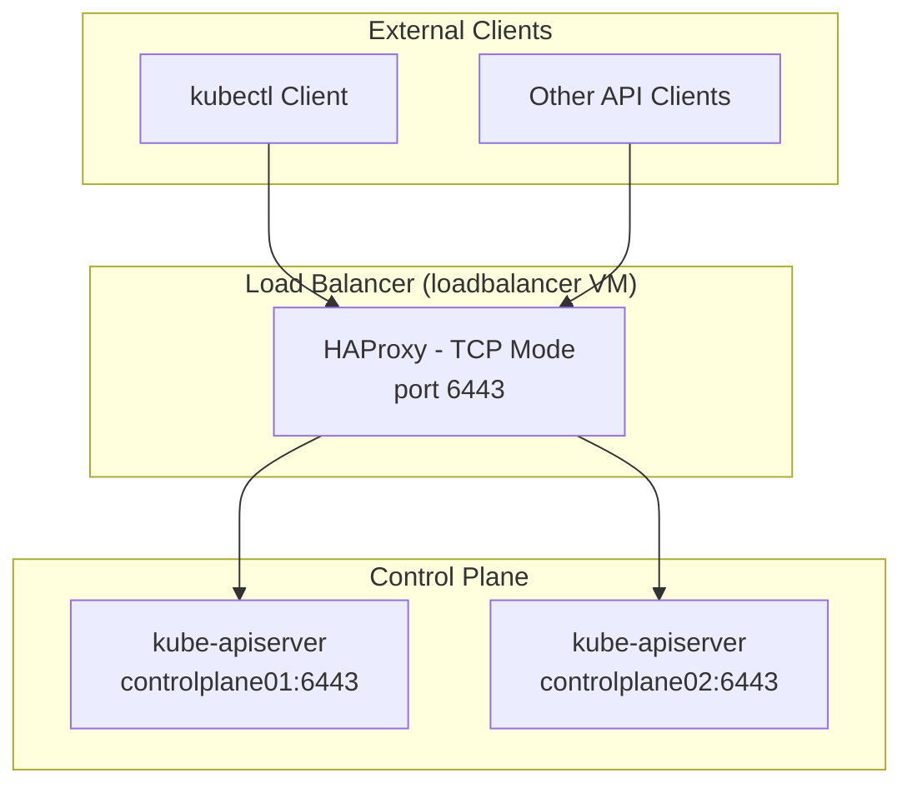
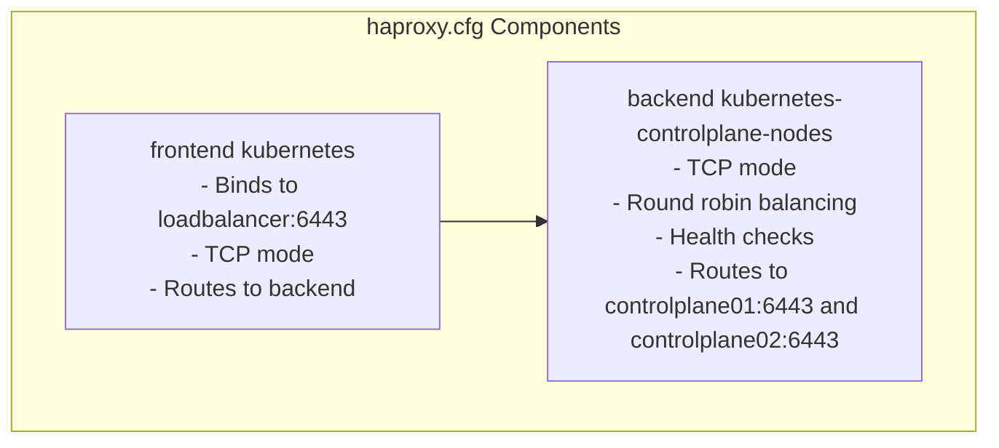
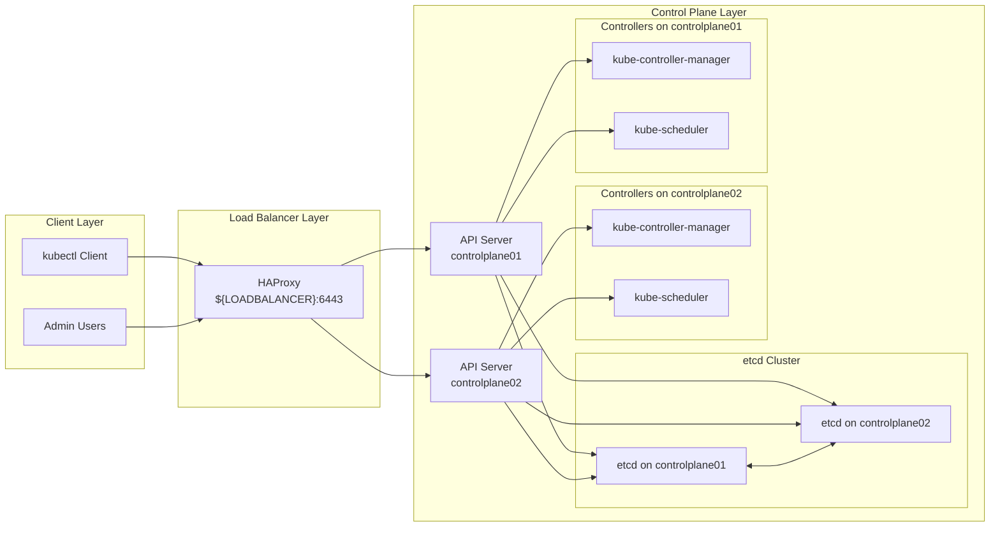

# Load Balancer Configuration
Relevant source files
- [docs/08-bootstrapping-kubernetes-controllers.md](https://github.com/mmumshad/kubernetes-the-hard-way/blob/8218a815/docs/08-bootstrapping-kubernetes-controllers.md?plain=1)

## Purpose and Scope

This document details the setup and configuration of a load balancer for Kubernetes API servers in the "Kubernetes The Hard Way" deployment. The load balancer provides high availability for the control plane by distributing client requests across multiple Kubernetes API server instances.

This page focuses specifically on setting up HAProxy as a network load balancer for the Kubernetes API servers. For information about the control plane components themselves, see [Kubernetes API Server, Controller Manager, and Scheduler](/mmumshad/kubernetes-the-hard-way/4.2-kubernetes-api-server-controller-manager-and-scheduler).

Sources: [docs/08-bootstrapping-kubernetes-controllers.md262-264](https://github.com/mmumshad/kubernetes-the-hard-way/blob/8218a815/docs/08-bootstrapping-kubernetes-controllers.md?plain=1#L262-L264)

## Load Balancer Architecture

The load balancer in our Kubernetes deployment operates at Layer 4 (Transport layer) of the OSI model, functioning as a TCP proxy that passes traffic directly to the backend API servers without modifying it. This approach preserves the TLS encryption all the way to the API servers rather than terminating it at the load balancer.



Sources: [docs/08-bootstrapping-kubernetes-controllers.md268-270](https://github.com/mmumshad/kubernetes-the-hard-way/blob/8218a815/docs/08-bootstrapping-kubernetes-controllers.md?plain=1#L268-L270)[docs/08-bootstrapping-kubernetes-controllers.md288-291](https://github.com/mmumshad/kubernetes-the-hard-way/blob/8218a815/docs/08-bootstrapping-kubernetes-controllers.md?plain=1#L288-L291)

## Installation Process

The load balancer is installed on a dedicated virtual machine named `loadbalancer`. The installation process involves:

1. Setting up the virtual machine (already covered in previous steps)
2. Installing HAProxy as the load balancing software
3. Configuring HAProxy to distribute traffic to the API servers
4. Verifying the load balancer functionality

Sources: [docs/08-bootstrapping-kubernetes-controllers.md273-274](https://github.com/mmumshad/kubernetes-the-hard-way/blob/8218a815/docs/08-bootstrapping-kubernetes-controllers.md?plain=1#L273-L274)

### HAProxy Installation

HAProxy is installed on the `loadbalancer` VM using the standard package manager:

```
sudo apt-get update && sudo apt-get install -y haproxy
```

Sources: [docs/08-bootstrapping-kubernetes-controllers.md276-278](https://github.com/mmumshad/kubernetes-the-hard-way/blob/8218a815/docs/08-bootstrapping-kubernetes-controllers.md?plain=1#L276-L278)

## Configuration Details

### IP Discovery

Before configuring HAProxy, we need to determine the IP addresses of the control plane nodes and the load balancer itself:

```
CONTROL01=$(dig +short controlplane01)
CONTROL02=$(dig +short controlplane02)
LOADBALANCER=$(dig +short loadbalancer)
```

Sources: [docs/08-bootstrapping-kubernetes-controllers.md280-286](https://github.com/mmumshad/kubernetes-the-hard-way/blob/8218a815/docs/08-bootstrapping-kubernetes-controllers.md?plain=1#L280-L286)

### HAProxy Configuration File

HAProxy is configured by creating a configuration file at `/etc/haproxy/haproxy.cfg` with the following settings:



The configuration includes:

1. **Frontend**: Defines where HAProxy listens for incoming connections

- Binds to the load balancer's IP address on port 6443
- Operates in TCP mode for transparent traffic passing
- Routes all traffic to the defined backend
2. **Backend**: Defines the group of servers that will receive the traffic

- Operates in TCP mode
- Uses round-robin load balancing algorithm
- Includes health checks to detect server failures
- Defines two server entries: `controlplane01` and `controlplane02`

The actual configuration file looks like this:

```
frontend kubernetes
    bind ${LOADBALANCER}:6443
    option tcplog
    mode tcp
    default_backend kubernetes-controlplane-nodes

backend kubernetes-controlplane-nodes
    mode tcp
    balance roundrobin
    option tcp-check
    server controlplane01 ${CONTROL01}:6443 check fall 3 rise 2
    server controlplane02 ${CONTROL02}:6443 check fall 3 rise 2

```

Sources: [docs/08-bootstrapping-kubernetes-controllers.md292-306](https://github.com/mmumshad/kubernetes-the-hard-way/blob/8218a815/docs/08-bootstrapping-kubernetes-controllers.md?plain=1#L292-L306)

### Health Check Parameters

The HAProxy configuration includes health check parameters for the backend servers:

- `check`: Enables health checking for the server
- `fall 3`: Server will be considered down after 3 consecutive failed health checks
- `rise 2`: Server will be considered up after 2 consecutive successful health checks

These parameters help ensure that traffic is only sent to healthy API servers.

Sources: [docs/08-bootstrapping-kubernetes-controllers.md304-305](https://github.com/mmumshad/kubernetes-the-hard-way/blob/8218a815/docs/08-bootstrapping-kubernetes-controllers.md?plain=1#L304-L305)

### Applying the Configuration

After creating the configuration file, HAProxy is restarted to apply the changes:

```
sudo systemctl restart haproxy
```

Sources: [docs/08-bootstrapping-kubernetes-controllers.md309-311](https://github.com/mmumshad/kubernetes-the-hard-way/blob/8218a815/docs/08-bootstrapping-kubernetes-controllers.md?plain=1#L309-L311)

## Integration with Kubernetes Components

The load balancer plays a crucial role in the overall Kubernetes architecture, serving as the entry point for all external API requests.



Note: The load balancer's IP address is used in the Kubernetes API server configuration as the `--service-account-issuer` endpoint, which is critically important for service account token validation.

Sources: [docs/08-bootstrapping-kubernetes-controllers.md64-69](https://github.com/mmumshad/kubernetes-the-hard-way/blob/8218a815/docs/08-bootstrapping-kubernetes-controllers.md?plain=1#L64-L69)[docs/08-bootstrapping-kubernetes-controllers.md119](https://github.com/mmumshad/kubernetes-the-hard-way/blob/8218a815/docs/08-bootstrapping-kubernetes-controllers.md?plain=1#L119-L119)

## Verification

To verify that the load balancer is working correctly, you can make a HTTP request to the Kubernetes API server through the load balancer:

```
curl -k https://${LOADBALANCER}:6443/version
```

A successful response will include details about the Kubernetes version and build information, confirming that:

1. The load balancer is accepting connections
2. At least one API server is operational
3. The request is being successfully proxied through the load balancer to an API server

Sources: [docs/08-bootstrapping-kubernetes-controllers.md315-323](https://github.com/mmumshad/kubernetes-the-hard-way/blob/8218a815/docs/08-bootstrapping-kubernetes-controllers.md?plain=1#L315-L323)

## Troubleshooting

If you encounter issues with the load balancer configuration, consider checking:

1. HAProxy service status: `sudo systemctl status haproxy`
2. HAProxy logs: `sudo journalctl -u haproxy`
3. Network connectivity between the load balancer and API servers
4. Firewall rules allowing traffic on port 6443
5. API server availability on both control plane nodes

## Summary

The load balancer configuration provides high availability for the Kubernetes control plane by distributing API requests across multiple API server instances. Using HAProxy in TCP mode ensures transparent traffic forwarding without interfering with TLS encryption. This setup is a critical component of a production-ready Kubernetes deployment, ensuring that the API remains accessible even if an individual control plane node fails.