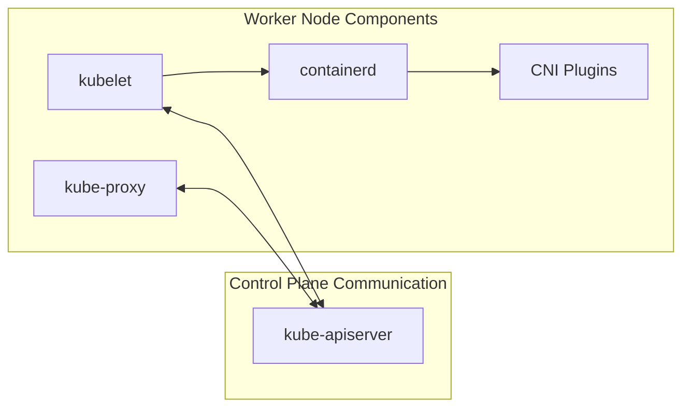
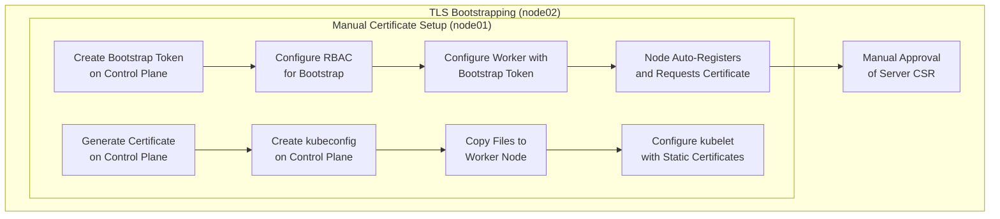
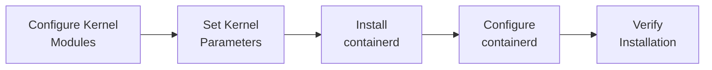
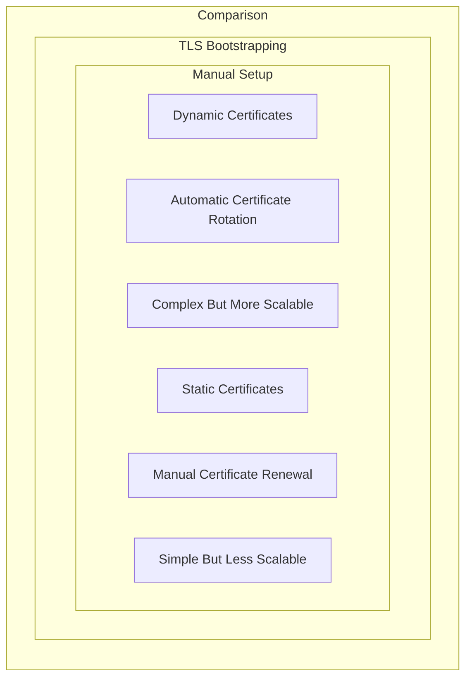

# Worker Node Setup
Relevant source files
- [apple-silicon/deploy-virtual-machines.sh](https://github.com/mmumshad/kubernetes-the-hard-way/blob/8218a815/apple-silicon/deploy-virtual-machines.sh)
- [docs/09-install-cri-workers.md](https://github.com/mmumshad/kubernetes-the-hard-way/blob/8218a815/docs/09-install-cri-workers.md?plain=1)
- [docs/10-bootstrapping-kubernetes-workers.md](https://github.com/mmumshad/kubernetes-the-hard-way/blob/8218a815/docs/10-bootstrapping-kubernetes-workers.md?plain=1)
- [docs/11-tls-bootstrapping-kubernetes-workers.md](https://github.com/mmumshad/kubernetes-the-hard-way/blob/8218a815/docs/11-tls-bootstrapping-kubernetes-workers.md?plain=1)
- [docs/differences-to-original.md](https://github.com/mmumshad/kubernetes-the-hard-way/blob/8218a815/docs/differences-to-original.md?plain=1)
- [tools/approve-csr.sh](https://github.com/mmumshad/kubernetes-the-hard-way/blob/8218a815/tools/approve-csr.sh)
- [vagrant/README.md](https://github.com/mmumshad/kubernetes-the-hard-way/blob/8218a815/vagrant/README.md?plain=1)
- [vagrant/Vagrantfile](https://github.com/mmumshad/kubernetes-the-hard-way/blob/8218a815/vagrant/Vagrantfile)

This wiki page explains the architecture and process for setting up Kubernetes worker nodes in our implementation. Worker nodes are critical components in a Kubernetes cluster, responsible for running containerized applications through Pods.

For prerequisite steps related to environment configuration, see [Environment Setup and Prerequisites](/mmumshad/kubernetes-the-hard-way/2-environment-setup-and-prerequisites). For control plane configuration that must be completed before worker setup, see [Control Plane Setup](/mmumshad/kubernetes-the-hard-way/4-control-plane-setup).

## Worker Node Architecture

Worker nodes require several key components to function properly within a Kubernetes cluster:

Kubernetes Worker Node Components



- **containerd**: Container runtime that manages container lifecycle
- **CNI plugins**: Network plugins that implement the Container Network Interface
- **kubelet**: Node agent that ensures containers are running in pods according to specifications
- **kube-proxy**: Network proxy that maintains network rules for service discovery

Sources: [docs/09-install-cri-workers.md1-3](https://github.com/mmumshad/kubernetes-the-hard-way/blob/8218a815/docs/09-install-cri-workers.md?plain=1#L1-L3)[docs/10-bootstrapping-kubernetes-workers.md3-7](https://github.com/mmumshad/kubernetes-the-hard-way/blob/8218a815/docs/10-bootstrapping-kubernetes-workers.md?plain=1#L3-L7)

## Setup Approaches

Our implementation demonstrates two different approaches to setting up worker nodes:

Two Worker Node Setup Methods



Sources: [docs/10-bootstrapping-kubernetes-workers.md1-2](https://github.com/mmumshad/kubernetes-the-hard-way/blob/8218a815/docs/10-bootstrapping-kubernetes-workers.md?plain=1#L1-L2)[docs/11-tls-bootstrapping-kubernetes-workers.md1-17](https://github.com/mmumshad/kubernetes-the-hard-way/blob/8218a815/docs/11-tls-bootstrapping-kubernetes-workers.md?plain=1#L1-L17)

## Prerequisites

Before setting up worker nodes, the following prerequisites must be met:

1. **Container Runtime**: Both approaches require containerd and CNI plugins to be installed
2. **Control Plane**: The Kubernetes control plane must be operational
3. **Load Balancer**: A load balancer must be configured for API server access
4. **Networking**: Proper network configuration for pod and service networking

Sources: [docs/09-install-cri-workers.md7-9](https://github.com/mmumshad/kubernetes-the-hard-way/blob/8218a815/docs/09-install-cri-workers.md?plain=1#L7-L9)[vagrant/README.md7-10](https://github.com/mmumshad/kubernetes-the-hard-way/blob/8218a815/vagrant/README.md?plain=1#L7-L10)

## Container Runtime Installation

The first step in worker node setup is installing the Container Runtime Interface (CRI). Our implementation uses containerd as the container runtime.

Container Runtime Setup Process



Key configuration aspects include:

- Loading kernel modules: `overlay` and `br_netfilter`
- Setting network parameters for bridging and IP forwarding
- Configuring containerd to use systemd cgroups

Sources: [docs/09-install-cri-workers.md11-91](https://github.com/mmumshad/kubernetes-the-hard-way/blob/8218a815/docs/09-install-cri-workers.md?plain=1#L11-L91)

## Manual Worker Node Setup (node01)

The manual approach for setting up the first worker node involves creating certificates and configurations explicitly for this node.

### Certificate Generation and Distribution

1. On the control plane node, generate a private key and certificate for node01
2. Create a kubeconfig file using these credentials
3. Transfer the certificates and kubeconfig to node01

This approach creates node-specific certificates with the node's name (`system:node:node01`) and IP address as the subject.

Sources: [docs/10-bootstrapping-kubernetes-workers.md14-100](https://github.com/mmumshad/kubernetes-the-hard-way/blob/8218a815/docs/10-bootstrapping-kubernetes-workers.md?plain=1#L14-L100)

### Kubelet Configuration

For node01, the kubelet is configured with static certificate paths:

```
tlsCertFile: /var/lib/kubernetes/pki/${HOSTNAME}.crt
tlsPrivateKeyFile: /var/lib/kubernetes/pki/${HOSTNAME}.key

```

The kubelet service file loads this configuration and starts the kubelet with these static certificates.

Sources: [docs/10-bootstrapping-kubernetes-workers.md139-224](https://github.com/mmumshad/kubernetes-the-hard-way/blob/8218a815/docs/10-bootstrapping-kubernetes-workers.md?plain=1#L139-L224)

### Kube-proxy Configuration

The kube-proxy configuration is identical for both worker nodes:

- Configuration file: Defines networking settings including cluster CIDR
- Service file: Starts kube-proxy with the specified configuration

Sources: [docs/10-bootstrapping-kubernetes-workers.md228-267](https://github.com/mmumshad/kubernetes-the-hard-way/blob/8218a815/docs/10-bootstrapping-kubernetes-workers.md?plain=1#L228-L267)

## TLS Bootstrapping Setup (node02)

The TLS bootstrapping approach automates certificate management through the Kubernetes Certificate API.

### Bootstrap Token Creation

A bootstrap token is created on the control plane with the format `07401b.f395accd246ae52d` and associated with the group `system:bootstrappers:worker`.

This token enables node02 to authenticate to the API server and request certificates.

Sources: [docs/11-tls-bootstrapping-kubernetes-workers.md51-105](https://github.com/mmumshad/kubernetes-the-hard-way/blob/8218a815/docs/11-tls-bootstrapping-kubernetes-workers.md?plain=1#L51-L105)

### RBAC Configuration for Bootstrapping

Three RBAC role bindings are created to enable TLS bootstrapping:

1. Allow bootstrap nodes to create CSRs
2. Allow auto-approval of CSRs for bootstrap nodes
3. Allow nodes to renew their certificates

These permissions are essential for the certificate lifecycle management.

Sources: [docs/11-tls-bootstrapping-kubernetes-workers.md110-210](https://github.com/mmumshad/kubernetes-the-hard-way/blob/8218a815/docs/11-tls-bootstrapping-kubernetes-workers.md?plain=1#L110-L210)

### Worker Node Bootstrap Configuration

On node02, instead of using static certificates, the kubelet is configured with:

- A bootstrap kubeconfig file containing the bootstrap token
- Configuration to enable certificate rotation with `rotateCertificates: true`
- Server TLS bootstrapping with `serverTLSBootstrap: true`

The bootstrap process:

1. Node uses bootstrap token to authenticate to the API server
2. Node generates a key pair and creates a CSR
3. Control plane approves the CSR and issues certificates
4. Node configures itself with the issued certificates

Sources: [docs/11-tls-bootstrapping-kubernetes-workers.md262-391](https://github.com/mmumshad/kubernetes-the-hard-way/blob/8218a815/docs/11-tls-bootstrapping-kubernetes-workers.md?plain=1#L262-L391)

### Certificate Signing Request Approval

When node02 joins the cluster, it creates two CSRs:

1. A client CSR for kubelet-to-apiserver communication (auto-approved)
2. A server CSR for apiserver-to-kubelet communication (requires manual approval)

The server CSR must be manually approved by a cluster administrator:

```
kubectl certificate approve --kubeconfig admin.kubeconfig <csr-name>
```

The tool `approve-csr.sh` is provided to automate this approval.

Sources: [docs/11-tls-bootstrapping-kubernetes-workers.md466-490](https://github.com/mmumshad/kubernetes-the-hard-way/blob/8218a815/docs/11-tls-bootstrapping-kubernetes-workers.md?plain=1#L466-L490)[tools/approve-csr.sh1-3](https://github.com/mmumshad/kubernetes-the-hard-way/blob/8218a815/tools/approve-csr.sh#L1-L3)

## Worker Node Verification

Once the worker nodes are set up, they should register with the Kubernetes cluster. This can be verified by checking the node status:

```
kubectl get nodes --kubeconfig admin.kubeconfig
```

Expected output:

```
NAME       STATUS     ROLES    AGE   VERSION
node01     NotReady   <none>   93s   v1.28.4
node02     NotReady   <none>   93s   v1.28.4

```

The nodes appear in `NotReady` state initially, which is expected until the networking configuration is completed.

Sources: [docs/10-bootstrapping-kubernetes-workers.md298-311](https://github.com/mmumshad/kubernetes-the-hard-way/blob/8218a815/docs/10-bootstrapping-kubernetes-workers.md?plain=1#L298-L311)[docs/11-tls-bootstrapping-kubernetes-workers.md498-511](https://github.com/mmumshad/kubernetes-the-hard-way/blob/8218a815/docs/11-tls-bootstrapping-kubernetes-workers.md?plain=1#L498-L511)

## Differences Between Approaches

Manual vs. TLS Bootstrapping Comparison



Key differences:

- **Certificate Generation**: Manual (node01) vs. API-based (node02)
- **Certificate Renewal**: Manual process vs. automatic rotation
- **Scalability**: Manual approach is more cumbersome for large clusters
- **Configuration**: Static certificate paths vs. bootstrap-kubeconfig
- **Maintenance**: Higher maintenance for manual certificates

The TLS bootstrapping approach is preferred for production environments with many nodes due to its scalability and automated certificate management.

Sources: [docs/11-tls-bootstrapping-kubernetes-workers.md3-17](https://github.com/mmumshad/kubernetes-the-hard-way/blob/8218a815/docs/11-tls-bootstrapping-kubernetes-workers.md?plain=1#L3-L17)[docs/differences-to-original.md3-6](https://github.com/mmumshad/kubernetes-the-hard-way/blob/8218a815/docs/differences-to-original.md?plain=1#L3-L6)

## Resource Allocation for Worker Nodes

In our virtual environment setup, worker nodes are allocated resources based on the host system's capabilities:

| Component | Resource Type | Allocation Strategy |
| --- | --- | --- |
| RAM | Dynamic | Min(RAM_selector * 128, 4096) MB |
| CPU | Dynamic | (((CPU_CORES / 4) * 4) - 4) / 4 cores |

For Apple Silicon machines with limited RAM, worker nodes receive reduced allocations (512M) compared to the default (2048M).

Sources: [vagrant/Vagrantfile35-37](https://github.com/mmumshad/kubernetes-the-hard-way/blob/8218a815/vagrant/Vagrantfile#L35-L37)[apple-silicon/deploy-virtual-machines.sh46-51](https://github.com/mmumshad/kubernetes-the-hard-way/blob/8218a815/apple-silicon/deploy-virtual-machines.sh#L46-L51)

This setup ensures that worker nodes have sufficient resources to run containerized workloads while adapting to the host system's capabilities.