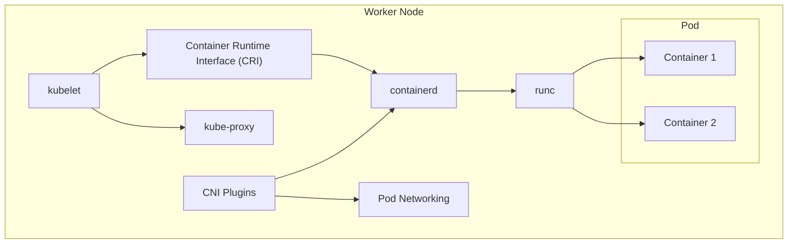
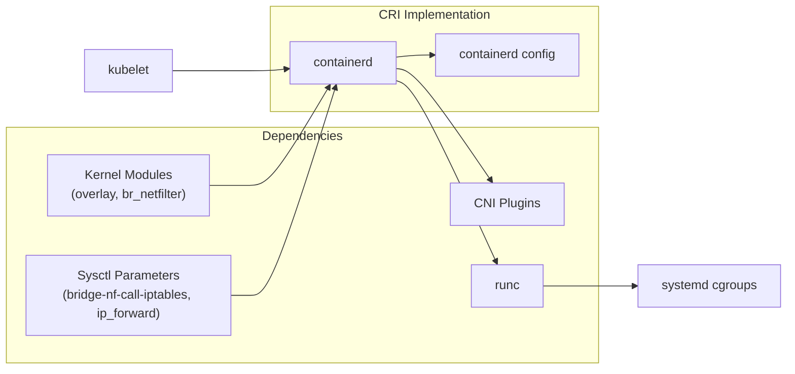
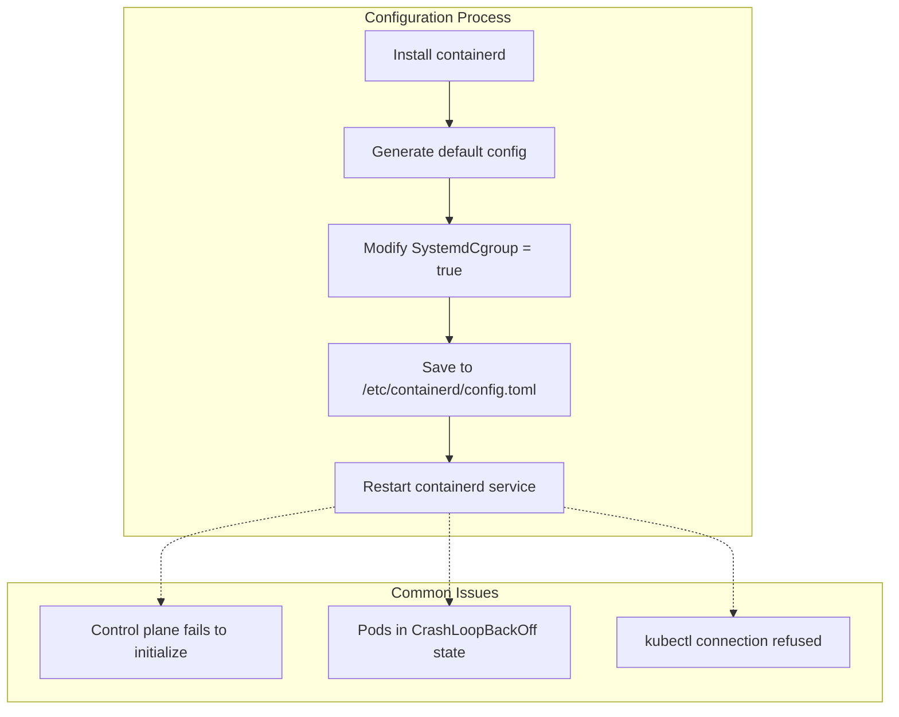

# Container Runtime Installation
Relevant source files
- [docs/09-install-cri-workers.md](https://github.com/mmumshad/kubernetes-the-hard-way/blob/8218a815/docs/09-install-cri-workers.md?plain=1)
- [docs/10-bootstrapping-kubernetes-workers.md](https://github.com/mmumshad/kubernetes-the-hard-way/blob/8218a815/docs/10-bootstrapping-kubernetes-workers.md?plain=1)
- [docs/differences-to-original.md](https://github.com/mmumshad/kubernetes-the-hard-way/blob/8218a815/docs/differences-to-original.md?plain=1)
- [vagrant/README.md](https://github.com/mmumshad/kubernetes-the-hard-way/blob/8218a815/vagrant/README.md?plain=1)

## Purpose and Scope

This document details the process of installing and configuring the Container Runtime Interface (CRI) on Kubernetes worker nodes as part of the manual Kubernetes cluster setup. Since Kubernetes v1.24, dockershim has been fully deprecated and removed from the codebase, with containerd now serving as the recommended container runtime. This guide focuses specifically on installing containerd and its dependencies. For information about configuring the kubelet and kube-proxy components that will use this runtime, see [Kubelet and Kube-proxy Configuration](/mmumshad/kubernetes-the-hard-way/5.3-kubelet-and-kube-proxy-configuration).

## Container Runtime Overview

Container runtimes are responsible for running containers on a host system. In Kubernetes architecture, the container runtime is a critical component that interfaces with the kubelet on worker nodes.

### Architecture Placement

The following diagram illustrates where the container runtime fits in the Kubernetes worker node architecture:



Sources: [docs/09-install-cri-workers.md1-5](https://github.com/mmumshad/kubernetes-the-hard-way/blob/8218a815/docs/09-install-cri-workers.md?plain=1#L1-L5)

### CRI Component Interactions

The container runtime depends on several components to function properly:



Sources: [docs/09-install-cri-workers.md3-5](https://github.com/mmumshad/kubernetes-the-hard-way/blob/8218a815/docs/09-install-cri-workers.md?plain=1#L3-L5)[docs/09-install-cri-workers.md76-86](https://github.com/mmumshad/kubernetes-the-hard-way/blob/8218a815/docs/09-install-cri-workers.md?plain=1#L76-L86)

## Prerequisites

Before installing the container runtime, the following prerequisites must be met:

1. Linux-based worker nodes (in this setup: `node01` and `node02`)
2. Root or sudo access to these nodes
3. Network connectivity for package downloads

Sources: [docs/09-install-cri-workers.md9-11](https://github.com/mmumshad/kubernetes-the-hard-way/blob/8218a815/docs/09-install-cri-workers.md?plain=1#L9-L11)

## Installation Procedure

The installation must be performed on each worker node. You can use tools like tmux to run these commands in parallel across nodes.

### 1. Update Package Index and Install Dependencies

```
sudo apt-get update
sudo apt-get install -y apt-transport-https ca-certificates curl
```

Sources: [docs/09-install-cri-workers.md18-23](https://github.com/mmumshad/kubernetes-the-hard-way/blob/8218a815/docs/09-install-cri-workers.md?plain=1#L18-L23)

### 2. Configure Kernel Modules

Load required kernel modules and make them persistent across reboots:

```
cat <<EOF | sudo tee /etc/modules-load.d/k8s.conf
overlay
br_netfilter
EOF
 
sudo modprobe overlay
sudo modprobe br_netfilter
```

Sources: [docs/09-install-cri-workers.md25-36](https://github.com/mmumshad/kubernetes-the-hard-way/blob/8218a815/docs/09-install-cri-workers.md?plain=1#L25-L36)

### 3. Configure Kernel Parameters

Set the required kernel parameters and make them persistent:

```
cat <<EOF | sudo tee /etc/sysctl.d/k8s.conf
net.bridge.bridge-nf-call-iptables  = 1
net.bridge.bridge-nf-call-ip6tables = 1
net.ipv4.ip_forward                 = 1
EOF
 
sudo sysctl --system
```

Sources: [docs/09-install-cri-workers.md38-49](https://github.com/mmumshad/kubernetes-the-hard-way/blob/8218a815/docs/09-install-cri-workers.md?plain=1#L38-L49)[vagrant/README.md9-10](https://github.com/mmumshad/kubernetes-the-hard-way/blob/8218a815/vagrant/README.md?plain=1#L9-L10)

### 4. Add Kubernetes Repository

```
# Determine latest version of Kubernetes
KUBE_LATEST=$(curl -L -s https://dl.k8s.io/release/stable.txt | awk 'BEGIN { FS="." } { printf "%s.%s", $1, $2 }')
 
# Download the Kubernetes public signing key
sudo mkdir -p /etc/apt/keyrings
curl -fsSL https://pkgs.k8s.io/core:/stable:/${KUBE_LATEST}/deb/Release.key | sudo gpg --dearmor -o /etc/apt/keyrings/kubernetes-apt-keyring.gpg
 
# Add the Kubernetes apt repository
echo "deb [signed-by=/etc/apt/keyrings/kubernetes-apt-keyring.gpg] https://pkgs.k8s.io/core:/stable:/${KUBE_LATEST}/deb/ /" | sudo tee /etc/apt/sources.list.d/kubernetes.list
```

Sources: [docs/09-install-cri-workers.md51-68](https://github.com/mmumshad/kubernetes-the-hard-way/blob/8218a815/docs/09-install-cri-workers.md?plain=1#L51-L68)

### 5. Install Container Runtime and CNI Components

```
sudo apt update
sudo apt-get install -y containerd kubernetes-cni kubectl ipvsadm ipset
```

Sources: [docs/09-install-cri-workers.md70-74](https://github.com/mmumshad/kubernetes-the-hard-way/blob/8218a815/docs/09-install-cri-workers.md?plain=1#L70-L74)

### 6. Configure containerd to Use systemd Cgroups

This critical step ensures that containerd uses systemd for cgroup management, which is required for Kubernetes:

```
# Create default configuration and modify it for systemd cgroups
sudo mkdir -p /etc/containerd
containerd config default | sed 's/SystemdCgroup = false/SystemdCgroup = true/' | sudo tee /etc/containerd/config.toml
 
# Restart containerd to apply changes
sudo systemctl restart containerd
```

Sources: [docs/09-install-cri-workers.md76-91](https://github.com/mmumshad/kubernetes-the-hard-way/blob/8218a815/docs/09-install-cri-workers.md?plain=1#L76-L91)

## Container Runtime Configuration

The diagram below illustrates the configuration workflow for containerd:



Sources: [docs/09-install-cri-workers.md76-91](https://github.com/mmumshad/kubernetes-the-hard-way/blob/8218a815/docs/09-install-cri-workers.md?plain=1#L76-L91)

## Verification

You can verify that containerd is running properly by checking its service status:

```
sudo systemctl status containerd
```

The output should show that the service is active (running).

## Common Issues and Troubleshooting

### Missing systemd Cgroup Configuration

If the containerd configuration is not properly set to use systemd Cgroups, you may encounter these issues:

1. The Kubernetes control plane may initialize but all pods will start crashing
2. kubectl commands may fail with: "The connection to the server x.x.x.x:6443 was refused"

Solution: Ensure that the `SystemdCgroup` parameter is set to `true` in the containerd configuration file.

Sources: [docs/09-install-cri-workers.md76-77](https://github.com/mmumshad/kubernetes-the-hard-way/blob/8218a815/docs/09-install-cri-workers.md?plain=1#L76-L77)

### Kernel Module Issues

If the required kernel modules are not loaded or persistent, container networking may fail after a system reboot.

Solution: Verify that the modules are loaded with `lsmod | grep -E 'overlay|br_netfilter'` and ensure they are configured in `/etc/modules-load.d/k8s.conf`.

Sources: [docs/09-install-cri-workers.md25-36](https://github.com/mmumshad/kubernetes-the-hard-way/blob/8218a815/docs/09-install-cri-workers.md?plain=1#L25-L36)

## Next Steps

After successfully installing and configuring the container runtime, you can proceed to bootstrap the Kubernetes components (kubelet and kube-proxy) on the worker nodes. These components will interact with the container runtime to manage containers and pod networking.

Sources: [docs/10-bootstrapping-kubernetes-workers.md1-7](https://github.com/mmumshad/kubernetes-the-hard-way/blob/8218a815/docs/10-bootstrapping-kubernetes-workers.md?plain=1#L1-L7)