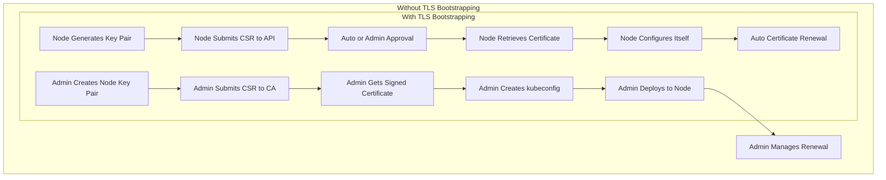
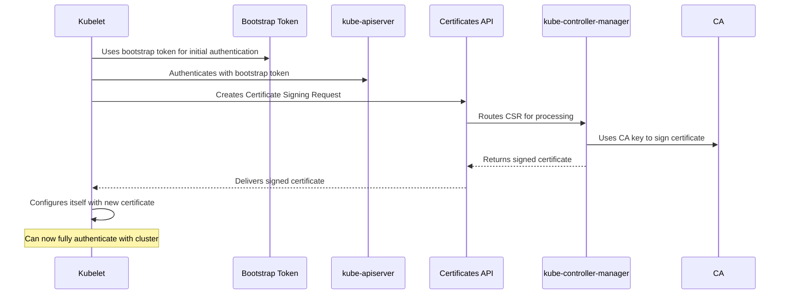
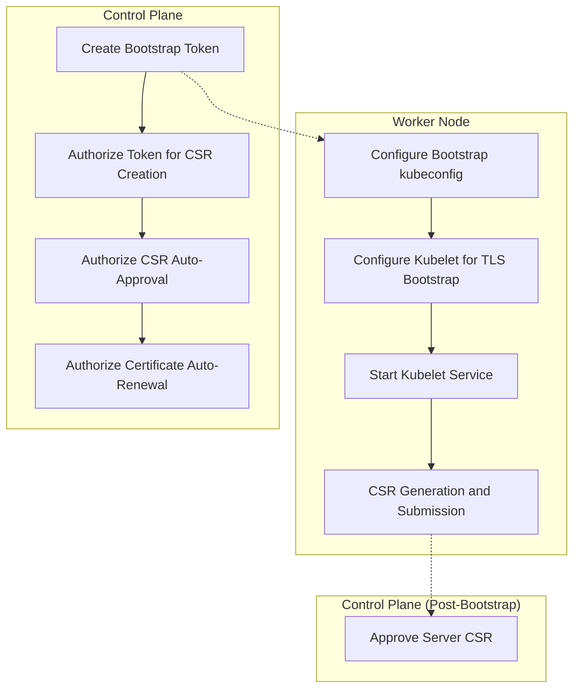
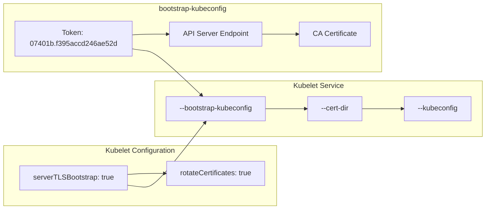

# TLS Bootstrapping
Relevant source files
- [apple-silicon/deploy-virtual-machines.sh](https://github.com/mmumshad/kubernetes-the-hard-way/blob/8218a815/apple-silicon/deploy-virtual-machines.sh)
- [docs/11-tls-bootstrapping-kubernetes-workers.md](https://github.com/mmumshad/kubernetes-the-hard-way/blob/8218a815/docs/11-tls-bootstrapping-kubernetes-workers.md?plain=1)
- [tools/approve-csr.sh](https://github.com/mmumshad/kubernetes-the-hard-way/blob/8218a815/tools/approve-csr.sh)
- [vagrant/Vagrantfile](https://github.com/mmumshad/kubernetes-the-hard-way/blob/8218a815/vagrant/Vagrantfile)

## Purpose and Scope

This document describes the TLS Bootstrapping process for Kubernetes worker nodes. TLS Bootstrapping enables worker nodes to automatically obtain their required certificates instead of requiring manual certificate creation and distribution. This approach is essential for scalable clusters where manually managing certificates for numerous nodes would be impractical.

This page focuses specifically on setting up TLS Bootstrapping for worker nodes in a Kubernetes cluster built from scratch. For general worker node configuration, see [Worker Node Setup](/mmumshad/kubernetes-the-hard-way/5-worker-node-setup) and for detailed information about the Container Runtime installation, see [Container Runtime Installation](/mmumshad/kubernetes-the-hard-way/5.1-container-runtime-installation).

## TLS Bootstrapping Overview

Without TLS Bootstrapping, administrators must:

- Manually create key pairs for each worker node
- Get certificates signed by the Certificate Authority (CA)
- Create kubeconfig files for each node
- Renew certificates when they expire

With TLS Bootstrapping, worker nodes can:

- Generate their own certificate key pairs
- Submit Certificate Signing Requests (CSRs) through the Kubernetes API
- Retrieve signed certificates automatically
- Generate their own kubeconfig files
- Automatically request certificate renewal



Sources: [docs/11-tls-bootstrapping-kubernetes-workers.md3-17](https://github.com/mmumshad/kubernetes-the-hard-way/blob/8218a815/docs/11-tls-bootstrapping-kubernetes-workers.md?plain=1#L3-L17)

## TLS Bootstrapping Architecture

### Components and Communication Flow

TLS Bootstrapping involves several components working together to authenticate worker nodes and provide them with proper certificates.



Sources: [docs/11-tls-bootstrapping-kubernetes-workers.md21-29](https://github.com/mmumshad/kubernetes-the-hard-way/blob/8218a815/docs/11-tls-bootstrapping-kubernetes-workers.md?plain=1#L21-L29)[docs/11-tls-bootstrapping-kubernetes-workers.md262-296](https://github.com/mmumshad/kubernetes-the-hard-way/blob/8218a815/docs/11-tls-bootstrapping-kubernetes-workers.md?plain=1#L262-L296)

### Required Kubernetes Components

For TLS Bootstrapping to function properly, specific configurations are needed:

| Component | Required Configuration | Purpose |
| --- | --- | --- |
| kube-apiserver | `--enable-bootstrap-token-auth=true` | Allows authentication using bootstrap tokens |
| kube-controller-manager | `--cluster-signing-cert-file=/var/lib/kubernetes/ca.crt``--cluster-signing-key-file=/var/lib/kubernetes/ca.key` | Provides access to CA certificate and key for signing CSRs |
| RBAC Configuration | ClusterRoleBindings for certificate creation and approval | Grants necessary permissions to bootstrap tokens |

Sources: [docs/11-tls-bootstrapping-kubernetes-workers.md30-49](https://github.com/mmumshad/kubernetes-the-hard-way/blob/8218a815/docs/11-tls-bootstrapping-kubernetes-workers.md?plain=1#L30-L49)

## Implementation Process

The TLS Bootstrapping implementation involves steps on both control plane and worker nodes:



Sources: [docs/11-tls-bootstrapping-kubernetes-workers.md51-96](https://github.com/mmumshad/kubernetes-the-hard-way/blob/8218a815/docs/11-tls-bootstrapping-kubernetes-workers.md?plain=1#L51-L96)[docs/11-tls-bootstrapping-kubernetes-workers.md262-324](https://github.com/mmumshad/kubernetes-the-hard-way/blob/8218a815/docs/11-tls-bootstrapping-kubernetes-workers.md?plain=1#L262-L324)

### Creating the Bootstrap Token

First, create a bootstrap token on a control plane node. This token serves as the initial authentication mechanism for worker nodes before they obtain their own certificates.

Bootstrap tokens follow the format: `{token-id}.{token-secret}` where:

- `token-id` is a 6-character string
- `token-secret` is a 16-character string
- Both must contain only lowercase ASCII letters and numbers

The token is implemented as a Secret resource in the `kube-system` namespace with specific metadata and configuration.

Sources: [docs/11-tls-bootstrapping-kubernetes-workers.md51-108](https://github.com/mmumshad/kubernetes-the-hard-way/blob/8218a815/docs/11-tls-bootstrapping-kubernetes-workers.md?plain=1#L51-L108)

### Configuring RBAC Permissions

Three cluster role bindings must be created for proper TLS bootstrapping:

1. Permission to create CSRs:

- Binds the `system:node-bootstrapper` ClusterRole to the `system:bootstrappers` group
- Allows nodes to submit certificate signing requests
2. Permission for CSR approval:

- Binds the `system:certificates.k8s.io:certificatesigningrequests:nodeclient` ClusterRole to the `system:bootstrappers` group
- Allows auto-approval of client certificate requests
3. Permission for certificate renewal:

- Binds the `system:certificates.k8s.io:certificatesigningrequests:selfnodeclient` ClusterRole to the `system:nodes` group
- Allows nodes to automatically renew their certificates

Sources: [docs/11-tls-bootstrapping-kubernetes-workers.md110-212](https://github.com/mmumshad/kubernetes-the-hard-way/blob/8218a815/docs/11-tls-bootstrapping-kubernetes-workers.md?plain=1#L110-L212)

### Configuring Worker Nodes for TLS Bootstrapping

On worker nodes, the following components must be configured:

1. **Bootstrap kubeconfig**: A special kubeconfig file containing the bootstrap token, which allows the kubelet to authenticate initially:



1. **Kubelet Configuration**: A configuration file that enables TLS bootstrapping features:

- `serverTLSBootstrap: true` - enables server certificate bootstrap
- `rotateCertificates: true` - enables certificate rotation
2. **Kubelet Service**: Systemd unit configuration that points to the bootstrap kubeconfig and other required settings.

Sources: [docs/11-tls-bootstrapping-kubernetes-workers.md262-391](https://github.com/mmumshad/kubernetes-the-hard-way/blob/8218a815/docs/11-tls-bootstrapping-kubernetes-workers.md?plain=1#L262-L391)

### Certificate Approval Process

After the worker node submits a CSR, an administrator must approve the server certificate request:

1. Worker node generates and submits CSR
2. Control plane stores the pending CSR
3. Admin views the pending CSRs: `kubectl get csr`
4. Admin approves the server CSR: `kubectl certificate approve <csr-name>`

Note that client certificates may be auto-approved, but server certificates require manual approval for security reasons.

Sources: [docs/11-tls-bootstrapping-kubernetes-workers.md465-496](https://github.com/mmumshad/kubernetes-the-hard-way/blob/8218a815/docs/11-tls-bootstrapping-kubernetes-workers.md?plain=1#L465-L496)

## Certificate Lifecycle Management

TLS Bootstrapping implements a complete certificate lifecycle for worker nodes:

```

```

Key aspects of certificate management:

1. **Initial Bootstrapping**:

- Node authenticates using bootstrap token
- CSR is created and submitted to the Kubernetes API
- Admin approves the CSR
- Node retrieves the signed certificate
2. **Certificate Renewal**:

- Certificates have a limited validity period (typically 1 year)
- Kubelet with `rotateCertificates: true` will request new certificates before expiration
- CSRs for renewal are automatically approved if the node has the proper RBAC permissions
3. **Security Considerations**:

- Initial server CSRs require manual approval for security
- The bootstrap token should have a limited lifespan
- Auto-approval is limited to specific certificate types

Sources: [docs/11-tls-bootstrapping-kubernetes-workers.md17-29](https://github.com/mmumshad/kubernetes-the-hard-way/blob/8218a815/docs/11-tls-bootstrapping-kubernetes-workers.md?plain=1#L17-L29)[docs/11-tls-bootstrapping-kubernetes-workers.md493-494](https://github.com/mmumshad/kubernetes-the-hard-way/blob/8218a815/docs/11-tls-bootstrapping-kubernetes-workers.md?plain=1#L493-L494)

## Verification

After setting up TLS bootstrapping, you can verify the worker node has joined the cluster:

1. List registered nodes:

```
kubectl get nodes --kubeconfig admin.kubeconfig

```
2. Check the status of certificates:

```
./cert_verify.sh

```
3. Examine CSRs to see what has been approved:

```
kubectl get csr --kubeconfig admin.kubeconfig

```

Sources: [docs/11-tls-bootstrapping-kubernetes-workers.md497-514](https://github.com/mmumshad/kubernetes-the-hard-way/blob/8218a815/docs/11-tls-bootstrapping-kubernetes-workers.md?plain=1#L497-L514)[tools/approve-csr.sh1-3](https://github.com/mmumshad/kubernetes-the-hard-way/blob/8218a815/tools/approve-csr.sh#L1-L3)

## Troubleshooting

Common issues that may arise during TLS bootstrapping include:

1. **Pending CSRs**: If a node's status remains NotReady, check for pending CSRs that require approval.
2. **Token Expiration**: If the bootstrap token expires before a node is bootstrapped, you'll need to create a new token.
3. **Permission Issues**: If CSRs are not auto-approved, verify the ClusterRoleBindings are correctly configured.
4. **Certificate Renewal**: After 365 days, you may need to manually approve replacement CSRs if auto-renewal fails.

Sources: [docs/11-tls-bootstrapping-kubernetes-workers.md493-496](https://github.com/mmumshad/kubernetes-the-hard-way/blob/8218a815/docs/11-tls-bootstrapping-kubernetes-workers.md?plain=1#L493-L496)