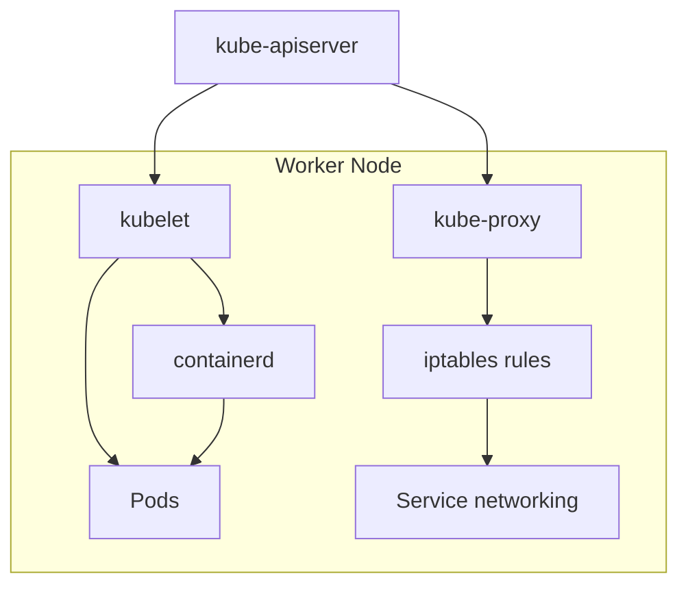
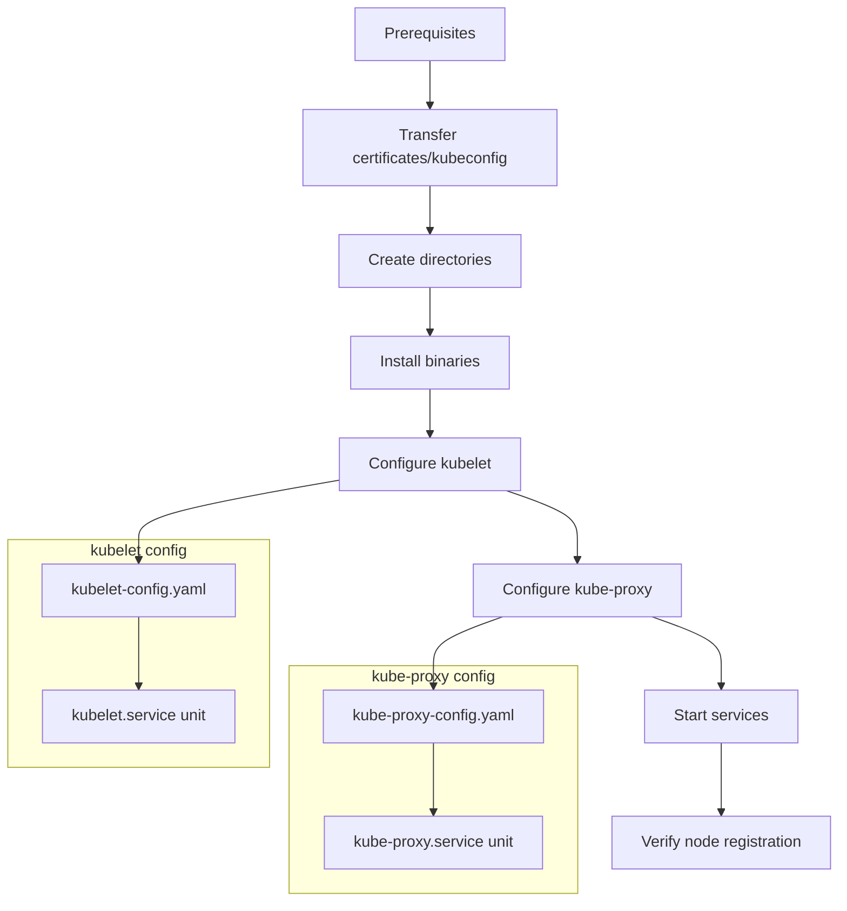
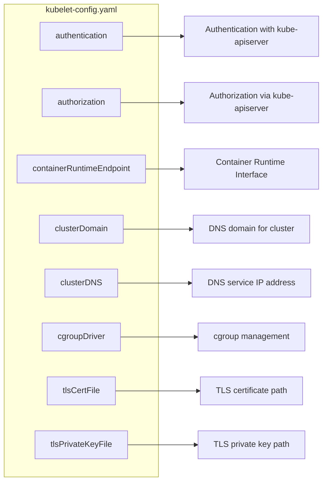
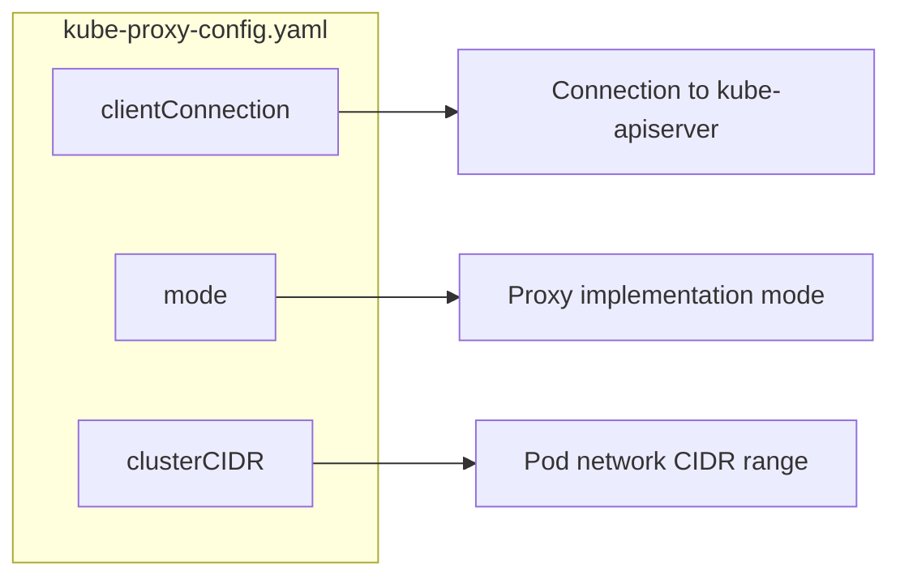

# Kubelet and Kube-proxy Configuration
Relevant source files
- [docs/09-install-cri-workers.md](https://github.com/mmumshad/kubernetes-the-hard-way/blob/8218a815/docs/09-install-cri-workers.md?plain=1)
- [docs/10-bootstrapping-kubernetes-workers.md](https://github.com/mmumshad/kubernetes-the-hard-way/blob/8218a815/docs/10-bootstrapping-kubernetes-workers.md?plain=1)
- [docs/differences-to-original.md](https://github.com/mmumshad/kubernetes-the-hard-way/blob/8218a815/docs/differences-to-original.md?plain=1)
- [vagrant/README.md](https://github.com/mmumshad/kubernetes-the-hard-way/blob/8218a815/vagrant/README.md?plain=1)

This document provides technical guidance for configuring the kubelet and kube-proxy services on Kubernetes worker nodes. These two components are essential for node functionality: kubelet manages pods and containers on the node, while kube-proxy maintains network rules for service connectivity. For information about container runtime installation, see [Container Runtime Installation](/mmumshad/kubernetes-the-hard-way/5.1-container-runtime-installation), and for certificate generation, see [TLS Bootstrapping](/mmumshad/kubernetes-the-hard-way/5.2-tls-bootstrapping).

## Component Overview

### Kubelet and Kube-proxy in the Node Architecture



Sources: [docs/10-bootstrapping-kubernetes-workers.md5-7](https://github.com/mmumshad/kubernetes-the-hard-way/blob/8218a815/docs/10-bootstrapping-kubernetes-workers.md?plain=1#L5-L7)

### Configuration Workflow



Sources: [docs/10-bootstrapping-kubernetes-workers.md9-29](https://github.com/mmumshad/kubernetes-the-hard-way/blob/8218a815/docs/10-bootstrapping-kubernetes-workers.md?plain=1#L9-L29)[docs/10-bootstrapping-kubernetes-workers.md95-304](https://github.com/mmumshad/kubernetes-the-hard-way/blob/8218a815/docs/10-bootstrapping-kubernetes-workers.md?plain=1#L95-L304)

## Prerequisites and Setup

Before configuring kubelet and kube-proxy, ensure the following prerequisites are met:

1. Container runtime (containerd) is installed on worker nodes
2. Required kernel modules (overlay, br_netfilter) are loaded
3. Necessary certificates and kubeconfig files are generated for each worker node

| Required Files | Purpose |
| --- | --- |
| `ca.crt` | Root certificate authority for verifying other certificates |
| `<node-name>.crt` | Node identity certificate |
| `<node-name>.key` | Node private key |
| `<node-name>.kubeconfig` | Kubelet configuration for API server access |
| `kube-proxy.kubeconfig` | Kube-proxy configuration for API server access |

Sources: [docs/10-bootstrapping-kubernetes-workers.md11-12](https://github.com/mmumshad/kubernetes-the-hard-way/blob/8218a815/docs/10-bootstrapping-kubernetes-workers.md?plain=1#L11-L12)[docs/09-install-cri-workers.md25-36](https://github.com/mmumshad/kubernetes-the-hard-way/blob/8218a815/docs/09-install-cri-workers.md?plain=1#L25-L36)

### Directory Structure

The following directories must be created on each worker node:

```
/var/lib/kubelet            # Kubelet configuration and state
/var/lib/kube-proxy         # Kube-proxy configuration
/var/lib/kubernetes/pki     # Certificates and keys
/var/run/kubernetes         # Runtime files

```

Sources: [docs/10-bootstrapping-kubernetes-workers.md122-128](https://github.com/mmumshad/kubernetes-the-hard-way/blob/8218a815/docs/10-bootstrapping-kubernetes-workers.md?plain=1#L122-L128)

## Worker Node Binaries

Download and install the kubelet and kube-proxy binaries:

1. Determine the latest stable Kubernetes version
2. Download the binaries for your architecture
3. Make them executable and install to `/usr/local/bin/`

Sources: [docs/10-bootstrapping-kubernetes-workers.md110-137](https://github.com/mmumshad/kubernetes-the-hard-way/blob/8218a815/docs/10-bootstrapping-kubernetes-workers.md?plain=1#L110-L137)

## Kubelet Configuration

Kubelet requires two main configuration files:

### 1. kubelet-config.yaml

This YAML file defines the kubelet's behavior as a KubeletConfiguration object:



Key configuration points:

- Authentication uses x509 client certificates and webhook to API server
- Authorization mode set to Webhook, delegating authorization decisions to API server
- Container runtime endpoint points to containerd socket
- Cluster DNS is configured to the standard service IP (usually 10.96.0.10)
- cgroup driver must match containerd's configuration (systemd)
- TLS certificate and key paths for secure communication

Sources: [docs/10-bootstrapping-kubernetes-workers.md176-198](https://github.com/mmumshad/kubernetes-the-hard-way/blob/8218a815/docs/10-bootstrapping-kubernetes-workers.md?plain=1#L176-L198)

### 2. kubelet.service (systemd unit)

The systemd unit file defines how kubelet runs as a service:

```
[Unit]
Description=Kubernetes Kubelet
Documentation=https://github.com/kubernetes/kubernetes
After=containerd.service
Requires=containerd.service

[Service]
ExecStart=/usr/local/bin/kubelet \
  --config=/var/lib/kubelet/kubelet-config.yaml \
  --kubeconfig=/var/lib/kubelet/kubelet.kubeconfig \
  --node-ip=${PRIMARY_IP} \
  --v=2
Restart=on-failure
RestartSec=5

[Install]
WantedBy=multi-user.target

```

Key features:

- Requires containerd service to be running first
- References the configuration YAML file
- Specifies the kubeconfig file for API server authentication
- Sets node IP explicitly to ensure proper networking
- Configures automatic restart on failure

Sources: [docs/10-bootstrapping-kubernetes-workers.md205-224](https://github.com/mmumshad/kubernetes-the-hard-way/blob/8218a815/docs/10-bootstrapping-kubernetes-workers.md?plain=1#L205-L224)

## Kube-proxy Configuration

Kube-proxy also requires two main configuration files:

### 1. kube-proxy-config.yaml

This YAML file defines the kube-proxy's behavior as a KubeProxyConfiguration object:



Key configuration points:

- Client connection details specify how to connect to the API server
- Proxy mode is set to iptables (alternatives include ipvs)
- Cluster CIDR defines the IP range for pods, necessary for correct proxying

Sources: [docs/10-bootstrapping-kubernetes-workers.md240-247](https://github.com/mmumshad/kubernetes-the-hard-way/blob/8218a815/docs/10-bootstrapping-kubernetes-workers.md?plain=1#L240-L247)

### 2. kube-proxy.service (systemd unit)

The systemd unit file defines how kube-proxy runs as a service:

```
[Unit]
Description=Kubernetes Kube Proxy
Documentation=https://github.com/kubernetes/kubernetes

[Service]
ExecStart=/usr/local/bin/kube-proxy \
  --config=/var/lib/kube-proxy/kube-proxy-config.yaml
Restart=on-failure
RestartSec=5

[Install]
WantedBy=multi-user.target

```

Key features:

- References the configuration YAML file
- Configures automatic restart on failure
- Doesn't have dependencies on other services

Sources: [docs/10-bootstrapping-kubernetes-workers.md252-266](https://github.com/mmumshad/kubernetes-the-hard-way/blob/8218a815/docs/10-bootstrapping-kubernetes-workers.md?plain=1#L252-L266)

## Starting Services and Verification

After configuration is complete:

1. Reload systemd daemon
2. Enable both services to start automatically on boot
3. Start both services

```
sudo systemctl daemon-reload
sudo systemctl enable kubelet kube-proxy
sudo systemctl start kubelet kube-proxy
```

### Verification

From a control plane node, verify that the worker node has registered:

```
kubectl get nodes --kubeconfig admin.kubeconfig
```

Expected output:

```
NAME       STATUS     ROLES    AGE   VERSION
node01     NotReady   <none>   93s   v1.28.4

```

Note: The node will initially show as `NotReady` until pod networking is configured in a later step.

Sources: [docs/10-bootstrapping-kubernetes-workers.md284-313](https://github.com/mmumshad/kubernetes-the-hard-way/blob/8218a815/docs/10-bootstrapping-kubernetes-workers.md?plain=1#L284-L313)

## System Requirements and Kernel Parameters

Worker nodes require specific kernel parameters for proper operation:

| Parameter | Value | Purpose |
| --- | --- | --- |
| `net.bridge.bridge-nf-call-iptables` | 1 | Allow iptables to see bridged traffic |
| `net.bridge.bridge-nf-call-ip6tables` | 1 | Allow iptables to see IPv6 bridged traffic |
| `net.ipv4.ip_forward` | 1 | Enable IP forwarding for pod communication |

Required kernel modules:

- `overlay` - For overlay filesystem used by container runtime
- `br_netfilter` - For bridge networking

Sources: [docs/09-install-cri-workers.md25-49](https://github.com/mmumshad/kubernetes-the-hard-way/blob/8218a815/docs/09-install-cri-workers.md?plain=1#L25-L49)[vagrant/README.md9-10](https://github.com/mmumshad/kubernetes-the-hard-way/blob/8218a815/vagrant/README.md?plain=1#L9-L10)