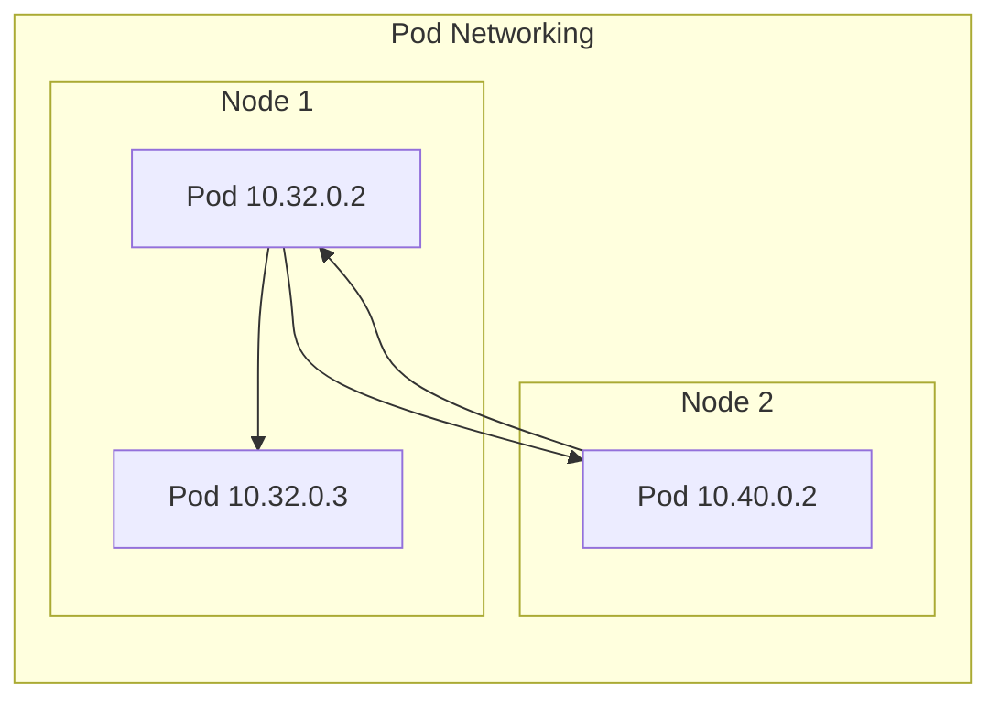
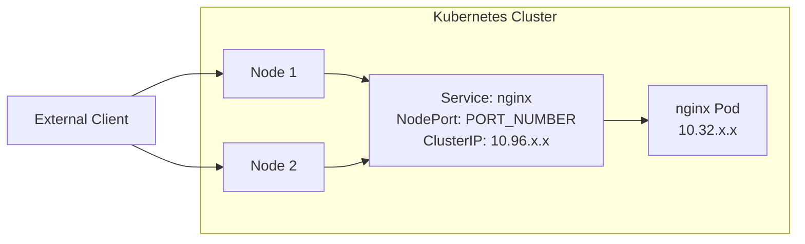
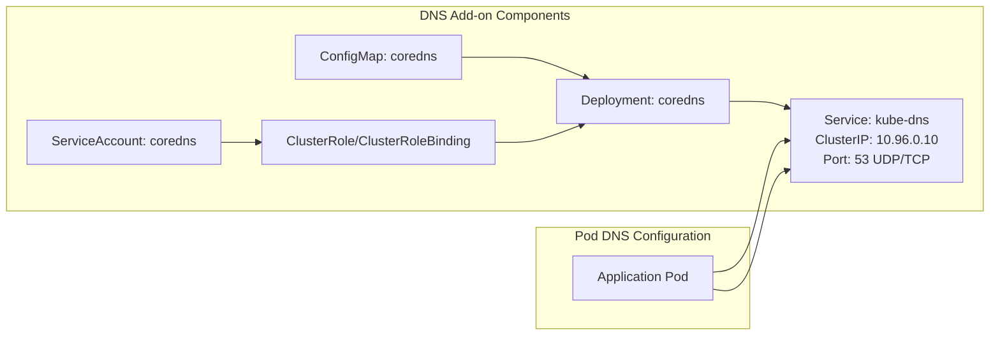
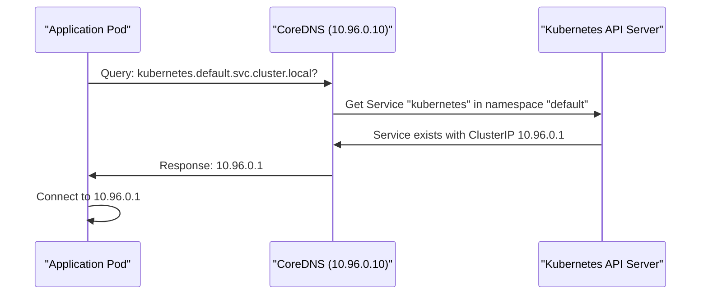
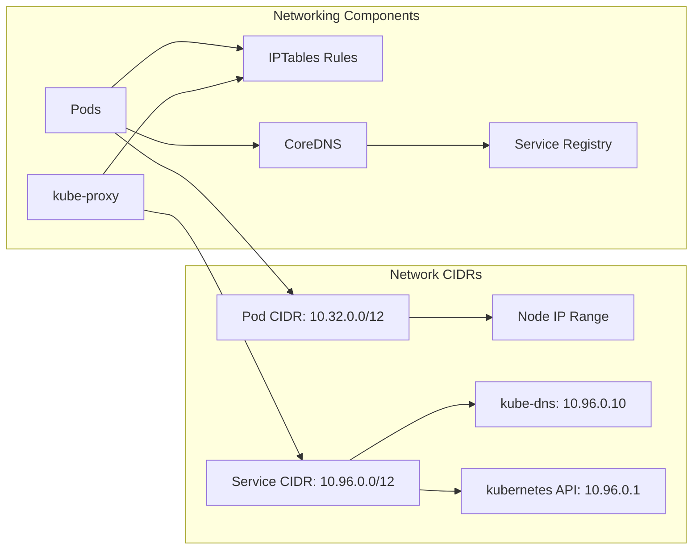

# Networking and Add-ons
Relevant source files
- [deployments/kube-dns.yaml](https://github.com/mmumshad/kubernetes-the-hard-way/blob/8218a815/deployments/kube-dns.yaml)
- [docs/15-dns-addon.md](https://github.com/mmumshad/kubernetes-the-hard-way/blob/8218a815/docs/15-dns-addon.md?plain=1)
- [docs/16-smoke-test.md](https://github.com/mmumshad/kubernetes-the-hard-way/blob/8218a815/docs/16-smoke-test.md?plain=1)
- [docs/17-e2e-tests.md](https://github.com/mmumshad/kubernetes-the-hard-way/blob/8218a815/docs/17-e2e-tests.md?plain=1)
- [tools/lab-script-generator.py](https://github.com/mmumshad/kubernetes-the-hard-way/blob/8218a815/tools/lab-script-generator.py)

This document covers the configuration of networking infrastructure and essential add-ons in the Kubernetes cluster deployed using the "hard way" method. It focuses on pod networking, service networking, and the DNS add-on which enables service discovery within the cluster. For information about cluster certificate management and security, see [Security Infrastructure](/mmumshad/kubernetes-the-hard-way/3-security-infrastructure). For details about verifying the networking functionality, see [Testing and Verification](/mmumshad/kubernetes-the-hard-way/7-testing-and-verification).

## Pod Network Configuration

In Kubernetes, a flat networking model is implemented where pods receive unique IP addresses from a configured CIDR range, and all pods can communicate with each other without NAT (Network Address Translation). When deploying a Kubernetes cluster, a specific pod CIDR range is allocated to ensure each pod gets a unique IP address.

Sources: [docs/16-smoke-test.md133-137](https://github.com/mmumshad/kubernetes-the-hard-way/blob/8218a815/docs/16-smoke-test.md?plain=1#L133-L137)

## Service Networking

Services in Kubernetes provide a stable endpoint for accessing a set of pods. Each service is assigned a virtual IP (ClusterIP) from the service CIDR range (typically 10.96.0.0/12). The kube-proxy component running on each node implements the service abstraction by setting up appropriate network rules.

### Types of Services

| Service Type | Description | Use Case |
| --- | --- | --- |
| ClusterIP | Virtual IP only accessible within cluster | Internal microservices |
| NodePort | Exposes service on each Node's IP at a static port | External access via node IP |
| LoadBalancer | Exposes service externally using a cloud provider's load balancer | Production external access |

The smoke test in the repository demonstrates creating a NodePort service to expose the nginx deployment and verifying external access through the node IP addresses.

Sources: [docs/16-smoke-test.md82-103](https://github.com/mmumshad/kubernetes-the-hard-way/blob/8218a815/docs/16-smoke-test.md?plain=1#L82-L103)

## DNS Add-on Setup

The DNS add-on is essential for service discovery within the Kubernetes cluster, allowing pods to locate other services using DNS names instead of hardcoded IP addresses. The repository uses CoreDNS as the DNS provider.

### CoreDNS Deployment

CoreDNS is deployed as a standard Kubernetes application with the following components:

1. ServiceAccount with appropriate RBAC permissions
2. ConfigMap containing CoreDNS configuration
3. Deployment running CoreDNS containers
4. Service named "kube-dns" with a fixed ClusterIP (10.96.0.10)

The CoreDNS service listens on port 53 for both TCP and UDP to handle DNS queries from pods in the cluster.

Sources: [docs/15-dns-addon.md9-26](https://github.com/mmumshad/kubernetes-the-hard-way/blob/8218a815/docs/15-dns-addon.md?plain=1#L9-L26)[deployments/kube-dns.yaml15-36](https://github.com/mmumshad/kubernetes-the-hard-way/blob/8218a815/deployments/kube-dns.yaml#L15-L36)

### DNS Resolution Process

When a pod needs to resolve a service name, the following process occurs:

1. Pod sends DNS query to the DNS service (10.96.0.10)
2. CoreDNS receives the query and looks up the service in the Kubernetes API
3. If the service exists, CoreDNS returns the ClusterIP associated with the service
4. The pod can then connect to the service using the resolved IP address

Sources: [docs/15-dns-addon.md71-84](https://github.com/mmumshad/kubernetes-the-hard-way/blob/8218a815/docs/15-dns-addon.md?plain=1#L71-L84)

## Verifying DNS Setup

The repository includes a verification procedure using a busybox pod to ensure DNS resolution works correctly:

1. Deploy a busybox pod
2. Execute a DNS lookup command for the `kubernetes` service
3. Verify that the service resolves to the correct ClusterIP

The expected output shows:

- The DNS server is correctly identified as 10.96.0.10 (kube-dns.kube-system.svc.cluster.local)
- The kubernetes service resolves to 10.96.0.1 (kubernetes.default.svc.cluster.local)

Sources: [docs/15-dns-addon.md47-84](https://github.com/mmumshad/kubernetes-the-hard-way/blob/8218a815/docs/15-dns-addon.md?plain=1#L47-L84)

## End-to-End Network Testing

The repository includes smoke tests to verify network connectivity and service functionality:

1. Creating a deployment (nginx)
2. Exposing it as a NodePort service
3. Verifying external access to the service via node IPs
4. Retrieving logs to confirm access

This ensures that the complete networking stack, from pod creation to external access, functions correctly.

Sources: [docs/16-smoke-test.md57-103](https://github.com/mmumshad/kubernetes-the-hard-way/blob/8218a815/docs/16-smoke-test.md?plain=1#L57-L103)

## Alternative DNS Add-ons

While the repository primarily uses CoreDNS, older Kubernetes clusters might use kube-dns. The repository includes a kube-dns.yaml configuration as an alternative.

The kube-dns deployment consists of three containers:

1. `kubedns`: Main DNS service
2. `dnsmasq`: DNS cache and forwarder
3. `sidecar`: Health checking and metrics

Sources: [deployments/kube-dns.yaml54-207](https://github.com/mmumshad/kubernetes-the-hard-way/blob/8218a815/deployments/kube-dns.yaml#L54-L207)

## Comprehensive Network Architecture

The overall networking architecture of the Kubernetes cluster includes several components working together:

Sources: [docs/15-dns-addon.md](https://github.com/mmumshad/kubernetes-the-hard-way/blob/8218a815/docs/15-dns-addon.md?plain=1)[docs/16-smoke-test.md](https://github.com/mmumshad/kubernetes-the-hard-way/blob/8218a815/docs/16-smoke-test.md?plain=1)

This document covered the essential networking components in a Kubernetes cluster built "the hard way." The networking infrastructure enables communication between pods, provides stable service endpoints, and implements DNS-based service discovery, forming the foundation for running distributed applications in the cluster.