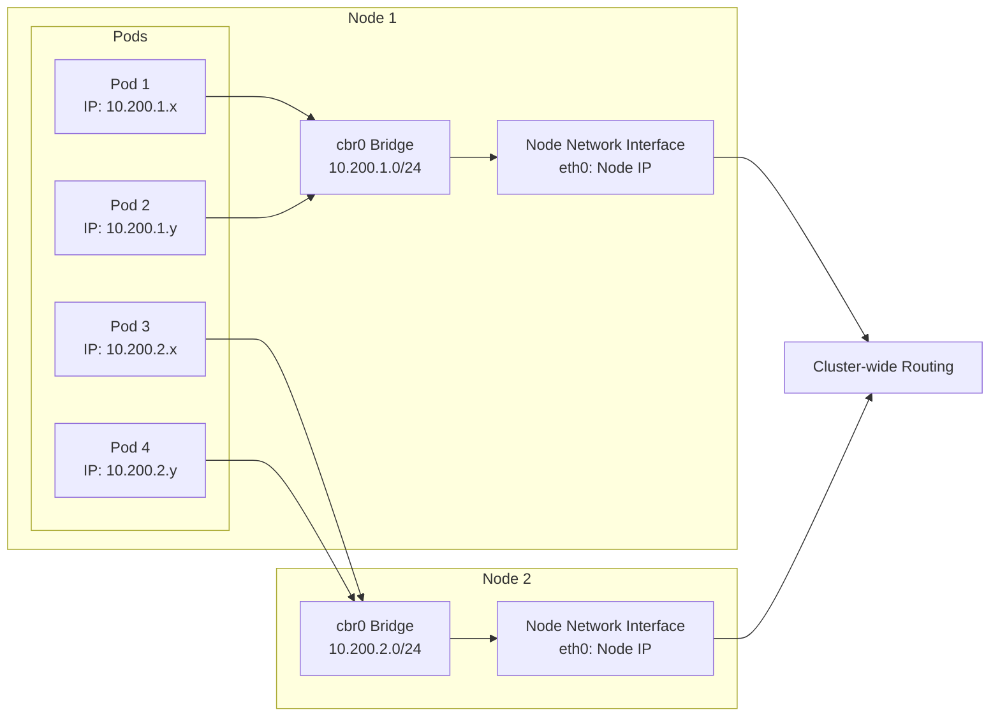
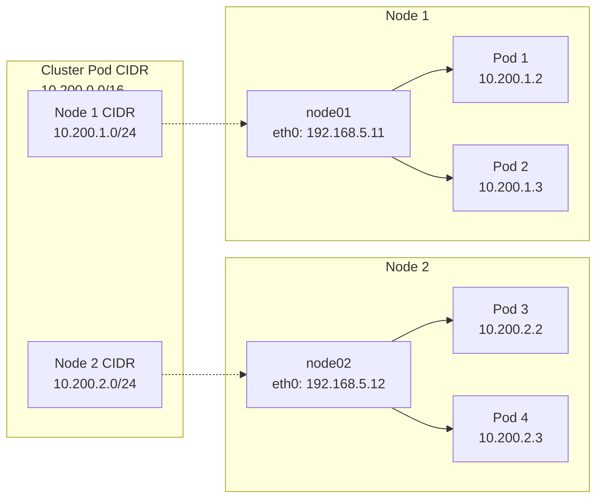
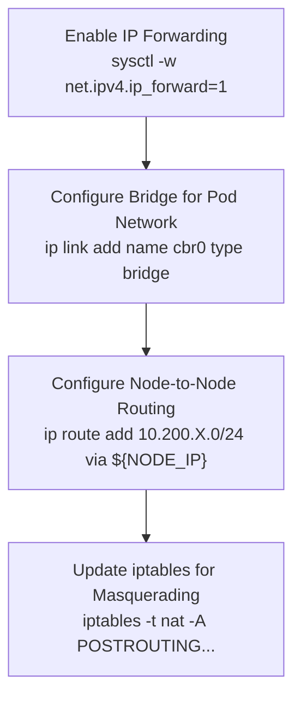
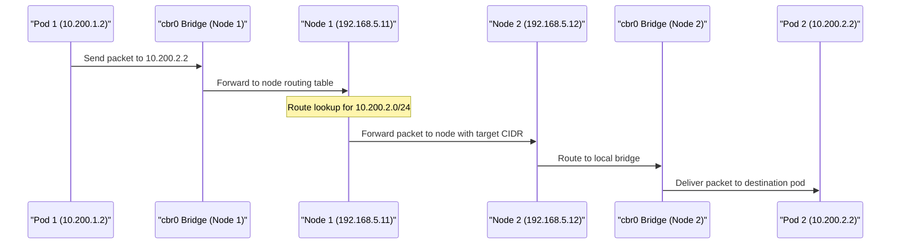
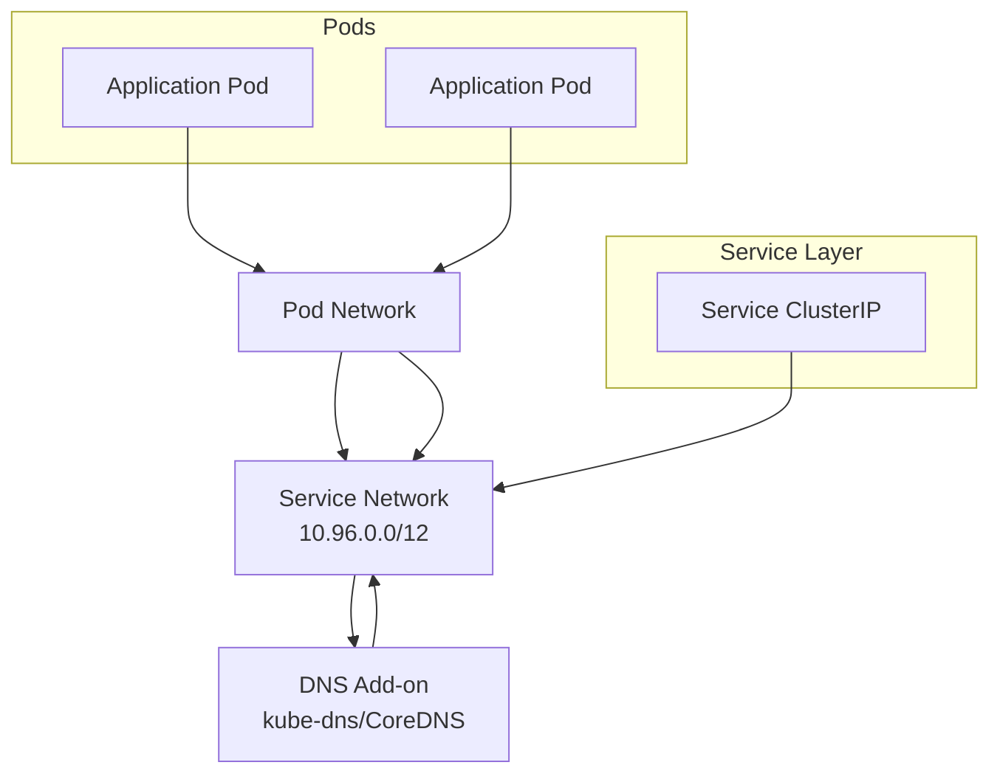

# Pod Network Configuration
Relevant source files
- [deployments/kube-dns.yaml](https://github.com/mmumshad/kubernetes-the-hard-way/blob/8218a815/deployments/kube-dns.yaml)

## Purpose and Scope

This document explains how to configure networking for Kubernetes pods within the cluster built through the "Kubernetes The Hard Way" tutorial. Pod networking enables containers in different pods to communicate with each other across worker nodes. This page focuses specifically on configuring the pod-to-pod communication layer. For information about service networking, see [Service Networking](/mmumshad/kubernetes-the-hard-way/6.3-service-networking), and for DNS configuration, see [DNS Add-on Setup](/mmumshad/kubernetes-the-hard-way/6.2-dns-add-on-setup).

## Pod Networking Fundamentals

In Kubernetes, pods require a network that allows them to:

- Communicate with each other without NAT
- Communicate with nodes in the cluster
- Maintain unique IP addresses within the cluster

The Kubernetes networking model requires all pods to have a unique IP address within the cluster network and be able to communicate with all other pods without using Network Address Translation (NAT).



**Diagram: Pod Networking Architecture**

Sources: N/A (based on Kubernetes networking principles)

## Pod CIDR Configuration

In this tutorial, each Kubernetes worker node is allocated a subnet from the Pod CIDR range for the cluster. Each pod gets an IP address from the node's subnet allocation.



**Diagram: Pod CIDR Allocation**

Sources: N/A (based on Kubernetes networking principles)

## Network Plugin Configuration

In the "Kubernetes the Hard Way" tutorial, we use a simple networking solution that configures Linux bridge devices and routing rules to support the Kubernetes networking model. This is done without relying on complex CNI plugins like Calico, Flannel, or Weave Net, which would normally handle this in a production environment.

### Worker Node Routing Configuration

Each worker node requires routing configuration to forward traffic destined for pod CIDRs to the appropriate node. This is accomplished through:

1. IP forwarding enablement
2. Bridge network interface configuration
3. Routing table updates



**Diagram: Network Configuration Steps**

Sources: N/A (based on Kubernetes networking principles)

## Pod-to-Pod Communication Flow

When a pod on one node needs to communicate with a pod on another node, the following network path is followed:



**Diagram: Pod-to-Pod Communication Flow**

Sources: N/A (based on Kubernetes networking principles)

## Kubelet Configuration for Pod Networking

The Kubelet on each worker node must be configured with the appropriate pod CIDR range. This is done through the Kubelet configuration file, specifying the `--pod-cidr` flag:

```
--pod-cidr=10.200.X.0/24

```

Where `X` is unique for each node (e.g., 1 for node01, 2 for node02).

## Verification of Pod Network Configuration

After configuring pod networking, you should verify that pods can communicate with each other across nodes by:

1. Creating test pods on different nodes
2. Testing connectivity between pods
3. Verifying pods can reach external networks

### Testing Pod-to-Pod Communication

Create pods on different nodes and test connectivity using tools like `ping` and `curl`:

```
kubectl run -it --rm test-pod1 --image=busybox -- /bin/sh
# From inside the pod
ping 10.200.2.2  # IP of a pod on another node

```

## Relationship with Other Network Components

The pod network serves as the foundation for other Kubernetes networking features:



**Diagram: Network Component Relationships**

Sources: N/A (based on Kubernetes networking principles)

## Troubleshooting Pod Networking

Common issues when setting up pod networking include:

| Issue | Possible Causes | Troubleshooting Steps |
| --- | --- | --- |
| Pods cannot communicate across nodes | Incorrect routing rules | Verify routes with `ip route` |
|  | IP forwarding disabled | Check `sysctl net.ipv4.ip_forward` |
|  | Firewall rules blocking traffic | Check iptables rules |
| Pods cannot reach external networks | Missing NAT rules | Verify POSTROUTING rules in iptables |
|  | Incorrect default gateway | Check pod's routing table |
| DNS resolution failures | kube-dns/CoreDNS not functioning | Check DNS service and pods |

When troubleshooting, inspect node routing tables, network interfaces, and iptables rules:

```
# Check routing table
ip route

# Examine network interfaces
ip addr

# View iptables rules
iptables -L -t nat

```

## Summary

The pod network configuration in "Kubernetes the Hard Way" establishes the foundational networking layer that enables pod-to-pod communication across worker nodes. Proper configuration ensures that:

1. Each pod has a unique IP within the cluster
2. Pods can communicate directly without NAT
3. Pods on different nodes can discover and reach each other

After configuring pod networking, you can proceed to set up the [DNS Add-on](/mmumshad/kubernetes-the-hard-way/6.2-dns-add-on-setup) and [Service Networking](/mmumshad/kubernetes-the-hard-way/6.3-service-networking).