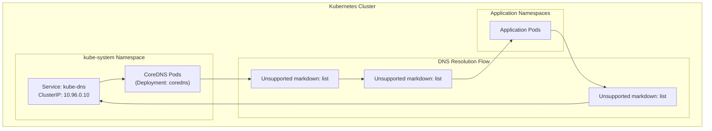
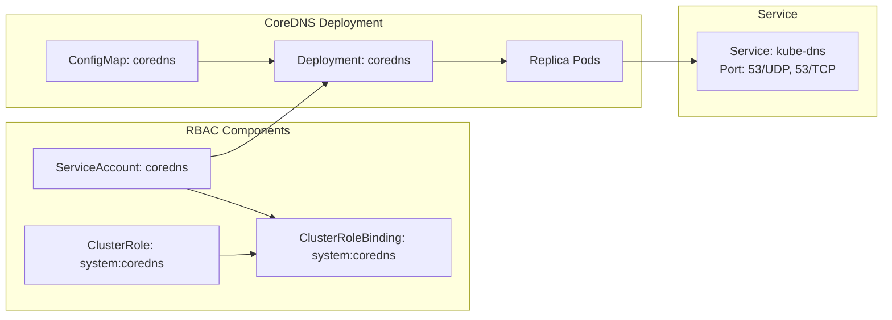
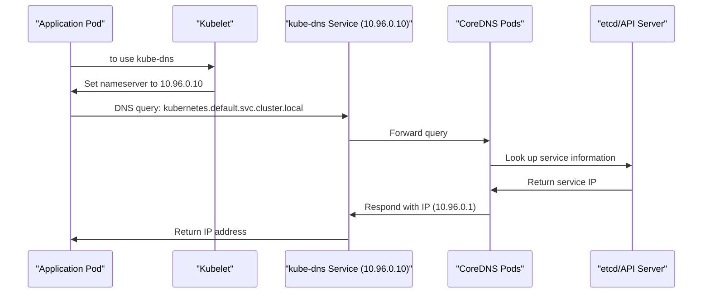

# DNS Add-on Setup
Relevant source files
- [docs/15-dns-addon.md](https://github.com/mmumshad/kubernetes-the-hard-way/blob/8218a815/docs/15-dns-addon.md?plain=1)
- [docs/16-smoke-test.md](https://github.com/mmumshad/kubernetes-the-hard-way/blob/8218a815/docs/16-smoke-test.md?plain=1)
- [docs/17-e2e-tests.md](https://github.com/mmumshad/kubernetes-the-hard-way/blob/8218a815/docs/17-e2e-tests.md?plain=1)
- [tools/lab-script-generator.py](https://github.com/mmumshad/kubernetes-the-hard-way/blob/8218a815/tools/lab-script-generator.py)

## Introduction and Purpose

This document details the deployment and verification of the DNS add-on in a Kubernetes cluster deployed "the hard way." The DNS add-on provides DNS-based service discovery capabilities to applications running within the Kubernetes cluster and is a critical component for service-to-service communication. In this implementation, we use [CoreDNS](https://coredns.io/) to provide DNS services.

For information about Pod Network Configuration, see [Pod Network Configuration](/mmumshad/kubernetes-the-hard-way/6.1-pod-network-configuration).
For information about Service Networking, see [Service Networking](/mmumshad/kubernetes-the-hard-way/6.3-service-networking).

Sources: [docs/15-dns-addon.md1-3](https://github.com/mmumshad/kubernetes-the-hard-way/blob/8218a815/docs/15-dns-addon.md?plain=1#L1-L3)

## Architecture Overview

### DNS Service in Kubernetes



CoreDNS serves as the DNS provider in the Kubernetes cluster, deployed as a set of pods managed by a Deployment in the `kube-system` namespace. It's exposed through a service named `kube-dns` with a fixed ClusterIP (typically 10.96.0.10), which is configured in each pod's `/etc/resolv.conf` file by the kubelet.

Sources: [docs/15-dns-addon.md1-3](https://github.com/mmumshad/kubernetes-the-hard-way/blob/8218a815/docs/15-dns-addon.md?plain=1#L1-L3)[docs/15-dns-addon.md77-84](https://github.com/mmumshad/kubernetes-the-hard-way/blob/8218a815/docs/15-dns-addon.md?plain=1#L77-L84)

### CoreDNS Components in Kubernetes



The CoreDNS deployment consists of several Kubernetes resources:

- A Deployment that manages the CoreDNS pods
- A ConfigMap containing the CoreDNS configuration (Corefile)
- RBAC components (ServiceAccount, ClusterRole, ClusterRoleBinding) for proper permissions
- A Service named `kube-dns` that exposes CoreDNS to the cluster on port 53

Sources: [docs/15-dns-addon.md9-25](https://github.com/mmumshad/kubernetes-the-hard-way/blob/8218a815/docs/15-dns-addon.md?plain=1#L9-L25)

## Deployment Process

### Deploying CoreDNS Add-on

To deploy the CoreDNS add-on, apply the provided YAML manifest:

```
kubectl apply -f https://raw.githubusercontent.com/mmumshad/kubernetes-the-hard-way/master/deployments/coredns.yaml
```

This manifest creates the following resources:

- ServiceAccount: `coredns`
- ClusterRole: `system:coredns`
- ClusterRoleBinding: `system:coredns`
- ConfigMap: `coredns`
- Deployment: `coredns`
- Service: `kube-dns`

Sources: [docs/15-dns-addon.md9-26](https://github.com/mmumshad/kubernetes-the-hard-way/blob/8218a815/docs/15-dns-addon.md?plain=1#L9-L26)

### Verifying Deployment

After deploying the CoreDNS add-on, you should verify that the pods are running:

```
kubectl get pods -l k8s-app=kube-dns -n kube-system
```

You should see output similar to:

| NAME | READY | STATUS | RESTARTS | AGE |
| --- | --- | --- | --- | --- |
| coredns-699f8ddd77-94qv9 | 1/1 | Running | 0 | 20s |
| coredns-699f8ddd77-gtcgb | 1/1 | Running | 0 | 20s |

The deployment creates two replicas of the CoreDNS pod for high availability.

Sources: [docs/15-dns-addon.md28-42](https://github.com/mmumshad/kubernetes-the-hard-way/blob/8218a815/docs/15-dns-addon.md?plain=1#L28-L42)

## Verification

### Testing DNS Resolution

To verify that the DNS add-on is working correctly, you can create a test pod and perform a DNS lookup:

1. Create a busybox pod:

```
kubectl run busybox -n default --image=busybox:1.28 --restart Never --command -- sleep 180
```

1. Verify the pod is running:

```
kubectl get pods -n default -l run=busybox
```

1. Execute a DNS lookup for the `kubernetes` service inside the busybox pod:

```
kubectl exec -ti -n default busybox -- nslookup kubernetes
```

You should see output similar to:

```
Server:    10.96.0.10
Address 1: 10.96.0.10 kube-dns.kube-system.svc.cluster.local

Name:      kubernetes
Address 1: 10.96.0.1 kubernetes.default.svc.cluster.local

```

This output indicates that:

- The DNS query is being resolved by the CoreDNS service (kube-dns) at 10.96.0.10
- The `kubernetes` service resolves to 10.96.0.1
- The DNS domain structure (`cluster.local`) is correctly configured

Sources: [docs/15-dns-addon.md47-84](https://github.com/mmumshad/kubernetes-the-hard-way/blob/8218a815/docs/15-dns-addon.md?plain=1#L47-L84)

### DNS Request Flow



When an application pod needs to access a service by its DNS name, the request flows through the CoreDNS system as shown in the diagram above. The kubelet configures each pod's DNS settings to use the CoreDNS service, allowing service discovery throughout the cluster.

Sources: [docs/15-dns-addon.md77-84](https://github.com/mmumshad/kubernetes-the-hard-way/blob/8218a815/docs/15-dns-addon.md?plain=1#L77-L84)

## Cleaning Up

After verifying DNS functionality, you may want to clean up the test pod:

```
kubectl delete pod -n default busybox
```

Sources: [docs/16-smoke-test.md158-162](https://github.com/mmumshad/kubernetes-the-hard-way/blob/8218a815/docs/16-smoke-test.md?plain=1#L158-L162)

## Next Steps

With the DNS add-on deployed and verified, your Kubernetes cluster now has internal service discovery capabilities. Applications can now communicate with other services using DNS names instead of IP addresses, making your deployments more flexible and maintainable.

For testing the full functionality of your cluster, including the DNS components, proceed to the [Smoke Test](#16) documentation.

Sources: [docs/15-dns-addon.md86-87](https://github.com/mmumshad/kubernetes-the-hard-way/blob/8218a815/docs/15-dns-addon.md?plain=1#L86-L87)