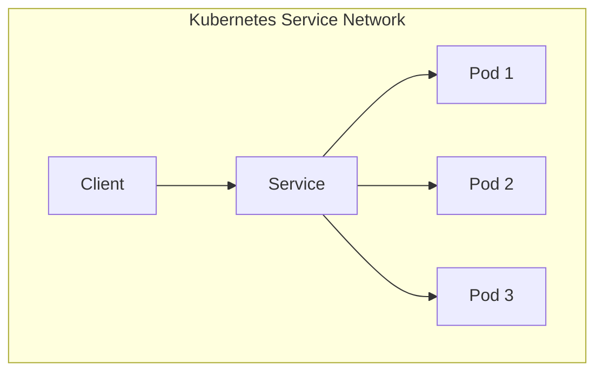
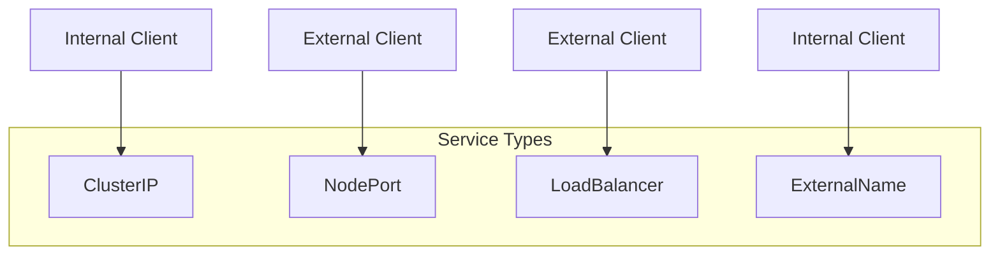
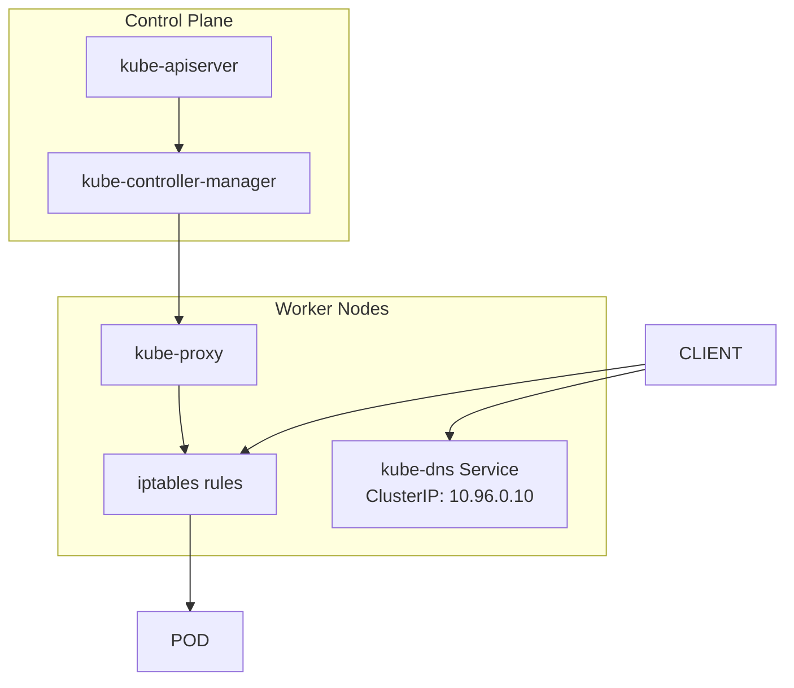
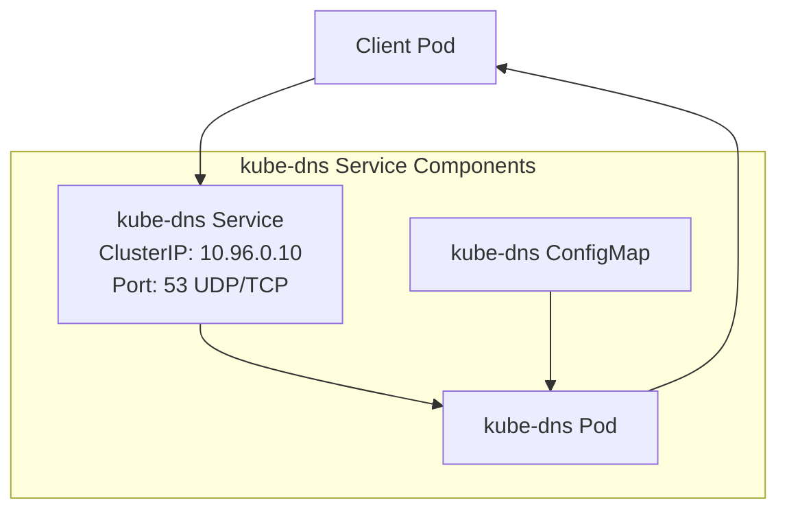
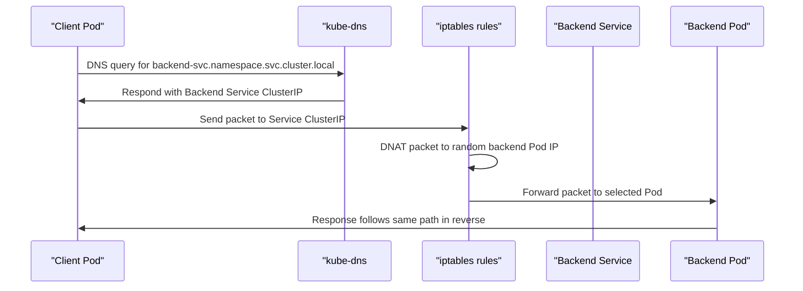

# Service Networking
Relevant source files
- [deployments/kube-dns.yaml](https://github.com/mmumshad/kubernetes-the-hard-way/blob/8218a815/deployments/kube-dns.yaml)

## Purpose and Scope

This document explains how Service networking is implemented in the Kubernetes cluster. It covers the architecture of Kubernetes Services, their IP address allocation, and how they enable network access to pods. For information about basic pod networking, see [Pod Network Configuration](/mmumshad/kubernetes-the-hard-way/6.1-pod-network-configuration), and for DNS configuration, see [DNS Add-on Setup](/mmumshad/kubernetes-the-hard-way/6.2-dns-add-on-setup).

## Introduction to Kubernetes Services

Kubernetes Services provide a stable network identity and endpoint for accessing a dynamic set of pods. Services abstract the underlying pod infrastructure, ensuring that client traffic is routed to the appropriate pods even as they are created, terminated, or rescheduled.



Sources: `deployments/kube-dns.yaml`

## Service IP Address Allocation

### Service CIDR Range

In our Kubernetes deployment, Services are allocated IP addresses from a dedicated CIDR block separate from the Pod network. By default, this cluster uses `10.96.0.0/12` as the Service CIDR, allowing for approximately 1 million Service IP addresses. The kube-apiserver is configured with this range via the `--service-cluster-ip-range` flag.

The most important service in our cluster, kube-dns, is assigned a specific ClusterIP:

```
clusterIP: 10.96.0.10

```

Sources: `deployments/kube-dns.yaml:28`

### Service Types

While this implementation focuses primarily on ClusterIP services (internal-only), Kubernetes supports multiple service types:



## Service Implementation Architecture

The service networking implementation consists of several key components that work together:



Sources: `deployments/kube-dns.yaml`

## kube-proxy

The kube-proxy daemon runs on each node and is responsible for implementing the Service abstraction. It watches the Kubernetes API for new Services and endpoints, and updates the node's iptables rules to route traffic to the appropriate pods.

In our implementation, kube-proxy runs in iptables mode (the default), which creates iptables rules that capture traffic to Service ClusterIPs and redirect them to the appropriate backend pods.

## DNS For Services

### kube-dns Service Configuration

The kube-dns service provides DNS resolution for Kubernetes services. It allows pods to discover and connect to services using domain names instead of IP addresses.

The kube-dns service is defined with a specific ClusterIP:



Sources: `deployments/kube-dns.yaml:15-35`

The kube-dns service is defined with:

- ClusterIP: 10.96.0.10
- Ports: 53 for both UDP and TCP protocols
- Labels for service discovery and management

Sources: `deployments/kube-dns.yaml:15-35`

### DNS Resolution Process

When a pod needs to connect to a service, it sends a DNS query to the kube-dns service, which resolves the service name to its ClusterIP. Services in Kubernetes are assigned DNS names following this pattern:

```
<service-name>.<namespace>.svc.cluster.local

```

For example, a service named "my-service" in namespace "my-namespace" would have this DNS name:

```
my-service.my-namespace.svc.cluster.local

```

## Service Definition Example

Here's a breakdown of the kube-dns service definition used in our cluster:

```
apiVersion: v1
kind: Service
metadata:
  name: kube-dns
  namespace: kube-system
  labels:
    k8s-app: kube-dns
    kubernetes.io/cluster-service: "true"
spec:
  selector:
    k8s-app: kube-dns
  clusterIP: 10.96.0.10
  ports:
  - name: dns
    port: 53
    protocol: UDP
  - name: dns-tcp
    port: 53
    protocol: TCP

```

This definition creates a service that:

1. Is named "kube-dns" in the "kube-system" namespace
2. Is assigned the specific ClusterIP 10.96.0.10
3. Targets pods with the label "k8s-app: kube-dns"
4. Exposes DNS service on port 53 for both UDP and TCP protocols

Sources: `deployments/kube-dns.yaml:15-35`

## Service Networking Flow

The following diagram illustrates the data flow when a pod communicates with another pod through a service:



Sources: `deployments/kube-dns.yaml`

## Conclusion

Service networking in Kubernetes provides a critical abstraction layer that enables communication between components regardless of their actual location or lifecycle state. In this implementation, we use:

1. A dedicated CIDR range (10.96.0.0/12) for Service IP addresses
2. kube-proxy in iptables mode to manage traffic routing
3. kube-dns with a fixed ClusterIP (10.96.0.10) to provide DNS resolution for services

This configuration ensures that Service networking works reliably across the entire cluster, enabling the desired microservices architecture with dynamic scaling capabilities.