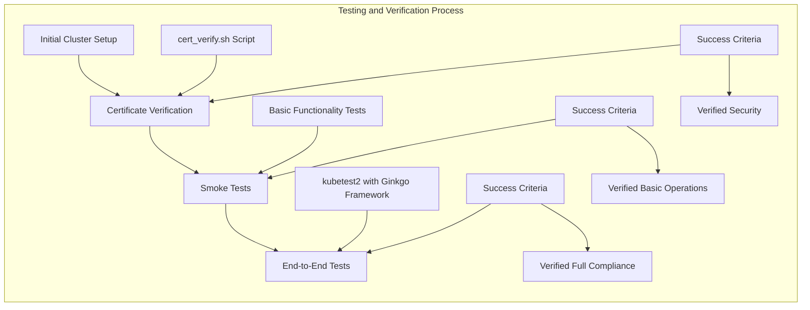
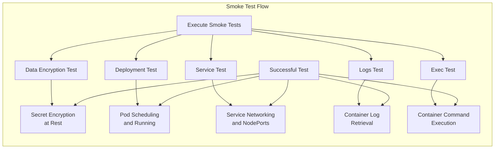
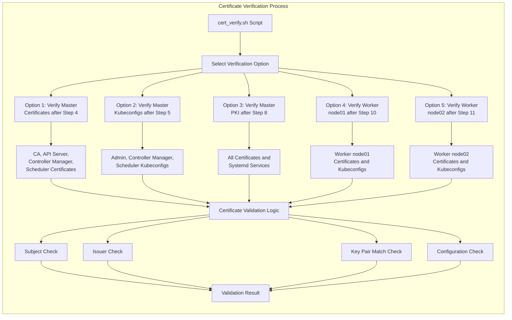

# Testing and Verification
Relevant source files
- [docs/15-dns-addon.md](https://github.com/mmumshad/kubernetes-the-hard-way/blob/8218a815/docs/15-dns-addon.md?plain=1)
- [docs/16-smoke-test.md](https://github.com/mmumshad/kubernetes-the-hard-way/blob/8218a815/docs/16-smoke-test.md?plain=1)
- [docs/17-e2e-tests.md](https://github.com/mmumshad/kubernetes-the-hard-way/blob/8218a815/docs/17-e2e-tests.md?plain=1)
- [tools/lab-script-generator.py](https://github.com/mmumshad/kubernetes-the-hard-way/blob/8218a815/tools/lab-script-generator.py)
- [vagrant/ubuntu/cert_verify.sh](https://github.com/mmumshad/kubernetes-the-hard-way/blob/8218a815/vagrant/ubuntu/cert_verify.sh)
- [vagrant/ubuntu/setup-kernel.sh](https://github.com/mmumshad/kubernetes-the-hard-way/blob/8218a815/vagrant/ubuntu/setup-kernel.sh)

This page provides a comprehensive guide to verifying the correct functioning of your Kubernetes cluster deployed using the "hard way" methodology. After completing the core setup of your cluster, it's crucial to test its functionality to ensure all components are working correctly. This document covers three main testing approaches: smoke tests, certificate verification, and end-to-end tests.

## Overview of Testing Methods

Testing a Kubernetes cluster involves verifying different aspects of its functionality, from basic operations to comprehensive conformance testing. Each method serves a specific purpose in the verification process.



Sources: [docs/16-smoke-test.md1-166](https://github.com/mmumshad/kubernetes-the-hard-way/blob/8218a815/docs/16-smoke-test.md?plain=1#L1-L166)[docs/17-e2e-tests.md1-64](https://github.com/mmumshad/kubernetes-the-hard-way/blob/8218a815/docs/17-e2e-tests.md?plain=1#L1-L64)[vagrant/ubuntu/cert_verify.sh1-579](https://github.com/mmumshad/kubernetes-the-hard-way/blob/8218a815/vagrant/ubuntu/cert_verify.sh#L1-L579)

## Smoke Tests

Smoke tests are quick, targeted tests designed to verify essential functionality of your Kubernetes cluster. They ensure basic operations work correctly before conducting more comprehensive testing.

### Smoke Test Components and Flow



Sources: [docs/16-smoke-test.md1-166](https://github.com/mmumshad/kubernetes-the-hard-way/blob/8218a815/docs/16-smoke-test.md?plain=1#L1-L166)

### Running Smoke Tests

Smoke tests should be run from the `controlplane01` node after you've completed all the cluster setup steps, including the DNS add-on deployment.

#### 1. Data Encryption Test

This test verifies that Kubernetes correctly encrypts secret data at rest in etcd:

1. Create a generic secret:

```
kubectl create secret generic kubernetes-the-hard-way \
  --from-literal="mykey=mydata"
```

1. Verify encryption by inspecting the secret in etcd:

```
sudo ETCDCTL_API=3 etcdctl get \
  --endpoints=https://127.0.0.1:2379 \
  --cacert=/etc/etcd/ca.crt \
  --cert=/etc/etcd/etcd-server.crt \
  --key=/etc/etcd/etcd-server.key \
  /registry/secrets/default/kubernetes-the-hard-way | hexdump -C
```

The output should show the data is encrypted, indicated by the `k8s:enc:aescbc:v1:key1` prefix.

1. Clean up the test secret:

```
kubectl delete secret kubernetes-the-hard-way
```

#### 2. Deployments Test

This test verifies the ability to create and manage deployments:

1. Create an nginx deployment:

```
kubectl create deployment nginx --image=nginx:alpine
```

1. Verify the deployment created a pod:

```
kubectl get pods -l app=nginx
```

#### 3. Services Test

This test verifies the ability to expose applications through services and access them remotely:

1. Create a NodePort service for the nginx deployment:

```
kubectl expose deploy nginx --type=NodePort --port 80
```

1. Get the assigned NodePort:

```
PORT_NUMBER=$(kubectl get svc -l app=nginx -o jsonpath="{.items[0].spec.ports[0].nodePort}")
```

1. Access the nginx service through the worker nodes:

```
curl http://node01:$PORT_NUMBER
curl http://node02:$PORT_NUMBER
```

The output should display the nginx welcome page HTML.

#### 4. Logs Test

This test verifies the ability to retrieve container logs:

1. Get the nginx pod name:

```
POD_NAME=$(kubectl get pods -l app=nginx -o jsonpath="{.items[0].metadata.name}")
```

1. View the pod logs:

```
kubectl logs $POD_NAME
```

#### 5. Exec Test

This test verifies the ability to execute commands within containers:

1. Execute a command in the nginx container:

```
kubectl exec -ti $POD_NAME -- nginx -v
```

The output should display the nginx version.

#### Clean Up

After running the smoke tests, clean up the test resources:

```
kubectl delete pod -n default busybox
kubectl delete service -n default nginx
kubectl delete deployment -n default nginx
```

Sources: [docs/16-smoke-test.md1-166](https://github.com/mmumshad/kubernetes-the-hard-way/blob/8218a815/docs/16-smoke-test.md?plain=1#L1-L166)

## Certificate Verification

Proper certificate configuration is crucial for the security of your Kubernetes cluster. The `cert_verify.sh` script provides a systematic way to verify that all certificates are correctly generated and configured.

### Certificate Verification Process



Sources: [vagrant/ubuntu/cert_verify.sh1-579](https://github.com/mmumshad/kubernetes-the-hard-way/blob/8218a815/vagrant/ubuntu/cert_verify.sh#L1-L579)

### Running Certificate Verification

The `cert_verify.sh` script provides five options for verifying certificates at different stages of the cluster setup:

1. **Verify Master Node Certificates after Step 4**

- Verifies CA, API server, controller manager, scheduler, and other core certificates
2. **Verify Master Node Kubeconfigs after Step 5**

- Verifies kubeconfig files for admin, controller manager, and scheduler
3. **Verify Master Node PKI and Services after Step 8**

- Comprehensive check of all certificates, kubeconfigs, and systemd service configurations
4. **Verify Worker Node 01 after Step 10**

- Verifies certificates and kubeconfigs on the first worker node
5. **Verify Worker Node 02 after Step 11**

- Verifies certificates and kubeconfigs on the second worker node

To run the script, SSH into the appropriate node and execute:

```
bash cert_verify.sh
```

Then select the appropriate option from the menu, or specify the option directly:

```
bash cert_verify.sh 3  # For option 3 (Verify master node PKI after step 8)
```

The script verifies:

- Certificate authority (CA) configuration
- Certificate and key file presence
- Certificate subject and issuer fields
- Certificate and key file matching (using MD5 hash comparison)
- Proper paths in kubeconfig files
- Systemd service configurations (for options 3, 4, and 5)

If any issue is found, the script will output a detailed error message with a link to the relevant documentation for fixing the problem.

Sources: [vagrant/ubuntu/cert_verify.sh97-169](https://github.com/mmumshad/kubernetes-the-hard-way/blob/8218a815/vagrant/ubuntu/cert_verify.sh#L97-L169)[vagrant/ubuntu/cert_verify.sh457-578](https://github.com/mmumshad/kubernetes-the-hard-way/blob/8218a815/vagrant/ubuntu/cert_verify.sh#L457-L578)

### Certificate Verification Components in the System

The verification process checks many components of the Kubernetes cluster's certificate infrastructure:

| Component | Certificate Files | Verified Attributes |
| --- | --- | --- |
| CA | `ca.crt`, `ca.key` | Subject, issuer |
| API Server | `kube-apiserver.crt`, `kube-apiserver.key` | Subject, issuer, key match |
| Controller Manager | `kube-controller-manager.crt`, `kube-controller-manager.key` | Subject, issuer, key match |
| Scheduler | `kube-scheduler.crt`, `kube-scheduler.key` | Subject, issuer, key match |
| Service Account | `service-account.crt`, `service-account.key` | Subject, issuer, key match |
| etcd | `etcd-server.crt`, `etcd-server.key` | Subject, issuer, key match |
| Kubelet | `node01.crt`, `node01.key` (for node01) | Subject, issuer, key match |
| Kube-proxy | `kube-proxy.crt`, `kube-proxy.key` | Subject, issuer, key match |

The verification also checks kubeconfig files:

| Kubeconfig | Location | Verified Attributes |
| --- | --- | --- |
| Admin | `admin.kubeconfig` | Certificate data, key data, server URL |
| Controller Manager | `kube-controller-manager.kubeconfig` | Certificate path, key path, server URL |
| Scheduler | `kube-scheduler.kubeconfig` | Certificate path, key path, server URL |
| Kubelet | `/var/lib/kubelet/kubeconfig` | Certificate path, key path, server URL |
| Kube-proxy | `/var/lib/kube-proxy/kubeconfig` | Certificate path, key path, server URL |

Sources: [vagrant/ubuntu/cert_verify.sh20-60](https://github.com/mmumshad/kubernetes-the-hard-way/blob/8218a815/vagrant/ubuntu/cert_verify.sh#L20-L60)[vagrant/ubuntu/cert_verify.sh97-201](https://github.com/mmumshad/kubernetes-the-hard-way/blob/8218a815/vagrant/ubuntu/cert_verify.sh#L97-L201)

## End-to-End Tests

End-to-end (E2E) tests provide comprehensive verification of Kubernetes functionality by running the official Kubernetes conformance test suite against your cluster.

### E2E Test Architecture

```

```

Sources: [docs/17-e2e-tests.md1-64](https://github.com/mmumshad/kubernetes-the-hard-way/blob/8218a815/docs/17-e2e-tests.md?plain=1#L1-L64)

### Running End-to-End Tests

**Important Note**: E2E tests require significant resources. Systems with less than 16GB RAM may experience failures. These tests are optional.

E2E tests should be installed and run from the `controlplane01` node:

#### 1. Install Go

```
GO_VERSION=$(curl -s 'https://go.dev/VERSION?m=text' | head -1)
wget "https://dl.google.com/go/${GO_VERSION}.linux-${ARCH}.tar.gz"
 
sudo tar -C /usr/local -xzf ${GO_VERSION}.linux-${ARCH}.tar.gz
 
sudo ln -s /usr/local/go/bin/go /usr/local/bin/go
sudo ln -s /usr/local/go/bin/gofmt /usr/local/bin/gofmt
 
source <(go env)
export PATH=$PATH:$GOPATH/bin
```

#### 2. Install kubetest2

```
go install sigs.k8s.io/kubetest2/...@latest
sudo snap install google-cloud-cli --classic
```

#### 3. Run Tests

```
KUBE_VERSION=$(curl -L -s https://dl.k8s.io/release/stable.txt)
NUM_CPU=$(cat /proc/cpuinfo | grep '^processor' | wc -l)
 
cd ~
kubetest2 noop --kubeconfig ${PWD}/.kube/config --test=ginkgo -- \
  --focus-regex='\[Conformance\]' --test-package-version $KUBE_VERSION --parallel $NUM_CPU
```

While the tests are running, you can monitor cluster activity in another terminal:

```
watch kubectl get all -A
```

#### Test Duration and Expectations

- Tests can take from one hour to several hours depending on your system
- The final output will show the number of tests run and passed
- Some test failures are expected, especially on resource-constrained systems
- Laptop processors may experience issues with the tests due to power management features

Sources: [docs/17-e2e-tests.md10-60](https://github.com/mmumshad/kubernetes-the-hard-way/blob/8218a815/docs/17-e2e-tests.md?plain=1#L10-L60)

## Troubleshooting and Common Issues

### Certificate Verification Issues

If the certificate verification script reports errors:

1. Check the error message for specific details about which certificate or configuration file is problematic
2. Refer to the documentation link provided in the error message
3. Verify that all certificate generation steps were completed correctly
4. Ensure certificates were copied to the correct locations

### Smoke Test Issues

If smoke tests fail:

1. **Data Encryption Test**: Verify the encryption configuration is correctly applied to the API server
2. **Deployment Test**: Check the Kubernetes scheduler and kubelet logs for any errors
3. **Service Test**: Verify the kube-proxy is running correctly and worker node networking is properly configured
4. **Logs/Exec Tests**: Ensure the kubelet API is accessible to the API server

### End-to-End Test Issues

1. **Resource Constraints**: Ensure your system has adequate resources (minimum 16GB RAM recommended)
2. **Test Timeouts**: Some tests may time out on slower systems - this is expected
3. **Cluster Stability**: Monitor cluster components during testing to ensure they remain stable
4. **Network Issues**: Ensure pod networking is correctly configured for all tests to pass

Sources: [docs/17-e2e-tests.md5-9](https://github.com/mmumshad/kubernetes-the-hard-way/blob/8218a815/docs/17-e2e-tests.md?plain=1#L5-L9)[vagrant/ubuntu/cert_verify.sh126-128](https://github.com/mmumshad/kubernetes-the-hard-way/blob/8218a815/vagrant/ubuntu/cert_verify.sh#L126-L128)

## Conclusion

Testing and verification are critical steps in ensuring your Kubernetes cluster is functioning correctly. By following the procedures outlined in this document, you can verify the security, functionality, and conformance of your cluster.

1. Start with certificate verification to ensure the security foundation is solid
2. Run smoke tests to verify basic functionality
3. Optionally run the more intensive end-to-end tests to verify full Kubernetes conformance

Each of these testing methods provides different levels of assurance about your cluster's functionality. Together, they ensure your manually deployed Kubernetes cluster meets the same standards as those deployed by automated tools.