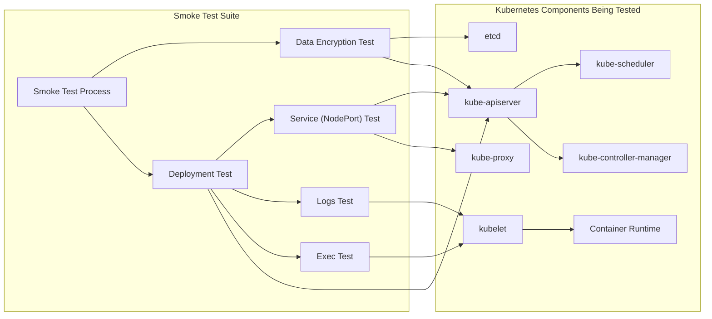
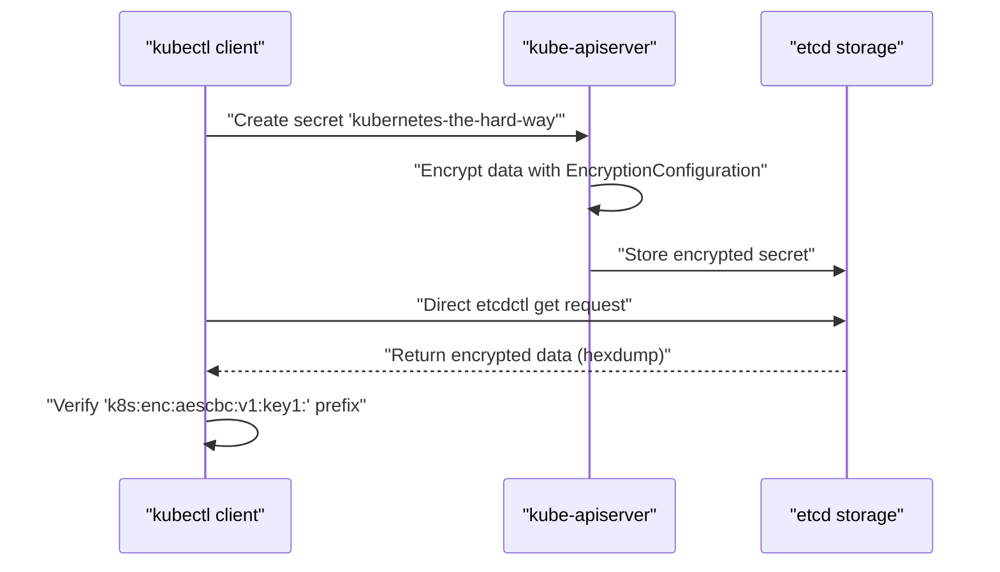
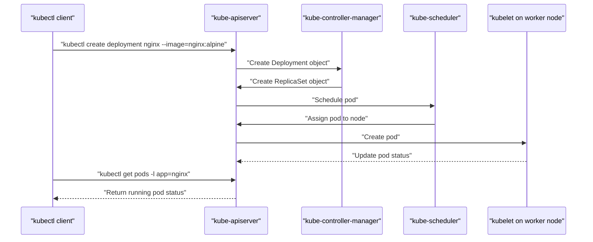
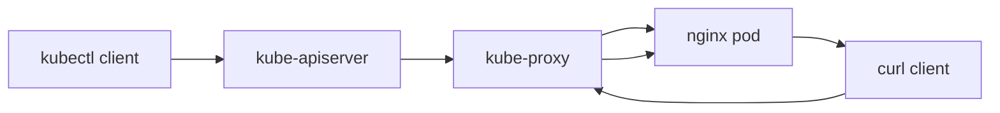
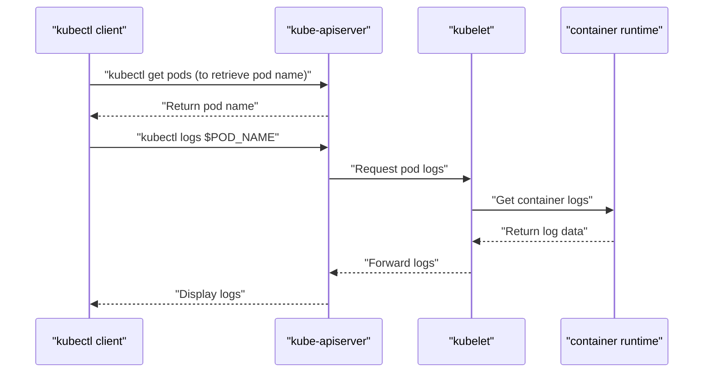
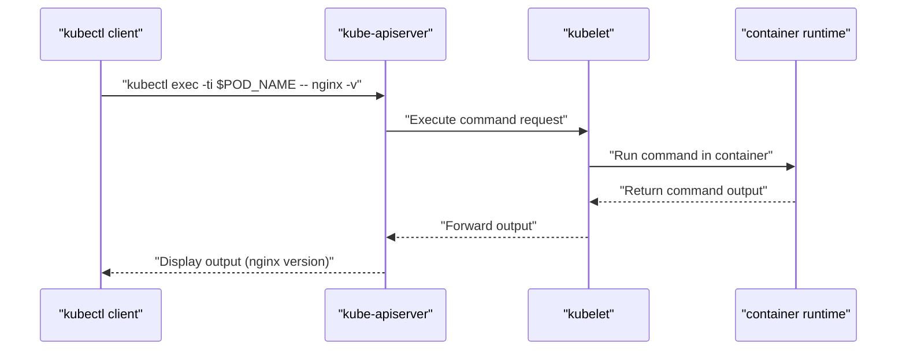

# Smoke Tests
Relevant source files
- [docs/15-dns-addon.md](https://github.com/mmumshad/kubernetes-the-hard-way/blob/8218a815/docs/15-dns-addon.md?plain=1)
- [docs/16-smoke-test.md](https://github.com/mmumshad/kubernetes-the-hard-way/blob/8218a815/docs/16-smoke-test.md?plain=1)
- [docs/17-e2e-tests.md](https://github.com/mmumshad/kubernetes-the-hard-way/blob/8218a815/docs/17-e2e-tests.md?plain=1)
- [tools/lab-script-generator.py](https://github.com/mmumshad/kubernetes-the-hard-way/blob/8218a815/tools/lab-script-generator.py)

## Purpose and Scope

This document outlines the smoke tests used to verify that a Kubernetes cluster deployed using the "hard way" method is functioning correctly. Smoke tests are targeted, lightweight tests that verify essential functionality of the Kubernetes cluster after its initial setup. Unlike the more comprehensive [End-to-End Tests](/mmumshad/kubernetes-the-hard-way/7.2-end-to-end-tests), smoke tests provide a quick verification that fundamental cluster operations work as expected before proceeding to more complex workloads.

## Smoke Test Overview

Smoke tests validate five core capabilities of a Kubernetes cluster:

1. **Data encryption**: Verifies that sensitive data is properly encrypted at rest in etcd
2. **Deployments**: Verifies the cluster can successfully deploy applications
3. **Services**: Verifies network connectivity and load balancing via NodePort services
4. **Logs**: Verifies the ability to retrieve container logs
5. **Exec**: Verifies the ability to execute commands within running containers



Sources: [docs/16-smoke-test.md1-6](https://github.com/mmumshad/kubernetes-the-hard-way/blob/8218a815/docs/16-smoke-test.md?plain=1#L1-L6)

## Data Encryption Test

This test verifies that Kubernetes properly encrypts secret data at rest in etcd storage. The smoke test creates a generic secret and then directly inspects the etcd storage to confirm encryption is working.



The test procedure:

1. Create a generic Kubernetes secret with test data
2. Use etcdctl to directly access the raw data in etcd
3. Verify that the stored data includes the encryption prefix (`k8s:enc:aescbc:v1:key1:`)
4. Clean up the test secret

When encryption is properly configured, secrets are not stored as plaintext in etcd, making the cluster more secure.

Sources: [docs/16-smoke-test.md6-54](https://github.com/mmumshad/kubernetes-the-hard-way/blob/8218a815/docs/16-smoke-test.md?plain=1#L6-L54)

## Deployment Test

This test verifies the cluster's ability to create and manage deployments, which is a fundamental capability of Kubernetes. The test deploys a standard NGINX web server container and verifies it's running.



The test procedure:

1. Create an NGINX deployment using the alpine image
2. Verify the pod is created and running with a proper status

This test validates that the control plane components (API server, controller manager, scheduler) and worker node components (kubelet, container runtime) are working together correctly to deploy applications.

Sources: [docs/16-smoke-test.md57-80](https://github.com/mmumshad/kubernetes-the-hard-way/blob/8218a815/docs/16-smoke-test.md?plain=1#L57-L80)

## Service Test

This test verifies that applications can be exposed and accessed through Kubernetes services. Specifically, it tests the NodePort service type, which exposes the application on a static port on each node.



The test procedure:

1. Expose the NGINX deployment as a NodePort service
2. Retrieve the assigned node port number
3. Use curl to access the NGINX service via the worker nodes' IPs
4. Verify a successful HTTP response containing the NGINX welcome page

This test confirms that:

- Service objects are correctly created in the API server
- kube-proxy properly configures network rules
- Traffic is correctly routed to pods

Sources: [docs/16-smoke-test.md82-114](https://github.com/mmumshad/kubernetes-the-hard-way/blob/8218a815/docs/16-smoke-test.md?plain=1#L82-L114)

## Logs Test

This test verifies the ability to retrieve container logs, which is essential for troubleshooting and monitoring applications.



The test procedure:

1. Retrieve the full name of the NGINX pod using a label selector
2. Execute the `kubectl logs` command on the pod
3. Verify logs are successfully returned, showing HTTP access entries

This test validates that:

- The API server can process log requests
- The kubelet can retrieve logs from the container runtime
- Log data can be successfully transmitted back to the client

Sources: [docs/16-smoke-test.md116-137](https://github.com/mmumshad/kubernetes-the-hard-way/blob/8218a815/docs/16-smoke-test.md?plain=1#L116-L137)

## Exec Test

This test verifies the ability to execute commands within a running container, which is crucial for debugging and administrative tasks.



The test procedure:

1. Execute the `nginx -v` command inside the NGINX container
2. Verify the command successfully returns the NGINX version information

This test validates that:

- The API server correctly processes exec requests
- The kubelet can execute commands in containers
- Command output is properly returned to the client

Sources: [docs/16-smoke-test.md139-153](https://github.com/mmumshad/kubernetes-the-hard-way/blob/8218a815/docs/16-smoke-test.md?plain=1#L139-L153)

## Test Cleanup

After all smoke tests have been completed, the test resources are cleaned up to leave the cluster in a clean state:

```
kubectl delete pod -n default busybox
kubectl delete service -n default nginx
kubectl delete deployment -n default nginx
```

This removes the test pod (from DNS verification), service, and deployment created during the smoke tests.

Sources: [docs/16-smoke-test.md155-162](https://github.com/mmumshad/kubernetes-the-hard-way/blob/8218a815/docs/16-smoke-test.md?plain=1#L155-L162)

## Relationship to Other Tests

The smoke tests are part of a larger testing strategy for verifying the Kubernetes cluster. They provide quick validation of core functionality, while more extensive validation can be performed with [End-to-End Tests](/mmumshad/kubernetes-the-hard-way/7.2-end-to-end-tests).

| Test Type | Purpose | Scope | Resource Requirements |
| --- | --- | --- | --- |
| Smoke Tests | Quick validation of core functionality | Basic operations (secrets, deployments, services, logs, exec) | Minimal |
| End-to-End Tests | Comprehensive validation | Full Kubernetes API conformance | High (requires significant CPU/memory) |
| Certificate Verification | Security validation | Validate certificate configurations | Minimal |

Sources: [docs/17-e2e-tests.md1-7](https://github.com/mmumshad/kubernetes-the-hard-way/blob/8218a815/docs/17-e2e-tests.md?plain=1#L1-L7)[docs/16-smoke-test.md1-6](https://github.com/mmumshad/kubernetes-the-hard-way/blob/8218a815/docs/16-smoke-test.md?plain=1#L1-L6)

## Summary

Smoke tests provide a critical verification step after deploying a Kubernetes cluster using the hard way method. By testing data encryption, deployments, services, logs, and exec functionality, they ensure that the fundamental capabilities of the cluster are working correctly. If all smoke tests pass successfully, the cluster can be considered operational for basic workloads.

After the smoke tests pass, you may proceed to [End-to-End Tests](/mmumshad/kubernetes-the-hard-way/7.2-end-to-end-tests) for more comprehensive validation or begin deploying actual workloads to your cluster.