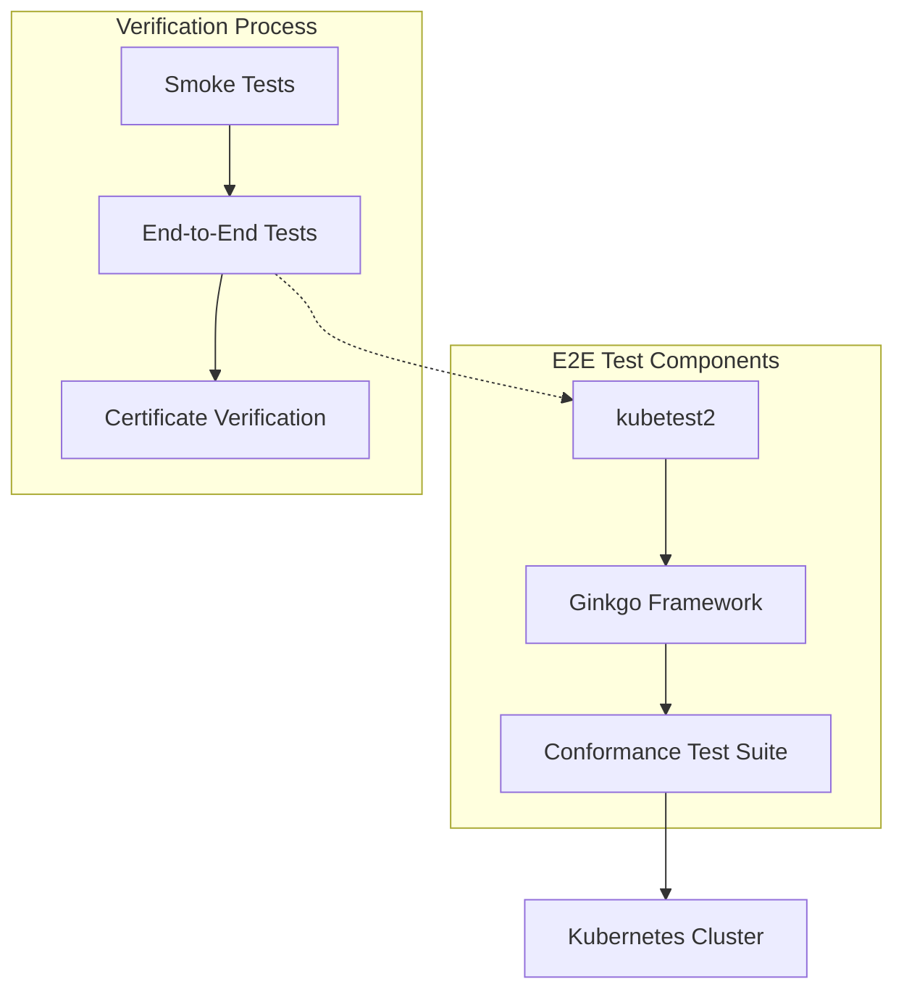
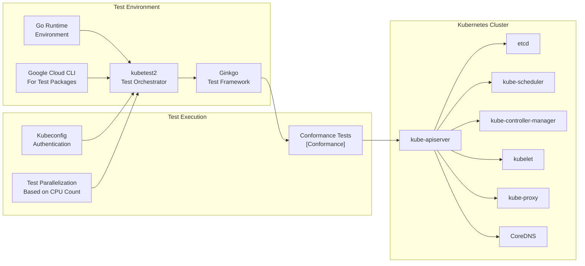
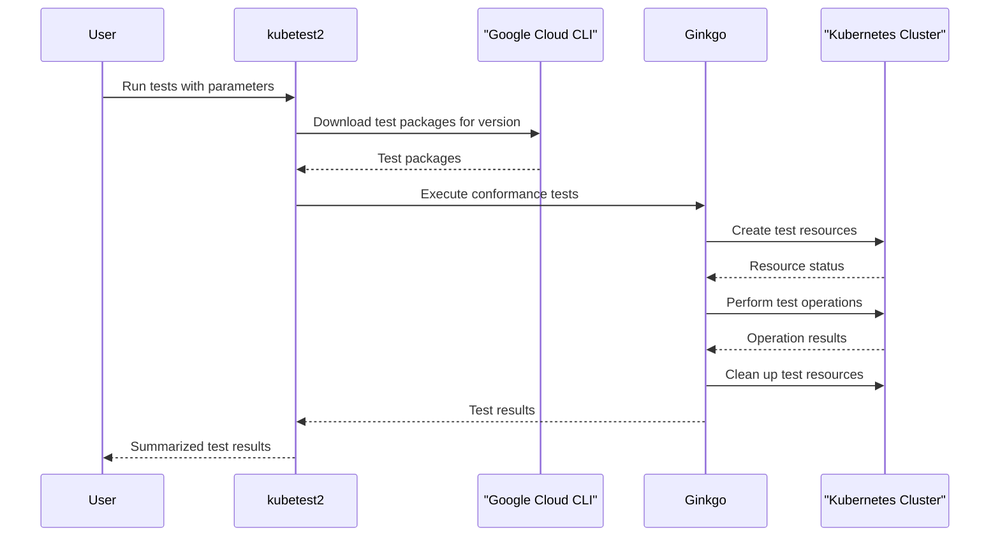

# End-to-End Tests
Relevant source files
- [docs/15-dns-addon.md](https://github.com/mmumshad/kubernetes-the-hard-way/blob/8218a815/docs/15-dns-addon.md?plain=1)
- [docs/16-smoke-test.md](https://github.com/mmumshad/kubernetes-the-hard-way/blob/8218a815/docs/16-smoke-test.md?plain=1)
- [docs/17-e2e-tests.md](https://github.com/mmumshad/kubernetes-the-hard-way/blob/8218a815/docs/17-e2e-tests.md?plain=1)
- [tools/lab-script-generator.py](https://github.com/mmumshad/kubernetes-the-hard-way/blob/8218a815/tools/lab-script-generator.py)

This document details how to run comprehensive end-to-end tests on your Kubernetes cluster to verify its conformance with official Kubernetes specifications. End-to-end tests provide a more thorough verification than [Smoke Tests](/mmumshad/kubernetes-the-hard-way/7.1-smoke-tests) by testing all cluster components and their interactions across multiple scenarios.

> **NOTE**: This is an optional lab that requires substantial system resources. Systems with less than 16GB RAM will likely encounter failures during testing.

## Overview of End-to-End Testing

End-to-end tests in Kubernetes verify that the cluster behaves as expected across various operational scenarios. These tests use the Ginkgo testing framework to execute conformance tests that validate your cluster against the Kubernetes specification.



Sources: [docs/17-e2e-tests.md1-10](https://github.com/mmumshad/kubernetes-the-hard-way/blob/8218a815/docs/17-e2e-tests.md?plain=1#L1-L10)

## System Requirements

Running the end-to-end test suite is resource-intensive and requires:

- At least 16GB RAM
- Multiple CPU cores (tests can use parallelization)
- Stable Kubernetes cluster with all components running
- The tests should be run from the `controlplane01` node

Processor types can significantly impact test stability. Desktop processors typically handle the load better than laptop processors, which may throttle performance during intensive testing.

Sources: [docs/17-e2e-tests.md3-7](https://github.com/mmumshad/kubernetes-the-hard-way/blob/8218a815/docs/17-e2e-tests.md?plain=1#L3-L7)

## Test Infrastructure Components

The end-to-end testing infrastructure consists of several components that work together to validate your Kubernetes cluster:



Sources: [docs/17-e2e-tests.md10-26](https://github.com/mmumshad/kubernetes-the-hard-way/blob/8218a815/docs/17-e2e-tests.md?plain=1#L10-L26)[docs/17-e2e-tests.md27-35](https://github.com/mmumshad/kubernetes-the-hard-way/blob/8218a815/docs/17-e2e-tests.md?plain=1#L27-L35)

## Installation Process

Before running the tests, you need to install the required components on the `controlplane01` node:

1. Install the Go programming language:

```
GO_VERSION=$(curl -s 'https://go.dev/VERSION?m=text' | head -1)
wget "https://dl.google.com/go/${GO_VERSION}.linux-${ARCH}.tar.gz"
 
sudo tar -C /usr/local -xzf ${GO_VERSION}.linux-${ARCH}.tar.gz
 
sudo ln -s /usr/local/go/bin/go /usr/local/bin/go
sudo ln -s /usr/local/go/bin/gofmt /usr/local/bin/gofmt
 
source <(go env)
export PATH=$PATH:$GOPATH/bin
```

1. Install kubetest2 and the Google Cloud CLI:

```
go install sigs.k8s.io/kubetest2/...@latest
sudo snap install google-cloud-cli --classic
```

Sources: [docs/17-e2e-tests.md12-35](https://github.com/mmumshad/kubernetes-the-hard-way/blob/8218a815/docs/17-e2e-tests.md?plain=1#L12-L35)

## Running End-to-End Tests

To run the end-to-end tests, execute the following commands:

```
KUBE_VERSION=$(curl -L -s https://dl.k8s.io/release/stable.txt)
NUM_CPU=$(cat /proc/cpuinfo | grep '^processor' | wc -l)
 
cd ~
kubetest2 noop --kubeconfig ${PWD}/.kube/config --test=ginkgo -- \
  --focus-regex='\[Conformance\]' --test-package-version $KUBE_VERSION --parallel $NUM_CPU
```

This command:

- Sets the Kubernetes version to match your stable cluster version
- Determines the number of CPU cores available for test parallelization
- Uses kubetest2 to run Ginkgo-based conformance tests
- Configures the tests to run in parallel based on your CPU core count

Sources: [docs/17-e2e-tests.md37-50](https://github.com/mmumshad/kubernetes-the-hard-way/blob/8218a815/docs/17-e2e-tests.md?plain=1#L37-L50)

## Test Execution Flow

The end-to-end test execution follows this sequence:



Sources: [docs/17-e2e-tests.md37-50](https://github.com/mmumshad/kubernetes-the-hard-way/blob/8218a815/docs/17-e2e-tests.md?plain=1#L37-L50)

## Monitoring Tests During Execution

While the tests are running, you can open an additional session to monitor the cluster activity:

```
watch kubectl get all -A
```

This command provides a real-time view of resources being created, updated, and deleted during the testing process.

Sources: [docs/17-e2e-tests.md52-56](https://github.com/mmumshad/kubernetes-the-hard-way/blob/8218a815/docs/17-e2e-tests.md?plain=1#L52-L56)

## Test Duration and Expectations

The end-to-end tests can take anywhere from one hour to several hours depending on your system specifications. The tests will show the total number of tests run and passed at the completion.

It's normal to see some test failures, particularly on systems with limited resources or when using mobile/laptop processors that may throttle performance during intensive workloads.

| System Type | Expected Behavior |
| --- | --- |
| Desktop (Server-grade CPU) | Better stability, fewer test failures |
| Laptop | May experience timeouts and synchronization issues due to CPU throttling |
| < 16GB RAM | High likelihood of test failures due to resource constraints |

Sources: [docs/17-e2e-tests.md58-63](https://github.com/mmumshad/kubernetes-the-hard-way/blob/8218a815/docs/17-e2e-tests.md?plain=1#L58-L63)

## Relationship to Other Tests

The end-to-end tests are part of a comprehensive testing strategy for your Kubernetes cluster:

| Test Type | Purpose | Scope | When to Run |
| --- | --- | --- | --- |
| Smoke Tests | Basic functionality verification | Limited (deployments, services, logs, exec) | After initial cluster setup |
| End-to-End Tests | Comprehensive conformance testing | Complete cluster functionality | After smoke tests pass |
| Certificate Verification | Security configuration validation | Certificates and encryption | Can be run independently |

Sources: [docs/16-smoke-test.md1-4](https://github.com/mmumshad/kubernetes-the-hard-way/blob/8218a815/docs/16-smoke-test.md?plain=1#L1-L4)[docs/17-e2e-tests.md1-2](https://github.com/mmumshad/kubernetes-the-hard-way/blob/8218a815/docs/17-e2e-tests.md?plain=1#L1-L2)

## Conclusion

Running end-to-end tests is an important step in verifying that your Kubernetes cluster is properly configured and functioning according to specifications. While some test failures may occur depending on your hardware, a majority of the tests should pass on a correctly configured cluster.

After completing the end-to-end tests, you can proceed to [Certificate Verification](/mmumshad/kubernetes-the-hard-way/7.3-certificate-verification) for additional validation of your cluster's security configuration.