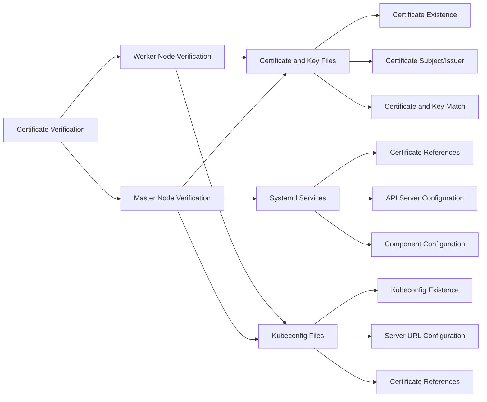
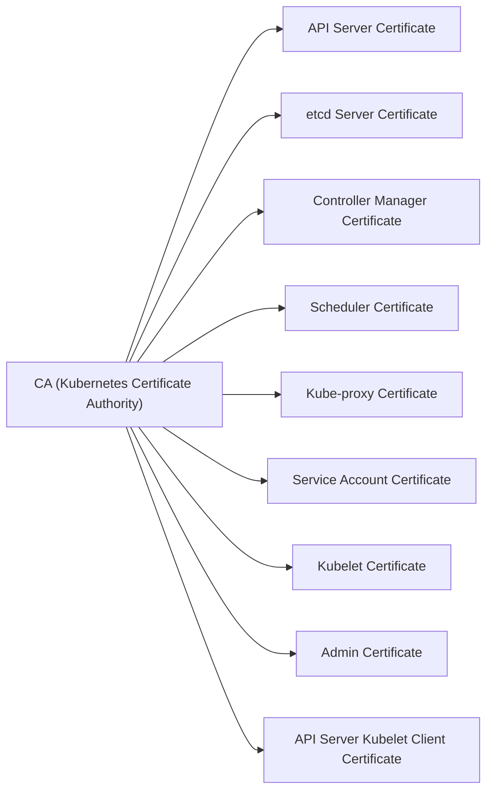
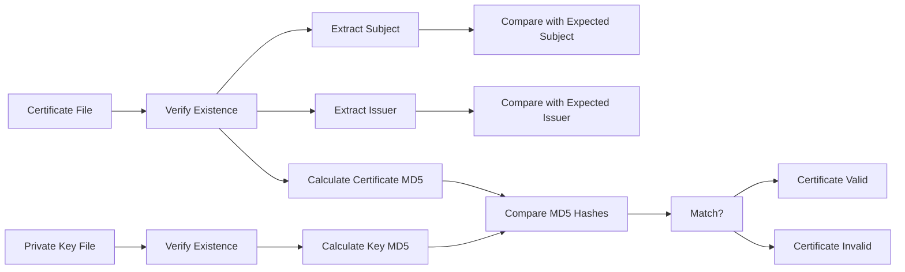
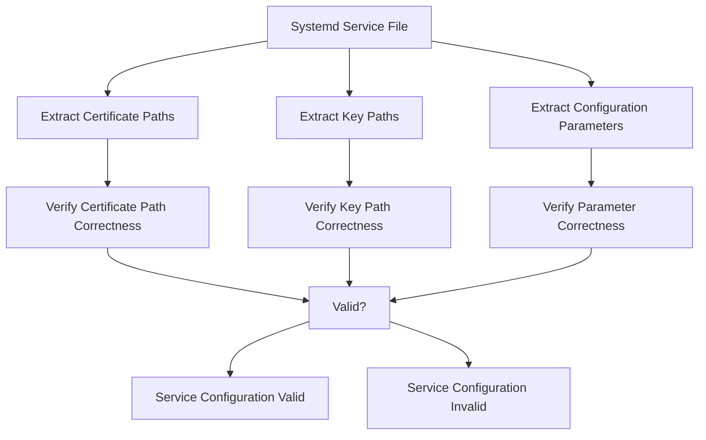
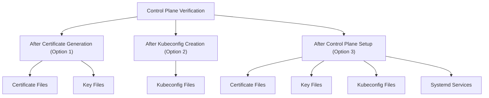
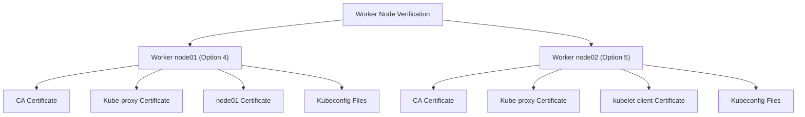

# Certificate Verification
Relevant source files
- [vagrant/ubuntu/cert_verify.sh](https://github.com/mmumshad/kubernetes-the-hard-way/blob/8218a815/vagrant/ubuntu/cert_verify.sh)
- [vagrant/ubuntu/setup-kernel.sh](https://github.com/mmumshad/kubernetes-the-hard-way/blob/8218a815/vagrant/ubuntu/setup-kernel.sh)

This document describes the procedures and tools for verifying certificates in a Kubernetes cluster deployed using the "Kubernetes The Hard Way" method. Certificate verification is a critical step to ensure the secure operation of your Kubernetes cluster by confirming that all components have properly configured certificates with the correct attributes.

For information on certificate generation, see [Certificate Authority](/mmumshad/kubernetes-the-hard-way/3.1-certificate-authority). For certificate management tools, see [Certificate Management Tools](/mmumshad/kubernetes-the-hard-way/8.3-certificate-management-tools).

## 1. Certificate Verification Overview

The security of a Kubernetes cluster depends on properly configured certificates. The certificate verification process ensures that:

1. All required certificates exist in the correct locations
2. Certificates and their corresponding private keys match
3. Certificates have the correct subject and issuer information
4. Certificates are properly referenced in configuration files and systemd services



Sources: [vagrant/ubuntu/cert_verify.sh96-170](https://github.com/mmumshad/kubernetes-the-hard-way/blob/8218a815/vagrant/ubuntu/cert_verify.sh#L96-L170)[vagrant/ubuntu/cert_verify.sh198-253](https://github.com/mmumshad/kubernetes-the-hard-way/blob/8218a815/vagrant/ubuntu/cert_verify.sh#L198-L253)

## 2. Certificate Verification Tool

The repository provides a certificate verification script (`cert_verify.sh`) that automates the verification process. This script validates certificate configurations across both control plane and worker nodes.

### 2.1 Using the Certificate Verification Script

The verification script offers multiple verification modes for different stages of cluster deployment and different node types:

| Option | Description | When to Use | Node Type |
| --- | --- | --- | --- |
| 1 | Verify certificates on Master Nodes | After step 4 (Certificate Generation) | Control Plane |
| 2 | Verify kubeconfigs on Master Nodes | After step 5 (Kubeconfig Creation) | Control Plane |
| 3 | Verify kubeconfigs and PKI on Master Nodes | After step 8 (Control Plane Setup) | Control Plane |
| 4 | Verify kubeconfigs and PKI on node01 | After step 10 (Worker Node 1 Setup) | Worker (node01) |
| 5 | Verify kubeconfigs and PKI on node02 | After step 11 (Worker Node 2 Setup) | Worker (node02) |

Sources: [vagrant/ubuntu/cert_verify.sh438-453](https://github.com/mmumshad/kubernetes-the-hard-way/blob/8218a815/vagrant/ubuntu/cert_verify.sh#L438-L453)

To run the verification script:

1. SSH into the appropriate node (control plane or worker)
2. Execute the script with the chosen verification option

Example:

```
# On a control plane node after completing step 8
./cert_verify.sh 3
 
# On worker node01 after completing step 10
./cert_verify.sh 4
```

## 3. Certificate Verification Components

### 3.1 Certificate Chain of Trust

The verification process validates the PKI chain of trust established in the cluster:



Sources: [vagrant/ubuntu/cert_verify.sh458-467](https://github.com/mmumshad/kubernetes-the-hard-way/blob/8218a815/vagrant/ubuntu/cert_verify.sh#L458-L467)

### 3.2 Certificate and Key Verification

For each certificate, the script verifies:

1. Certificate existence in the correct path
2. Matching private key existence
3. Subject and issuer information correctness
4. Cryptographic integrity (certificate and key match)



Sources: [vagrant/ubuntu/cert_verify.sh98-130](https://github.com/mmumshad/kubernetes-the-hard-way/blob/8218a815/vagrant/ubuntu/cert_verify.sh#L98-L130)

The script verifies the following certificates on control plane nodes:

| Certificate | Subject | Issuer |
| --- | --- | --- |
| ca.crt | CN=KUBERNETES-CA,O=Kubernetes | CN=KUBERNETES-CA,O=Kubernetes |
| kube-apiserver.crt | CN=kube-apiserver,O=Kubernetes | CN=KUBERNETES-CA,O=Kubernetes |
| kube-controller-manager.crt | CN=system:kube-controller-manager,O=system:kube-controller-manager | CN=KUBERNETES-CA,O=Kubernetes |
| kube-scheduler.crt | CN=system:kube-scheduler,O=system:kube-scheduler | CN=KUBERNETES-CA,O=Kubernetes |
| service-account.crt | CN=service-accounts,O=Kubernetes | CN=KUBERNETES-CA,O=Kubernetes |
| apiserver-kubelet-client.crt | CN=kube-apiserver-kubelet-client,O=system:masters | CN=KUBERNETES-CA,O=Kubernetes |
| etcd-server.crt | CN=etcd-server,O=Kubernetes | CN=KUBERNETES-CA,O=Kubernetes |
| admin.crt | CN=admin,O=system:masters | CN=KUBERNETES-CA,O=Kubernetes |
| kube-proxy.crt | CN=system:kube-proxy,O=system:node-proxier | CN=KUBERNETES-CA,O=Kubernetes |

Sources: [vagrant/ubuntu/cert_verify.sh458-468](https://github.com/mmumshad/kubernetes-the-hard-way/blob/8218a815/vagrant/ubuntu/cert_verify.sh#L458-L468)[vagrant/ubuntu/cert_verify.sh481-493](https://github.com/mmumshad/kubernetes-the-hard-way/blob/8218a815/vagrant/ubuntu/cert_verify.sh#L481-L493)

### 3.3 Kubeconfig Verification

For kubeconfig files, the script checks:

1. File existence
2. Certificate and key references
3. API server URL configuration

Each component uses its own kubeconfig file:

| Component | Kubeconfig Location | API Server URL |
| --- | --- | --- |
| kube-controller-manager | /var/lib/kubernetes/kube-controller-manager.kubeconfig | [https://127.0.0.1:6443](https://127.0.0.1:6443) |
| kube-scheduler | /var/lib/kubernetes/kube-scheduler.kubeconfig | [https://127.0.0.1:6443](https://127.0.0.1:6443) |
| kube-proxy | /var/lib/kube-proxy/kube-proxy.kubeconfig | [https://loadbalancer:6443](https://loadbalancer:6443) |
| kubelet (node01) | /var/lib/kubelet/kubeconfig | [https://loadbalancer:6443](https://loadbalancer:6443) |
| kubelet (node02) | /var/lib/kubelet/kubeconfig | [https://loadbalancer:6443](https://loadbalancer:6443) |
| admin | $HOME/admin.kubeconfig | [https://127.0.0.1:6443](https://127.0.0.1:6443) |

Sources: [vagrant/ubuntu/cert_verify.sh199-253](https://github.com/mmumshad/kubernetes-the-hard-way/blob/8218a815/vagrant/ubuntu/cert_verify.sh#L199-L253)[vagrant/ubuntu/cert_verify.sh534-535](https://github.com/mmumshad/kubernetes-the-hard-way/blob/8218a815/vagrant/ubuntu/cert_verify.sh#L534-L535)

### 3.4 Systemd Service Configuration Verification

For service configuration, the script validates that systemd service files correctly reference certificate and key files:



The script checks systemd service files for:

| Service | File Path | What is Verified |
| --- | --- | --- |
| etcd | /etc/systemd/system/etcd.service | Certificate paths, key paths, CA path, URLs |
| kube-apiserver | /etc/systemd/system/kube-apiserver.service | Certificate paths, key paths, service account key path, etcd certificate references |
| kube-controller-manager | /etc/systemd/system/kube-controller-manager.service | CA path, key paths, kubeconfig path, service account key path |
| kube-scheduler | /etc/systemd/system/kube-scheduler.service | Kubeconfig path |

Sources: [vagrant/ubuntu/cert_verify.sh269-430](https://github.com/mmumshad/kubernetes-the-hard-way/blob/8218a815/vagrant/ubuntu/cert_verify.sh#L269-L430)

## 4. Node-Specific Verification

### 4.1 Control Plane Node Verification

Control plane nodes require verification of:

1. Core component certificates (API server, controller manager, scheduler)
2. etcd server certificates
3. Service account certificates
4. Kubeconfig files for components
5. Systemd service configurations

The verification script supports multiple verification stages for control plane nodes:



Sources: [vagrant/ubuntu/cert_verify.sh471-540](https://github.com/mmumshad/kubernetes-the-hard-way/blob/8218a815/vagrant/ubuntu/cert_verify.sh#L471-L540)

### 4.2 Worker Node Verification

Worker nodes require verification of:

1. CA certificate
2. Kubelet certificate
3. Kube-proxy certificate
4. Kubeconfig files



Sources: [vagrant/ubuntu/cert_verify.sh542-571](https://github.com/mmumshad/kubernetes-the-hard-way/blob/8218a815/vagrant/ubuntu/cert_verify.sh#L542-L571)

## 5. Troubleshooting Certificate Issues

When verification fails, the script provides detailed error messages indicating:

1. Which certificate or configuration has issues
2. What the specific problem is
3. Where to find more information to resolve the issue

Common certificate-related issues include:

1. Missing certificate files or keys
2. Incorrect subject or issuer information
3. Mismatched certificate and key pairs
4. Incorrect certificate paths in systemd service files
5. Incorrect server URLs in kubeconfig files

If certificate verification fails, you may need to:

1. Regenerate certificates with correct attributes
2. Copy certificates to the correct locations
3. Update systemd service files with correct certificate paths
4. Recreate kubeconfig files with correct server URLs

Sources: [vagrant/ubuntu/cert_verify.sh122-128](https://github.com/mmumshad/kubernetes-the-hard-way/blob/8218a815/vagrant/ubuntu/cert_verify.sh#L122-L128)[vagrant/ubuntu/cert_verify.sh158-168](https://github.com/mmumshad/kubernetes-the-hard-way/blob/8218a815/vagrant/ubuntu/cert_verify.sh#L158-L168)

## 6. Networking Requirements for Certificate Verification

Certificate verification depends on proper network configuration. The verification script requires:

1. Properly configured `/etc/hosts` file with node names and IP addresses
2. Proper network configuration as set up in the kernel settings

The verification script retrieves IP addresses of nodes using the `dig` command, which relies on proper DNS resolution:

```
PRIMARY_IP=$(ip addr show enp0s8 | grep "inet " | awk '{print $2}' | cut -d / -f 1)
CONTROL01=$(dig +short controlplane01)
CONTROL02=$(dig +short controlplane02)
NODE01=$(dig +short node01)
NODE02=$(dig +short node02)
LOADBALANCER=$(dig +short loadbalancer)

```

The kernel network settings required for Kubernetes (and by extension, for the certificate verification to work correctly) include:

```
net.bridge.bridge-nf-call-iptables=1
net.ipv4.ip_forward=1

```

Sources: [vagrant/ubuntu/cert_verify.sh10-17](https://github.com/mmumshad/kubernetes-the-hard-way/blob/8218a815/vagrant/ubuntu/cert_verify.sh#L10-L17)[vagrant/ubuntu/setup-kernel.sh17-24](https://github.com/mmumshad/kubernetes-the-hard-way/blob/8218a815/vagrant/ubuntu/setup-kernel.sh#L17-L24)

---

By following the certificate verification procedures outlined in this document, you can ensure that your Kubernetes cluster has properly configured certificates, which is critical for the secure operation of the cluster.