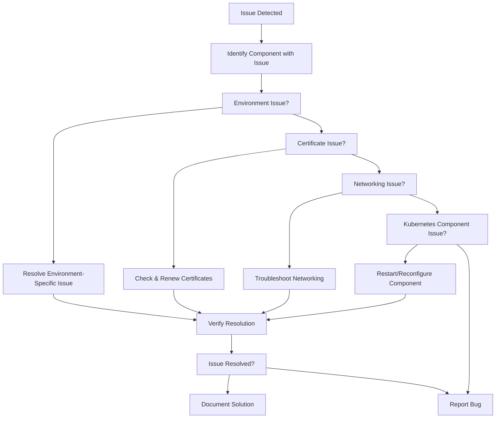
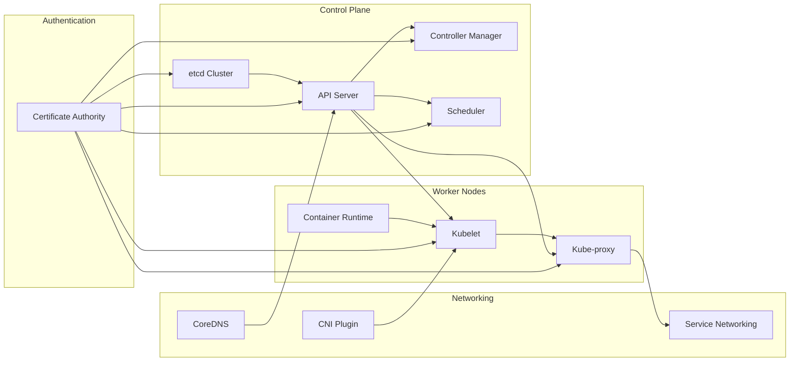
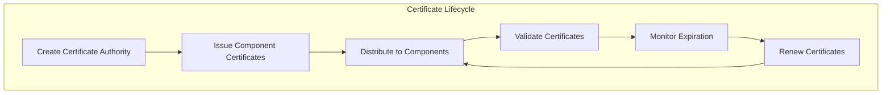

# Troubleshooting and Maintenance
Relevant source files
- [.github/ISSUE_TEMPLATE/bug.yaml](https://github.com/mmumshad/kubernetes-the-hard-way/blob/8218a815/.github/ISSUE_TEMPLATE/bug.yaml)
- [.github/ISSUE_TEMPLATE/config.yml](https://github.com/mmumshad/kubernetes-the-hard-way/blob/8218a815/.github/ISSUE_TEMPLATE/config.yml)
- [VirtualBox/docs/01-prerequisites.md](https://github.com/mmumshad/kubernetes-the-hard-way/blob/8218a815/VirtualBox/docs/01-prerequisites.md?plain=1)
- [VirtualBox/docs/02-compute-resources.md](https://github.com/mmumshad/kubernetes-the-hard-way/blob/8218a815/VirtualBox/docs/02-compute-resources.md?plain=1)
- [apple-silicon/docs/01-prerequisites.md](https://github.com/mmumshad/kubernetes-the-hard-way/blob/8218a815/apple-silicon/docs/01-prerequisites.md?plain=1)
- [apple-silicon/docs/02-compute-resources.md](https://github.com/mmumshad/kubernetes-the-hard-way/blob/8218a815/apple-silicon/docs/02-compute-resources.md?plain=1)
- [tools/kubernetes-certs-checker.xlsx](https://github.com/mmumshad/kubernetes-the-hard-way/blob/8218a815/tools/kubernetes-certs-checker.xlsx)

This document provides comprehensive guidance on identifying and resolving common issues that may arise during the deployment and operation of a Kubernetes cluster using the "Kubernetes The Hard Way" method. It also covers essential maintenance tasks to ensure the ongoing health and security of your cluster. For information about testing and verification procedures, see [Testing and Verification](/mmumshad/kubernetes-the-hard-way/7-testing-and-verification).

## Table of Contents

- [Common Issues and Fixes](https://github.com/mmumshad/kubernetes-the-hard-way/blob/8218a815/Common Issues and Fixes)
- [Environment-Specific Troubleshooting](https://github.com/mmumshad/kubernetes-the-hard-way/blob/8218a815/Environment-Specific Troubleshooting)
- [Kubernetes Component Troubleshooting](https://github.com/mmumshad/kubernetes-the-hard-way/blob/8218a815/Kubernetes Component Troubleshooting)
- [Certificate Management](https://github.com/mmumshad/kubernetes-the-hard-way/blob/8218a815/Certificate Management)
- [Reporting Bugs](https://github.com/mmumshad/kubernetes-the-hard-way/blob/8218a815/Reporting Bugs)

## Common Issues and Fixes

### Troubleshooting Approach

When encountering issues with your Kubernetes cluster, it's important to follow a systematic approach to troubleshooting:



This flowchart provides a systematic approach to isolating and resolving issues in your Kubernetes the Hard Way deployment.

Sources: `.github/ISSUE_TEMPLATE/bug.yaml`

### Common Cluster Health Issues

The following table outlines common issues you might encounter and their solutions:

| Issue | Symptoms | Possible Solutions |
| --- | --- | --- |
| etcd cluster unhealthy | API server unavailable, `kubectl` commands fail | Check etcd logs, verify etcd certificates, restart etcd service |
| API server unreachable | `kubectl` commands fail with connection errors | Check API server logs, verify load balancer, check API server certificates |
| Node not ready | Nodes show "NotReady" status | Check kubelet logs, verify kubelet certificates, restart kubelet service |
| Pod networking issues | Pods cannot communicate | Check Weave/CNI configuration, verify pod CIDR configuration |
| DNS resolution failure | Service discovery fails | Check CoreDNS/KubeDNS pods, verify service CIDR, check kube-proxy |

## Environment-Specific Troubleshooting

### VirtualBox Environment

In the VirtualBox-based deployment, common issues include:

#### Failed Provisioning

If a VM fails to provision correctly:

```
# Destroy the failed VM
vagrant destroy <vm>
 
# Re-provision
vagrant up
```

If the delete fails due to directory issues:

```
vagrant destroy <vm>
rmdir "<path-to-vm-folder>\kubernetes-ha-<vm>"
vagrant up
```

#### Provisioner Gets Stuck

If the provisioner gets stuck at "Waiting for machine to reboot":

1. Press `CTRL+C` to interrupt the process
2. Kill any running `ruby` processes
3. Destroy the VM that got stuck: `vagrant destroy <vm>`
4. Re-provision: `vagrant up`

#### Resource Constraints

If you experience crashes or performance issues, you may need to adjust the VM resources in the Vagrantfile:

```
# Edit the Vagrantfile to adjust RAM_SIZE and CPU_CORES
# Then halt and restart the VMs
vagrant halt
vagrant up
```

Sources: `VirtualBox/docs/02-compute-resources.md`

### Apple Silicon Environment

In the Apple Silicon-based deployment, common issues include:

#### Memory Constraints

Apple Silicon Macs with less than 16GB RAM may experience performance issues:

```
# Edit the deploy-virtual-machines.sh script to reduce VM memory
# Then recreate the VMs
./delete-virtual-machines.sh
./deploy-virtual-machines.sh
```

#### Network Interface Binding Issues

Components may incorrectly bind to the wrong network interface:

```
# Verify the PRIMARY_IP environment variable is set correctly
echo $PRIMARY_IP
 
# Components should use this IP in their configuration
```

#### DHCP Lease Cleanup

After deleting VMs, clean up stale DHCP leases to prevent IP address exhaustion:

```
sudo vi /var/db/dhcpd_leases
# Remove all blocks with controlplane, node, or loadbalancer names
```

Sources: `apple-silicon/docs/01-prerequisites.md`, `apple-silicon/docs/02-compute-resources.md`

## Kubernetes Component Troubleshooting

### Component Dependency Map

Understanding the dependencies between components is crucial for effective troubleshooting:



This diagram illustrates component dependencies to help identify potential failure points.

### Troubleshooting Kubernetes Components

#### API Server Issues

```
# Check API server logs
sudo journalctl -u kube-apiserver
 
# Verify API server process is running
ps aux | grep kube-apiserver
 
# Test API server connectivity
curl -k https://localhost:6443/healthz
```

#### etcd Issues

```
# Check etcd logs
sudo journalctl -u etcd
 
# Verify etcd cluster health
ETCDCTL_API=3 etcdctl --endpoints=https://127.0.0.1:2379 \
  --cacert=/etc/etcd/ca.pem \
  --cert=/etc/etcd/kubernetes.pem \
  --key=/etc/etcd/kubernetes-key.pem \
  member list
 
# Check etcd cluster health
ETCDCTL_API=3 etcdctl --endpoints=https://127.0.0.1:2379 \
  --cacert=/etc/etcd/ca.pem \
  --cert=/etc/etcd/kubernetes.pem \
  --key=/etc/etcd/kubernetes-key.pem \
  endpoint health
```

#### Worker Node Issues

```
# Check kubelet logs
sudo journalctl -u kubelet
 
# Check kubelet status
sudo systemctl status kubelet
 
# Verify node status
kubectl get nodes
kubectl describe node <node-name>
```

#### Networking Issues

```
# Check pod network connectivity
kubectl run test-pod --image=busybox -- sleep 3600
kubectl exec -it test-pod -- ping <target-ip>
 
# Check DNS resolution
kubectl exec -it test-pod -- nslookup kubernetes.default
 
# Verify kube-proxy status
sudo systemctl status kube-proxy
sudo journalctl -u kube-proxy
```

## Certificate Management

### Certificate Lifecycle

Kubernetes certificates are critical for secure operation and have a defined lifecycle:



### Certificate Verification Tool

The repository includes a Kubernetes certificate checker tool to help identify certificate issues:

1. Open the `tools/kubernetes-certs-checker.xlsx` file
2. Follow the instructions to input your certificate information
3. The tool will identify certificate issues including:

- Expiration dates
- Missing certificates
- Certificate mismatches
- Improper configurations

### Certificate Renewal Procedure

When certificates are nearing expiration (typically after 1 year), follow these steps to renew them:

1. Generate new certificates following the same procedure used during initial setup
2. Distribute the new certificates to the appropriate components
3. Restart components to use the new certificates:

```
# For control plane components
sudo systemctl restart kube-apiserver
sudo systemctl restart kube-controller-manager
sudo systemctl restart kube-scheduler
sudo systemctl restart etcd
 
# For worker nodes
sudo systemctl restart kubelet
sudo systemctl restart kube-proxy
```

Sources: `tools/kubernetes-certs-checker.xlsx`

## Reporting Bugs

If you encounter an issue that cannot be resolved using the troubleshooting steps outlined above, please report it as a bug.

### Bug Report Process

1. Ensure the issue is related to the "Kubernetes The Hard Way" deployment (not for course or exam questions)
2. Go to the [GitHub Issues page](https://github.com/mmumshad/kubernetes-the-hard-way/blob/8218a815/GitHub Issues page)
3. Click "New Issue" and select "Bug Report"
4. Fill out the template completely, including:

- Your workstation type (Windows, Intel Mac, Apple Silicon Mac)
- System memory
- Detailed description of the issue
- Steps to reproduce
- Expected behavior
- Relevant console output

### Bug Report Template

The bug report template requires the following information:

- Workstation type
- System memory
- Description of the issue
- Relevant output (logs, error messages)

Note that issues will be considered stale and closed if there is no response from the original poster for 30 days following a response from KodeKloud personnel.

For questions related to courses or exams, use the [KodeKloud Forum](https://kodekloud.com/community/) instead.

Sources: `.github/ISSUE_TEMPLATE/bug.yaml`, `.github/ISSUE_TEMPLATE/config.yml`

## Maintenance Best Practices

### Regular Maintenance Tasks

| Task | Frequency | Description |
| --- | --- | --- |
| Certificate audit | Monthly | Check certificate expiration dates and plan for renewal |
| Cluster health check | Weekly | Verify all components are running properly |
| etcd backup | Weekly | Create and verify backups of etcd data |
| Security updates | As released | Apply security patches to nodes |
| Version compatibility check | Before upgrades | Verify compatibility between components before upgrading |

### Component Health Check

Create a component health check script to automate routine checks:

```
#!/bin/bash
# Component health check script
 
echo "Checking API Server..."
kubectl get --raw=/healthz
 
echo "Checking etcd..."
ETCDCTL_API=3 etcdctl --endpoints=https://127.0.0.1:2379 \
  --cacert=/etc/etcd/ca.pem \
  --cert=/etc/etcd/kubernetes.pem \
  --key=/etc/etcd/kubernetes-key.pem \
  endpoint health
 
echo "Checking Nodes..."
kubectl get nodes
 
echo "Checking System Pods..."
kubectl get pods -n kube-system
 
echo "Checking CoreDNS..."
kubectl get pods -n kube-system -l k8s-app=kube-dns
```