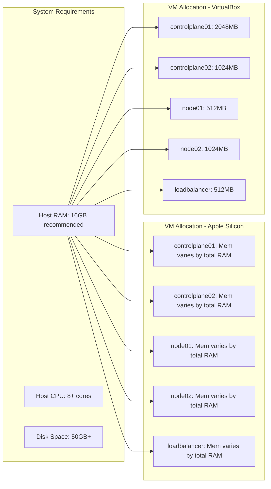
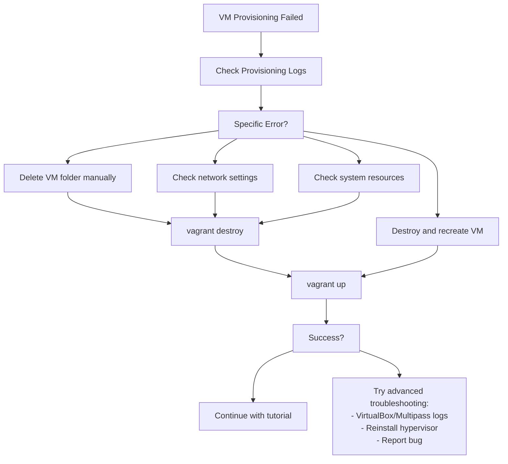
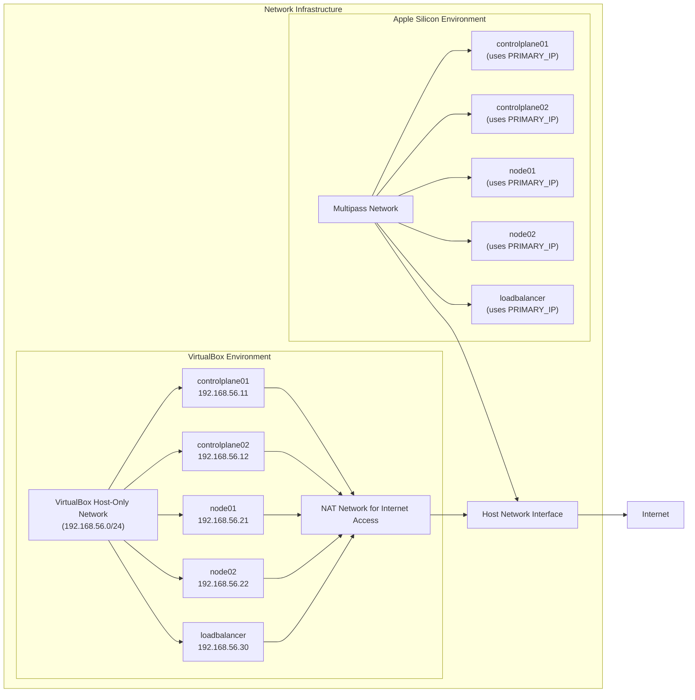
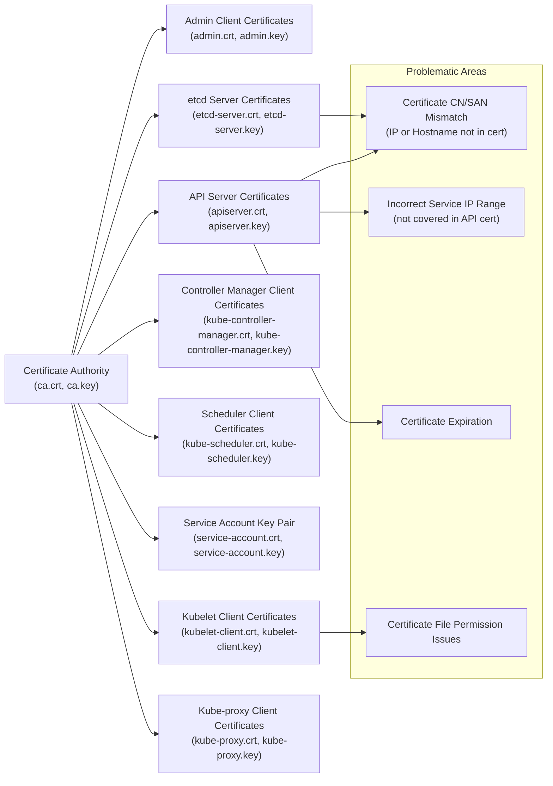
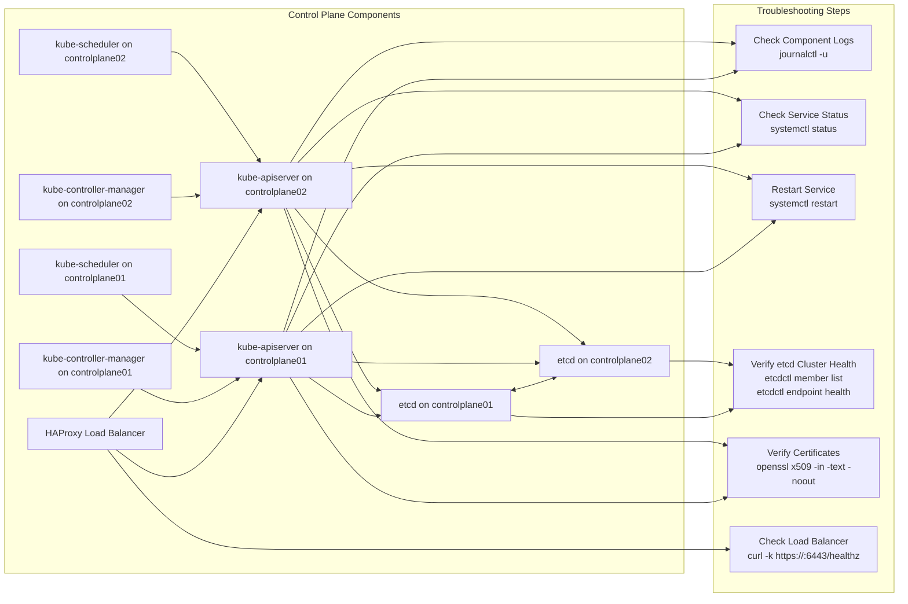
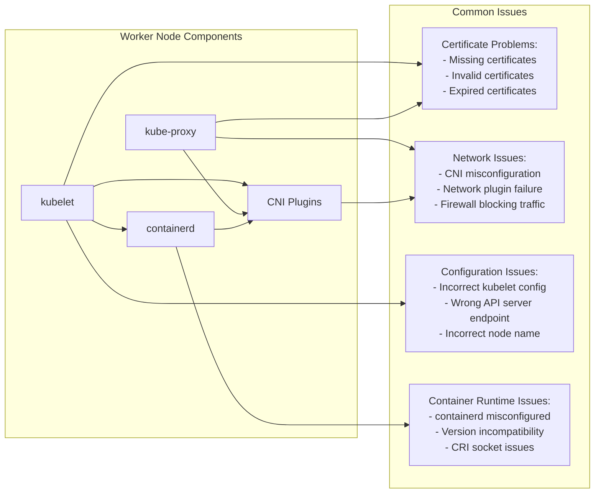
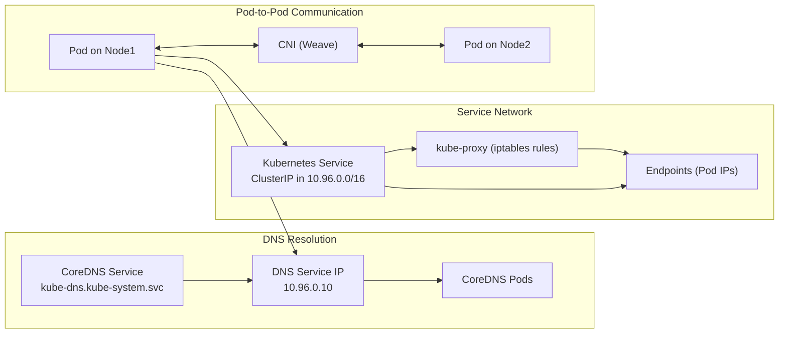

# Common Issues and Fixes
Relevant source files
- [.github/ISSUE_TEMPLATE/bug.yaml](https://github.com/mmumshad/kubernetes-the-hard-way/blob/8218a815/.github/ISSUE_TEMPLATE/bug.yaml)
- [.github/ISSUE_TEMPLATE/config.yml](https://github.com/mmumshad/kubernetes-the-hard-way/blob/8218a815/.github/ISSUE_TEMPLATE/config.yml)
- [VirtualBox/docs/01-prerequisites.md](https://github.com/mmumshad/kubernetes-the-hard-way/blob/8218a815/VirtualBox/docs/01-prerequisites.md?plain=1)
- [VirtualBox/docs/02-compute-resources.md](https://github.com/mmumshad/kubernetes-the-hard-way/blob/8218a815/VirtualBox/docs/02-compute-resources.md?plain=1)
- [apple-silicon/docs/01-prerequisites.md](https://github.com/mmumshad/kubernetes-the-hard-way/blob/8218a815/apple-silicon/docs/01-prerequisites.md?plain=1)
- [apple-silicon/docs/02-compute-resources.md](https://github.com/mmumshad/kubernetes-the-hard-way/blob/8218a815/apple-silicon/docs/02-compute-resources.md?plain=1)

This page documents common problems encountered when following the Kubernetes The Hard Way tutorial, along with their solutions. It covers issues across different phases of the deployment process, from environment setup to testing and verification.

For information about reporting bugs in the tutorial itself, see [Reporting Bugs](/mmumshad/kubernetes-the-hard-way/8.2-reporting-bugs). For certificate management tools that can help diagnose certificate-related issues, see [Certificate Management Tools](/mmumshad/kubernetes-the-hard-way/8.3-certificate-management-tools).

## 1. Environment Setup Issues

### 1.1. Hardware Resource Constraints

**Issue**: VMs crash, become unresponsive, or fail to provision properly.

**Causes**:

- Insufficient RAM (less than 8GB for VirtualBox, less than 8GB for Apple Silicon)
- Insufficient CPU cores
- Insufficient disk space

**Solutions**:

- Ensure your system meets the minimum requirements:

- VirtualBox: 16GB RAM recommended, 8 cores or better CPU, 50GB disk space
- Apple Silicon: 16GB RAM recommended (8GB minimum)
- Close unnecessary applications before deploying
- For VirtualBox, adjust RAM and CPU allocation in the Vagrantfile before deployment:

```
# Reduce RAM allocation (not recommended below these values)
RAM_SIZE = 2048  # for controlplane01
RAM_SIZE_CONTROLPLANE2 = 1024  # for controlplane02
RAM_SIZE_WORKER1 = 512  # for node01
RAM_SIZE_WORKER2 = 1024  # for node02
RAM_SIZE_LB = 512  # for loadbalancer
```

**Diagram: Hardware Resource Requirements and VM Allocation**



Sources: [VirtualBox/docs/01-prerequisites.md10-16](https://github.com/mmumshad/kubernetes-the-hard-way/blob/8218a815/VirtualBox/docs/01-prerequisites.md?plain=1#L10-L16)[apple-silicon/docs/01-prerequisites.md5-9](https://github.com/mmumshad/kubernetes-the-hard-way/blob/8218a815/apple-silicon/docs/01-prerequisites.md?plain=1#L5-L9)[VirtualBox/docs/02-compute-resources.md17-20](https://github.com/mmumshad/kubernetes-the-hard-way/blob/8218a815/VirtualBox/docs/02-compute-resources.md?plain=1#L17-L20)

### 1.2. VirtualBox/Vagrant Issues (non-Apple Silicon)

**Issue**: VirtualBox or Vagrant fails to initialize or provision VMs.

**Causes**:

- Incompatible VirtualBox/Vagrant versions
- Another hypervisor running (e.g., Hyper-V on Windows)
- Permission issues

**Solutions**:

- Ensure you have the latest compatible versions of VirtualBox and Vagrant
- Disable other hypervisors if running
- Run the terminal or command prompt as administrator
- Check VirtualBox logs for specific errors

**Issue**: Vagrant fails with "VBoxManage.exe: error: Could not rename the directory"

**Solution**:

```
# First destroy the VM
vagrant destroy <vm>
 
# Then manually remove the directory
rmdir "<path-to-vm-folder>\kubernetes-ha-<vm>"
 
# Then re-provision
vagrant up
```

**Issue**: Provisioner gets stuck at "Waiting for machine to reboot"

**Solution**:

1. Hit CTRL+C
2. Kill any running ruby process
3. Destroy the VM that got stuck: `vagrant destroy <vm>`
4. Re-provision: `vagrant up`

Sources: [VirtualBox/docs/02-compute-resources.md84-123](https://github.com/mmumshad/kubernetes-the-hard-way/blob/8218a815/VirtualBox/docs/02-compute-resources.md?plain=1#L84-L123)

### 1.3. Multipass Issues (Apple Silicon)

**Issue**: Multipass fails to create or provision VMs on Apple Silicon.

**Causes**:

- Insufficient permissions
- DHCP lease exhaustion
- Software conflicts

**Solutions**:

- Ensure your user account has admin privileges and can use `sudo`
- Clean stale DHCP leases after deleting VMs:

```
sudo vi /var/db/dhcpd_leases
# Remove all blocks with name like controlplane, node or loadbalancer
```
- Restart Multipass if it becomes unresponsive
- Ensure you have the latest version of Multipass

**Issue**: VMs fail to access the internet or each other.

**Solution**:

- Verify PRIMARY_IP is correctly set in each VM
- Check that the network adapter with the default gateway is active
- Ensure firewall settings aren't blocking traffic

Sources: [apple-silicon/docs/01-prerequisites.md11-22](https://github.com/mmumshad/kubernetes-the-hard-way/blob/8218a815/apple-silicon/docs/01-prerequisites.md?plain=1#L11-L22)[apple-silicon/docs/02-compute-resources.md38-57](https://github.com/mmumshad/kubernetes-the-hard-way/blob/8218a815/apple-silicon/docs/02-compute-resources.md?plain=1#L38-L57)

## 2. VM Provisioning and Networking Issues

### 2.1. Failed VM Provisioning

**Diagram: VM Provisioning Troubleshooting Flow**



Sources: [VirtualBox/docs/02-compute-resources.md84-113](https://github.com/mmumshad/kubernetes-the-hard-way/blob/8218a815/VirtualBox/docs/02-compute-resources.md?plain=1#L84-L113)[.github/ISSUE_TEMPLATE/bug.yaml1-61](https://github.com/mmumshad/kubernetes-the-hard-way/blob/8218a815/.github/ISSUE_TEMPLATE/bug.yaml#L1-L61)

### 2.2. Network Configuration Issues

**Issue**: Nodes cannot communicate with each other or access the internet.

**Causes**:

- Incorrect network configuration
- Firewall settings
- DNS resolution problems

**Solutions**:

- Verify nodes can ping each other using their assigned IPs
- Check `/etc/hosts` contains correct entries for all nodes
- For VirtualBox, verify network is configured as `192.168.56.0/24`
- For Apple Silicon, ensure the correct network interface is used (indicated by PRIMARY_IP)
- Check DNS configuration (should be `8.8.8.8`)

**Issue**: IP address conflicts.

**Solution**:

- For VirtualBox, check the Vagrantfile for any IP address duplications
- For Apple Silicon, clean stale DHCP leases after destroying VMs

**Diagram: Network Architecture and Common Failure Points**



Sources: [VirtualBox/docs/01-prerequisites.md42-80](https://github.com/mmumshad/kubernetes-the-hard-way/blob/8218a815/VirtualBox/docs/01-prerequisites.md?plain=1#L42-L80)[apple-silicon/docs/01-prerequisites.md31-41](https://github.com/mmumshad/kubernetes-the-hard-way/blob/8218a815/apple-silicon/docs/01-prerequisites.md?plain=1#L31-L41)

## 3. Security Infrastructure Issues

### 3.1. Certificate Generation Problems

**Issue**: Certificate generation fails or certificates are invalid.

**Causes**:

- Incorrect configuration parameters
- Mismatched hostnames/IPs
- Expired certificates

**Solutions**:

- Verify certificate configuration, especially IP addresses and hostnames
- Ensure certificates include the correct IP addresses (including load balancer IP)
- Regenerate certificates if they've expired
- Check that service account key pair is generated correctly

**Issue**: Certificate mismatch or "x509: certificate signed by unknown authority" errors.

**Solution**:

- Ensure the same CA is used to sign all certificates
- Verify certificate chains are complete
- Check that certificate paths in configuration files are correct

**Diagram: Certificate Hierarchy and Common Failure Points**



### 3.2. Kubeconfig and Authentication Issues

**Issue**: "Unable to connect to the server: x509" errors when using kubectl.

**Causes**:

- Incorrect kubeconfig file
- Missing or invalid certificates
- API server not reachable

**Solutions**:

- Verify kubeconfig file points to the correct cluster IP/hostname
- Check that certificate files referenced in kubeconfig exist and are valid
- Ensure the load balancer is correctly routing to API servers
- Validate connectivity to API server endpoint

**Issue**: Authentication failures or "Unauthorized" errors.

**Solutions**:

- Verify RBAC is correctly configured
- Check that the user/serviceaccount has appropriate permissions
- Ensure token is valid and not expired
- Verify certificates are valid and signed by the correct CA

## 4. Control Plane Component Issues

### 4.1. etcd Cluster Issues

**Issue**: etcd cluster fails to form or maintain quorum.

**Causes**:

- Network connectivity issues between etcd nodes
- Certificate issues
- Incorrect etcd configuration

**Solutions**:

- Check etcd logs with `journalctl -u etcd`
- Verify all etcd nodes can reach each other on port 2379/2380
- Ensure certificates are valid and correctly configured
- Validate etcd cluster state with `etcdctl member list`
- Restart etcd service if necessary

**Issue**: etcd data corruption or inconsistency.

**Solution**:

- Backup etcd data if possible
- Remove corrupt data directory and restore from backup, or
- Reinitialize the etcd cluster if no backup is available

### 4.2. API Server Issues

**Issue**: API server fails to start or becomes unresponsive.

**Causes**:

- Certificate issues
- Incorrect configuration
- etcd connectivity problems
- Resource constraints

**Solutions**:

- Check API server logs with `journalctl -u kube-apiserver`
- Verify API server can connect to etcd
- Ensure all required certificates are valid
- Check that service account key is correctly configured
- Restart API server if necessary

**Issue**: API server returns 5xx errors or "connection refused".

**Solution**:

- Check load balancer configuration
- Verify both API servers are running correctly
- Check API server endpoint is reachable from all nodes

**Diagram: Control Plane Components and Troubleshooting Flow**



### 4.3. Controller Manager and Scheduler Issues

**Issue**: Controller Manager or Scheduler fails to start or function properly.

**Causes**:

- Certificate issues
- Incorrect configuration
- API server connectivity problems

**Solutions**:

- Check logs with `journalctl -u kube-controller-manager` or `journalctl -u kube-scheduler`
- Verify these components can connect to the API server
- Ensure all required certificates are valid
- Check kubeconfig files are correctly configured
- Restart services if necessary

## 5. Worker Node Issues

### 5.1. Container Runtime Issues

**Issue**: Container runtime fails to start or is misconfigured.

**Causes**:

- Incorrect installation
- Systemd configuration issues
- Incompatible versions

**Solutions**:

- Check containerd status with `systemctl status containerd`
- Verify containerd configuration in `/etc/containerd/config.toml`
- Ensure CNI plugins are correctly installed
- Restart containerd if necessary

**Issue**: Container runtime errors like "OCI runtime create failed".

**Solution**:

- Check container runtime logs
- Verify container runtime is compatible with Kubernetes version
- Check that node has sufficient resources for containers

### 5.2. Kubelet Issues

**Issue**: Kubelet fails to start or register with the API server.

**Causes**:

- Certificate issues
- Incorrect configuration
- API server connectivity problems
- Container runtime issues

**Solutions**:

- Check kubelet logs with `journalctl -u kubelet`
- Verify kubelet can connect to the API server
- Ensure all required certificates are valid
- Check that container runtime is working correctly
- Verify kubelet configuration in `/var/lib/kubelet/config.yaml`
- Restart kubelet if necessary

**Issue**: Nodes showing "NotReady" status.

**Solutions**:

- Check node status with `kubectl describe node <node-name>`
- Verify network plugin is correctly installed
- Check kubelet is running and healthy
- Ensure CNI network is configured correctly

**Diagram: Worker Node Components and Common Issues**



### 5.3. Kube-proxy Issues

**Issue**: Kube-proxy fails to start or function properly.

**Causes**:

- Certificate issues
- Incorrect configuration
- API server connectivity problems

**Solutions**:

- Check kube-proxy logs
- Verify kube-proxy can connect to the API server
- Ensure iptables or IPVS (based on configuration) is functioning correctly
- Check kube-proxy configmap is correctly configured
- Restart kube-proxy if necessary

**Issue**: Services not reachable from pods.

**Solution**:

- Check kube-proxy logs
- Verify service and endpoint objects exist
- Ensure kube-proxy is running on all nodes
- Check iptables rules are correctly set up

## 6. Networking and DNS Issues

### 6.1. Pod Network Issues

**Issue**: Pods cannot communicate with each other across nodes.

**Causes**:

- CNI plugin issues
- Incorrect pod CIDR configuration
- Firewall or routing issues

**Solutions**:

- Verify Weave or other CNI plugin is correctly deployed
- Check pod CIDR matches the configured network (`10.244.0.0/16` by default)
- Ensure nodes can communicate on required ports
- Check CNI plugin logs for errors

**Issue**: Pods stuck in "ContainerCreating" status with network errors.

**Solution**:

- Check CNI plugin is running correctly
- Verify CNI configuration in `/etc/cni/net.d/`
- Restart CNI plugin pods if necessary
- Check kubelet logs for specific network errors

### 6.2. DNS Resolution Issues

**Issue**: DNS resolution not working in pods.

**Causes**:

- CoreDNS/KubeDNS not running
- CoreDNS/KubeDNS misconfigured
- Pod network issues affecting DNS traffic

**Solutions**:

- Verify CoreDNS pods are running: `kubectl get pods -n kube-system`
- Check CoreDNS service is correctly configured
- Ensure CoreDNS configmap has correct upstream DNS server
- Check DNS service IP falls within service CIDR (`10.96.0.0/16` by default)
- Test DNS resolution from a pod: `kubectl run -it --rm debug --image=busybox -- nslookup kubernetes.default`

**Diagram: Kubernetes Networking Architecture and DNS Flow**



### 6.3. Service Access Issues

**Issue**: Services not accessible from pods or other services.

**Causes**:

- Kube-proxy issues
- Incorrect service definition
- Endpoint issues

**Solutions**:

- Check service exists and has correct selector: `kubectl describe svc <service-name>`
- Verify pods are matching the service selector
- Check endpoints exist for the service: `kubectl get endpoints <service-name>`
- Ensure kube-proxy is running on all nodes
- Verify service IP is within service CIDR

## 7. Verification and Testing Issues

### 7.1. Smoke Test Failures

**Issue**: Basic functionality tests fail.

**Causes**:

- Core kubernetes components not functioning correctly
- Networking issues
- Configuration errors

**Solutions**:

- Check specific components based on which tests are failing
- Verify all core components are running
- Check logs for components involved in the failing tests
- Ensure networking plugins are correctly configured

### 7.2. End-to-End Test Failures

**Issue**: Comprehensive tests fail on specific features.

**Solutions**:

- Analyze test logs to identify specific failure points
- Check components related to the failing tests
- Verify configuration of specific features being tested
- Consult Kubernetes documentation for feature-specific troubleshooting

**Issue**: Tests fail with timeout errors.

**Solution**:

- Check if the cluster has sufficient resources
- Verify network connectivity is stable
- Consider running fewer tests in parallel if resources are constrained

## 8. General Troubleshooting Techniques

### 8.1. Checking Logs

For core components, check logs using:

```
journalctl -u <service-name> -f
# Examples:
journalctl -u etcd -f
journalctl -u kube-apiserver -f
journalctl -u kubelet -f
```

For pods:

```
kubectl logs <pod-name> -n <namespace>
```

### 8.2. Checking Component Status

Check service status:

```
systemctl status <service-name>
# Examples:
systemctl status etcd
systemctl status kube-apiserver
systemctl status kubelet
```

Check pod status:

```
kubectl get pods --all-namespaces
```

### 8.3. Restarting Components

Restart systemd services:

```
systemctl restart <service-name>
# Examples:
systemctl restart etcd
systemctl restart kube-apiserver
systemctl restart kubelet
```

### 8.4. Verifying Network Connectivity

Test network connectivity between nodes:

```
ping <node-ip>
```

Test specific port connectivity:

```
telnet <node-ip> <port>
# or
nc -zv <node-ip> <port>
```

Test API server connectivity:

```
curl -k https://<load-balancer-ip>:6443/healthz
```

Sources: [.github/ISSUE_TEMPLATE/bug.yaml1-61](https://github.com/mmumshad/kubernetes-the-hard-way/blob/8218a815/.github/ISSUE_TEMPLATE/bug.yaml#L1-L61)[VirtualBox/docs/01-prerequisites.md42-80](https://github.com/mmumshad/kubernetes-the-hard-way/blob/8218a815/VirtualBox/docs/01-prerequisites.md?plain=1#L42-L80)[VirtualBox/docs/02-compute-resources.md84-123](https://github.com/mmumshad/kubernetes-the-hard-way/blob/8218a815/VirtualBox/docs/02-compute-resources.md?plain=1#L84-L123)[apple-silicon/docs/01-prerequisites.md31-41](https://github.com/mmumshad/kubernetes-the-hard-way/blob/8218a815/apple-silicon/docs/01-prerequisites.md?plain=1#L31-L41)[apple-silicon/docs/02-compute-resources.md38-57](https://github.com/mmumshad/kubernetes-the-hard-way/blob/8218a815/apple-silicon/docs/02-compute-resources.md?plain=1#L38-L57)