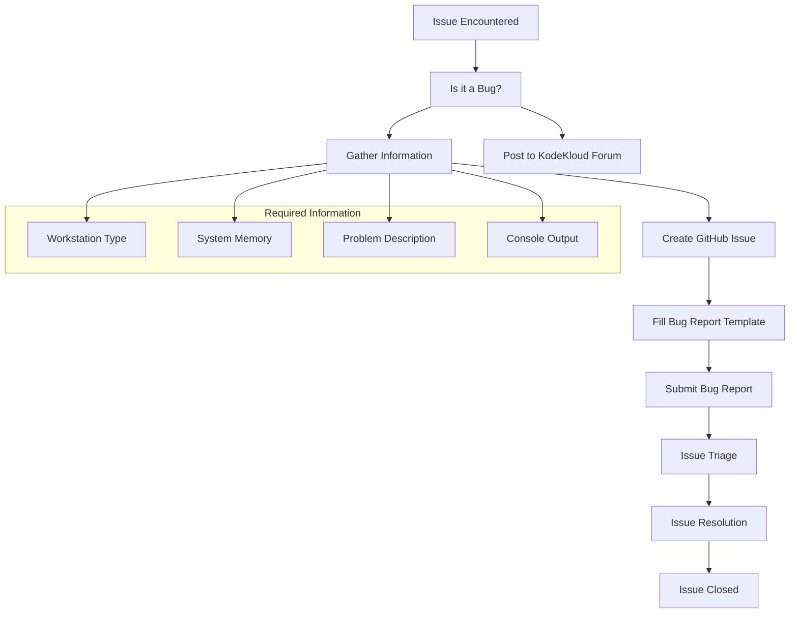
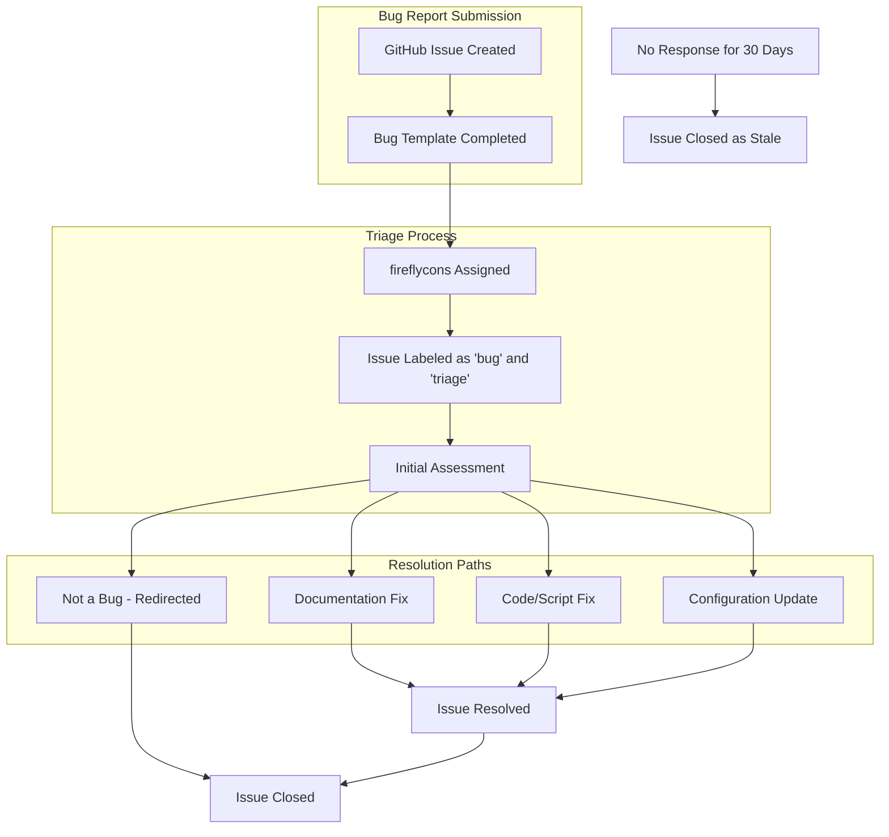

# Reporting Bugs
Relevant source files
- [.github/ISSUE_TEMPLATE/bug.yaml](https://github.com/mmumshad/kubernetes-the-hard-way/blob/8218a815/.github/ISSUE_TEMPLATE/bug.yaml)
- [.github/ISSUE_TEMPLATE/config.yml](https://github.com/mmumshad/kubernetes-the-hard-way/blob/8218a815/.github/ISSUE_TEMPLATE/config.yml)
- [VirtualBox/docs/01-prerequisites.md](https://github.com/mmumshad/kubernetes-the-hard-way/blob/8218a815/VirtualBox/docs/01-prerequisites.md?plain=1)
- [VirtualBox/docs/02-compute-resources.md](https://github.com/mmumshad/kubernetes-the-hard-way/blob/8218a815/VirtualBox/docs/02-compute-resources.md?plain=1)
- [apple-silicon/docs/01-prerequisites.md](https://github.com/mmumshad/kubernetes-the-hard-way/blob/8218a815/apple-silicon/docs/01-prerequisites.md?plain=1)
- [apple-silicon/docs/02-compute-resources.md](https://github.com/mmumshad/kubernetes-the-hard-way/blob/8218a815/apple-silicon/docs/02-compute-resources.md?plain=1)

This document outlines the process for reporting bugs and issues encountered while following the Kubernetes The Hard Way tutorial. It provides guidance on what information to include, how to submit bug reports, and what to expect after submission. For information about common issues and their fixes, see [Common Issues and Fixes](/mmumshad/kubernetes-the-hard-way/8.1-common-issues-and-fixes).

## Purpose and Scope

The bug reporting process described here is specifically for issues related to the deployment steps, scripts, or documentation in the Kubernetes The Hard Way tutorial. Bug reports should be focused on problems with the tutorial itself, not general Kubernetes issues or questions about courses or exams.

Sources: [.github/ISSUE_TEMPLATE/bug.yaml11-17](https://github.com/mmumshad/kubernetes-the-hard-way/blob/8218a815/.github/ISSUE_TEMPLATE/bug.yaml#L11-L17)

## When to Report a Bug

A bug should be reported when you encounter:

1. Errors in deployment scripts that prevent successful execution
2. Missing or incorrect steps in the tutorial documentation
3. Inconsistencies between the documentation and actual behavior
4. Issues with the provided configuration files
5. Problems specific to particular hardware platforms (VirtualBox/Intel or Apple Silicon)

Note that questions about courses, exams, or general Kubernetes concepts should be directed to the KodeKloud Forum ([https://kodekloud.com/community/](https://kodekloud.com/community/)).

Sources: [.github/ISSUE_TEMPLATE/bug.yaml11-17](https://github.com/mmumshad/kubernetes-the-hard-way/blob/8218a815/.github/ISSUE_TEMPLATE/bug.yaml#L11-L17)[.github/ISSUE_TEMPLATE/config.yml1-5](https://github.com/mmumshad/kubernetes-the-hard-way/blob/8218a815/.github/ISSUE_TEMPLATE/config.yml#L1-L5)

## Bug Reporting Workflow

### Diagram: Bug Reporting Process



Sources: [.github/ISSUE_TEMPLATE/bug.yaml1-61](https://github.com/mmumshad/kubernetes-the-hard-way/blob/8218a815/.github/ISSUE_TEMPLATE/bug.yaml#L1-L61)[.github/ISSUE_TEMPLATE/config.yml1-5](https://github.com/mmumshad/kubernetes-the-hard-way/blob/8218a815/.github/ISSUE_TEMPLATE/config.yml#L1-L5)

## Bug Reporting Guidelines

### 1. Verify the Issue

Before reporting a bug, ensure that:

- You're following the latest version of the tutorial
- You've met all prerequisites for your platform
- The issue isn't already listed in [Common Issues and Fixes](/mmumshad/kubernetes-the-hard-way/8.1-common-issues-and-fixes)
- It's a problem with the tutorial itself, not with your understanding of Kubernetes concepts

Sources: [.github/ISSUE_TEMPLATE/bug.yaml11-17](https://github.com/mmumshad/kubernetes-the-hard-way/blob/8218a815/.github/ISSUE_TEMPLATE/bug.yaml#L11-L17)

### 2. Required Information

When reporting a bug, you'll need to provide the following information:

| Information | Description | Required? |
| --- | --- | --- |
| Workstation Type | Your machine's OS and architecture (Windows, Intel Mac, Apple Silicon Mac) | Yes |
| System Memory | Amount of RAM available on your system | Yes |
| Problem Description | Details of what happened and what you expected to happen | Yes |
| Console Output | Relevant error messages or command output | Yes |

Sources: [.github/ISSUE_TEMPLATE/bug.yaml18-61](https://github.com/mmumshad/kubernetes-the-hard-way/blob/8218a815/.github/ISSUE_TEMPLATE/bug.yaml#L18-L61)

### 3. Platform-Specific Considerations

#### VirtualBox/Vagrant Users

When reporting issues specific to VirtualBox/Vagrant deployment:

- Include the exact error messages from Vagrant
- Mention if VMs failed to provision and which specific steps failed
- Include information about host machine resources

Sources: [VirtualBox/docs/01-prerequisites.md9-16](https://github.com/mmumshad/kubernetes-the-hard-way/blob/8218a815/VirtualBox/docs/01-prerequisites.md?plain=1#L9-L16)[VirtualBox/docs/02-compute-resources.md82-123](https://github.com/mmumshad/kubernetes-the-hard-way/blob/8218a815/VirtualBox/docs/02-compute-resources.md?plain=1#L82-L123)

#### Apple Silicon Users

When reporting issues specific to Apple Silicon deployment:

- Confirm your macOS version
- Verify Multipass is correctly installed and functioning
- Include information about your M1/M2/M3 processor and available memory
- Mention any external displays connected (which affect available memory)

Sources: [apple-silicon/docs/01-prerequisites.md5-9](https://github.com/mmumshad/kubernetes-the-hard-way/blob/8218a815/apple-silicon/docs/01-prerequisites.md?plain=1#L5-L9)[apple-silicon/docs/01-prerequisites.md11-16](https://github.com/mmumshad/kubernetes-the-hard-way/blob/8218a815/apple-silicon/docs/01-prerequisites.md?plain=1#L11-L16)

### Diagram: Bug Report Processing System



Sources: [.github/ISSUE_TEMPLATE/bug.yaml1-7](https://github.com/mmumshad/kubernetes-the-hard-way/blob/8218a815/.github/ISSUE_TEMPLATE/bug.yaml#L1-L7)[.github/ISSUE_TEMPLATE/bug.yaml17](https://github.com/mmumshad/kubernetes-the-hard-way/blob/8218a815/.github/ISSUE_TEMPLATE/bug.yaml#L17-L17)

## How to Submit a Bug Report

1. Go to the [GitHub repository](https://github.com/mmumshad/kubernetes-the-hard-way/blob/8218a815/GitHub repository)
2. Click on the "Issues" tab
3. Click "New Issue"
4. Select "Bug Report" template
5. Fill in all required fields in the bug report form
6. Submit the issue

The bug report template includes:

1. A dropdown to select your workstation type
2. A dropdown to select your system memory
3. A text area to describe what happened and what you expected
4. A text area for relevant console output

Sources: [.github/ISSUE_TEMPLATE/bug.yaml1-61](https://github.com/mmumshad/kubernetes-the-hard-way/blob/8218a815/.github/ISSUE_TEMPLATE/bug.yaml#L1-L61)

## Providing Detailed Bug Reports

### Specific Information to Include

For the most effective bug reports, include:

1. **Step Reference**: Identify which specific step in the tutorial is failing
2. **Command Executed**: The exact command you ran
3. **Expected Outcome**: What you expected to happen
4. **Actual Outcome**: What actually happened
5. **Error Messages**: Complete error messages, not summaries
6. **Environment Details**: Beyond the basic workstation type, include OS version, virtualization software version, etc.

### Example Format

```
Step Reference: Section 4.2, "Starting the Kubernetes API Server"

Command Executed:
sudo systemctl start kube-apiserver

Expected Outcome:
kube-apiserver service starts successfully

Actual Outcome:
Service fails to start

Error Messages:
Failed to start kube-apiserver.service: Unit kube-apiserver.service not found.

```

Sources: [.github/ISSUE_TEMPLATE/bug.yaml47-61](https://github.com/mmumshad/kubernetes-the-hard-way/blob/8218a815/.github/ISSUE_TEMPLATE/bug.yaml#L47-L61)

## After Submitting a Bug Report

After submitting a bug report:

1. **Assignment**: The bug will be assigned to the repository maintainers
2. **Triage**: The issue will be labeled appropriately and evaluated
3. **Follow-up**: You may be asked for additional information
4. **Resolution**: If confirmed as a bug, it will be fixed in a future update
5. **Inactivity**: Issues will be considered stale and closed if there is no response from the reporter for 30 days after a response from KodeKloud personnel

Sources: [.github/ISSUE_TEMPLATE/bug.yaml17](https://github.com/mmumshad/kubernetes-the-hard-way/blob/8218a815/.github/ISSUE_TEMPLATE/bug.yaml#L17-L17)

## Common Bug Report Issues

Common problems with bug reports include:

1. **Insufficient Information**: Not providing enough details to reproduce the issue
2. **Course/Exam Questions**: Using bug reports to ask about courses or exams instead of the KodeKloud Forum
3. **General Kubernetes Issues**: Reporting problems with Kubernetes itself rather than with the tutorial
4. **Resource Constraints**: Issues caused by insufficient system resources that don't meet the minimum requirements
5. **Outdated Information**: Following older versions of the tutorial that have been updated

Sources: [.github/ISSUE_TEMPLATE/bug.yaml11-17](https://github.com/mmumshad/kubernetes-the-hard-way/blob/8218a815/.github/ISSUE_TEMPLATE/bug.yaml#L11-L17)[VirtualBox/docs/01-prerequisites.md9-16](https://github.com/mmumshad/kubernetes-the-hard-way/blob/8218a815/VirtualBox/docs/01-prerequisites.md?plain=1#L9-L16)[apple-silicon/docs/01-prerequisites.md5-9](https://github.com/mmumshad/kubernetes-the-hard-way/blob/8218a815/apple-silicon/docs/01-prerequisites.md?plain=1#L5-L9)

## Conclusion

Proper bug reporting helps improve the Kubernetes The Hard Way tutorial for all users. By following these guidelines and providing detailed, accurate information, you contribute to the quality of the project and help maintainers resolve issues more efficiently.