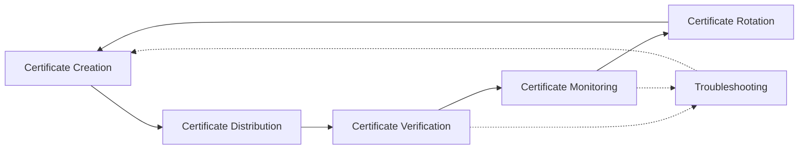
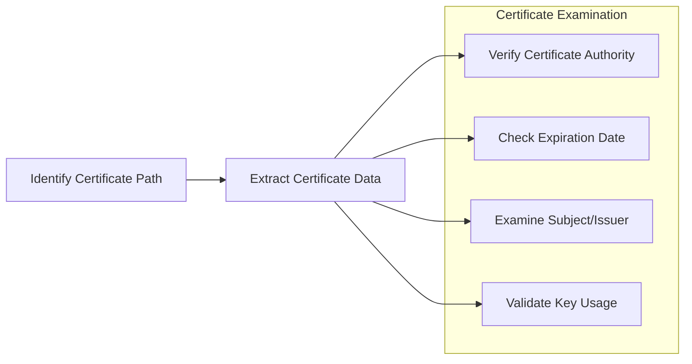
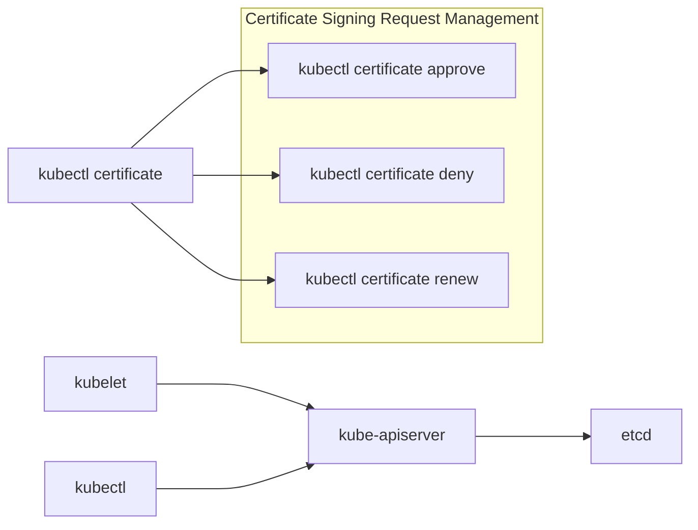
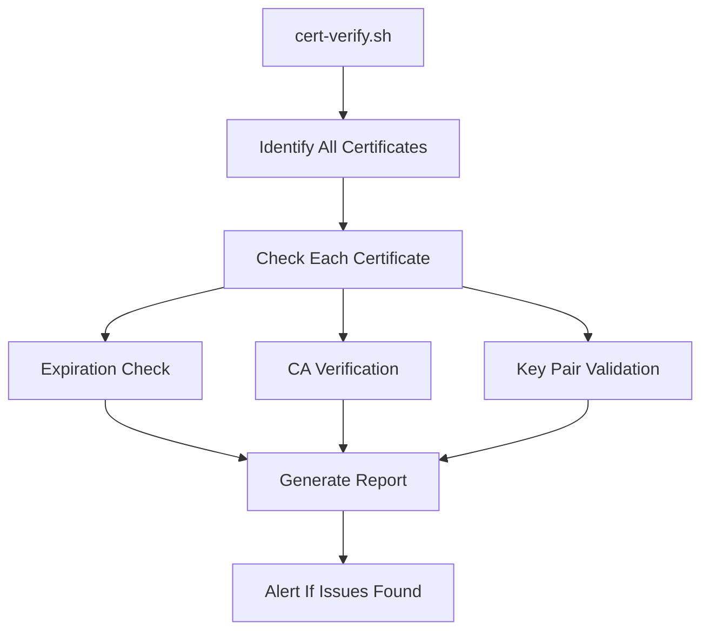
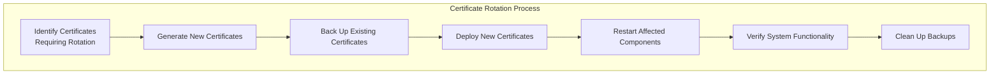
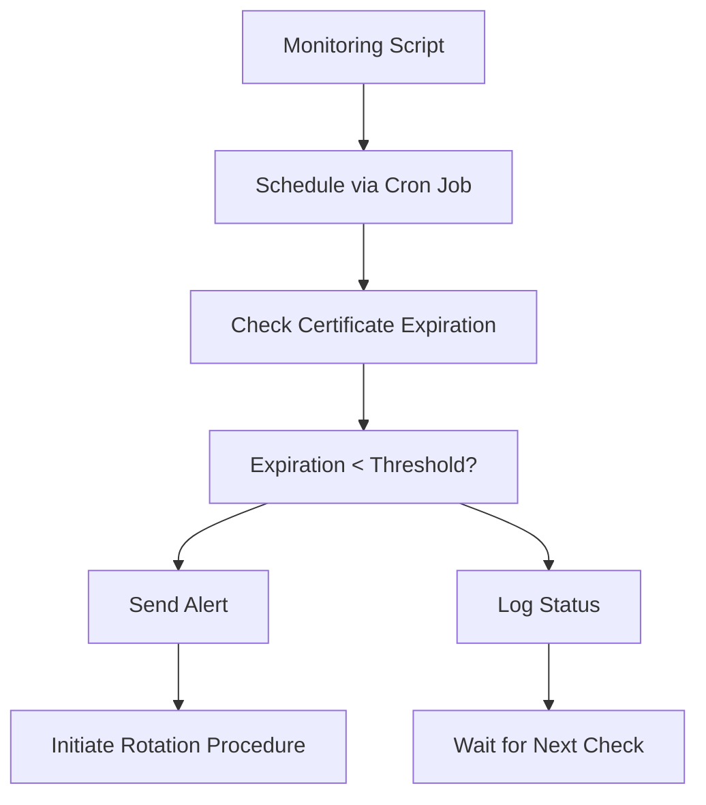

# Certificate Management Tools
Relevant source files
- [tools/kubernetes-certs-checker.xlsx](https://github.com/mmumshad/kubernetes-the-hard-way/blob/8218a815/tools/kubernetes-certs-checker.xlsx)

## Purpose and Scope

This document provides a comprehensive overview of tools and utilities for managing certificates in a Kubernetes cluster deployed using the "hard way" approach. Certificate management is a critical aspect of maintaining a secure and functioning Kubernetes environment. This page focuses specifically on tools for monitoring, verifying, rotating, and troubleshooting certificates after the initial cluster setup. For information about creating the certificate authority and generating initial certificates, see [Certificate Authority](/mmumshad/kubernetes-the-hard-way/3.1-certificate-authority). For verification procedures during initial setup, see [Certificate Verification](/mmumshad/kubernetes-the-hard-way/7.3-certificate-verification).

## Certificate Management Workflow

The certificate management lifecycle in a Kubernetes cluster involves several key processes, as illustrated below.

## Core Certificate Management Tools

Kubernetes the Hard Way relies on several standard tools for certificate management operations.

### OpenSSL

OpenSSL serves as a foundational tool for inspecting, verifying, and troubleshooting certificates.

#### Key OpenSSL Commands for Certificate Management

| Command | Purpose | Example |
| --- | --- | --- |
| `openssl x509 -in cert.pem -text -noout` | Display certificate details | Inspect certificate expiration date and subject details |
| `openssl verify -CAfile ca.pem cert.pem` | Verify certificate against a CA | Confirm certificate is signed by the correct CA |
| `openssl x509 -noout -dates -in cert.pem` | Check certificate validity period | Monitor expiration dates |
| `openssl s_client -connect host:port` | Test TLS connection | Verify server certificate during connection |

#### Certificate Inspection Workflow

### CFSSL

CFSSL is used during initial certificate creation but can also assist with management tasks.

| Command | Purpose | Example |
| --- | --- | --- |
| `cfssl certinfo -cert cert.pem` | Display detailed certificate information | View comprehensive certificate metadata |
| `cfssl-certinfo -domain kube-apiserver.cluster.local` | Analyze certificate from a domain | Check TLS configuration of a service |

## Kubernetes-Native Certificate Tools

### kubectl certificate commands

The `kubectl certificate` subcommand provides functionality for managing certificates within a running Kubernetes cluster.

#### Key kubectl Certificate Commands

| Command | Purpose |
| --- | --- |
| `kubectl get csr` | List certificate signing requests |
| `kubectl certificate approve <csr-name>` | Approve a CSR |
| `kubectl certificate deny <csr-name>` | Deny a CSR |
| `kubectl describe csr <csr-name>` | Show details of a CSR |

### kubeadm certificate management

While Kubernetes The Hard Way doesn't use kubeadm for deployment, the kubeadm certificate commands can be installed separately and used for managing certificates in any cluster.

| Command | Purpose |
| --- | --- |
| `kubeadm certs check-expiration` | Check certificate expiration dates |
| `kubeadm certs renew <component>` | Renew certificates for a specific component |
| `kubeadm certs renew all` | Renew all certificates |

## Certificate Verification Script

A useful tool for monitoring certificate health is a verification script that can be run periodically or as part of maintenance operations.

### Sample Certificate Verification Script Components

- Certificate path discovery
- Expiration date checking
- CA chain validation
- Key usage verification
- Certificate-key pair matching
- Centralized reporting

## Certificate Rotation Workflow

Certificate rotation is a critical maintenance task to ensure continued security and functionality of your cluster.

### Component-Specific Rotation Considerations

| Component | Certificate Files | Restart Required | Special Considerations |
| --- | --- | --- | --- |
| etcd | etcd-server.crt, etcd-server.key | Yes | Rotate one node at a time |
| kube-apiserver | apiserver.crt, apiserver.key | Yes | Client impact during restart |
| kubelet | kubelet-client.crt, kubelet.key | Yes | May require node drain |
| kube-controller-manager | controller-manager.crt, controller-manager.key | Yes | Leadership transfer |
| kube-scheduler | scheduler.crt, scheduler.key | Yes | Leadership transfer |
| kube-proxy | kube-proxy.crt, kube-proxy.key | Yes | Network connectivity impact |

## Automated Certificate Monitoring

Setting up automated monitoring helps prevent certificate-related outages by providing early warnings.

### Sample Certificate Monitoring Approaches

- Cron job with OpenSSL checks
- Prometheus exporter for certificate metrics
- Integration with existing monitoring systems
- Slack/email alerting for approaching expirations

## Troubleshooting Certificate Issues

Common certificate issues and their resolution approaches:

| Issue | Possible Causes | Troubleshooting Approach |
| --- | --- | --- |
| Certificate expired | Missed rotation | Check expiration with `openssl x509 -noout -dates -in cert.pem` |
| Certificate not trusted | Wrong CA | Verify chain with `openssl verify -CAfile ca.pem cert.pem` |
| Name mismatch | Incorrect SAN | Check names with `openssl x509 -in cert.pem -text -noout \| grep DNS` |
| Permission issues | Wrong file permissions | Verify with `ls -la` and correct with `chmod` |
| Key mismatch | Certificate and key don't match | Compare modulus with OpenSSL commands |

## Best Practices for Certificate Management

To maintain a secure and reliable Kubernetes cluster, follow these certificate management best practices:

1. Document all certificates, their locations, and expiration dates
2. Implement automated monitoring for certificate expiration
3. Establish a regular certificate rotation schedule
4. Test certificate rotation procedures in a non-production environment
5. Maintain secure backups of CA materials
6. Use appropriate file permissions for certificate files
7. Keep certificate private keys protected
8. Implement a clear procedure for emergency certificate rotation

## Conclusion

Effective certificate management is crucial for maintaining the security and functionality of a Kubernetes cluster. The tools and approaches outlined in this document provide a framework for managing certificates throughout their lifecycle in a cluster deployed using the Kubernetes The Hard Way approach.

For information about initial certificate generation, see [Certificate Authority](/mmumshad/kubernetes-the-hard-way/3.1-certificate-authority).

For specific certificate verification procedures during setup, see [Certificate Verification](/mmumshad/kubernetes-the-hard-way/7.3-certificate-verification).